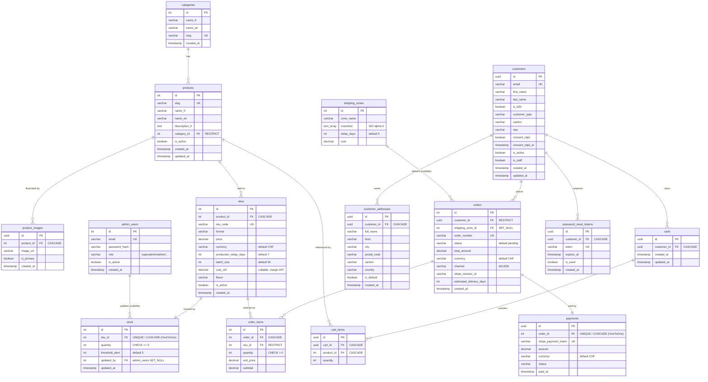

# 🗄️ Database Diagram (ERD) — corrected version

## 1) What is an ERD?
An **ERD** (Entity-Relationship Diagram) shows the **database tables** and the **links
(foreign keys)** between them. In Mermaid:
- `A ||--o{ B` = "**one** A relates to **many** B" (one-to-many).
- `A ||--|| B` = "**one** A for **one** B" (one-to-one).
- `PK` = primary key, `FK` = foreign key, `UK` = unique constraint.

An ERD shows **tables**, not class inheritance. That is the first thing to fix (see §2).

---

## 2) Mistakes in the old ERD/diagram (and why they are wrong)
| # | Mistake in the Portfolio | Reality in the code | Fix |
|---|---|---|---|
| 1 | A **`BaseModel`** with inheritance arrows (`BaseModel <|-- Category…`) | **No `BaseModel` exists.** `apps/common/models.py` says "this app has NO models", `mixins.py` is empty. Every model extends `django.db.models.Model` directly. | Remove `BaseModel` (details in the class diagram). |
| 2 | `admin_users ||--o{ b2b_requests : "processes"` | `B2BRequest` has **no** `processed_by` FK. Staff only changes a `status` field. | Remove that relation. |
| 3 | `customers.id = int` | `Customer.id` = **UUID** (`models.UUIDField`) | PK = `uuid`. |
| 4 | `currency DEFAULT EUR` | Default = **CHF** (`Order`, `Payment`, `SKU`) — Swiss market | `chf`. |
| 5 | `customers` with `password_hash` + addresses **inline** | Password handled by Django (`AbstractBaseUser`); addresses in **`customer_addresses`** | Separate them. |
| 6 | Tables **missing** | `product_images`, `payments`, `b2b_accounts`, `consent_logs`, `customer_addresses`, `carts`, `cart_items`, `b2b_product_info`, `b2b_customization_requests`, `b2b_quote_simulations`, `cockpit_*`, `forecasts`, `alerts`, `analytics_events` | Add them. |

> **Note:** "The design ERD evolved: We moved to **UUID keys** for sensitive data, to **CHF** for Switzerland, and we added the compliance (`consent_logs`) and B2B (`b2b_accounts`) tables. Here is the **up-to-date** ERD."

---

## 3) Corrected ERD — Part A: B2C commerce (the purchase funnel core)

## 4) Corrected ERD — Part B: B2B, compliance & business intelligence

```mermaid
erDiagram
    customers    ||--|| b2b_accounts               : "pro profile"
    skus         ||--|| b2b_product_info           : "pro data"
    b2b_accounts ||--o{ b2b_customization_requests : "requests"
    skus         ||--o{ b2b_customization_requests : "customizes (PROTECT)"
    b2b_accounts ||--o{ b2b_quote_simulations      : "simulates"

    customers    ||--o{ consent_logs               : "consents (SET_NULL)"
    customers    ||--o{ analytics_events           : "generates (SET_NULL)"

    products     ||--o{ forecasts                  : "forecasted"
    forecasts    ||--o{ alerts                      : "raises"
    products     ||--o{ alerts                      : "about"
    products     ||--|| cockpit_product_targets     : "monthly target"
    customers    ||--o{ cockpit_objectives          : "set by (SET_NULL)"

    b2b_accounts {
        uuid id PK
        uuid customer_id FK "UNIQUE / CASCADE (OneToOne)"
        varchar company_name
        varchar segment
        varchar status "prospect/active/…"
        timestamp onboarded_at
        timestamp created_at
    }
    b2b_requests {
        int id PK
        varchar company_name
        varchar contact_email
        varchar sector
        int estimated_qty
        varchar status "new/in_progress/…"
        inet ip_address
        boolean wants_marketing
        timestamp marketing_consent_at
        timestamp created_at
    }
    b2b_product_info {
        int id PK
        int sku_id FK "UNIQUE / CASCADE (OneToOne)"
        boolean is_b2b_available
        varchar availability_status
        int moq "default 24"
        decimal b2b_unit_price "nullable"
    }
    b2b_customization_requests {
        int id PK
        uuid account_id FK "b2b_accounts CASCADE"
        int sku_id FK "skus PROTECT"
        boolean logo_engraved
        int grammage
        int quantity
        varchar status "draft/quote/order"
        timestamp created_at
    }
    b2b_quote_simulations {
        int id PK
        uuid account_id FK "b2b_accounts CASCADE"
        jsonb cart_json
        boolean moq_reached
        decimal estimated_value
        boolean converted
        timestamp created_at
    }
    consent_logs {
        uuid id PK
        uuid customer_id FK "SET_NULL, nullable"
        varchar consent_id "cookie token"
        boolean necessary
        boolean analytics
        boolean marketing
        varchar policy_version
        inet ip_address
        timestamp created_at
    }
    analytics_events {
        uuid id PK
        varchar event_type
        uuid customer_id FK "SET_NULL, nullable"
        varchar channel
        varchar canton
        decimal value_chf
        jsonb properties
        timestamp created_at
    }
    forecasts {
        uuid id PK
        int product_id FK "CASCADE"
        date forecast_date
        int predicted_quantity
        decimal confidence_score
        timestamp created_at
    }
    alerts {
        uuid id PK
        int product_id FK "CASCADE"
        uuid forecast_id FK "CASCADE"
        text message
        varchar severity "low/medium/high/critical"
        timestamp created_at
    }
    cockpit_objectives {
        int id PK "singleton pk=1"
        int daily_revenue_chf
        int monthly_revenue_chf
        int monthly_capacity_units
        decimal target_margin_pct
        uuid updated_by FK "customers SET_NULL"
        timestamp updated_at
    }
    cockpit_product_targets {
        int id PK
        int product_id FK "UNIQUE / CASCADE (OneToOne)"
        int monthly_units
        timestamp updated_at
    }
    canton_targets {
        int id PK
        varchar canton UK
        int monthly_revenue_chf
        timestamp updated_at
    }
```

---

## 5) Reference table — every table (to know for the MR)
| Table (db_table) | Django model | Primary key | App |
|---|---|---|---|
| `categories` | `Category` | int | shop |
| `products` | `Product` | int | shop |
| `product_images` | `ProductImage` | **uuid** | shop |
| `skus` | `SKU` | int | shop |
| `stock` | `Stock` | int | shop |
| `shipping_zones` | `ShippingZone` | int | shop |
| `accounts_customer` | `Customer` | **uuid** | accounts |
| `accounts_passwordresettoken` | `PasswordResetToken` | **uuid** | accounts |
| `b2b_accounts` | `B2BAccount` | **uuid** | accounts |
| `consent_logs` | `ConsentLog` | **uuid** | accounts |
| `customer_addresses` | `CustomerAddress` | **uuid** | customer_area |
| `cart_cart` | `Cart` | **uuid** | cart |
| `cart_cartitem` | `CartItem` | **uuid** | cart |
| `orders` | `Order` | int | checkout |
| `order_items` | `OrderItem` | int | checkout |
| `payments` | `Payment` | **uuid** | checkout |
| `b2b_requests` | `B2BRequest` | int | b2b |
| `b2b_product_info` | `B2BProductInfo` | int | b2b |
| `b2b_customization_requests` | `CustomizationRequest` | int | b2b |
| `b2b_quote_simulations` | `QuoteSimulation` | int | b2b |
| `admin_users` | `AdminUser` | int | backoffice |
| `cockpit_*` objective/targets | `CockpitObjective` / `ProductTarget` / `CantonTarget` | int | cockpit |
| `forecasting_forecast` | `Forecast` | **uuid** | forecasting |
| `forecasting_alert` | `Alert` | **uuid** | forecasting |
| `analytics_events` | `Event` | **uuid** | analytics |

> **URL routing rule to mention:** **UUID** PK → `<uuid:...>` in URLs (non-enumerable,
> security); **int** PK (e.g. `Order`) → `<int:order_id>`.

---

## 6) Key relations to explain (3 examples) :
- **`orders.customer_id` → `customers` with `RESTRICT`**: I **cannot** delete a customer who
  has orders (Swiss accounting retention, CO art. 958f).
- **`payments.order_id` → `orders` as `OneToOne`**: exactly **one** payment per order.
- **`consent_logs.customer_id` as `SET_NULL`**: if an account is anonymised, I **keep** the
  consent proof (nLPD compliance) — the row is never deleted.

---

## 7) Honesty notes :
- **`cart_items` points to `products`, not `skus`.** Also, `Cart.get_total_price()` and
  `CartItem.get_subtotal()` use `product.price`, which **does not exist** (price is on `SKU`).
  The **cart actually used at checkout is session-based** (SKU-based, see
  `apps/checkout/stripe.py`). → These DB `Cart`/`CartItem` models are likely **legacy /
  partly unused**. I can say so if asked.
- `Forecast.__str__` and `CartItem.__str__` reference `product.name` (does not exist) → a
  minor display bug, no functional impact.

---

## 9) How each part of the ERD works and why it changed

**a) Catalog: `categories → products → skus → stock` (+ `product_images`, `shipping_zones`)**
How it works: a `category` groups `products`; each product is sold as one or more **`skus`**
(a sellable variant with its own price and stock); each SKU has exactly one **`stock`** row
(OneToOne) and a product can have several **`product_images`**.
Why it changed: the old design put the price/name on the product and forgot `product_images`.
In the code, **price and stock are on the SKU** (a "Tablette" can have 100 g and 200 g SKUs),
and images are a separate table — so I added `product_images` (UUID) and moved price to `skus`.

**b) Accounts: `customers` (+ `password_reset_tokens`, `consent_logs`, `b2b_accounts`)**
How it works: `customers` is the login identity (email + UUID). Password resets use single-use
`password_reset_tokens`. Consent is proven by **`consent_logs`** (immutable rows). A customer
may have one `b2b_accounts` profile (prospect → active).
Why it changed: the old ERD had `customers.id = int` with an inline `password_hash` and inline
address. In the code the key is **UUID** (non-enumerable), the password is managed by Django's
auth (not a plain field), and addresses moved to `customer_addresses`. I also added
`consent_logs` and `b2b_accounts`, which the old ERD did not have — they are central to Swiss
nLPD compliance and the B2B lifecycle.

**c) Cart: `carts → cart_items`**
How it works in the schema: a customer owns a `cart` containing `cart_items` (each referencing
a `product`).
Why it needs a note: the **cart used at checkout is session-based** (`apps/cart/cart.py`,
SKU-based). These DB tables exist but are partly unused (their helpers reference
`product.price`, which does not exist). I keep them in the ERD for completeness and flag the
limitation openly.

**d) Orders & payment: `orders → order_items` + `payments`**
How it works: an `order` (int key, human `order_number`) contains `order_items` (each linked to
a `sku`, with a price snapshot). Exactly one **`payments`** row per order (OneToOne, UUID,
Stripe payment intent). `orders.customer` uses **RESTRICT** (cannot delete a customer with
orders); `orders.shipping_zone` uses SET_NULL.
Why it changed: the old design defaulted currency to EUR and had no `payments` table. The code
defaults to **CHF** (Swiss market) and isolates payment data in its own table (cleaner + PCI
data stays with Stripe).

**e) B2B: `b2b_requests`, `b2b_product_info`, customization & quotes**
How it works: `b2b_requests` are public leads (no FK). `b2b_product_info` adds pro data
(MOQ, pro price) to a `sku` without touching the B2C catalog. `b2b_customization_requests` and
`b2b_quote_simulations` belong to a `b2b_account`.
Why it changed: the old ERD drew `admin_users → b2b_requests : processes`, but the code has **no
`processed_by` FK** — staff only change a `status`. That relation was removed.

**f) BI: `analytics_events`, `forecasts`, `alerts`, `cockpit_*`**
How it works: `analytics_events` records consent-gated events (with canton/channel/value_chf for
KPIs). `forecasts` predict per-product demand and raise `alerts`. `cockpit_*` holds management
targets (a singleton objectives row + per-product and per-canton targets).
Why it changed: these tables were missing from the old ERD entirely; they were added with the
cockpit/forecasting/analytics apps.

**Consistency rule that drove many changes:** sensitive or externally-referenced rows use
**UUID** keys (Customer, Payment, ConsentLog, B2BAccount, ProductImage) so IDs cannot be
enumerated; internal high-volume rows (Order, OrderItem, SKU) keep integer keys with a separate
non-guessable `order_number` where a public identifier is needed.