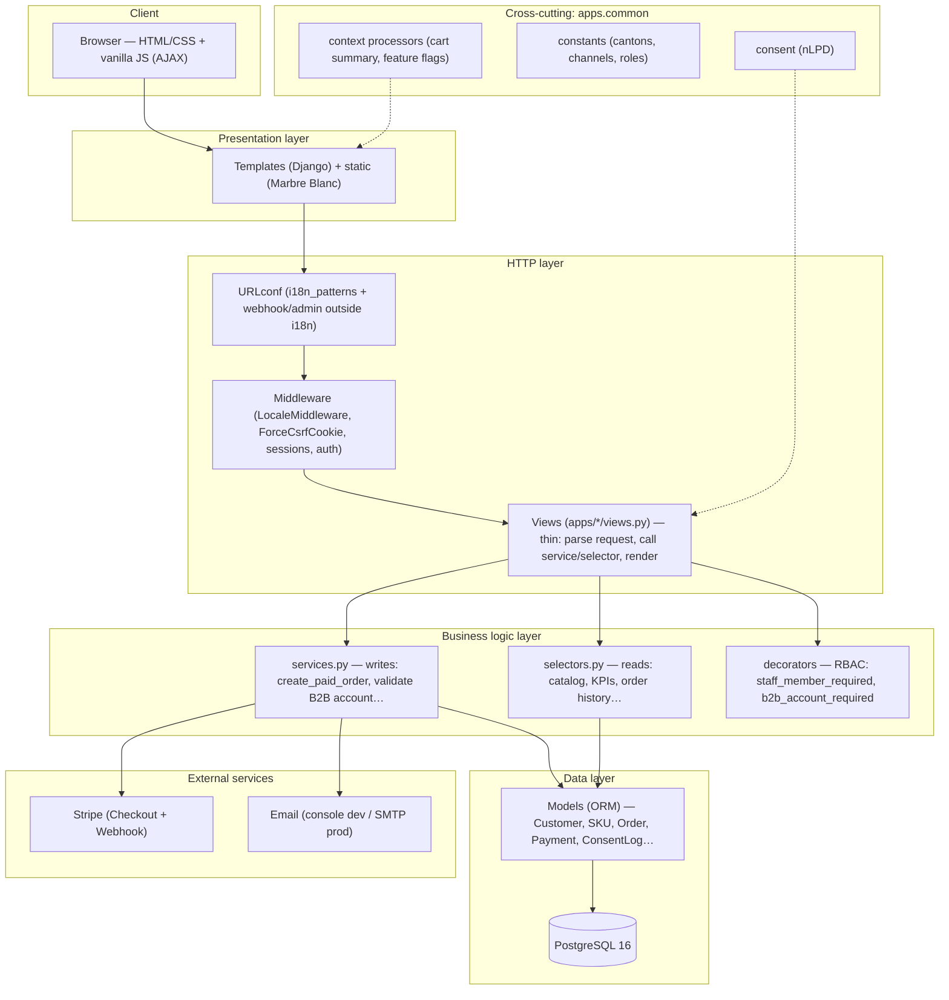
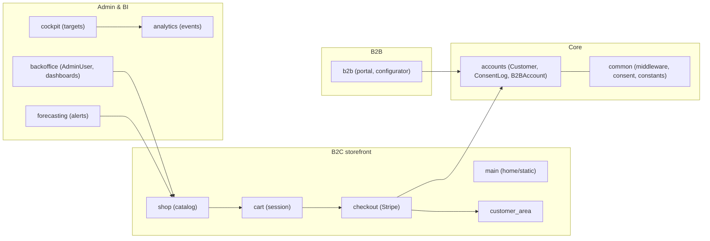
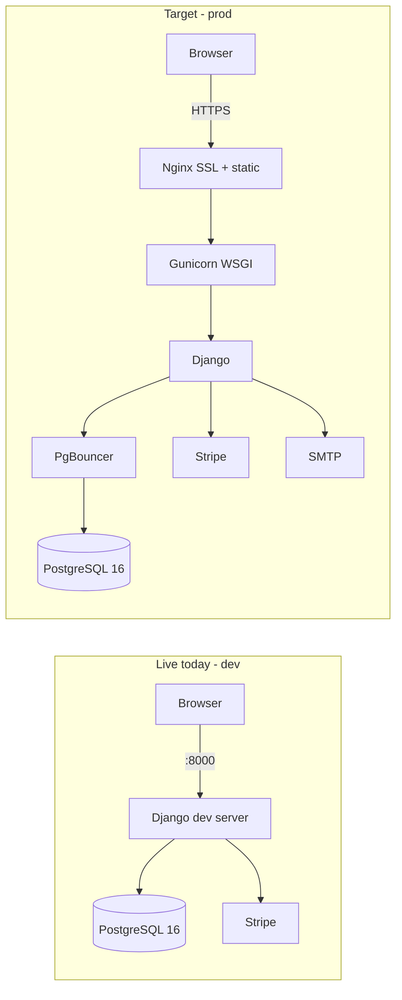

# Architecture Diagram — layered, with business logic

## 1) Layered view (the important one — the data flow)
Each request crosses well-separated layers. Business logic lives in the **service layer**
(`services.py` for writes, `selectors.py` for reads), never in the views.

## 2) Domain map (12 apps grouped by business area)

## 3) Runtime: live (dev) vs target (prod)

Note: Nginx / Gunicorn / PgBouncer are the production targets, not enabled in the dev compose (only `django` + `postgres` run today).

## 4) More to know about data flow
A request enters via the URLconf (with a language prefix for non-French), passes through
middleware (locale, sessions, CSRF), reaches a thin view. The view calls a **service** (write)
or a **selector** (read); those hold the business logic and talk to the models (ORM), which map
to PostgreSQL. Cross-cutting concerns (consent, constants, context) live in `apps.common`.
External calls (Stripe, email) are made from the service layer.

