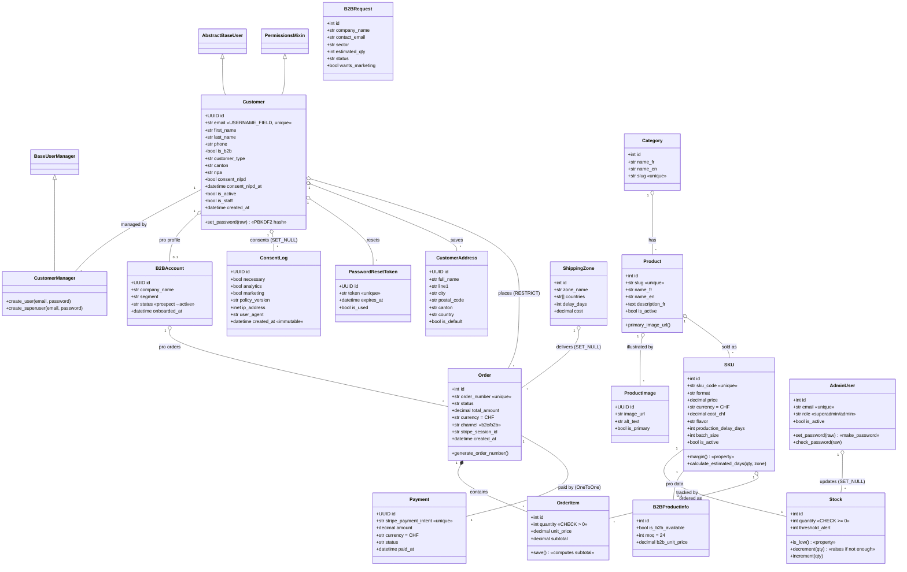

# Class Diagram — single, complete, corrected

## What changed vs the design doc (and why)
The old diagram had two problems:
1. **A fictional `BaseModel`** that all models "inherited" from. It does not exist in the code
   (`apps/common/models.py` has no models, `mixins.py` is empty, and timestamp fields differ
   from model to model — proof there is no shared base). Removed.
2. **Two separate diagrams** (one for auth inheritance, one for the domain), which was
   confusing and left `Customer` shown as an empty box in the domain view.

This is now **one diagram**: every class carries its real attributes and methods, the real
inheritance is shown inline (`Customer` extends Django's auth classes).

## How to read it
- `+attr` = attribute, `+method()` = method. `<|--` = inheritance. `*--` = composition (the
  part cannot exist without the whole). `o--` = aggregation/association. `"1"`, `"*"`, `"0..1"`
  = multiplicity.

## Key business methods to explain
- `Customer.set_password()` — hashes with PBKDF2 (never plaintext).
- `SKU.calculate_estimated_days(qty, zone)` — shipping delay if stock is enough, otherwise
  production batches + shipping.
- `Stock.decrement(qty)` — decreases stock, raises `ValueError` if insufficient (no negative
  stock).
- `Order.generate_order_number()` — unique, non-guessable number (based on `secrets`).
- `OrderItem.save()` — auto-computes `subtotal = quantity × unit_price`.
- `AdminUser.set_password()/check_password()` — hashed staff credentials.
