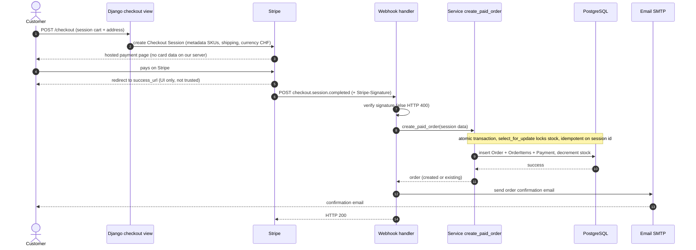
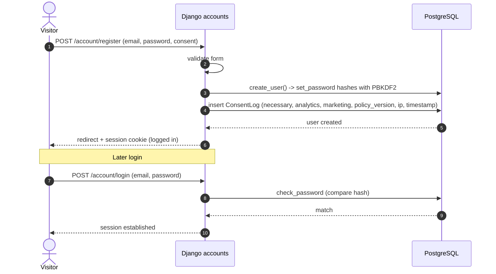
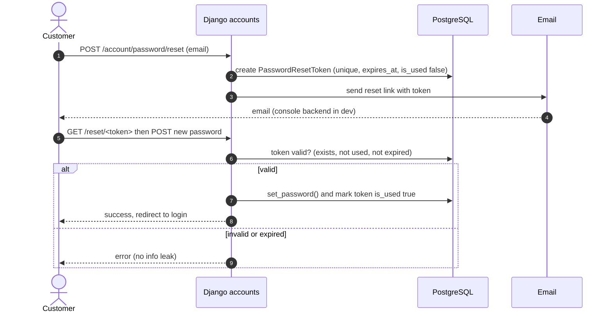
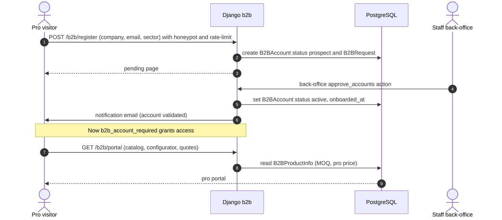
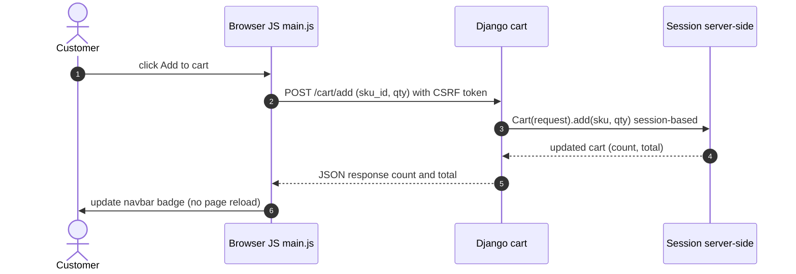

# Sequence Diagrams — 5 key flows

Here's fives cases of Sequence diagrams
---

## 1) B2C purchase (Stripe) — the order is confirmed only by the signed webhook
Why it matters: the success page must NOT create the order (a user could open it without
paying). The signed webhook is the source of truth.

---

## 2) Registration + login (email account, nLPD consent recorded)

---

## 3) Password reset (single-use, time-limited token)

---

## 4) B2B request then staff validation (prospect to active)

---

## 5) Add to cart (AJAX, session cart, live navbar badge)

