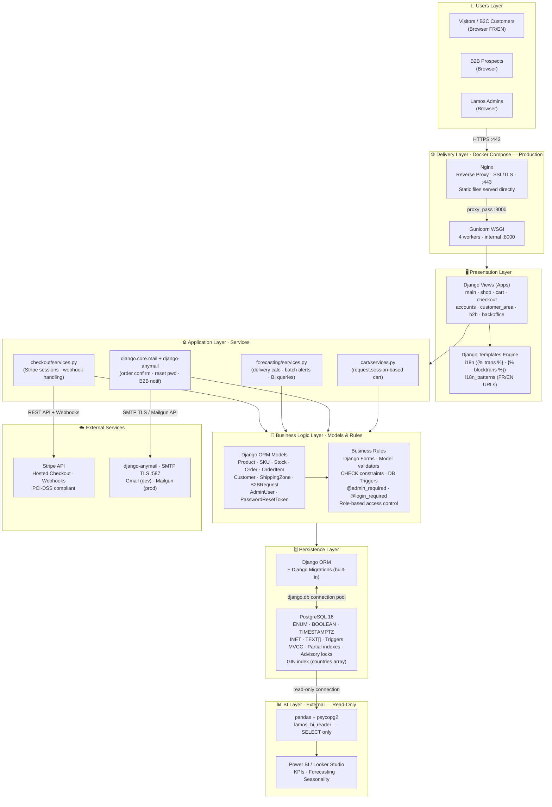
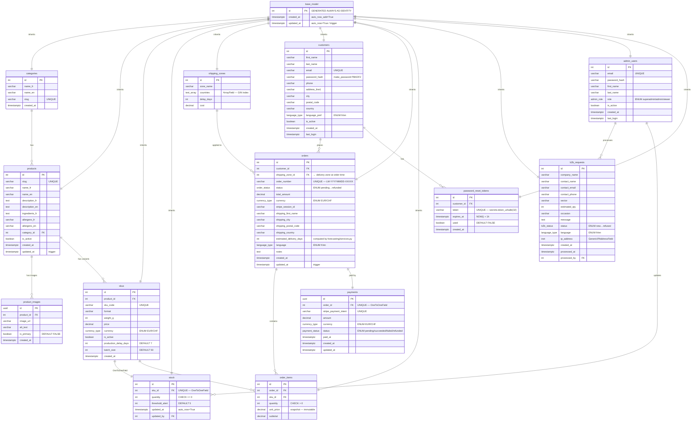
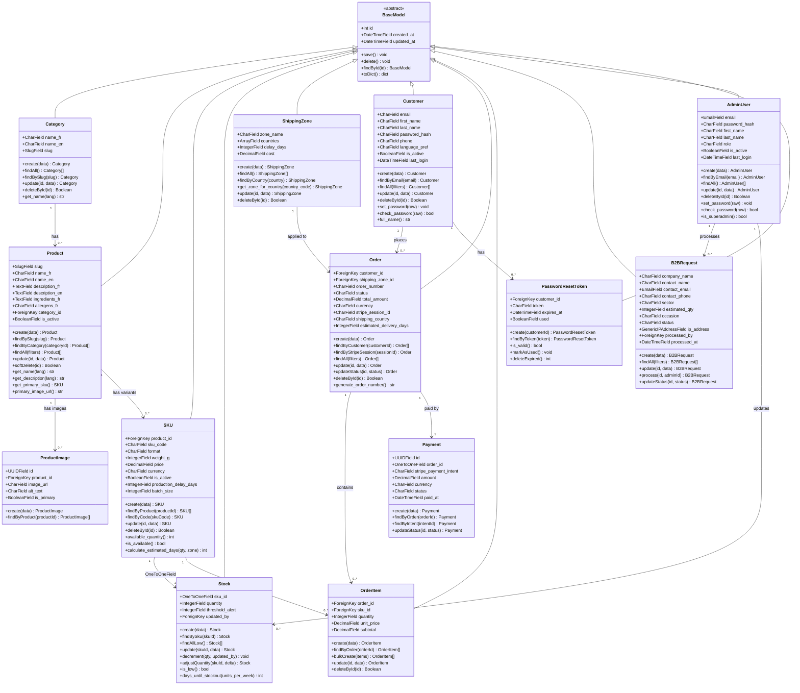
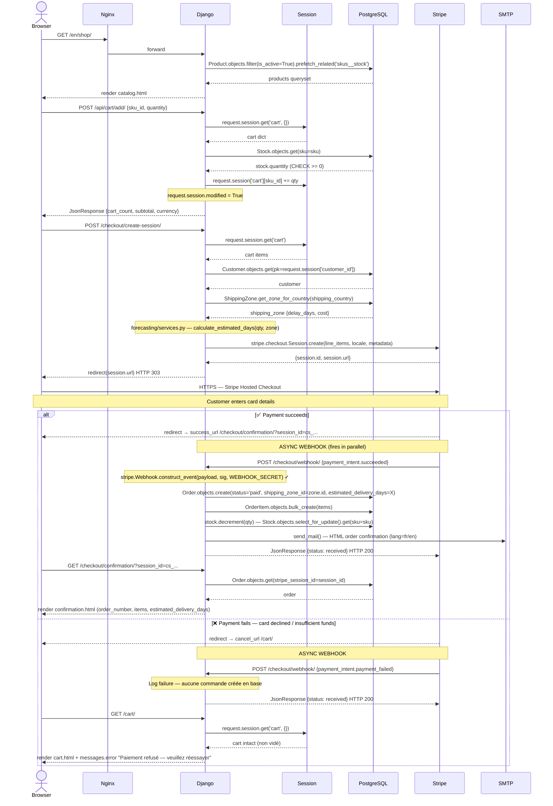
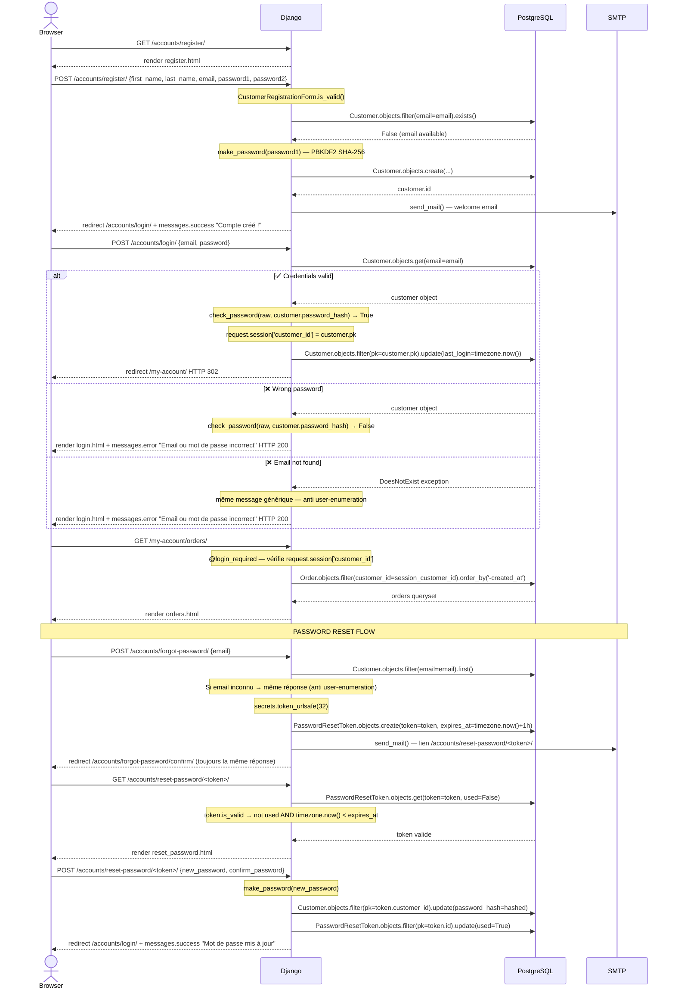
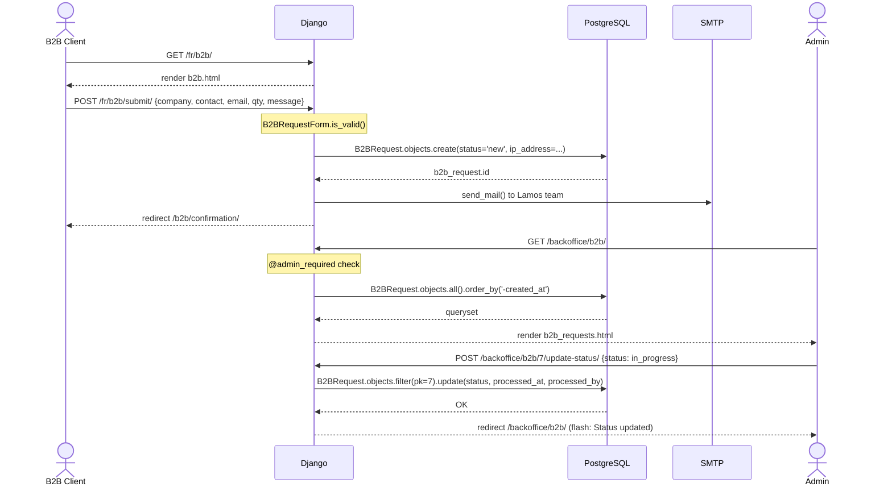
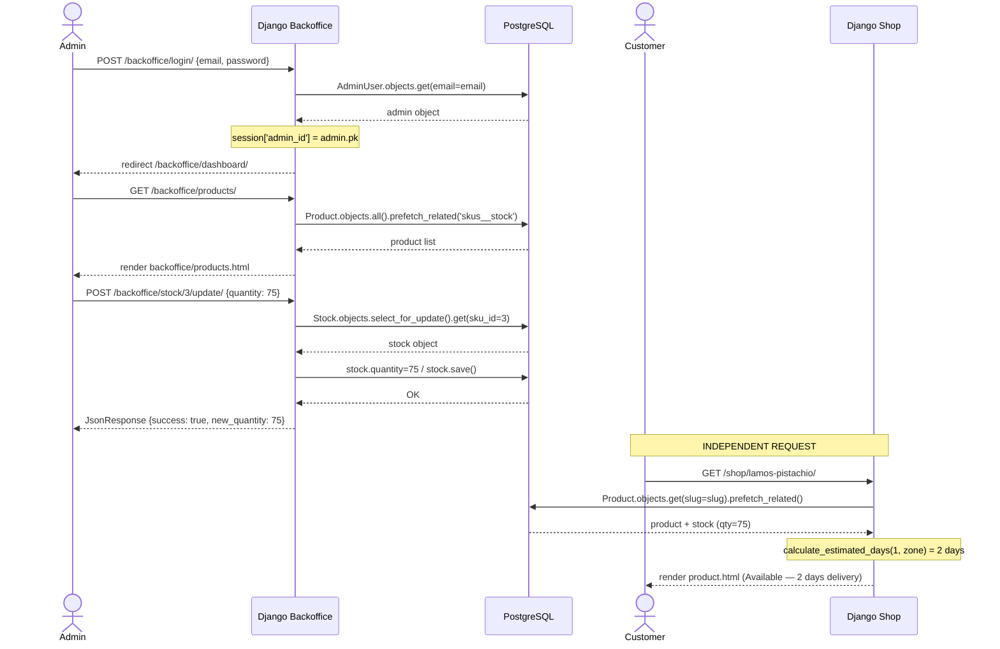
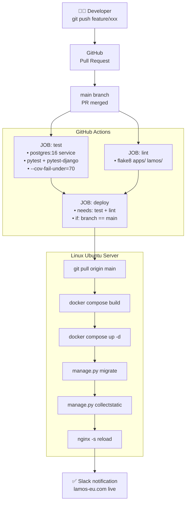

# 🍫 Lamos Chocolate — European Digital Platform

> **Portfolio Project** · Holberton School France · April – July 2026
> Sara Rebati & Valentin Planchon

---

## Table of Contents

- [Team](#team)
- [Project Overview](#project-overview)
- [Brainstorming & Idea Evaluation](#brainstorming--idea-evaluation)
- [Decision & Refinement](#decision--refinement)
- [Documentation Summary](#documentation-summary)
- [Project Planning](#project-planning)
- [Tech Stack](#tech-stack)
- [STAGE 3 — Technical Documentation](#stage-3--technical-documentation)
  - [Task 0 — User Stories & Mockups](#stage-3--task-0-user-stories--mockups)
    - [0.1 — Introduction & Prioritization Method](#01--introduction--prioritization-method)
    - [0.2 — User Types Identification](#02--user-types-identification)
    - [0.3 — Complete User Stories by Module](#03--complete-user-stories-by-module)
      - [MODULE 1 — Navigation & Brand Discovery](#module-1--navigation--brand-discovery)
      - [MODULE 2 — Product Catalog](#module-2--product-catalog)
      - [MODULE 3 — Cart & Payment (B2C)](#module-3--cart--payment-b2c)
      - [MODULE 4 — Customer Accounts & History](#module-4--customer-accounts--history)
      - [MODULE 5 — B2B Portal (Corporate Gifting)](#module-5--b2b-portal-corporate-gifting)
      - [MODULE 6 — Administrator Panel](#module-6--administrator-panel)
      - [MODULE 7 — Business Intelligence](#module-7--business-intelligence)
    - [0.4 — MoSCoW Summary](#04--moscow-summary)
    - [0.5 — Mockup Descriptions (V0 — Figma)](#05--mockup-descriptions-v0--figma)
  - [Task 1 — System Architecture](#stage-3--task-1-system-architecture)
    - [1.1 — Architecture Overview](#11--architecture-overview)
    - [1.2 — High-Level Architecture Diagram](#12--high-level-architecture-diagram)
    - [1.3 — Layer-by-Layer Description](#13--layer-by-layer-description)
      - [1.3.1 — Presentation Layer](#131--presentation-layer-front-end)
      - [1.3.2 — Application Layer](#132--application-layer-django-back-end)
      - [1.3.3 — Data Layer](#133--data-layer-postgresql-16)
      - [1.3.4 — External Services](#134--external-services)
      - [1.3.5 — BI Layer](#135--bi-layer-business-intelligence)
      - [1.3.6 — Infrastructure & DevOps](#136--infrastructure--devops)
    - [1.4 — Data Flows — Main Use Cases](#14--data-flows--main-use-cases)
    - [1.5 — Technology Choice Justification](#15--technology-choice-justification)
  - [Task 2 — Components, Classes & Database Design](#stage-3--task-2-components-classes--database-design)
    - [2.1 — Database Schema (ERD)](#21--database-schema-erd)
    - [2.2 — Class Diagram & CRUD Methods](#22--class-diagram--crud-methods)
    - [2.3 — Seed Data (PostgreSQL)](#23--seed-data-postgresql)
    - [2.4 — Forecasting Model](#24--forecasting-model)
    - [2.5 — Django Models](#25--django-models)
    - [2.6 — Django Project Structure](#26--django-project-structure)
    - [2.7 — Django Settings (Key Configuration)](#27--django-settings-key-configuration)
    - [2.8 — Reusable Frontend Component](#28--reusable-frontend-component-django-template-tag)
  - [Task 3 — Sequence Diagrams](#stage-3--task-3-sequence-diagrams)
    - [3.1 — Introduction](#31--introduction)
    - [3.2 — Diagram 1: B2C Purchase Flow](#32--diagram-1-complete-b2c-purchase-flow)
    - [3.3 — Diagram 2: Registration, Login & Password Reset](#33--diagram-2-registration-login--password-reset)
    - [3.4 — Diagram 3: B2B Request Submission](#34--diagram-3-b2b-request-submission--admin-notification)
    - [3.5 — Diagram 4: Admin Product Update](#35--diagram-4-admin--product-update--storefront-impact)
    - [3.6 — Diagram 5: CI/CD Pipeline](#36--diagram-5-cicd-pipeline--automated-deployment)
    - [3.7 — Diagrams Summary](#37--diagrams-summary)
    - [3.8 — Session & Regulatory Justification](#38-why-requestsession--technical--regulatory-justification)
  - [Task 4 — API Specifications](#stage-3--task-4-api-specifications)
    - [4.1 — External APIs Used](#41--external-apis-used)
      - [4.1.1 — Stripe API](#411--stripe-api)
      - [4.1.2 — SMTP Email](#412--smtp-email)
    - [4.2 — Internal API — Django Views & URL Patterns](#42--internal-api--django-views--url-patterns)
      - [MODULE: MAIN](#module-main-storefront--navigation)
      - [MODULE: SHOP](#module-shop-catalog)
      - [MODULE: CART](#module-cart)
      - [MODULE: CHECKOUT](#module-checkout-stripe-payment)
      - [MODULE: ACCOUNTS](#module-accounts-customer-authentication)
      - [MODULE: CUSTOMER AREA](#module-customer-area)
      - [MODULE: B2B](#module-b2b)
      - [MODULE: BACKOFFICE](#module-backoffice-custom-admin-panel)
    - [4.3 — HTTP Status Codes Used](#43--http-status-codes-used)
    - [4.4 — Endpoint Security](#44--endpoint-security)
    - [4.5 — Environment Variables Reference](#45--environment-variables-reference)
  - [Task 5 — SCM & QA Strategies](#stage-3--task-5-scm--qa-strategies)
    - [5.1 — Source Control Management (SCM)](#51--source-control-management-scm)
      - [5.1.1 — Tool and Platform](#511--tool-and-platform)
      - [5.1.2 — Branching Strategy](#512--branching-strategy-simplified-git-flow)
      - [5.1.3 — Development Workflow](#513--development-workflow--step-by-step)
      - [5.1.4 — Commit Message Convention](#514--commit-message-convention-conventional-commits)
      - [5.1.5 — Branch Protection & Merge Rules](#515--branch-protection--merge-rules)
      - [5.1.6 — Secrets & Environment Variables](#516--secrets--environment-variables-management)
    - [5.2 — Quality Assurance (QA) Strategy](#52--quality-assurance-qa-strategy)
      - [5.2.1 — Test Pyramid Overview](#521--test-pyramid-overview)
      - [5.2.2 — pytest-django Configuration](#522--pytest-django-configuration)
      - [5.2.3 — Test Fixtures and Shared Helpers](#523--test-fixtures-and-shared-helpers)
      - [5.2.4 — Unit Tests](#524--unit-tests)
      - [5.2.5 — Integration Tests](#525--integration-tests)
      - [5.2.6 — End-to-End Test Checklist](#526--end-to-end-test-checklist-manual)
      - [5.2.7 — User Acceptance Testing (UAT)](#527--user-acceptance-testing-uat--sprint-9)
      - [5.2.8 — GitHub Actions CI Configuration](#528--github-actions-ci-configuration)
      - [5.2.9 — Test Coverage Targets](#529--test-coverage-targets)
      - [5.2.10 — Production Monitoring & Logging](#5210--production-monitoring--logging)
    - [5.3 — SCM & QA Summary](#53--scm--qa-summary)
---

## Team

| Member | Technical Role | Project Role | Curriculum |
|--------|---------------|--------------|------------|
| **Sara Rebati** | Fullstack Developer (backend focus) | Project Manager · Tech Lead · Backend Dev | Holberton School — 1st year (in progress) |
| **Valentin Planchon** | Business Analyst · Frontend Developer · Data & BI | Business Analyst · UI/UX Lead · Data Layer | Holberton School + Liora — BA track |

### Sara Rebati — Project Manager & Fullstack Developer (Backend Focus)

Sara is currently completing her first year of the RNCP Level 5 Professional Developer certification at Holberton School Thonon-les-Bains (1,200-hour intensive programme covering Python, C, HTML, CSS, JavaScript, SQL/MySQL, Linux/Shell, Git, Docker, Jenkins, Ansible). She brings a hybrid profile combining analytical discipline from her previous academic background with technical expertise acquired through intensive Holberton projects.

Prior to Holberton, she accumulated significant digital project management experience:

- Managed the full digital transformation at **CASA SWITCH** — piloting a mobile application from specifications to launch in three months, coordinating technical teams, and overseeing UX/UI decisions.
- Led over **50 web and e-commerce projects** at **WOMWORK** (Algeria's first women's incubator), combining training in digital marketing, design thinking, and agile project coordination.
- Managed digital project portfolios at **THE ANNEX** coworking space, supervising communication strategy, web presence, and coordination between clients and technical providers.
- Developed a professional website showcase for **FLUXIVOLT** as part of Holberton coursework.

**Certifications:** Project Management Fundamentals · SQL and Relational Databases · Agile Explorer *(IBM Skills Build, 2025–2026)*

On this project, Sara leads backend development (Flask API, MySQL schema design, server-side logic), CI/CD pipeline setup (GitHub Actions + Nginx), authentication (Flask-Login), and email automation. She also holds the Project Manager role: sprint planning, stakeholder liaison, scope enforcement, and documentation.

### Valentin Planchon — Business Analyst, Data & Frontend Developer

Valentin comes from a commerce background and made a deliberate career transition into tech. Before joining formal programmes, he developed advanced self-taught expertise in Excel — including complex dashboards, pivot tables (TCD), and VBA macros. He is currently pursuing a dual curriculum at Holberton School and Liora (Business Analyst track), covering:

- Data study and transformation using Python (`pandas`, `numpy`) and SQL.
- Advanced statistics and machine learning foundations for prediction and reporting.
- Business Intelligence tools: **Power BI** and **Looker** — building live dashboards and KPI reports.
- Big Data processing workflows using Python and SQL pipelines.

On this project, Valentin leads frontend development (HTML/CSS/JS, Jinja2 templates, responsive design), UI integration with the Flask backend, and the Business Intelligence reporting layer — connecting the MySQL database to Power BI/Looker via a Python data connector to produce live sales KPI dashboards.

### Role Assignment Rationale

**Decision-making protocol:** All decisions affecting scope, architecture, or deadlines are discussed during Monday meetings. The Project Manager (Sara) holds final decision authority, with written justification recorded in Notion within 24 hours.

---

## Communication & Collaboration

### Platform Selection

The team evaluated three project management platforms before selecting a primary tool.

| Tool | Strengths | Limitations | Decision |
|------|-----------|-------------|----------|
| **Notion** | Rich docs, Kanban, databases, wiki-style pages | Can feel complex for task-only tracking | ✅ Selected — documentation hub + Kanban board |
| Trello | Simple Kanban, visual, fast onboarding | Limited documentation and reporting features | Backup option if Notion becomes too heavy |
| ClickUp | Powerful, Gantt views, time tracking | Steeper learning curve, risk of over-engineering | Not selected — overhead not justified for 2-person team |

### Communication Norms

| Tool | Usage | Norm | Frequency |
|------|-------|------|-----------|
| **Discord** | Daily communication, stand-ups, quick decisions, file sharing | Dedicated channel `#lamos-project` · No important decision via DM only | Daily |
| **Notion** | Kanban board, sprint planning, meeting notes, scope doc, decisions log | Updated every Monday · All scope changes documented here | Weekly update |
| **GitHub** | Code versioning, feature branches, pull requests, issue tracker | 1 branch per feature · PR review required before merge to `main` | Continuous |
| **Team Meeting** | Sprint review, blocker discussion, alignment session | Agenda set 24h in advance · Notes logged in Notion | Twice/week (Mon + Thu) |

---

## Stakeholders

| Stakeholder | Role & Responsibilities | Type | Impact |
|-------------|------------------------|------|--------|
| **Lamos Chocolate** (Dubai / Switzerland) | Client / Product Owner — Provides brand brief, visual assets, product specs, and final validation of deliverables | External | 🔴 HIGH |
| **Holberton School France** | Educational institution — Sets evaluation criteria, deadlines, and technical expectations | Internal | 🔴 HIGH |
| **Technical Coach** | Technical mentor — Guidance on architecture, code quality, debugging, and best practices | Internal | 🔴 HIGH |
| **JURY** | Evaluation committee — Assesses final project on technical execution, design quality, and professionalism | Internal | 🔴 HIGH |
| **Sara Rebati & Valentin Planchon** | Development team — Full design, development, testing, and delivery of the platform | Internal | 🔴 HIGH |
| **B2C Consumers** (EU / Swiss market) | End users — Luxury chocolate buyers discovering and ordering Lamos products online | External | 🟡 MEDIUM |
| **B2B Corporate Clients** | Hotels, private banks, jewellers, law firms — Ordering premium gifts in volume | External | 🟡 MEDIUM |

---

## Brainstorming & Idea Evaluation

### Brainstorming Session Overview

The brainstorming session took place during the week of **April 20, 2026**. Both team members conducted individual research first, then reconvened for a structured group session using three complementary techniques:

- **Mind Mapping** — Each member independently mapped digital problems and opportunities, then cross-referenced to identify common themes.
- **SCAMPER Framework** — Existing ideas were analysed through six lenses (Substitute, Combine, Adapt, Modify, Put to another use, Eliminate, Reverse) to identify differentiation opportunities.
- **"How Might We" Questions** — Open-ended prompts framed each idea around a user or business need (e.g. *"How might we give an artisan premium brand a credible European digital presence in under 8 weeks?"*).

### Ideas Explored

#### Idea 1 — FLUXIVOLT: Professional Website + Automated Quote & Lead Generation Platform

FLUXIVOLT is a local electricity and electrical installation company based in the Thonon-les-Bains / Haute-Savoie area. Sara had previously developed a static showcase website for the client as part of a Holberton project — giving the team direct familiarity with the client's business and digital expectations.

The proposed project envisioned three interconnected deliverables:
1. A **redesigned professional website** — dynamic, database-backed, replacing the current static version.
2. An **automated online quote generation platform** — a prospect-facing web form computing preliminary pricing estimates, storing leads in MySQL, and triggering email notifications.
3. A **digital lead capture funnel** — dedicated landing pages receiving traffic from paid advertising campaigns on Facebook/Instagram and Google Ads.

#### Idea 2 — Lamos Chocolate: European Digital Platform ✅ SELECTED

Lamos Chocolate is an artisan chocolate manufacturer founded in Dubai in 2021, born from the excellence of the LAMOS Sweets fine pastry house — rated 4.5/5 on UAE premium delivery platforms and present at Michelin-starred restaurants, five-star hotels, private banks, and jewellers across Dubai, Sharjah, and Abu Dhabi.

The brand's positioning is unique: it fuses **Oriental pastry mastery** (pistachio, kunafa) with the finest **Swiss and Belgian chocolate raw materials** (Swiss Carma cocoa, Callebaut cream). This is not an imitation of the viral "Dubai Chocolate" trend — LAMOS was founded in Dubai in 2021, the very same year the trend was born. **LAMOS is the original.** In 2026, the brand is taking the logical next step: launching its European expansion in Switzerland.

The proposed project delivers the brand's complete European digital infrastructure:
- A **bilingual (FR/EN) immersive brand showcase** — homepage, brand story, heritage, and philosophy.
- A **structured product catalogue** — three flagship references with full artisan descriptions, available formats (200g, 80g, 45g), and European pricing.
- A **complete B2C e-commerce system** — cart, Stripe-powered payment, customer accounts with order history, and stock management.
- A **B2B corporate gifting portal** — dedicated request form with automatic email notification and tracked request log.
- A **full administration panel** — CRUD management of products, stock, and B2B requests.
- A **Business Intelligence reporting dashboard** (Power BI / Looker) — live KPIs connected to MySQL via a Python data connector.
- A **CI/CD automated deployment pipeline** (GitHub Actions + Nginx).

### Evaluation Criteria

Each idea is scored from 1 (very low) to 4 (very high) per criterion.

| Criterion | Definition |
|-----------|-----------|
| **Technical Feasibility** | Can the full deliverable be built by 2 Holberton students within 8 weeks using the current curriculum stack? |
| **Business Impact** | Does the project solve a real, documented business problem for an identifiable client? Does it generate measurable value? |
| **Technical Alignment** | Does the project make full use of Holberton programme skills (backend API, database, frontend, DevOps, CI/CD) and Valentin's BI expertise? |
| **Risk Level** | Level of uncontrolled dependencies. Score 4 = low risk (team controls all inputs). Score 1 = high risk (blocking external factors). |
| **Scope Control** | Can the scope be clearly defined and locked? Can the team prevent scope creep and deliver a complete, testable product? |

### Evaluation Matrix

| Idea | Tech Feasibility | Business Impact | Tech Alignment | Risk Level | Scope Control | **Total** |
|------|:---:|:---:|:---:|:---:|:---:|:---:|
| FLUXIVOLT | 3/4 | 3/4 | 2/4 | 1/4 | 1/4 | **10/20** |
| **Lamos Chocolate ✅** | **4/4** | **4/4** | **4/4** | **4/4** | **4/4** | **20/20** |

> **Risk Level note:** Score 4 = LOW risk (team controls all required inputs). Score 1 = HIGH risk (blocking external dependencies). FLUXIVOLT received 1/4 on both Risk Level and Scope Control due to missing client content and an out-of-scope advertising integration.

### Reasons for Rejection — FLUXIVOLT

Despite strong familiarity with the client and an already-established foundation, the FLUXIVOLT project was rejected on three structural grounds:

1. **Missing client content (blocking dependency)** — The automated quote platform requires a complete and validated set of inputs from the client (service catalogue, pricing logic, legal terms). As of the brainstorming session, this content had not been provided and had no confirmed delivery date.

2. **Out-of-scope advertising component** — The lead generation funnel involves paid advertising account management, campaign budgeting, A/B testing, and pixel tracking — competencies and deliverables outside both the Holberton curriculum and the 8-week timeline.

3. **Fragmented scope with three distinct deliverables** — Website + quote engine + ad funnel represents three independently complex systems, each with its own client dependencies and integration points. For a 2-person team over 8 weeks, this creates a high probability of partial or non-functional delivery.

---

## Decision & Refinement

### Selected Project: Lamos Chocolate — European Digital Platform

#### The Problem

Lamos Chocolate, founded in Dubai in 2021, is launching its European expansion in Switzerland in 2026. The brand carries exceptional market positioning: it is the **original artisan house** that pioneered the fusion of Middle-Eastern pastry techniques with premium Swiss and Belgian cocoa — a combination that went globally viral in late 2023 when a TikTok video generated **126 million views** and triggered a **1,259% explosion** in social media conversations around "Dubai Chocolate."

While industry giants (Lindt, Läderach, Starbucks, Waitrose) scrambled to launch their own versions, **Lamos had already been producing this product for two years**, working with Michelin-starred chefs and five-star hotels.

Today, despite this exceptional brand equity, Lamos Chocolate has **no structured digital presence in the European market** — no e-commerce website, no bilingual brand showcase, no customer account system, no corporate gifting channel. In a market where global searches for "Dubai Chocolate" surged **128% between January and March 2025**, this absence represents a critical gap between the brand's viral awareness and its ability to convert that awareness into European revenue.

#### The Solution

A bilingual (FR/EN) full-stack web platform built on **Python/Flask** and **MySQL**, deployed via a **CI/CD pipeline**, serving as Lamos Chocolate's complete European digital infrastructure — addressing both B2C consumers and B2B corporate clients simultaneously, with a Business Intelligence reporting layer for real-time operational visibility.

#### Target Audience

| Segment | Profile | Primary Need |
|---------|---------|--------------|
| **B2C — European consumers** | Swiss and EU residents aged 25–55, passionate about premium chocolate and Dubai's luxury food culture | Discover the brand, browse the catalogue, and place a secure online order |
| **B2B — Corporate clients** | Hotels, private banks, jewellers, law firms, and luxury companies in Switzerland and the EU seeking high-end corporate gifts | Submit a tailored volume request and receive a professional, personalised response |

#### Type of Application

A **responsive web application** — desktop-first, mobile-optimised — accessible via any modern browser. No native mobile application is included in the current scope. This choice is justified by three reasons:
1. The B2B corporate gifting use case is primarily desktop-based.
2. A server-rendered Flask web application is fully deliverable within the 8-week timeline.
3. A mobile-responsive web experience already addresses the B2C consumer need without the added complexity of app store deployment.

#### Why Lamos Chocolate Over FLUXIVOLT?

| Factor | Lamos Chocolate | FLUXIVOLT |
|--------|----------------|-----------|
| **Client brief** | Real brief with complete inputs from day one | Missing content with no confirmed delivery date |
| **Scope fit** | Perfectly matched to 2-person / 8-week capacity | Three distinct deliverables with unresolved external dependencies |
| **Technical coverage** | Exercises every Holberton curriculum pillar + BI specialisation | Partial coverage, advertising component out of scope |
| **Geographic alignment** | Team based in Thonon-les-Bains, 15 min from Geneva — heart of the Swiss luxury market | Local, but blocked by client content |
| **Portfolio value** | Real named client, commercial launch in 2026, measurable outcome | Speculative without resolved inputs |

---

## SMART Goals

| # | Objective | Measurable Success Criterion | Deadline | Owner |
|---|-----------|------------------------------|----------|-------|
| 1 | Brand showcase deployed live | Homepage, brand story, and product pages for 3+ SKUs deployed on a live server with end-to-end CI/CD pipeline operational | End of Week 6 — May 30 | Sara (backend + deploy) · Valentin (UI) |
| 2 | B2C cart + Stripe payment | Cart functional, Stripe test-mode transactions completing successfully, orders stored in DB, confirmation email triggered — validated by 3 end-to-end test transactions | End of Week 7 — Jun 13 | Sara (API + Stripe) · Valentin (cart UI) |
| 3 | Customer accounts + order history | Registration, login, password reset, and order history page fully functional; sessions secured with Flask-Login; validated by end-to-end user test | End of Week 7 — Jun 13 | Sara (auth + DB) · Valentin (account UI) |
| 4 | B2B corporate gifting portal | B2B form triggers automated email to Lamos team; request logged in admin panel; validated by 1 simulated corporate scenario | End of Week 8 — Jun 20 | Sara (API + email) · Valentin (form UI) |
| 5 | Admin panel + stock management | Authenticated admin can create/update/delete products, adjust stock levels; all changes reflected on storefront in real time; role-based access verified | End of Week 8 — Jun 20 | Sara (admin routes + DB) · Valentin (admin UI) |
| 6 | BI reporting dashboard | Minimum 4 KPIs live (orders, revenue, top products, B2B vs B2C ratio) connected to MySQL via Python data connector; dashboard shareable as report | End of Week 9 — Jun 27 | Valentin (BI + data connector) |

---

## Project Scope

| ✅ IN SCOPE — V1 (Project Deliverable) | 🚫 OUT OF SCOPE — V2 (Future Evolution) |
|----------------------------------------|----------------------------------------|
| Bilingual (FR/EN) brand showcase website | Machine learning product recommendation engine |
| Product catalogue (3+ references, formats, prices) | Native mobile application (iOS / Android) |
| B2C cart + Stripe online payment (test + production) | Additional languages (German, Arabic) |
| Customer accounts with order history | Social media pixel / Meta Ads / Google Ads integration |
| Real-time stock management | Loyalty programme and referral system |
| B2B corporate gifting form + auto email | Full ELT Big Data analytics pipeline |
| Admin panel (products CRUD + B2B request log) | Third-party ERP / CRM integration |
| CI/CD pipeline (GitHub Actions + Nginx) | Subscription or recurring order management |
| Power BI / Looker reporting dashboard (4+ live KPIs) | Promo codes and discount engine |
| Responsive design (desktop + mobile web) | Advanced fraud detection or 3DS payment security |

---

## Risk Register & Mitigation Plan

| Risk | Probability | Impact | Mitigation Strategy |
|------|:-----------:|:------:|---------------------|
| Lamos visual assets not delivered on time | Medium | High | Development starts with high-quality royalty-free placeholders. Client assets substituted upon receipt with no structural rework required. |
| Scope creep (unplanned feature requests) | Medium | High | Scope document signed by both members at project start. Any addition requires a written team decision logged in Notion before a single line of code is written. |
| Stripe integration complexity | Low | Medium | Stripe has well-documented Python libraries and test mode. Week 5 is allocated to payment integration. Fallback: order form without live payment if Stripe testing cannot be completed in time. |
| CI/CD setup and server configuration | Low | Medium | Sprint 1 (Week 3) dedicated to environment setup and pipeline testing before any feature development begins. |
| Bilingual content quality (FR/EN) | Low | Low | The team is bilingual FR/EN. All copy is written and peer-reviewed by the team before integration. |

---

## Version Roadmap

| Version | Name | Key Deliverables | Timeline |
|---------|------|-----------------|----------|
| **V0** | Design & Wireframes | Static HTML mockup · Brand identity integrated · UX flows · Mockups validated with client | Weeks 1–2 (Apr 20 – May 2) |
| **V1** | Full Platform — Project Deliverable | Bilingual Flask site · Catalogue · Stripe payment · Customer accounts · Stock management · B2B portal · Admin panel · Power BI dashboard · CI/CD | Weeks 3–12 (May 3 – Jul 17) |
| **V2** | Marketing & Scale | ML recommendations · Promo codes · Loyalty programme · German/Arabic · Native mobile app · Full Big Data ELT pipeline | Long term (post July 2026) |

---

## Documentation Summary

### Project Summary

Lamos Chocolate is a Dubai-born artisan chocolate manufacture — not a confectionery boutique, but a true manufacture built on the excellence of award-winning Middle-Eastern pastry chefs and the finest Swiss and Belgian raw ingredients. Founded in 2021 in the very city that gave birth to the "Dubai Chocolate" global phenomenon, the brand was ahead of the wave — producing its signature pistachio & kunafa bars **two years before the trend exploded worldwide**.

Today, with its 2026 expansion into Switzerland, it arrives at the intersection of the two greatest chocolate traditions on the planet.

Our project delivers the **digital infrastructure this launch deserves**: a bilingual, premium web platform serving as the brand's complete European digital presence — immersive brand showcase, full e-commerce (Stripe payment, customer accounts, order history, real-time stock management), B2B corporate gifting portal, autonomous admin panel, and a live Business Intelligence reporting dashboard built on Power BI/Looker connected to MySQL via a Python data pipeline. The platform is built on Python/Flask, MySQL, HTML/CSS/JS, and deployed via a GitHub Actions CI/CD pipeline.

### Selection Rationale

Lamos Chocolate was selected over FLUXIVOLT after a structured evaluation on five criteria: Technical Feasibility, Business Impact, Technical Alignment, Risk Level, and Scope Control.

FLUXIVOLT was rejected due to two blocking dependencies: missing client content (required for the automated quote engine) and an out-of-scope advertising funnel component, creating an unacceptably high risk of partial or non-functional delivery within the 8-week timeline.

Lamos Chocolate uniquely combines a real client with a documented brief, a scope matched to the team's skills and calendar, and a technically comprehensive full-stack challenge that exercises every pillar of the Holberton curriculum while adding Valentin's distinctive BI contribution.

### Expected Impact

**For Lamos Chocolate:** A credible, professional European digital presence at the moment of launch — enabling direct B2C online sales (Stripe), a B2B corporate gifting channel serving Swiss luxury institutions, and a live BI dashboard giving the management team real-time visibility into orders, revenue, and product performance from day one.

**For the development team:** A production-grade portfolio project demonstrating end-to-end delivery capability — API design, relational database modelling, Stripe integration, authenticated sessions, bilingual i18n, responsive UI, CI/CD, and a Business Intelligence reporting layer.

**For Holberton School:** A real-world client project demonstrating the programme's ability to produce developers and analysts capable of delivering business-grade digital products under professional constraints.

---

## Tech Stack

| Layer | Technologies |
|-------|-------------|
| **Backend** | Python 3 · Flask · SQLAlchemy · Flask-Login · Flask-Mail · Flask-Babel |
| **Frontend** | HTML5 · CSS3 · JavaScript (vanilla) · Jinja2 templating · Responsive design (mobile-first breakpoints) |
| **Database** | MySQL · Relational schema — Products, SKUs, Orders, OrderItems, Customers, B2B_Requests, Stock, Admin_Users |
| **Payment** | Stripe API (test + production) · Webhook handling for asynchronous payment confirmation |
| **Business Intelligence** | Power BI Desktop / Looker · Python data connector (`pandas` + SQLAlchemy) · 4+ live KPI dashboards |
| **Data & Analytics** | Python (`pandas`, `numpy`) · SQL aggregation queries · Advanced statistics · BI report automation |
| **DevOps / Infra** | Git · GitHub · GitHub Actions (CI/CD) · Docker · Nginx · Linux Ubuntu Server |
| **i18n / Email** | Flask-Babel (FR/EN bilingual routing + content) · Flask-Mail (SMTP) · Auto-confirmations for B2C and B2B |
| **Project Management** | Notion (Kanban + sprint docs + decisions log) · Discord (daily comms) · GitHub Projects (issue tracking) |

---

## Project Planning

### Purpose & Objectives

Stage 2 translates the MVP concept defined in Stage 1 into a concrete, actionable project plan. It provides all stakeholders — the development team, the Holberton evaluation panel, and the Lamos Chocolate client — with a clear, high-level roadmap showing how the project will progress from Stage 1 through technical documentation, full MVP development, and final presentation by July 17, 2026.

### Project Overview

| Item | Details |
|------|---------|
| **Project name** | Lamos Chocolate — European Digital Platform |
| **Client** | Lamos Chocolate (Dubai / Switzerland) |
| **Team** | Sara Rebati (PM + Backend + Fullstack) · Valentin Planchon (BA + Frontend + BI) |
| **School** | Holberton School France — Thonon-les-Bains |
| **Start date** | Week of April 20, 2026 |
| **End date** | July 17, 2026 |
| **Total duration** | 12 weeks |
| **Core deliverable** | Bilingual full-stack e-commerce platform + admin panel + BI dashboard |

### Project Phases

| Stage | Name | Key Tasks & Deliverables | Timeline |
|-------|------|--------------------------|----------|
| **1** | Team Formation & MVP | Team kick-off · Brainstorming · Idea evaluation · MVP selection · Stage 1 report | Weeks 1–2 (Apr 20 – May 2) — ✅ COMPLETED |
| **2** | Project Planning | High-level plan · Gantt chart · Sprint planning for all development sprints | Weeks 2–3 (Apr 27 – May 10) — 🔄 CURRENT |
| **3** | Technical Documentation | Database schema · API architecture · UI wireframes (V0 mockups) · CI/CD pipeline design | Weeks 3–5 (May 4 – May 24) |
| **4** | MVP Development | 9 development sprints: brand showcase · catalogue · Stripe payment · customer auth · admin panel · B2B portal · BI dashboard · testing · UAT | Weeks 3–11 (May 4 – Jul 11) |
| **5** | Project Closure | Final presentation · Live demo · Peer review · Final report · Submission | Weeks 11–12 (Jun 29 – Jul 17) |

### High-Level Gantt Chart

```
Phase / Task               W1    W2    W3    W4    W5    W6    W7    W8    W9   W10   W11   W12
Week start date          Apr20 Apr27  May4 May11 May18 May25  Jun1  Jun8 Jun15 Jun22 Jun29  Jul7

── STAGE 1 — Formation ──
  Team kick-off            ██
  Brainstorming            ██    ██
  Idea eval & selection    ██    ██
  Stage 1 report                 ██  ✓ Stage 1

── STAGE 2 — Planning ──
  High-level plan & Gantt        ██    ██
  Sprint planning                ██    ██  ✓ Stage 2

── STAGE 3 — Tech Docs ──
  Database schema design               ██    ██
  API & architecture docs              ██    ██
  UI wireframes (V0)                         ██  ✓ Stage 3

── STAGE 4 — MVP Dev ──
  S1 — Env. setup & CI/CD              ██
  S2 — Brand showcase (V0)                   ██    ██  ✓ Showcase live
  S3 — Catalogue & DB                        ██    ██
  S4 — Admin + B2B portal                                ██
  S5 — Auth & accounts                             ██
  S6 — Cart + Stripe payment                       ██    ██
  S7 — BI dashboard (Valentin)                                 ██  ✓ BI live
  S8 — Testing & bug fixes                                           ██
  S9 — Polish & UAT                                                  ██    ██  ✓ Stage 4

── STAGE 5 — Closure ──
  Final presentation prep                                                  ██    ██
  Demo & peer review                                                              ██
  Final report & submission                                                        ██  ✓ PROJECT END
```

### Sprint Plan — Stage 4 (MVP Development)

| Sprint | Focus Area | Deliverables & Acceptance Criteria | Week |
|--------|------------|-----------------------------------|------|
| **S1** | Environment & CI/CD | Server provisioned · GitHub Actions pipeline running · Nginx configured · Docker container deployable · ENV variables secured | Week 3 (May 4) |
| **S2** | Brand Showcase V0 | Static homepage live · Brand story page · Hero section · Bilingual (FR/EN) routing working with Flask-Babel · Placeholder assets integrated | Weeks 4–5 (May 11–24) |
| **S3** | Product Catalogue & DB | MySQL schema created · 3+ products seeded · Product list and detail pages rendering dynamically · Stock field functional | Weeks 5–6 (May 18–31) |
| **S4** | Admin Panel + B2B Portal | Admin authentication · Products CRUD operational · Stock update working · B2B form submitting and triggering email · B2B requests logged in admin view | Week 8 (Jun 8–14) |
| **S5** | Authentication & Accounts | Register / login / logout / password reset working · Flask-Login sessions secured · Order history page accessible post-login · End-to-end user test passed | Week 7 (Jun 1–7) |
| **S6** | Cart + Stripe Payment | Add-to-cart functional · Stripe test-mode checkout completing · Order stored in DB · Confirmation email triggered · 3 test transactions validated | Weeks 6–7 (May 25–Jun 7) |
| **S7** | BI Dashboard *(Valentin)* | Python data connector to MySQL operational · 4+ KPIs computed (orders, revenue, top products, B2B/B2C split) · Power BI / Looker dashboard live and shareable | Week 9 (Jun 15–21) |
| **S8** | Testing & Bug Fixes | Full end-to-end test of B2C purchase flow · B2B form submission test · Admin panel operations verified · Bilingual routing verified · Critical bugs resolved | Week 10 (Jun 22–28) |
| **S9** | Polish, UAT & Deploy | Responsive design verified on 3 screen sizes · Performance check (page load < 3s) · Final UI polish · UAT with 2+ simulated test users · Production deployment confirmed | Weeks 10–11 (Jun 22–Jul 11) |

### Key Milestones

| Milestone | Description | Target Date |
|-----------|-------------|-------------|
| ✅ **Stage 1 Complete** | Team formed, MVP selected, Stage 1 report delivered | Week 2 — May 2, 2026 |
| 🔄 **Stage 2 Complete** | Full project plan and Gantt chart delivered | Week 3 — May 10, 2026 |
| **Stage 3 Complete** | All technical documentation finalised and reviewed | Week 5 — May 24, 2026 |
| **Brand Showcase Live (V0)** | Static homepage and product pages deployed to production server | Week 6 — May 31, 2026 |
| **Core MVP Complete** | B2C purchase flow (Stripe), customer auth, admin panel, B2B portal all functional | Week 8 — June 20, 2026 |
| **BI Dashboard Live** | Power BI / Looker dashboard connected to MySQL, publishing 4+ live KPIs | Week 9 — June 27, 2026 |
| **Stage 4 Complete (UAT passed)** | Full MVP tested, bugs resolved, UAT passed, production deployment confirmed | Week 11 — July 11, 2026 |
| **Final Presentation & Submission** | Live demo delivered, final report submitted, project officially closed | Week 12 — July 17, 2026 |

---
# STAGE 3 : Technical documentation 
---
# Stage 3 — Task 0: User Stories & Mockups
---

## 0.1 — Introduction & Prioritization Method

User Stories are written from the perspective of real system users. They define **what the system must do** before deciding **how it does it**. Each story is prioritized using the **MoSCoW** method:

| Priority | Meaning | Criteria |
|----------|---------|----------|
| **M — Must Have** | Essential for MVP | Without this, the product cannot be delivered |
| **S — Should Have** | Important but not blocking | High added value, deliverable in V1 if time allows |
| **C — Could Have** | Desirable | Nice to have, deferrable to V2 without critical impact |
| **W — Won't Have (this time)** | Out of V1 scope | Documented for the V2 roadmap, not developed now |

---

## 0.2 — User Types Identification

| Actor | Description | Primary Channel |
|-------|-------------|-----------------|
| **Anonymous Visitor** | Internet user discovering the brand, not logged in | Web (desktop + mobile) |
| **Registered B2C Customer** | Individual buyer with an account, can place orders online | Web (desktop + mobile) |
| **B2B Client** | Purchasing manager at a hotel, private bank, or law firm in Switzerland/EU | Web (dedicated form) |
| **Administrator** | Lamos team managing products, orders, and B2B requests from the back-office | Web (Django-powered secure admin panel) |
| **BI Analyst** | Valentin / Lamos team consulting KPI dashboards in Power BI / Looker | Power BI / Looker (external) |

---

## 0.3 — Complete User Stories by Module

### MODULE 1 — Navigation & Brand Discovery

---

**US-01** — Brand discovery (homepage)
**Priority: MUST HAVE**

> *As an anonymous visitor, I want to land on an immersive homepage presenting the Lamos brand, its story and value proposition, so I immediately understand who it is and why this chocolate is different.*

**Acceptance Criteria:**
- Homepage loads in under 3 seconds
- A full-screen hero section with premium visuals and brand tagline is visible without scrolling
- A call-to-action toward the shop and one toward B2B are present above the fold
- The page is responsive (mobile, tablet, desktop)
- Both languages (FR / EN) are accessible via a visible selector in the header

---

**US-02** — Reading the brand story
**Priority: MUST HAVE**

> *As an anonymous visitor, I want to read the story of Lamos Chocolate (origins in Dubai, European expansion, artisanal philosophy), so I can emotionally connect with the brand before purchasing.*

**Acceptance Criteria:**
- Dedicated `/about/` page accessible from the main menu
- Bilingual FR/EN content managed via Django i18n (`` tags)
- Visual / storytelling section present (photos of the manufacturing process, chefs, ingredients)
- No form or access barrier on this page

---

**US-03** — Language selection FR/EN
**Priority: MUST HAVE**

> *As a visitor, I want to switch between French and English at any time from any page, so I can browse in my native language.*

**Acceptance Criteria:**
- Language selector present in the header on all pages
- Selected language persists throughout the session (`django_language` cookie)
- URL reflects the active language (`/fr/shop/` vs `/en/shop/`)
- All labels, product texts, buttons, and emails are translated

---

### MODULE 2 — Product Catalog

---

**US-04** — Browsing the catalog
**Priority: MUST HAVE**

> *As an anonymous visitor or logged-in customer, I want to browse the complete list of Lamos products with their photos, names, formats, and prices, so I can identify what interests me before buying.*

**Acceptance Criteria:**
- Catalog page `/shop/` listing all active products (minimum 3 references at MVP)
- Each product card displays: photo, name, format/weight, price, "Available / Out of Stock" badge
- Dynamic page generated from PostgreSQL via Django ORM
- Bilingual FR/EN, responsive on mobile/desktop

---

**US-05** — Viewing a detailed product page
**Priority: MUST HAVE**

> *As a visitor, I want to click on a product and access a detailed page with full description, ingredients, allergens, available formats, price, and **estimated delivery time**, so I can make an informed purchasing decision.*

**Acceptance Criteria:**
- Clean URL: `/shop/<product-slug>/`
- Long description, ingredients, allergens displayed
- Quantity selector and "Add to Cart" button functional
- **Estimated delivery time displayed** based on current stock and shipping zone (forecasting model)
- Real-time availability indicator

---

**US-06** — Filtering / browsing by category
**Priority: SHOULD HAVE**

> *As a visitor, I want to filter products by type (gift boxes, bars, limited editions), so I can quickly find what matches my needs.*

**Acceptance Criteria:**
- Filters available on the catalog page
- Server-side filtering (Django views) with optional URL query param `?category=coffrets`
- Active filter visually highlighted

---

### MODULE 3 — Cart & Payment (B2C)

---

**US-07** — Adding to cart
**Priority: MUST HAVE**

> *As a visitor or logged-in customer, I want to add products to a persistent cart, so I can prepare my order before proceeding to payment.*

**Acceptance Criteria:**
- "Add to Cart" button on each product page
- Cart counter updated in the header without full page reload (AJAX via `JsonResponse`)
- Cart accessible from all pages via header icon
- Cart persists throughout the session (stored in Django session `request.session['cart']`)
- Cannot add more than available stock

---

**US-08** — Managing the cart
**Priority: MUST HAVE**

> *As a customer, I want to view my cart, modify quantities, and remove items, so I can control what I'm ordering before paying.*

**Acceptance Criteria:**
- Cart page `/cart/` with list of items, editable quantities, unit prices, and total
- Delete button per line item
- Total updated in real time when quantities are modified
- "Proceed to Checkout" button visible and functional

---

**US-09** — Online payment via Stripe
**Priority: MUST HAVE**

> *As a B2C customer, I want to pay for my order securely via credit card, so I can finalize my online purchase.*

**Acceptance Criteria:**
- Stripe Checkout integration (test mode validated with 3 test transactions)
- Redirect to confirmation page after successful payment
- Redirect to error page + cart maintained if payment fails
- **Order is only recorded in the database after Stripe webhook confirmation**
- Confirmation email sent automatically after payment (Django mail)

---

**US-10** — Receiving an order confirmation email
**Priority: MUST HAVE**

> *As a customer who has paid, I want to immediately receive a confirmation email with my order details, so I have a record of my purchase.*

**Acceptance Criteria:**
- Email triggered by the Stripe webhook (`payment_intent.succeeded` event)
- Content: order number, item list, total, shipping address, **estimated delivery time**
- Bilingual email according to the session language
- Professional HTML template consistent with brand identity

---

### MODULE 4 — Customer Accounts & History

---

**US-11** — Creating a customer account
**Priority: MUST HAVE**

> *As a visitor, I want to create an account with my email and a secure password, so I can find my orders and not re-enter my details at each purchase.*

**Acceptance Criteria:**
- `/accounts/register/` form: first name, last name, email, password, password confirmation
- Server-side validation via Django Forms (unique email, valid format, password min 8 chars)
- Password hashing via `django.contrib.auth.hashers.make_password` (PBKDF2 by default)
- Welcome email sent on registration
- Redirect to account page after successful creation

---

**US-12** — Login / Logout
**Priority: MUST HAVE**

> *As a registered customer, I want to log in with my credentials and log out when I wish, so I can secure access to my account.*

**Acceptance Criteria:**
- `/accounts/login/` page with email + password form
- Session managed via `django.contrib.auth` (`login()`, `logout()`)
- Clear error message if incorrect credentials (without revealing which field is wrong)
- Logout via dedicated button, session destroyed

---

**US-13** — Password reset
**Priority: MUST HAVE**

> *As a customer who has forgotten their password, I want to receive a reset link by email, so I can regain access to my account without contacting support.*

**Acceptance Criteria:**
- "Forgot your password?" link on the login page
- Email with a secure time-limited token (1-hour expiration)
- Password reset form accessible via the token link
- Token invalidated after use
- Generic response regardless of whether the email exists (anti-enumeration)

---

**US-14** — Viewing order history
**Priority: MUST HAVE**

> *As a logged-in customer, I want to see the list of my past orders with their status, so I can track my purchases.*

**Acceptance Criteria:**
- `/my-account/orders/` page accessible only if logged in (`@login_required`)
- Orders listed in descending date order
- Each line: order number, date, items, total, status (paid / shipped / delivered)
- Click on an order to see its details

---

### MODULE 5 — B2B Portal (Corporate Gifting)

---

**US-15** — Submitting a B2B request
**Priority: MUST HAVE**

> *As a purchasing manager at a Swiss hotel or private bank, I want to submit a quote request for premium gift boxes in bulk, so I can get a commercial proposal tailored to my needs.*

**Acceptance Criteria:**
- Dedicated `/b2b/` page with form: name, company, sector, professional email, phone, estimated quantity, occasion, free message
- Server-side validation via Django Forms (required fields)
- Automatic email triggered to the Lamos address
- Request stored in the `b2b_requests` PostgreSQL table (`status='new'`)
- Confirmation page displayed after submission

---

**US-16** — Viewing the B2B offer presentation
**Priority: SHOULD HAVE**

> *As a corporate visitor, I want to consult a presentation page of the B2B offer (range, personalization, served sectors), so I understand what Lamos offers to businesses before filling in the form.*

**Acceptance Criteria:**
- B2B section in the main navigation
- Presentation page: advantages, target sectors (hospitality, finance, luxury), gift formats
- Call-to-action toward the B2B form

---

### MODULE 6 — Administrator Panel

---

**US-17** — Administrator authentication
**Priority: MUST HAVE**

> *As a Lamos administrator, I want to log in to a protected administration area with separate credentials from customers, so I have secure and distinct back-office access.*

**Acceptance Criteria:**
- Django Admin (`/admin/`) available for superusers
- Custom back-office (`/backoffice/`) for business-specific functions
- `@admin_required` custom decorator verifying role at each request
- Admin session expires after 30 minutes of inactivity
- No access to the admin panel with a standard customer account

---

**US-18** — Managing the product catalog (CRUD)
**Priority: MUST HAVE**

> *As an administrator, I want to create, edit, and delete products from the admin panel, so I can keep the catalog up to date without technical intervention.*

**Acceptance Criteria:**
- CRUD interface: product list + creation/edit forms
- Editable fields: name (FR+EN), description (FR+EN), price, weight, category, photo, initial stock
- **Forecasting fields**: `production_delay_days`, `batch_size` editable per SKU
- Delete with confirmation (soft delete: `is_active=False`)
- Changes immediately visible on the storefront

---

**US-19** — Stock management
**Priority: MUST HAVE**

> *As an administrator, I want to see stock levels for each product and update them manually, so I avoid selling unavailable items.*

**Acceptance Criteria:**
- Stock level table in the admin panel
- Quick update field without going through the full product form
- Visual indicator (red if stock = 0 or below critical threshold)
- Stock changes logged (timestamp + admin user `updated_by`)

---

**US-20** — Viewing and managing B2B requests
**Priority: MUST HAVE**

> *As an administrator, I want to see all submitted B2B requests with each prospect's contact details and needs, so I can process them and follow up with the right contacts.*

**Acceptance Criteria:**
- `/backoffice/b2b/` page listing all requests
- Visible information: date, company, contact, quantity, status (new / in progress / converted / refused)
- Ability to change the status of a request
- Filtering by status

---

**US-21** — Viewing orders
**Priority: SHOULD HAVE**

> *As an administrator, I want to view all orders placed on the platform with their details (customer, items, amount, payment status), so I can manage shipments and customer service.*

**Acceptance Criteria:**
- `/backoffice/orders/` page listing all orders
- Detail accessible per order
- Ability to update status (paid / shipped / delivered / cancelled)

---

### MODULE 7 — Business Intelligence

---

**US-22** — Accessing the BI dashboard
**Priority: MUST HAVE**

> *As a Lamos manager, I want to access a Power BI / Looker dashboard showing real-time key activity KPIs (orders, revenue, top products, B2C/B2B ratio, stock forecasts), so I can steer the European launch with concrete data.*

**Acceptance Criteria:**
- Minimum 7 live KPIs:
  - Total orders (by period)
  - Revenue (total / by product)
  - Top 3 products (volume + revenue)
  - B2C vs B2B ratio
  - **Days until stockout per SKU** (forecasting model)
  - **Production relaunch alerts** (SKUs to restock)
  - **Monthly seasonality** (peak detection: Christmas, Valentine's Day, Mother's Day)
- Python connector (pandas + psycopg2) linked to PostgreSQL read-only user `lamos_bi_reader`
- Dashboard shareable as a report (link or PDF export)

---

## 0.4 — MoSCoW Summary

| ID | Short Title | Actor | Priority |
|----|-------------|-------|----------|
| US-01 | Immersive homepage | Visitor | **MUST** |
| US-02 | Brand story page | Visitor | **MUST** |
| US-03 | FR/EN language selection | Visitor | **MUST** |
| US-04 | Product catalog | Visitor / Customer | **MUST** |
| US-05 | Detailed product page + estimated delivery | Visitor / Customer | **MUST** |
| US-06 | Catalog filters | Visitor | **SHOULD** |
| US-07 | Add to cart | Visitor / Customer | **MUST** |
| US-08 | Cart management | Customer | **MUST** |
| US-09 | Stripe payment | B2C Customer | **MUST** |
| US-10 | Order confirmation email | B2C Customer | **MUST** |
| US-11 | Account creation | Visitor | **MUST** |
| US-12 | Login / Logout | Customer | **MUST** |
| US-13 | Password reset | Customer | **MUST** |
| US-14 | Order history | Logged-in Customer | **MUST** |
| US-15 | B2B form | B2B Prospect | **MUST** |
| US-16 | B2B offer page | Corporate Visitor | **SHOULD** |
| US-17 | Admin authentication | Admin | **MUST** |
| US-18 | Product CRUD admin | Admin | **MUST** |
| US-19 | Stock management admin | Admin | **MUST** |
| US-20 | B2B requests management | Admin | **MUST** |
| US-21 | Order consultation admin | Admin | **SHOULD** |
| US-22 | BI Dashboard + forecasting | Analyst / Lamos | **MUST** |

**Total Must Have: 18 stories | Should Have: 3 stories | Could Have: 0 | Won't Have: 0**

---

## 0.5 — Mockup Descriptions (V0 — Figma)

Wireframes V0 are produced in **Figma** and cover main screens in desktop (1440px) and mobile (375px).

### Screens to Mock Up

| # | Screen | Description |
|---|--------|-------------|
| M-01 | Homepage | Hero section, navigation, product highlights, B2C/B2B blocks |
| M-02 | Catalog page | Product grid, filters, stock badges |
| M-03 | Product page | Photos, description, quantity selector, cart CTA, **estimated delivery display** |
| M-04 | Cart page | Item list, editable quantities, total, checkout CTA |
| M-05 | Checkout | Shipping address form + Stripe Checkout redirect |
| M-06 | Order confirmation | Order number, summary, estimated delivery, back-to-shop CTA |
| M-07 | Login / Register | Side-by-side forms, password reset link |
| M-08 | Customer area — History | Order list, statuses, expandable detail |
| M-09 | B2B form | Professional contact fields, quantity, occasion, submit |
| M-10 | Backoffice — Dashboard | Quick stats, module links, **stock alerts, production alerts** |
| M-11 | Backoffice — Product CRUD | Product table, edit/delete buttons, creation form |


> 🔗 **Figma File:** [View Lamos Chocolate Mockups (V0)](https://www.figma.com/design/1GHeN3zgSsrHMA8AVlRGg1/Lamos-chocolate?node-id=1-3932&t=OPs0ByFeChnWIsZ0-1)

### Design Principles

- **Palette**: cream/ivory background (#FAF7F2), gold accents (#C8A96E), dark text (#1A1A1A)
- **Typography**: Elegant serif for headings (Playfair Display), sans-serif for body (Inter)
- **Tone**: Artisanal luxury, minimalist, premium — no generic visual elements
- **Mobile-first**: Breakpoints defined at 375px, 768px, 1280px, 1440px

---

# Stage 3 — Task 1: System Architecture
---

## 1.1 — Architecture Overview

The Lamos Chocolate system is a **multi-layer full-stack web application** organized around Django's **MVT (Model-View-Template)** pattern. It integrates an external BI layer connected directly to the production PostgreSQL database. The entire infrastructure is **containerized with Docker** and deployed on a Linux Ubuntu server via a GitHub Actions CI/CD pipeline, behind an Nginx reverse proxy.

### Core Architectural Principles

| Principle | Choice | Justification |
|-----------|--------|---------------|
| **MVT Pattern** | Django 5.x | Batteries-included framework: built-in admin, auth, ORM, i18n, forms |
| **Modular monolith** | Django apps | Appropriate for MVP scope, evolvable toward microservices in V2 |
| **Relational database** | PostgreSQL 16 | ACID, superior MVCC, JSONB, arrays, native full-text search, partitioning |
| **Reverse proxy** | Nginx in front of Gunicorn | Performance, HTTPS termination, static asset serving |
| **Central containerization** | Docker + Docker Compose | Full dev/staging/prod reproducibility |
| **CI/CD** | GitHub Actions | Native GitHub integration, free, Holberton curriculum |
| **External payment** | Stripe API (hosted checkout) | PCI-DSS compliance delegated to Stripe |
| **External BI** | Power BI / Looker via Python connector | Decoupled reporting, no production performance impact |
| **Connection pooling** | PgBouncer (production) | PostgreSQL connection management at high load |

### Stack Migration Summary — Flask/MySQL → Django/PostgreSQL

| Component | Previous Stack (V1) | New Stack (V2) |
|-----------|--------------------|--------------------|
| Framework | Flask | Django 5.x |
| ORM | SQLAlchemy | Django ORM (built-in) |
| Database | MySQL 8 | PostgreSQL 16 |
| Auth | Flask-Login | `django.contrib.auth` |
| i18n | Flask-Babel | `django.middleware.locale` + django-rosetta |
| Email | Flask-Mail | `django.core.mail` + django-anymail |
| Forms | Flask-WTF | Django Forms |
| Admin | Custom Flask panel | Django Admin + custom backoffice |
| Migrations | Flask-Migrate (Alembic) | Django Migrations (built-in) |
| Tests | pytest | pytest + pytest-django |
| DB URI | `mysql+pymysql://` | `postgresql+psycopg2://` |
| Session storage | Flask server-side session | Django sessions (DB-backed) |
| ENUM types | Inline MySQL ENUM | `CREATE TYPE AS ENUM` (PostgreSQL reusable types) |
| Auto-increment | `AUTO_INCREMENT` | `GENERATED ALWAYS AS IDENTITY` |
| Boolean | `TINYINT(1)` | Native `BOOLEAN` |
| Timestamps | `DATETIME` | `TIMESTAMPTZ` (timezone-aware) |
| `updated_at` | `ON UPDATE CURRENT_TIMESTAMP` | PostgreSQL trigger `update_updated_at()` |

---

## 1.2 — High-Level Architecture Diagram


---

## 1.3 — Layer-by-Layer Description

### 1.3.1 — Presentation Layer (Front-end)

**Technologies: HTML5 · CSS3 · Vanilla JavaScript · Django Templates**

The front-end is entirely server-side rendered via Django's built-in template engine. No JavaScript front-end framework (React, Vue) in the MVP — vanilla JS handles AJAX interactions only.

**Template organization:**

```
templates/
├── base.html                  ← Global layout (navbar, footer, meta, i18n)
├── main/
│   ├── index.html             ← Homepage
│   └── about.html             ← Brand story
├── shop/
│   ├── catalog.html           ← Product list
│   └── product.html           ← Product page + estimated delivery display
├── cart/
│   └── cart.html              ← Cart page
├── checkout/
│   ├── checkout.html          ← Shipping address form
│   └── confirmation.html      ← Post-payment confirmation
├── accounts/
│   ├── login.html
│   ├── register.html
│   └── reset_password.html
├── customer_area/
│   └── orders.html            ← Order history
├── b2b/
│   └── b2b.html               ← Corporate form
├── backoffice/                ← Custom admin panel (beyond Django Admin)
│   ├── dashboard.html         ← KPIs + stock & production alerts
│   ├── products.html
│   ├── orders.html
│   └── b2b_requests.html
└── emails/                    ← HTML email templates
    ├── order_confirmation.html
    ├── b2b_notification.html
    └── reset_password.html
```

**Static files:**

```
static/
├── css/
│   ├── main.css               ← Global styles + CSS custom properties
│   ├── shop.css
│   ├── backoffice.css
│   └── responsive.css         ← Mobile-first media queries
├── js/
│   ├── cart.js                ← Cart AJAX updates (fetch API)
│   ├── language.js            ← Language switcher
│   └── backoffice.js          ← Admin panel interactions
└── images/
    └── products/              ← WebP optimized product photos
```

**Internationalization (i18n):**
- `django.middleware.locale` handles language detection (cookie + URL prefix via `i18n_patterns`)
- Translation files: `locale/fr/LC_MESSAGES/django.po` and `locale/en/`
- All strings use `` in templates and `_("...")` in Python
- Tool: `django-rosetta` for in-browser translation editing

---

### 1.3.2 — Application Layer (Django Back-end)

**Technologies: Python 3.12 · Django 5.x · Django Apps · Django ORM**

The Django application is structured as **Django apps** to separate functional modules. Each app maps to a business domain.

**Django Apps structure:**

| App | URL Prefix | Responsibilities |
|-----|------------|-----------------|
| `main` | `/` | Homepage, brand page, language selection |
| `shop` | `/shop/` | Catalog, product pages, delivery estimation |
| `cart` | `/cart/` | Cart management (Django session), AJAX endpoints |
| `checkout` | `/checkout/` | Stripe payment flow, webhooks, confirmation |
| `accounts` | `/accounts/` | Login, register, logout, password reset |
| `customer_area` | `/my-account/` | Customer profile, order history |
| `b2b` | `/b2b/` | Corporate form, confirmation |
| `backoffice` | `/backoffice/` | Custom admin panel: product CRUD, orders, B2B |
| `forecasting` | (internal) | Delivery time calculation, BI alert queries |

**Cross-cutting Django services:**
- `django.contrib.auth`: session management, `@login_required`, `LoginRequiredMixin`
- `django.middleware.locale`: i18n, bilingual URL routing
- `django.core.mail` / `django-anymail`: transactional emails
- `django.contrib.admin`: native admin interface for superusers (`/admin/`)
- `django.contrib.postgres`: `ArrayField` for `shipping_zones.countries`, `GIN` index
- Stripe Python SDK: checkout session creation, webhook processing

---

### 1.3.3 — Data Layer (PostgreSQL 16)

**Technologies: PostgreSQL 16 · Django ORM · Django Migrations**

PostgreSQL 16 was chosen over MySQL 8 for several key advantages:

| Criterion | PostgreSQL 16 | MySQL 8 |
|-----------|--------------|---------|
| Advanced types | JSONB, `TEXT[]`, `INET`, range types | Basic |
| MVCC | Superior, fewer lock contentions | More aggressive locks |
| ENUM types | `CREATE TYPE AS ENUM` (reusable) | Inline per column |
| Extensions | pg_trgm, PostGIS, TimescaleDB, pg_stat_statements | Few |
| SQL conformance | Very high | Partial |
| Native partitioning | Yes (on `orders.created_at`) | Limited |
| `CHECK` constraints | Full support since always | Recent (8.0.16+) |

**Connection:**
```
postgresql+psycopg2://lamos_app:password@db:5432/lamos_db
```

**Key PostgreSQL features used:**
- `GENERATED ALWAYS AS IDENTITY` (replaces `AUTO_INCREMENT`)
- `BOOLEAN` (replaces `TINYINT(1)`)
- `TIMESTAMPTZ` (replaces `DATETIME` — timezone-aware)
- `CREATE TYPE AS ENUM` — reusable across tables
- `INET` — native type for IP addresses (`b2b_requests.ip_address`)
- `TEXT[]` — PostgreSQL array for `shipping_zones.countries`
- Trigger `update_updated_at()` (replaces `ON UPDATE CURRENT_TIMESTAMP`)
- Partial indexes: `WHERE status NOT IN ('cancelled', 'refunded')` on orders
- Advisory locks for atomic stock decrements

**BI Read-Only Access:**
```sql
CREATE ROLE lamos_bi_reader WITH LOGIN PASSWORD 'bi_secure_password';
GRANT CONNECT ON DATABASE lamos_db TO lamos_bi_reader;
GRANT USAGE ON SCHEMA public TO lamos_bi_reader;
GRANT SELECT ON ALL TABLES IN SCHEMA public TO lamos_bi_reader;
ALTER DEFAULT PRIVILEGES IN SCHEMA public GRANT SELECT ON TABLES TO lamos_bi_reader;
```

---

### 1.3.4 — External Services

| Service | Usage | Protocol | Environment Variables |
|---------|-------|----------|-----------------------|
| **Stripe** | Online checkout + webhooks | HTTPS REST | `STRIPE_PUBLIC_KEY`, `STRIPE_SECRET_KEY`, `STRIPE_WEBHOOK_SECRET` |
| **SMTP / Mailgun** | Transactional emails | SMTP TLS 587 / HTTP API | `EMAIL_HOST`, `MAILGUN_API_KEY` |
| **Let's Encrypt** | SSL/TLS certificate | Certbot auto-renew | Managed by Nginx |

---

### 1.3.5 — BI Layer (Business Intelligence)

**Technologies: Python (pandas, psycopg2) · Power BI Desktop / Looker Studio**

The BI layer is **fully decoupled** from the main application. It queries PostgreSQL through a read-only user and feeds externalized dashboards. This separation guarantees that no heavy analytical query impacts production site performance.

**BI data flow:**
```
PostgreSQL lamos_db (read-only via lamos_bi_reader)
    │
    └── Python Connector (pandas + psycopg2 / SQLAlchemy)
         │
         ├── Data aggregation (groupby, pivot, KPI computation)
         │
         └── Export to Power BI / Looker Studio
              │
              └── Live KPI Dashboards:
                   ├── KPI 1: Total orders (by period)
                   ├── KPI 2: Revenue (total / per product)
                   ├── KPI 3: Top 3 products (volume + revenue)
                   ├── KPI 4: B2C orders vs B2B requests ratio
                   ├── KPI 5: Days until stockout / SKU (forecasting)
                   ├── KPI 6: Production relaunch alerts
                   └── KPI 7: Monthly seasonality (peak detection)
```

**Forecasting model** (new — from `forecasting.md`):
- Sales velocity per SKU computed from the last 90 days of orders
- Days until stockout = `current_stock / (units_per_week / 7)`
- Production alert triggered when: `days_until_stockout ≤ production_delay_days + 3`
- Expected peaks: November–December (Christmas gifts), February (Valentine's Day), May (Mother's Day)

---

### 1.3.6 — Infrastructure & DevOps

**Technologies: GitHub · GitHub Actions · Docker · Docker Compose · Nginx · Linux Ubuntu Server**

Docker is the backbone of the entire infrastructure, from local development to production.

**Docker Compose services:**

```yaml
services:
  db:          # PostgreSQL 16-alpine
  app:         # Django + Gunicorn (4 workers in production)
  nginx:       # Reverse proxy + SSL termination
  pgbouncer:   # Connection pooling (production only)
```

**CI/CD pipeline:**
```
Developer → git push → GitHub
                          │
                    GitHub Actions (CI)
                          │
                    ┌─────┴─────┐
                    │           │
                  Tests       Lint
              (pytest-django) (flake8)
              PostgreSQL 16     │
               service          │
                    │           │
                    └────┬──────┘
                         │
                   (if all pass)
                         │
                   Deploy to Server
                   (SSH + docker compose up)
                         │
                   django manage.py migrate
                   django manage.py collectstatic
                         │
                   Nginx reloads
                         │
                   Production Live ✓
```

**Environments:**

| Env | Description | URL | Docker Compose file |
|-----|-------------|-----|---------------------|
| `development` | Local developer machine | `localhost:8000` | `docker-compose.dev.yml` |
| `staging` | Pre-production test server | `staging.lamos-eu.com` | `docker-compose.staging.yml` |
| `production` | Live server | `lamos-eu.com` | `docker-compose.yml` |

---

## 1.4 — Data Flows — Main Use Cases

### Flow 1: B2C Order (Complete Purchase Journey)

```
Browser → GET /en/shop/ → Nginx → Gunicorn → Django (shop app)
                                              → Django ORM → PostgreSQL
                                                (SELECT products with prefetch_related)
                                              ← Django template render catalog.html ←

Browser → POST /api/cart/add/ → Django (cart app)
                              → Read request.session['cart']
                              → Check stock: Stock.objects.get(sku=sku)
                              → Update session cart
                              ← JsonResponse {cart_count, subtotal} ←

Browser → POST /checkout/create-session/ → Django (checkout app)
                                         → Compute estimated_delivery_days
                                           (SKU.calculate_estimated_days + ShippingZone)
                                         → stripe.checkout.Session.create(line_items)
                                         ← redirect(session.url) ←

[Stripe Hosted Page] → Customer enters credit card

Stripe → POST /checkout/webhook/ → Django
                                 → stripe.Webhook.construct_event() signature check
                                 → Order.objects.create(estimated_delivery_days=X)
                                 → OrderItem.objects.bulk_create(items)
                                 → Stock.decrement() with select_for_update()
                                 → send_mail() (HTML confirmation email)
                                 ← JsonResponse {status: received} 200 ←

Browser → GET /checkout/confirmation/?session_id=cs_... → Django
                                                        → render confirmation.html ←
```

### Flow 2: B2B Request Submission

```
Browser → GET /fr/b2b/ → Django → render b2b.html

Browser → POST /fr/b2b/submit/ → Django
                               → B2BRequestForm validation
                               → B2BRequest.objects.create(status='new', ip_address=...)
                               → send_mail() → SMTP (Lamos internal notification)
                               ← redirect /b2b/confirmation/ ←
```

### Flow 3: Customer Authentication

```
Browser → POST /accounts/login/ → Django
                                → Customer.objects.get(email=email)
                                → check_password(password, customer.password_hash)
                                → request.session['customer_id'] = customer.pk
                                ← redirect /my-account/ ←
```

---

## 1.5 — Technology Choice Justification

| Layer | Choice | Alternatives Considered | Justification |
|-------|--------|------------------------|---------------|
| **Backend** | Python / Django 5.x | Flask, Node.js/Express | Django: built-in admin, auth, i18n, ORM — less glue code for this scope |
| **ORM** | Django ORM | SQLAlchemy, raw SQL | Built-in, automatic migrations, excellent documentation |
| **Database** | PostgreSQL 16 | MySQL 8, MongoDB | Advanced types (INET, TEXT[], TIMESTAMPTZ), superior MVCC, native partitioning |
| **Frontend** | Vanilla JS + Django Templates | React, Vue | No SPA needed for MVP, server-side rendering simpler and SEO-friendly |
| **Payment** | Stripe | PayPal, Mollie | Best DX, Python SDK, robust test mode, delegated PCI-DSS |
| **Web server** | Nginx + Gunicorn | Apache + uWSGI | Standard combination for Django in production |
| **Containerization** | Docker (central) | VMs, bare metal | Full dev/prod reproducibility, rapid onboarding |
| **CI/CD** | GitHub Actions | Jenkins, GitLab CI | Integrated with GitHub, free, Holberton curriculum |
| **BI** | Power BI / Looker | Tableau, Metabase | Valentin's specialization (Liora track), native Python/SQL connectors |

---


# Stage 3 — Task 2: Components, Classes & Database Design
---

## 2.1 — Database Schema (ERD)

All tables are implemented in **PostgreSQL 16**. MySQL-specific syntax (`AUTO_INCREMENT`, `TINYINT(1)`, `DATETIME`, inline ENUMs, `ON UPDATE CURRENT_TIMESTAMP`) has been replaced with their native PostgreSQL equivalents.

### Key PostgreSQL Replacements

| MySQL | PostgreSQL |
|-------|------------|
| `AUTO_INCREMENT` | `GENERATED ALWAYS AS IDENTITY` |
| `TINYINT(1)` | `BOOLEAN` |
| `DATETIME` | `TIMESTAMPTZ` (timezone-aware) |
| `ENUM('a','b')` inline | `CREATE TYPE ... AS ENUM (...)` (reusable) |
| `ON UPDATE CURRENT_TIMESTAMP` | Trigger `update_updated_at()` |
| `ENGINE=InnoDB DEFAULT CHARSET=utf8mb4` | Removed (encoding at DB level) |
| `VARCHAR(45)` for IP | `INET` (native PostgreSQL type) |

### Table Relationships Overview:
The relational schema below represents the complete PostgreSQL database architecture used by the Lamos Chocolate platform. It formalizes the core business entities — products, categories, SKUs, stock, customers, orders, order_items, B2B flows, shipping_zones, and related administrative tables — and their logical relationships.
Purpose of this ERD: structure data in a normalized way (3NF) to ensure consistency, integrity, and scalability; replace MySQL specifics with PostgreSQL‑native equivalents (reusable ENUM types, INET, arrays, trigger‑based updated_at, TIMESTAMPTZ); align the database with the Django model layer where each table maps to a Django model and inherits standard audit fields; make key relationships explicit (one‑to‑many: Category → Products, Product → SKUs, Customer → Orders; one‑to‑one: SKU → Stock; many‑to‑one: OrderItems → Orders & SKUs; administrative links: AdminUser → stock updates & B2B processing); and support operational needs such as forecasting and logistics via fields like production_delay_days, batch_size, shipping_zones, and estimated_delivery_days. This diagram is intended as the single source of truth for backend development, Django migrations, SQL optimization, and overall data consistency.

Note on BaseModel and implementation details: in the Django layer every model inherits from a common BaseModel that provides an auto‑generated id, created_at (auto_now_add=True) and updated_at (auto_now=True); on the database side a PostgreSQL trigger update_updated_at() enforces updated_at consistency, and orders.shipping_zone_id is implemented as a real foreign key.




## 2.2 — Class Diagram & CRUD Methods:
The class diagram below models the application’s domain objects and their service‑level responsibilities, mirroring the Django model layer and exposing the primary CRUD operations used by the backend. It documents core domain classes — Category, Product, SKU, Stock, ShippingZone, Customer, Order, OrderItem, B2BRequest, AdminUser, PasswordResetToken — their associations (inheritance from a common base, one‑to‑many, one‑to‑one, and many‑to‑one links) and the typical methods each class provides for creation, retrieval, update and deletion.
Purpose of this diagram: provide a developer‑facing blueprint for the object API and persistence patterns so that service code, repository layers, and unit tests can be implemented consistently; make explicit which domain objects encapsulate business logic (availability checks, stock adjustments, estimated delivery calculations, order number generation, password handling, B2B processing); and clarify responsibilities for transactional operations (e.g., decrementing stock when an order is placed, bulk creating order items, marking tokens as used).

Note on BaseModel and CRUD semantics: every domain class inherits from an abstract BaseModel that supplies id, created_at, updated_at and common persistence helpers (save(), delete(), findById(), toDict()); individual classes extend this with domain methods (for example, SKU.available_quantity(), Stock.decrement(), Order.generate_order_number()). These methods represent the canonical CRUD and domain operations expected from the service layer and should map directly to Django model managers or repository functions in the implementation.

This diagram is intended as the single source of truth for object responsibilities, method signatures, and interaction points between domain logic and persistence, helping ensure consistent implementation across views, serializers, and background jobs.


---

## 2.2 — Full PostgreSQL DDL:

The following section provides the complete PostgreSQL DDL used to build the database schema for the Lamos Chocolate platform. It serves as a transparent, implementation‑level view of the system, showing how the conceptual ERD is translated into real SQL structures. This DDL highlights several PostgreSQL‑specific design choices — reusable ENUM types, GIN indexes, array columns, identity columns, and a trigger‑based mechanism for maintaining updated_at — which replace MySQL‑specific features and ensure strong data integrity, performance, and scalability.
Including the full DDL makes the architecture reproducible, auditable, and aligned with the Django ORM models, providing a reliable foundation for migrations, forecasting features, and production deployment.

```sql
-- ================================================================
-- LAMOS CHOCOLATE — POSTGRESQL SCHEMA
-- Version : 2.0 (Django + Forecasting)
-- Engine  : PostgreSQL 16+
-- Encoding: UTF-8
-- ================================================================

-- ----------------------------------------------------------------
-- REUSABLE ENUM TYPES (PostgreSQL advantage over MySQL inline ENUMs)
-- ----------------------------------------------------------------

CREATE TYPE currency_type AS ENUM ('EUR', 'CHF');
CREATE TYPE language_type AS ENUM ('fr', 'en');
CREATE TYPE order_status  AS ENUM (
    'pending', 'paid', 'processing',
    'shipped', 'delivered', 'cancelled', 'refunded'
);
CREATE TYPE b2b_status  AS ENUM ('new', 'in_progress', 'converted', 'refused');
CREATE TYPE admin_role  AS ENUM ('superadmin', 'admin', 'viewer');
CREATE TYPE payment_status AS ENUM ('pending', 'succeeded', 'failed', 'refunded');

-- ----------------------------------------------------------------
-- TRIGGER FUNCTION — automatic updated_at
-- (replaces MySQL's ON UPDATE CURRENT_TIMESTAMP)
-- ----------------------------------------------------------------

CREATE OR REPLACE FUNCTION update_updated_at()
RETURNS TRIGGER AS $$
BEGIN
    NEW.updated_at = NOW();
    RETURN NEW;
END;
$$ LANGUAGE plpgsql;

-- ----------------------------------------------------------------
-- TABLE: categories
-- ----------------------------------------------------------------

CREATE TABLE categories (
    id         INTEGER      GENERATED ALWAYS AS IDENTITY PRIMARY KEY,
    name_fr    VARCHAR(100) NOT NULL,
    name_en    VARCHAR(100) NOT NULL,
    slug       VARCHAR(120) NOT NULL UNIQUE,
    created_at TIMESTAMPTZ  NOT NULL DEFAULT NOW()
);

-- ----------------------------------------------------------------
-- TABLE: products
-- ----------------------------------------------------------------

CREATE TABLE products (
    id             INTEGER       GENERATED ALWAYS AS IDENTITY PRIMARY KEY,
    slug           VARCHAR(160)  NOT NULL UNIQUE,
    name_fr        VARCHAR(200)  NOT NULL,
    name_en        VARCHAR(200)  NOT NULL,
    description_fr TEXT,
    description_en TEXT,
    ingredients_fr TEXT,
    ingredients_en TEXT,
    allergens_fr   VARCHAR(500),
    allergens_en   VARCHAR(500),
    category_id    INTEGER       NOT NULL REFERENCES categories(id) ON DELETE RESTRICT,
    is_active      BOOLEAN       NOT NULL DEFAULT TRUE,
    created_at     TIMESTAMPTZ   NOT NULL DEFAULT NOW(),
    updated_at     TIMESTAMPTZ   NOT NULL DEFAULT NOW()
);

CREATE TRIGGER trg_products_updated_at
    BEFORE UPDATE ON products
    FOR EACH ROW EXECUTE FUNCTION update_updated_at();

-- ----------------------------------------------------------------
-- TABLE: product_images (NEW — multi-image gallery per product)
-- Replaces the single products.image_url field.
-- ----------------------------------------------------------------

CREATE TABLE product_images (
    id         UUID         PRIMARY KEY DEFAULT gen_random_uuid(),
    product_id INTEGER      NOT NULL REFERENCES products(id) ON DELETE CASCADE,
    image_url  VARCHAR(500) NOT NULL,
    alt_text   VARCHAR(255) NOT NULL DEFAULT '',
    is_primary BOOLEAN      NOT NULL DEFAULT FALSE,
    created_at TIMESTAMPTZ  NOT NULL DEFAULT NOW()
);

CREATE INDEX idx_product_images_product ON product_images (product_id);

-- ----------------------------------------------------------------
-- TABLE: admin_users
-- ----------------------------------------------------------------

CREATE TABLE admin_users (
    id            INTEGER       GENERATED ALWAYS AS IDENTITY PRIMARY KEY,
    email         VARCHAR(255)  NOT NULL UNIQUE,
    password_hash VARCHAR(255)  NOT NULL,
    first_name    VARCHAR(100),
    last_name     VARCHAR(100),
    role          admin_role    NOT NULL DEFAULT 'admin',
    is_active     BOOLEAN       NOT NULL DEFAULT TRUE,
    created_at    TIMESTAMPTZ   NOT NULL DEFAULT NOW(),
    last_login    TIMESTAMPTZ
);

-- ----------------------------------------------------------------
-- TABLE: skus (Stock Keeping Units)
-- NEW: production_delay_days, batch_size — forecasting model
-- ----------------------------------------------------------------

CREATE TABLE skus (
    id                    INTEGER        GENERATED ALWAYS AS IDENTITY PRIMARY KEY,
    product_id            INTEGER        NOT NULL REFERENCES products(id) ON DELETE CASCADE,
    sku_code              VARCHAR(60)    NOT NULL UNIQUE,
    format                VARCHAR(100)   NOT NULL,
    weight_g              INTEGER,
    price                 DECIMAL(10,2)  NOT NULL,
    currency              currency_type  NOT NULL DEFAULT 'EUR',
    is_active             BOOLEAN        NOT NULL DEFAULT TRUE,
    production_delay_days INTEGER        NOT NULL DEFAULT 7,
    -- Average days to produce one batch of this SKU
    batch_size            INTEGER        NOT NULL DEFAULT 50,
    -- Number of units per production batch
    created_at            TIMESTAMPTZ    NOT NULL DEFAULT NOW()
);

-- ----------------------------------------------------------------
-- TABLE: stock
-- ----------------------------------------------------------------

CREATE TABLE stock (
    id              INTEGER     GENERATED ALWAYS AS IDENTITY PRIMARY KEY,
    sku_id          INTEGER     NOT NULL UNIQUE REFERENCES skus(id) ON DELETE CASCADE,
    quantity        INTEGER     NOT NULL DEFAULT 0 CHECK (quantity >= 0),
    threshold_alert INTEGER     NOT NULL DEFAULT 5,
    updated_at      TIMESTAMPTZ NOT NULL DEFAULT NOW(),
    updated_by      INTEGER     REFERENCES admin_users(id) ON DELETE SET NULL
);

CREATE TRIGGER trg_stock_updated_at
    BEFORE UPDATE ON stock
    FOR EACH ROW EXECUTE FUNCTION update_updated_at();

-- Partial index — fast queries for low-stock alerts
CREATE INDEX idx_stock_low ON stock (sku_id) WHERE quantity <= threshold_alert;

-- ----------------------------------------------------------------
-- TABLE: shipping_zones (NEW — forecasting model)
-- ----------------------------------------------------------------

CREATE TABLE shipping_zones (
    id          INTEGER       GENERATED ALWAYS AS IDENTITY PRIMARY KEY,
    zone_name   VARCHAR(100)  NOT NULL,
    countries   TEXT[]        NOT NULL,
    -- PostgreSQL native array: ARRAY['CH'], ARRAY['FR'], ARRAY['DE','AT','IT',...]
    delay_days  INTEGER       NOT NULL DEFAULT 5,
    cost        DECIMAL(10,2) NOT NULL DEFAULT 0.00
);

-- GIN index on array column for fast country lookup
CREATE INDEX idx_shipping_zones_countries ON shipping_zones USING GIN (countries);

-- ----------------------------------------------------------------
-- TABLE: customers
-- ----------------------------------------------------------------

CREATE TABLE customers (
    id            INTEGER       GENERATED ALWAYS AS IDENTITY PRIMARY KEY,
    first_name    VARCHAR(100)  NOT NULL,
    last_name     VARCHAR(100)  NOT NULL,
    email         VARCHAR(255)  NOT NULL UNIQUE,
    password_hash VARCHAR(255)  NOT NULL,
    phone         VARCHAR(30),
    address_line1 VARCHAR(255),
    address_line2 VARCHAR(255),
    city          VARCHAR(100),
    postal_code   VARCHAR(20),
    country       VARCHAR(100),
    language_pref language_type NOT NULL DEFAULT 'fr',
    is_active     BOOLEAN       NOT NULL DEFAULT TRUE,
    created_at    TIMESTAMPTZ   NOT NULL DEFAULT NOW(),
    last_login    TIMESTAMPTZ
);

-- ----------------------------------------------------------------
-- TABLE: orders
-- NEW: estimated_delivery_days — computed at order time (forecasting)
-- ----------------------------------------------------------------

CREATE TABLE orders (
    id                      INTEGER        GENERATED ALWAYS AS IDENTITY PRIMARY KEY,
    customer_id             INTEGER        NOT NULL REFERENCES customers(id) ON DELETE RESTRICT,
    order_number            VARCHAR(30)    NOT NULL UNIQUE,
    status                  order_status   NOT NULL DEFAULT 'pending',
    total_amount            DECIMAL(10,2)  NOT NULL,
    currency                currency_type  NOT NULL DEFAULT 'EUR',
    stripe_session_id       VARCHAR(255),
    shipping_first_name     VARCHAR(100),
    shipping_last_name      VARCHAR(100),
    shipping_address1       VARCHAR(255),
    shipping_address2       VARCHAR(255),
    shipping_city           VARCHAR(100),
    shipping_postal_code    VARCHAR(20),
    shipping_country        VARCHAR(100),
    language                language_type  NOT NULL DEFAULT 'fr',
    notes                   TEXT,
    estimated_delivery_days INTEGER,
    -- Computed at order time and stored for display + email
    created_at              TIMESTAMPTZ    NOT NULL DEFAULT NOW(),
    updated_at              TIMESTAMPTZ    NOT NULL DEFAULT NOW()
);

CREATE TRIGGER trg_orders_updated_at
    BEFORE UPDATE ON orders
    FOR EACH ROW EXECUTE FUNCTION update_updated_at();

CREATE INDEX idx_orders_status   ON orders (status);
CREATE INDEX idx_orders_customer ON orders (customer_id);
CREATE INDEX idx_orders_created  ON orders (created_at DESC);

-- Partial index for active orders only (recommended for production)
CREATE INDEX idx_orders_active ON orders (status)
    WHERE status NOT IN ('cancelled', 'refunded');

-- ----------------------------------------------------------------
-- TABLE: payments (NEW — dedicated Stripe payment lifecycle)
-- One payment per order. Replaces orders.stripe_payment_id; the
-- Checkout Session id stays on orders, the PaymentIntent lives here.
-- ----------------------------------------------------------------

CREATE TABLE payments (
    id                    UUID           PRIMARY KEY DEFAULT gen_random_uuid(),
    order_id              INTEGER        NOT NULL UNIQUE REFERENCES orders(id) ON DELETE CASCADE,
    stripe_payment_intent VARCHAR(255)   NOT NULL UNIQUE,
    amount                DECIMAL(10,2)  NOT NULL,
    currency              currency_type  NOT NULL DEFAULT 'EUR',
    status                payment_status NOT NULL DEFAULT 'pending',
    paid_at               TIMESTAMPTZ,
    created_at            TIMESTAMPTZ    NOT NULL DEFAULT NOW(),
    updated_at            TIMESTAMPTZ    NOT NULL DEFAULT NOW()
);

CREATE TRIGGER trg_payments_updated_at
    BEFORE UPDATE ON payments
    FOR EACH ROW EXECUTE FUNCTION update_updated_at();

-- ----------------------------------------------------------------
-- TABLE: order_items
-- ----------------------------------------------------------------

CREATE TABLE order_items (
    id         INTEGER        GENERATED ALWAYS AS IDENTITY PRIMARY KEY,
    order_id   INTEGER        NOT NULL REFERENCES orders(id) ON DELETE CASCADE,
    sku_id     INTEGER        NOT NULL REFERENCES skus(id) ON DELETE RESTRICT,
    quantity   INTEGER        NOT NULL CHECK (quantity > 0),
    unit_price DECIMAL(10,2)  NOT NULL,
    -- Price captured at order time (snapshot — immutable)
    subtotal   DECIMAL(10,2)  NOT NULL
    -- quantity * unit_price
);

-- ----------------------------------------------------------------
-- TABLE: b2b_requests
-- NOTE: ip_address uses PostgreSQL's native INET type
-- ----------------------------------------------------------------

CREATE TABLE b2b_requests (
    id            INTEGER       GENERATED ALWAYS AS IDENTITY PRIMARY KEY,
    company_name  VARCHAR(200)  NOT NULL,
    contact_name  VARCHAR(200)  NOT NULL,
    contact_email VARCHAR(255)  NOT NULL,
    contact_phone VARCHAR(30),
    sector        VARCHAR(100),
    estimated_qty INTEGER,
    occasion      VARCHAR(200),
    message       TEXT,
    status        b2b_status    NOT NULL DEFAULT 'new',
    language      language_type NOT NULL DEFAULT 'fr',
    ip_address    INET,
    -- Native PostgreSQL type — supports both IPv4 and IPv6
    created_at    TIMESTAMPTZ   NOT NULL DEFAULT NOW(),
    processed_at  TIMESTAMPTZ,
    processed_by  INTEGER       REFERENCES admin_users(id) ON DELETE SET NULL
);

CREATE INDEX idx_b2b_status  ON b2b_requests (status);
CREATE INDEX idx_b2b_created ON b2b_requests (created_at DESC);

-- ----------------------------------------------------------------
-- TABLE: password_reset_tokens
-- ----------------------------------------------------------------

CREATE TABLE password_reset_tokens (
    id          INTEGER      GENERATED ALWAYS AS IDENTITY PRIMARY KEY,
    customer_id INTEGER      NOT NULL REFERENCES customers(id) ON DELETE CASCADE,
    token       VARCHAR(255) NOT NULL UNIQUE,
    expires_at  TIMESTAMPTZ  NOT NULL,
    used        BOOLEAN      NOT NULL DEFAULT FALSE,
    created_at  TIMESTAMPTZ  NOT NULL DEFAULT NOW()
);

-- Partial index — only index valid (unused) tokens
CREATE INDEX idx_reset_tokens_lookup
    ON password_reset_tokens (token)
    WHERE used = FALSE;
```

---

## 2.3 — Seed Data (PostgreSQL):
The seed data below provides a minimal but functional dataset used to initialize the PostgreSQL database for the Lamos Chocolate platform. It includes predefined shipping zones, categories, products, SKUs, stock levels, and a default admin user, ensuring that the application can run immediately after the first migration without requiring manual data entry.
This dataset also reflects real business logic — such as forecasting fields (production_delay_days, batch_size, delay_days) and multilingual product information — allowing developers to test catalog browsing, ordering flows, stock alerts, and admin features in a realistic environment.
Including seed data ensures reproducibility, simplifies onboarding for new developers, and guarantees consistent behavior across development, staging, and demo environments.

```sql
-- Shipping zones (forecasting model)
INSERT INTO shipping_zones (zone_name, countries, delay_days, cost) VALUES
    ('Switzerland', ARRAY['CH'],                                     2,  8.90),
    ('France',      ARRAY['FR'],                                     3,  6.90),
    ('Europe',      ARRAY['DE','AT','IT','BE','NL','LU','ES','PT'],  5,  9.90);

-- Categories
INSERT INTO categories (name_fr, name_en, slug) VALUES
    ('Tablettes',         'Bars',             'tablettes'),
    ('Coffrets',          'Gift Boxes',        'coffrets'),
    ('Editions Limitees', 'Limited Editions',  'editions-limitees');

-- Products
INSERT INTO products (slug, name_fr, name_en, description_fr, description_en,
                      ingredients_fr, allergens_fr, allergens_en, category_id)
VALUES
    ('lamos-pistachio-kunafa-bar',
     'Tablette Pistache & Kunafa', 'Pistachio & Kunafa Bar',
     'La signature originale de Lamos — pistache iranienne, cheveux d''ange, chocolat blanc belge.',
     'The original Lamos signature — Iranian pistachio, kunafa angel hair, Belgian white chocolate.',
     'Chocolat blanc (lait, sucre, beurre de cacao), pistache 28%, kunafa (ble), beurre clarifie.',
     'Lait, Gluten (ble), Fruits a coque (pistache)',
     'Milk, Gluten (wheat), Nuts (pistachio)', 1),

    ('lamos-coffret-decouverte-3',
     'Coffret Decouverte 3 Tablettes', 'Discovery Gift Box — 3 Bars',
     'Coffret cadeau avec 3 tablettes signature.',
     'Gift box featuring 3 signature bars.',
     'Voir composition de chaque tablette.',
     'Lait, Gluten, Fruits a coque', 'Milk, Gluten, Nuts', 2),

    ('lamos-dark-rose-saffron',
     'Tablette Noir Rose & Safran', 'Dark Rose & Saffron Bar',
     'Edition limitee printemps — chocolat noir 72%, petales de rose, safran iranien.',
     'Spring limited edition — 72% dark chocolate, rose petals, Iranian saffron.',
     'Chocolat noir (cacao min. 72%, sucre), petales de rose, safran, beurre de cacao.',
     'Peut contenir des traces de lait et fruits a coque.',
     'May contain traces of milk and nuts.', 3);

-- Product images (primary image per product)
INSERT INTO product_images (product_id, image_url, alt_text, is_primary) VALUES
    (1, '/static/images/products/pistachio-kunafa-bar.webp', 'Tablette Pistache & Kunafa',     TRUE),
    (2, '/static/images/products/coffret-decouverte-3.webp', 'Coffret Decouverte 3 Tablettes', TRUE),
    (3, '/static/images/products/dark-rose-saffron.webp',    'Tablette Noir Rose & Safran',    TRUE);

-- SKUs (with forecasting columns)
INSERT INTO skus (product_id, sku_code, format, weight_g, price, currency,
                  production_delay_days, batch_size) VALUES
    (1, 'LM-PIK-100',   'Bar 100g',           100,  12.90, 'EUR', 7,  50),
    (1, 'LM-PIK-250',   'Gift format 250g',   250,  28.50, 'EUR', 7,  30),
    (2, 'LM-GBX-3',     'Gift Box 3 bars',    330,  38.90, 'EUR', 5,  20),
    (2, 'LM-GBX-3-CHF', 'Gift Box 3 bars CHF',330, 42.00, 'CHF', 5,  20),
    (3, 'LM-DRS-100',   'Bar 100g',           100,  14.90, 'EUR', 10, 40);

-- Stock
INSERT INTO stock (sku_id, quantity, threshold_alert) VALUES
    (1, 100, 10), (2, 50, 5), (3, 30, 5), (4, 20, 3), (5, 25, 5);

-- Admin user
INSERT INTO admin_users (email, password_hash, first_name, last_name, role) VALUES
    ('admin@lamos-eu.com', 'HASHED_IN_PROD', 'Sara', 'Rebati', 'superadmin');
```

---

## 2.4 — Forecasting Model:
The forecasting model introduces a lightweight but effective predictive layer that enhances both customer experience and operational planning. It combines real‑time stock levels, SKU production constraints, and shipping zone delays to compute an accurate estimated_delivery_days value at order time. This value is stored directly in the orders table to ensure consistency across emails, dashboards, and historical analytics.

The model handles multiple scenarios — sufficient stock, partial stock, or zero stock — by calculating production batches, lead times, and shipping delays. This approach allows the platform to provide transparent delivery expectations to customers while giving the business actionable insights into production needs.

To support business intelligence, several analytical SQL views compute key KPIs such as sell‑through velocity, days until stockout, production relaunch alerts, and monthly seasonality. These views form the foundation for future dashboards, automated alerts, and long‑term forecasting features.

### Estimated Delivery Calculation Logic

At each order, the system computes `estimated_delivery_days` displayed to the customer and stored in `orders.estimated_delivery_days`.

**Case 1 — Sufficient stock:**
```
stock.quantity >= order_quantity
→ estimated_days = shipping_zone.delay_days
```
Example: 50 in stock, customer orders 10, Switzerland zone (2 days) → **Delivered in 2 days**

**Case 2 — Insufficient stock:**
```
deficit        = order_quantity - stock.quantity
batches_needed = CEIL(deficit / sku.batch_size)
production     = batches_needed * sku.production_delay_days
estimated_days = production + shipping_zone.delay_days
```
Example: 5 in stock, customer orders 55, batch_size=50, production_delay=7d, EU zone (5d)
→ deficit=50, batches=1, production=7d → **Delivered in 12 days**

**Case 3 — Zero stock:**
```
estimated_days = CEIL(order_qty / batch_size) * production_delay_days + shipping_delay
```

### BI Analytical SQL Views

```sql
-- Sell-through velocity per SKU (last 90 days)
SELECT
    oi.sku_id,
    s.sku_code,
    SUM(oi.quantity)                                                    AS total_sold,
    COUNT(DISTINCT DATE_TRUNC('week', o.created_at))                    AS weeks_active,
    ROUND(
        SUM(oi.quantity)::NUMERIC
        / GREATEST(COUNT(DISTINCT DATE_TRUNC('week', o.created_at)), 1),
        1
    )                                                                    AS units_per_week
FROM order_items oi
JOIN orders o ON o.id  = oi.order_id
JOIN skus   s ON s.id  = oi.sku_id
WHERE o.created_at >= NOW() - INTERVAL '90 days'
  AND o.status NOT IN ('cancelled', 'refunded')
GROUP BY oi.sku_id, s.sku_code
ORDER BY units_per_week DESC;

-- KPI: Days until stockout per SKU
SELECT
    s.sku_code,
    st.quantity AS current_stock,
    forecast.units_per_week,
    CASE
        WHEN forecast.units_per_week = 0 THEN NULL
        ELSE ROUND(st.quantity / (forecast.units_per_week / 7.0), 0)
    END AS days_until_stockout
FROM stock st
JOIN skus s ON s.id = st.sku_id
JOIN (
    SELECT oi.sku_id,
           SUM(oi.quantity)::NUMERIC
           / GREATEST(COUNT(DISTINCT DATE_TRUNC('week', o.created_at)), 1)
           AS units_per_week
    FROM order_items oi
    JOIN orders o ON o.id = oi.order_id
    WHERE o.created_at >= NOW() - INTERVAL '90 days'
      AND o.status NOT IN ('cancelled', 'refunded')
    GROUP BY oi.sku_id
) forecast ON forecast.sku_id = st.sku_id
ORDER BY days_until_stockout ASC NULLS LAST;

-- Reusable forecast view
CREATE VIEW forecast_view AS
SELECT
    oi.sku_id,
    SUM(oi.quantity)::NUMERIC
        / GREATEST(COUNT(DISTINCT DATE_TRUNC('week', o.created_at)), 1)
        AS units_per_week,
    CASE
        WHEN SUM(oi.quantity)::NUMERIC
             / GREATEST(COUNT(DISTINCT DATE_TRUNC('week', o.created_at)), 1) = 0
        THEN NULL
        ELSE ROUND(
            st.quantity /
            (SUM(oi.quantity)::NUMERIC
             / GREATEST(COUNT(DISTINCT DATE_TRUNC('week', o.created_at)), 1) / 7.0),
            0)
    END AS days_until_stockout
FROM order_items oi
JOIN orders o  ON o.id       = oi.order_id
JOIN stock  st ON st.sku_id  = oi.sku_id
WHERE o.created_at >= NOW() - INTERVAL '90 days'
  AND o.status NOT IN ('cancelled', 'refunded')
GROUP BY oi.sku_id, st.quantity;

-- KPI: Production relaunch alert (urgent SKUs)
SELECT
    s.sku_code,
    s.production_delay_days,
    st.quantity         AS current_stock,
    fv.days_until_stockout,
    s.batch_size        AS batch_to_launch
FROM skus s
JOIN stock       st ON st.sku_id  = s.id
JOIN forecast_view fv ON fv.sku_id = s.id
WHERE fv.days_until_stockout <= (s.production_delay_days + 3)
ORDER BY fv.days_until_stockout ASC;

-- KPI: Monthly seasonality
SELECT
    DATE_TRUNC('month', o.created_at) AS month,
    COUNT(DISTINCT o.id)              AS order_count,
    SUM(oi.quantity)                  AS total_units,
    SUM(o.total_amount)               AS total_revenue
FROM orders o
JOIN order_items oi ON oi.order_id = o.id
WHERE o.status NOT IN ('cancelled', 'refunded')
GROUP BY DATE_TRUNC('month', o.created_at)
ORDER BY month DESC;
```

---

## 2.5 — Django Models
The Django model layer provides the application‑level representation of the Lamos Chocolate domain. Each model maps directly to the PostgreSQL tables defined earlier, ensuring full alignment between the ORM and the underlying database schema. The models encapsulate business logic such as multilingual product fields, SKU‑level forecasting attributes, stock management, customer authentication, B2B request processing, and order lifecycle tracking.

This layer also integrates essential compliance considerations for both EU GDPR and Swiss LPD 2023. Personal data such as customer profiles, addresses, IP addresses, and order information is stored using Django’s secure field types, with hashed passwords, optional fields for minimization, and explicit retention‑friendly structures (e.g., processed_at, used, is_active). Sensitive operations—password resets, stock updates, admin actions—are logged through relational links (updated_by, processed_by) to ensure auditability and accountability.
By centralizing validation, access rules, and computed properties (e.g., available_quantity, is_low, calculate_estimated_days), the model layer enforces data integrity while supporting future extensions such as consent tracking, data export, and right‑to‑erasure workflows.

Overall, these Django models form the operational backbone of the platform, bridging business logic, forecasting features, and regulatory requirements in a clean, maintainable, and production‑ready structure.

```python
# apps/shop/models.py

import math
import random
import string
from django.db import models
from django.contrib.auth.hashers import make_password, check_password as django_check_password
from django.contrib.postgres.fields import ArrayField
from django.utils import timezone


class Category(models.Model):
    name_fr    = models.CharField(max_length=100)
    name_en    = models.CharField(max_length=100)
    slug       = models.SlugField(max_length=120, unique=True)
    created_at = models.DateTimeField(auto_now_add=True)

    class Meta:
        db_table = 'categories'
        verbose_name_plural = 'categories'

    def get_name(self, lang='fr'):
        return self.name_en if lang == 'en' else self.name_fr

    def __str__(self):
        return self.slug


class Product(models.Model):
    slug           = models.SlugField(max_length=160, unique=True)
    name_fr        = models.CharField(max_length=200)
    name_en        = models.CharField(max_length=200)
    description_fr = models.TextField(blank=True, null=True)
    description_en = models.TextField(blank=True, null=True)
    ingredients_fr = models.TextField(blank=True, null=True)
    ingredients_en = models.TextField(blank=True, null=True)
    allergens_fr   = models.CharField(max_length=500, blank=True, null=True)
    allergens_en   = models.CharField(max_length=500, blank=True, null=True)
    category       = models.ForeignKey(
        Category, on_delete=models.RESTRICT, related_name='products'
    )
    is_active      = models.BooleanField(default=True)
    created_at     = models.DateTimeField(auto_now_add=True)
    updated_at     = models.DateTimeField(auto_now=True)

    class Meta:
        db_table = 'products'

    def get_name(self, lang='fr'):
        return self.name_en if lang == 'en' else self.name_fr

    def get_description(self, lang='fr'):
        return self.description_en if lang == 'en' else self.description_fr

    def get_primary_sku(self):
        """Returns the first active SKU."""
        return self.skus.filter(is_active=True).first()

    @property
    def primary_image_url(self):
        image = self.images.filter(is_primary=True).first() or self.images.first()
        return image.image_url if image else ''

    def __str__(self):
        return self.slug


class ProductImage(models.Model):
    id         = models.UUIDField(primary_key=True, default=uuid.uuid4, editable=False)
    product    = models.ForeignKey(
        Product, on_delete=models.CASCADE, related_name='images'
    )
    image_url  = models.CharField(max_length=500)
    alt_text   = models.CharField(max_length=255, blank=True, default='')
    is_primary = models.BooleanField(default=False)
    created_at = models.DateTimeField(auto_now_add=True)

    class Meta:
        db_table = 'product_images'
        ordering = ['-is_primary', 'created_at']


class SKU(models.Model):
    CURRENCY_CHOICES = [('EUR', 'EUR'), ('CHF', 'CHF')]

    product               = models.ForeignKey(
        Product, on_delete=models.CASCADE, related_name='skus'
    )
    sku_code              = models.CharField(max_length=60, unique=True)
    format                = models.CharField(max_length=100)
    weight_g              = models.IntegerField(null=True, blank=True)
    price                 = models.DecimalField(max_digits=10, decimal_places=2)
    currency              = models.CharField(
        max_length=3, choices=CURRENCY_CHOICES, default='EUR'
    )
    is_active             = models.BooleanField(default=True)
    production_delay_days = models.IntegerField(default=7)
    batch_size            = models.IntegerField(default=50)
    created_at            = models.DateTimeField(auto_now_add=True)

    class Meta:
        db_table = 'skus'
        verbose_name = 'SKU'

    @property
    def available_quantity(self):
        """Returns the current available stock quantity."""
        try:
            return self.stock.quantity
        except Stock.DoesNotExist:
            return 0

    @property
    def is_available(self):
        return self.available_quantity > 0

    def calculate_estimated_days(self, order_quantity, shipping_zone):
        """
        Computes estimated delivery days based on stock level and shipping zone.

        Case 1 — sufficient stock: returns shipping_zone.delay_days
        Case 2 — insufficient stock: production time + shipping delay
        Case 3 — zero stock: full production from scratch + shipping
        """
        stock_qty = self.available_quantity

        if stock_qty >= order_quantity:
            return shipping_zone.delay_days

        deficit        = order_quantity - stock_qty
        batches_needed = math.ceil(deficit / self.batch_size)
        production     = batches_needed * self.production_delay_days
        return production + shipping_zone.delay_days

    def __str__(self):
        return self.sku_code


class Stock(models.Model):
    sku             = models.OneToOneField(
        SKU, on_delete=models.CASCADE, related_name='stock'
    )
    quantity        = models.IntegerField(default=0)
    threshold_alert = models.IntegerField(default=5)
    updated_at      = models.DateTimeField(auto_now=True)
    updated_by      = models.ForeignKey(
        'AdminUser', on_delete=models.SET_NULL,
        null=True, blank=True, related_name='stock_updates'
    )

    class Meta:
        db_table = 'stock'

    @property
    def is_low(self):
        return self.quantity <= self.threshold_alert

    def decrement(self, qty, updated_by=None):
        """Atomically decrements stock. Raises ValueError if insufficient."""
        if self.quantity < qty:
            raise ValueError(f"Insufficient stock for SKU {self.sku.sku_code}")
        self.quantity  -= qty
        self.updated_by = updated_by
        self.save(update_fields=['quantity', 'updated_at', 'updated_by'])

    def __str__(self):
        return f'Stock[{self.sku.sku_code}] = {self.quantity}'


class ShippingZone(models.Model):
    """Shipping zones with estimated delivery times and costs (forecasting model)."""

    zone_name  = models.CharField(max_length=100)
    countries  = ArrayField(models.CharField(max_length=2), default=list)
    delay_days = models.IntegerField(default=5)
    cost       = models.DecimalField(max_digits=10, decimal_places=2, default=0)

    class Meta:
        db_table = 'shipping_zones'

    @classmethod
    def get_zone_for_country(cls, country_code):
        """Returns the shipping zone for a given country code (ISO 2-letter)."""
        return cls.objects.filter(countries__contains=[country_code]).first()

    def __str__(self):
        return self.zone_name


class Customer(models.Model):
    LANGUAGE_CHOICES = [('fr', 'French'), ('en', 'English')]

    first_name    = models.CharField(max_length=100)
    last_name     = models.CharField(max_length=100)
    email         = models.EmailField(max_length=255, unique=True)
    password_hash = models.CharField(max_length=255)
    phone         = models.CharField(max_length=30, blank=True, null=True)
    address_line1 = models.CharField(max_length=255, blank=True, null=True)
    address_line2 = models.CharField(max_length=255, blank=True, null=True)
    city          = models.CharField(max_length=100, blank=True, null=True)
    postal_code   = models.CharField(max_length=20, blank=True, null=True)
    country       = models.CharField(max_length=100, blank=True, null=True)
    language_pref = models.CharField(
        max_length=2, choices=LANGUAGE_CHOICES, default='fr'
    )
    is_active  = models.BooleanField(default=True)
    created_at = models.DateTimeField(auto_now_add=True)
    last_login = models.DateTimeField(null=True, blank=True)

    class Meta:
        db_table = 'customers'

    def set_password(self, password):
        self.password_hash = make_password(password)

    def check_password(self, password):
        return django_check_password(password, self.password_hash)

    @property
    def full_name(self):
        return f"{self.first_name} {self.last_name}"

    def __str__(self):
        return self.email


class Order(models.Model):
    STATUS_CHOICES = [
        ('pending',    'Pending'),
        ('paid',       'Paid'),
        ('processing', 'Processing'),
        ('shipped',    'Shipped'),
        ('delivered',  'Delivered'),
        ('cancelled',  'Cancelled'),
        ('refunded',   'Refunded'),
    ]
    CURRENCY_CHOICES = [('EUR', 'EUR'), ('CHF', 'CHF')]
    LANGUAGE_CHOICES = [('fr', 'French'), ('en', 'English')]

    customer             = models.ForeignKey(
        Customer, on_delete=models.RESTRICT, related_name='orders'
    )
    order_number         = models.CharField(max_length=30, unique=True)
    status               = models.CharField(
        max_length=20, choices=STATUS_CHOICES, default='pending'
    )
    total_amount         = models.DecimalField(max_digits=10, decimal_places=2)
    currency             = models.CharField(
        max_length=3, choices=CURRENCY_CHOICES, default='EUR'
    )
    stripe_session_id    = models.CharField(max_length=255, blank=True, null=True)
    shipping_first_name  = models.CharField(max_length=100, blank=True, null=True)
    shipping_last_name   = models.CharField(max_length=100, blank=True, null=True)
    shipping_address1    = models.CharField(max_length=255, blank=True, null=True)
    shipping_address2    = models.CharField(max_length=255, blank=True, null=True)
    shipping_city        = models.CharField(max_length=100, blank=True, null=True)
    shipping_postal_code = models.CharField(max_length=20, blank=True, null=True)
    shipping_country     = models.CharField(max_length=100, blank=True, null=True)
    language             = models.CharField(
        max_length=2, choices=LANGUAGE_CHOICES, default='fr'
    )
    notes                   = models.TextField(blank=True, null=True)
    estimated_delivery_days = models.IntegerField(null=True, blank=True)
    created_at              = models.DateTimeField(auto_now_add=True)
    updated_at              = models.DateTimeField(auto_now=True)

    class Meta:
        db_table = 'orders'
        indexes  = [
            models.Index(fields=['status']),
            models.Index(fields=['customer']),
            models.Index(fields=['-created_at']),
        ]

    @staticmethod
    def generate_order_number():
        """Generates a unique order number: LM-YYYYMMDD-XXXXX"""
        date_str = timezone.now().strftime('%Y%m%d')
        suffix   = ''.join(random.choices(string.ascii_uppercase + string.digits, k=5))
        return f"LM-{date_str}-{suffix}"

    def __str__(self):
        return f'{self.order_number} — {self.status}'


class OrderItem(models.Model):
    order      = models.ForeignKey(
        Order, on_delete=models.CASCADE, related_name='items'
    )
    sku        = models.ForeignKey(SKU, on_delete=models.RESTRICT)
    quantity   = models.IntegerField()
    unit_price = models.DecimalField(max_digits=10, decimal_places=2)
    subtotal   = models.DecimalField(max_digits=10, decimal_places=2)

    class Meta:
        db_table = 'order_items'

    def __str__(self):
        return f'OrderItem[{self.order.order_number}] SKU={self.sku.sku_code} x{self.quantity}'


class Payment(models.Model):
    STATUS_CHOICES = [
        ('pending', 'Pending'), ('succeeded', 'Succeeded'),
        ('failed', 'Failed'), ('refunded', 'Refunded'),
    ]

    id                    = models.UUIDField(
        primary_key=True, default=uuid.uuid4, editable=False
    )
    order                 = models.OneToOneField(
        Order, on_delete=models.CASCADE, related_name='payment'
    )
    stripe_payment_intent = models.CharField(max_length=255, unique=True)
    amount                = models.DecimalField(max_digits=10, decimal_places=2)
    currency              = models.CharField(
        max_length=3, choices=CURRENCY_CHOICES, default='EUR'
    )
    status                = models.CharField(
        max_length=20, choices=STATUS_CHOICES, default='pending'
    )
    paid_at               = models.DateTimeField(null=True, blank=True)
    created_at            = models.DateTimeField(auto_now_add=True)
    updated_at            = models.DateTimeField(auto_now=True)

    class Meta:
        db_table = 'payments'

    def __str__(self):
        return f'Payment[{self.order.order_number}] — {self.status}'


class B2BRequest(models.Model):
    STATUS_CHOICES   = [
        ('new',         'New'),
        ('in_progress', 'In Progress'),
        ('converted',   'Converted'),
        ('refused',     'Refused'),
    ]
    LANGUAGE_CHOICES = [('fr', 'French'), ('en', 'English')]

    company_name  = models.CharField(max_length=200)
    contact_name  = models.CharField(max_length=200)
    contact_email = models.EmailField(max_length=255)
    contact_phone = models.CharField(max_length=30, blank=True, null=True)
    sector        = models.CharField(max_length=100, blank=True, null=True)
    estimated_qty = models.IntegerField(null=True, blank=True)
    occasion      = models.CharField(max_length=200, blank=True, null=True)
    message       = models.TextField(blank=True, null=True)
    status        = models.CharField(
        max_length=20, choices=STATUS_CHOICES, default='new'
    )
    language      = models.CharField(
        max_length=2, choices=LANGUAGE_CHOICES, default='fr'
    )
    ip_address   = models.GenericIPAddressField(null=True, blank=True)
    created_at   = models.DateTimeField(auto_now_add=True)
    processed_at = models.DateTimeField(null=True, blank=True)
    processed_by = models.ForeignKey(
        'AdminUser', on_delete=models.SET_NULL,
        null=True, blank=True, related_name='processed_b2b'
    )

    class Meta:
        db_table = 'b2b_requests'

    def __str__(self):
        return f'{self.company_name} — {self.status}'


class AdminUser(models.Model):
    ROLE_CHOICES = [
        ('superadmin', 'Super Admin'),
        ('admin',      'Admin'),
        ('viewer',     'Viewer'),
    ]

    email         = models.EmailField(max_length=255, unique=True)
    password_hash = models.CharField(max_length=255)
    first_name    = models.CharField(max_length=100, blank=True, null=True)
    last_name     = models.CharField(max_length=100, blank=True, null=True)
    role          = models.CharField(
        max_length=20, choices=ROLE_CHOICES, default='admin'
    )
    is_active  = models.BooleanField(default=True)
    created_at = models.DateTimeField(auto_now_add=True)
    last_login = models.DateTimeField(null=True, blank=True)

    class Meta:
        db_table = 'admin_users'

    def set_password(self, password):
        self.password_hash = make_password(password)

    def check_password(self, password):
        return django_check_password(password, self.password_hash)

    def is_superadmin(self):
        return self.role == 'superadmin'

    def __str__(self):
        return f'{self.email} — {self.role}'


class PasswordResetToken(models.Model):
    customer   = models.ForeignKey(
        Customer, on_delete=models.CASCADE, related_name='reset_tokens'
    )
    token      = models.CharField(max_length=255, unique=True)
    expires_at = models.DateTimeField()
    used       = models.BooleanField(default=False)
    created_at = models.DateTimeField(auto_now_add=True)

    class Meta:
        db_table = 'password_reset_tokens'

    @property
    def is_valid(self):
        return not self.used and timezone.now() < self.expires_at

    def __str__(self):
        return f'ResetToken[customer={self.customer_id} used={self.used}]'
```

---

## 2.6 — Django Project Structure
The Django project is organized into a clean, modular architecture that separates concerns across dedicated apps and environment‑specific settings. This structure ensures maintainability, scalability, and compliance with both EU GDPR and Swiss LPD 2023, particularly in areas involving personal data, authentication, and operational logging.

The lamos/ package contains the core configuration of the platform, including a multi‑file settings system (base, development, staging, production, testing) that supports secure deployment practices such as environment variables, PgBouncer connection pooling, and strict separation between debug and production environments. The root URL dispatcher uses i18n_patterns to provide full multilingual routing across the site.

The apps/ directory groups all business logic into focused Django apps:

main for public pages and language switching

shop as the central domain layer containing all models (single source of truth), catalog views, and admin integration

cart and checkout for session‑based cart logic and Stripe payment workflows

accounts and customer_area for authentication, profile management, and order history

b2b for corporate requests and lead processing

backoffice for the custom administrative interface with role‑based access control

This modular design enforces clear boundaries between public, customer, and administrative features, while supporting secure handling of personal data, auditability of admin actions, and future extensions such as analytics dashboards or API endpoints.
Overall, the project structure reflects production‑grade Django best practices and provides a robust foundation for long‑term evolution of the platform.
```
lamos_platform/
├── lamos/                           ← Main Django package
│   ├── __init__.py
│   ├── settings/
│   │   ├── base.py                  ← Common settings
│   │   ├── development.py           ← DEBUG=True, local PostgreSQL
│   │   ├── staging.py
│   │   ├── production.py            ← DEBUG=False, env vars, PgBouncer
│   │   └── testing.py               ← In-memory email, test DB
│   ├── urls.py                      ← Root URL dispatcher (i18n_patterns)
│   ├── wsgi.py                      ← Gunicorn entry point
│   └── asgi.py
├── apps/
│   ├── main/                        ← Homepage, about, language switch
│   │   ├── views.py
│   │   ├── urls.py
│   │   └── templates/main/
│   ├── shop/                        ← Catalog, product pages, all models
│   │   ├── models.py                ← All Django models (single source of truth)
│   │   ├── views.py
│   │   ├── urls.py
│   │   ├── admin.py                 ← Django Admin registration
│   │   └── templates/shop/
│   ├── cart/                        ← Session-based cart
│   │   ├── services.py              ← CartService class
│   │   ├── views.py
│   │   └── urls.py
│   ├── checkout/                    ← Stripe checkout + webhook
│   │   ├── services.py              ← create_checkout_session(), handle_webhook()
│   │   ├── views.py
│   │   └── urls.py
│   ├── accounts/                    ← Customer auth
│   │   ├── views.py
│   │   ├── forms.py
│   │   └── urls.py
│   ├── customer_area/               ← Customer area (orders)
│   │   ├── views.py
│   │   └── urls.py
│   ├── b2b/                         ← B2B form
│   │   ├── views.py
│   │   ├── forms.py
│   │   └── urls.py
│   ├── backoffice/                  ← Custom admin panel
│   │   ├── views.py
│   │   ├── urls.py
│   │   └── decorators.py            ← @admin_required
│   └── forecasting/                 ← Delivery calculation + BI queries
│       ├── services.py              ← calculate_estimated_days()
│       └── queries.py               ← Raw SQL analytical queries
├── templates/                       ← Global + per-app templates
├── static/                          ← CSS, JS, images
├── locale/                          ← i18n translation files
│   ├── fr/LC_MESSAGES/django.po
│   └── en/LC_MESSAGES/django.po
├── docker/
│   ├── Dockerfile
│   ├── docker-compose.yml           ← Production (db, app, nginx, pgbouncer)
│   ├── docker-compose.dev.yml       ← Development (db, app)
│   └── nginx/lamos.conf
├── requirements/
│   ├── base.txt                     ← django, psycopg2, stripe, django-anymail...
│   ├── development.txt
│   └── production.txt
├── tests/
│   ├── conftest.py
│   ├── unit/
│   └── integration/
├── manage.py
├── .env.example
└── .gitignore
```

## 2.7 — Django Settings (Key Configuration)
The Django settings are structured to provide a secure, scalable, and environment‑aware configuration for the Lamos Chocolate platform. The project uses a multi‑file settings architecture (base, development, staging, production, testing) to ensure clean separation between local development, CI testing, and production deployment. Sensitive values such as the SECRET_KEY, database credentials, and Stripe API keys are injected through environment variables, following best practices for security, 12‑factor applications, and GDPR/LPD compliance.

The platform is fully configured for PostgreSQL, leveraging advanced features such as ArrayField, GIN indexing, and timezone‑aware timestamps. Internationalization is enabled through i18n_patterns, multilingual settings, and locale directories, ensuring consistent French/English support across the entire site.

In production, the application runs inside Docker containers orchestrated via docker-compose. The stack includes a PostgreSQL 16 database, a Gunicorn‑powered Django application server, and an Nginx reverse proxy with HTTPS support. Health checks, persistent volumes, and environment‑specific overrides ensure reliability and predictable deployments.
This architecture also supports compliance with EU GDPR and Swiss LPD 2023, as personal data is stored securely, access is restricted by environment, and no secrets are hard‑coded in the repository.

Overall, the settings system provides a robust foundation for secure operations, predictable deployments, and long‑term maintainability of the platform.

```python
# lamos/settings/base.py

import os
from pathlib import Path

BASE_DIR = Path(__file__).resolve().parent.parent.parent
SECRET_KEY = os.environ.get('SECRET_KEY')
DEBUG = False

INSTALLED_APPS = [
    'django.contrib.admin',
    'django.contrib.auth',
    'django.contrib.contenttypes',
    'django.contrib.sessions',
    'django.contrib.messages',
    'django.contrib.staticfiles',
    'django.contrib.postgres',    # ArrayField, GIN index, GenericIPAddressField
    # Lamos apps
    'apps.main',
    'apps.shop',
    'apps.cart',
    'apps.checkout',
    'apps.accounts',
    'apps.customer_area',
    'apps.b2b',
    'apps.backoffice',
    'apps.forecasting',
]

DATABASES = {
    'default': {
        'ENGINE':   'django.db.backends.postgresql',
        'NAME':     os.environ.get('DB_NAME', 'lamos_db'),
        'USER':     os.environ.get('DB_USER', 'lamos_app'),
        'PASSWORD': os.environ.get('DB_PASSWORD'),
        'HOST':     os.environ.get('DB_HOST', 'db'),  # Docker service name
        'PORT':     os.environ.get('DB_PORT', '5432'),
        'CONN_MAX_AGE': 60,
    }
}

# i18n
LANGUAGE_CODE = 'fr'
TIME_ZONE     = 'Europe/Paris'
USE_I18N      = True
USE_TZ        = True
LANGUAGES     = [('fr', 'Français'), ('en', 'English')]
LOCALE_PATHS  = [BASE_DIR / 'locale']

# Stripe
STRIPE_PUBLIC_KEY     = os.environ.get('STRIPE_PUBLIC_KEY')
STRIPE_SECRET_KEY     = os.environ.get('STRIPE_SECRET_KEY')
STRIPE_WEBHOOK_SECRET = os.environ.get('STRIPE_WEBHOOK_SECRET')
```

```yaml
# docker/docker-compose.yml — Production

services:
  db:
    image: postgres:16-alpine
    environment:
      POSTGRES_DB:       lamos_db
      POSTGRES_USER:     lamos_app
      POSTGRES_PASSWORD: ${DB_PASSWORD}
    volumes:
      - postgres_data:/var/lib/postgresql/data
      - ./schema_postgresql.sql:/docker-entrypoint-initdb.d/01_schema.sql
    healthcheck:
      test: ["CMD-SHELL", "pg_isready -U lamos_app -d lamos_db"]
      interval: 5s
      timeout: 3s
      retries: 5

  app:
    build:
      context: ..
      dockerfile: docker/Dockerfile
    command: gunicorn lamos.wsgi:application --bind 0.0.0.0:8000 --workers 4
    environment:
      DJANGO_SETTINGS_MODULE: lamos.settings.production
    env_file: ../.env
    depends_on:
      db:
        condition: service_healthy
    volumes:
      - static_volume:/app/staticfiles

  nginx:
    image: nginx:alpine
    ports:
      - "80:80"
      - "443:443"
    volumes:
      - ./nginx/lamos.conf:/etc/nginx/conf.d/default.conf
      - static_volume:/var/www/static:ro
      - /etc/letsencrypt:/etc/letsencrypt:ro
    depends_on:
      - app

volumes:
  postgres_data:
  static_volume:
```

---

## 2.8 — Reusable Frontend Component (Django Template Tag)
This reusable Django template tag implements a fully encapsulated product card component, used throughout the catalog, homepage sections, and recommendation blocks. By centralizing the markup and logic in a single template tag, the frontend remains consistent, maintainable, and easy to extend as new features are added.

The component integrates several key features of the platform:

Internationalization (i18n) through  and , ensuring that product names, labels, and delivery estimates automatically adapt to the user’s selected language.

Dynamic availability logic, using sku.is_available to display badges, disable buttons, and adjust the visual state of the card.

Forecasting integration, where estimated_days is injected by the view layer to show real‑time delivery estimates based on stock levels and production constraints.

Performance optimizations, including lazy‑loaded images, lightweight HTML, and a placeholder fallback for missing product images.

Clean UX patterns, such as consistent button styles, accessible alt text, and clear out‑of‑stock indicators.

By abstracting this UI element into a reusable component, the platform ensures visual consistency, reduces duplication, and simplifies future enhancements such as badges, promotions, or A/B‑tested layouts. This approach aligns with modern frontend best practices while remaining fully compatible with Django’s server‑rendered architecture.

```django
{# templatetags/product_tags.py #}



<article class="product-card product-card--out-of-stock">
  <a href="" class="product-card__image-link">
    
    
      <span class="badge badge--out"></span>
    
  </a>
  <div class="product-card__body">
    <h3 class="product-card__name">{{ product.get_name(request.LANGUAGE_CODE) }}</h3>
    <p class="product-card__format">{{ sku.format }}</p>
    <p class="product-card__price">{{ sku.price }} {{ sku.currency }}</p>
    
      <p class="product-card__delivery">
        Estimated delivery: {{ days }} days
      </p>
    
    
      <button class="btn btn--primary js-add-to-cart" data-sku-id="{{ sku.id }}">
        
      </button>
    
      <button class="btn btn--disabled" disabled></button>
    
  </div>
</article>

```

---

# Stage 3 — Task 3: Sequence Diagrams

---

## 3.1 — Introduction

Sequence diagrams describe the **chronological interactions** between system components for critical use cases. They answer the question: *"Who sends what to whom, and in what order?"*

Each diagram is accompanied by a step-by-step description detailing every interaction.

### Common Actors and Participants

| Symbol | Participant | Description |
|--------|-------------|-------------|
| `Browser` | Client browser | User interface (HTML/JS) |
| `Nginx` | Reverse proxy | HTTPS → Gunicorn routing (Docker) |
| `Django` | Django application | Views + Service Layer (Python 3.12) |
| `DB` | PostgreSQL 16 | Relational database (Docker) |
| `Stripe` | Stripe API | External payment service |
| `SMTP` | Mail server | Transactional email sending |
| `Session` | Django Session | Server-side storage (cart, auth) |

---

## 3.2 — Diagram 1: Complete B2C Purchase Flow (Production‑grade Stripe Checkout)

> **Use case**: An authenticated customer adds a product to their cart, initiates the Stripe checkout, the payment is confirmed via webhook, then the order is created, stock is decremented, and the customer receives the confirmation.


----
### Step-by-Step Description

| # | Actor | Action | Technical Detail |
|---|-------|--------|-----------------|
| 1 | Browser → Nginx → Django | `GET /en/shop/` | `CatalogView` — `Product.objects.filter(is_active=True).prefetch_related('skus__stock')` |
| 2 | Django → DB | Products query | `prefetch_related('skus__stock')` avoids N+1 and loads SKUs + stock in a single query |
| 3 | Django → Browser | Render `catalog.html` | Django template with i18n context and product cards |
| 4 | Browser → Django | `POST /api/cart/add/` — `{sku_id, quantity}` | AJAX call from frontend (`cart.js`) |
| 5 | Django → Session | Read current cart | `request.session.get('cart', {})` |
| 6 | Django → DB (transactional) | Check stock | `Stock.objects.select_for_update().get(sku=sku)` — row-level lock to prevent race conditions |
| 7 | Django | Validate availability | Ensure `stock.quantity >= requested_qty`, or handle partial availability |
| 8 | Django → Session | Update cart | `request.session['cart'][sku_id] += qty`; set `request.session.modified = True` |
| 9 | Django → Browser | `JsonResponse {cart_count, subtotal, currency}` | AJAX response updates the UI (header counter, mini-cart) |
| 10 | Browser → Django | `POST /checkout/create-session/` | View reads the session cart and customer context |
| 11 | Django → DB | Resolve customer & shipping zone | `Customer.objects.get(pk=...)`; `ShippingZone.get_zone_for_country(country_code)` |
| 12 | Django | Compute estimated delivery | `sku.calculate_estimated_days(order_qty, shipping_zone)` (forecasting logic in `forecasting/services.py`) |
| 13 | Django → Stripe | `stripe.checkout.Session.create(line_items=..., locale=lang, metadata=...)` | Create hosted Stripe Checkout session server-side |
| 14 | Stripe → Django | `{session.id, session.url}` | Stripe returns the session payload |
| 15 | Django → Browser | `redirect(session.url)` HTTP 303 | Redirect the customer to the Stripe hosted checkout page |
| 16 | Browser ↔ Stripe | Stripe Checkout (PCI-compliant) | Customer enters payment details on Stripe's UI |
| 17 | Stripe → Browser | Redirect to `success_url` or `cancel_url` | Browser redirected after the payment attempt |
| 18 | Stripe → Django (async) | `POST /checkout/webhook/` — `payment_intent.succeeded` or `payment_intent.payment_failed` | Webhook fires asynchronously, independent of the browser redirect |
| 19 | Django | Verify webhook signature | `stripe.Webhook.construct_event(payload, sig_header, STRIPE_WEBHOOK_SECRET)` — reject if invalid |
| 20 | ✅ (on success) Django → DB | Create order atomically | `Order.objects.create(...)` with `status='paid'`, `estimated_delivery_days=X` |
| 21 | ✅ (on success) Django → DB | Create order lines | `OrderItem.objects.bulk_create(items)` for performance |
| 22 | ✅ (on success) Django → DB | Decrement stock safely | For each SKU: `Stock.objects.select_for_update()` then `stock.decrement(qty, updated_by=...)` inside the same DB transaction |
| 23 | ✅ (on success) Django → SMTP | Send confirmation email | `send_mail()` — HTML email localised to the customer's language |
| 24 | ✅ (on success) Django → Stripe | Acknowledge webhook | Return `JsonResponse({'status': 'received'})` HTTP 200 to Stripe |
| 25 | ✅ (on success) Browser → Django | `GET /checkout/confirmation/?session_id=cs_...` | View loads `Order.objects.get(stripe_session_id=session_id)` and renders `confirmation.html` |
| 26 | ❌ (on failure) Stripe → Django (async) | `payment_intent.payment_failed` webhook | Log failure — no order created, cart and session remain intact |
| 27 | ❌ (on failure) Django → Browser | Render `cart.html` with error | Display localised message: *"Payment declined — please try again"* |
 
> **Critical point:** Steps **18–24** (webhook handling, order creation, stock decrement, confirmation email) are **asynchronous** and **transactional**. The system **must not** create a confirmed `Order` before receiving and verifying a valid, signature-verified Stripe webhook. Use `select_for_update()` and wrap all DB writes in atomic transactions to prevent race conditions and ensure stock consistency.

---

## 3.3 — Diagram 2: Registration, Login & Password Reset (with ALT login failure)
> **Use case**: A visitor creates an account, logs in (with both success and failure paths), accesses a protected page, and resets their password via a time-limited email token.

 

---
### Step-by-Step Description
 
| # | Flow | Actor | Action | Technical Detail |
|---|------|-------|--------|-----------------|
| 1 | Registration | Browser → Django | `GET /accounts/register/` | Django renders the empty registration form |
| 2 | Registration | Django → Browser | Render `register.html` | Displays `CustomerRegistrationForm` (first name, last name, email, password×2) |
| 3 | Registration | Browser → Django | `POST /accounts/register/` `{first_name, last_name, email, password1, password2}` | Form submission — all fields sent in the POST body |
| 4 | Registration | Django | Validate form | `CustomerRegistrationForm.is_valid()` — checks field formats, password matching, length constraints |
| 5 | Registration | Django → DB | Check email uniqueness | `Customer.objects.filter(email=email).exists()` — returns `False` if available |
| 6 | Registration | Django | Hash the password | `make_password(password1)` — PBKDF2 SHA-256 with a random salt (Django default) |
| 7 | Registration | Django → DB | Persist the customer | `Customer.objects.create(first_name=..., last_name=..., email=..., password_hash=hashed)` |
| 8 | Registration | DB → Django | Return new customer ID | `customer.id` confirmed after INSERT |
| 9 | Registration | Django → SMTP | Send welcome email | `send_mail()` — welcome message with account details |
| 10 | Registration | Django → Browser | Redirect + success message | `redirect('/accounts/login/')` HTTP 302 + `messages.success("Account created!")` |
| 11 | Login | Browser → Django | `POST /accounts/login/` `{email, password}` | Login form submitted |
| 12 | Login | Django → DB | Fetch customer record | `Customer.objects.get(email=email)` |
| 13 | ✅ Login success | DB → Django | Return customer object | Customer found with matching email |
| 14 | ✅ Login success | Django | Verify password | `check_password(raw_password, customer.password_hash)` → `True` |
| 15 | ✅ Login success | Django → Session | Store customer identity | `request.session['customer_id'] = customer.pk` |
| 16 | ✅ Login success | Django → DB | Update last login | `Customer.objects.filter(pk=customer.pk).update(last_login=timezone.now())` |
| 17 | ✅ Login success | Django → Browser | Redirect to account area | `redirect('/my-account/')` HTTP 302 |
| 18 | ❌ Wrong password | DB → Django | Return customer object | Customer exists but password check fails |
| 19 | ❌ Wrong password | Django | Password check fails | `check_password(raw, customer.password_hash)` → `False` |
| 20 | ❌ Wrong password | Django → Browser | Re-render login with error | `render login.html` HTTP 200 + `messages.error("Incorrect email or password")` |
| 21 | ❌ Email not found | DB → Django | Raise exception | `Customer.DoesNotExist` — no record matches the submitted email |
| 22 | ❌ Email not found | Django | Generic error — anti-enumeration | Same message as wrong password: **never reveal** whether the email exists |
| 23 | ❌ Email not found | Django → Browser | Re-render login with error | `render login.html` HTTP 200 + `messages.error("Incorrect email or password")` |
| 24 | Protected page | Browser → Django | `GET /my-account/orders/` | Request to a login-required view |
| 25 | Protected page | Django | Check session authentication | `@login_required` decorator — verifies `request.session['customer_id']` is present |
| 26 | Protected page | Django → DB | Fetch customer's orders | `Order.objects.filter(customer_id=session_customer_id).order_by('-created_at')` |
| 27 | Protected page | DB → Django | Return orders queryset | List of orders sorted by most recent first |
| 28 | Protected page | Django → Browser | Render `orders.html` | Order history page displayed to the authenticated customer |
| 29 | Password reset | Browser → Django | `POST /accounts/forgot-password/` `{email}` | User submits the forgot-password form |
| 30 | Password reset | Django → DB | Look up the email | `Customer.objects.filter(email=email).first()` — returns `None` if not found |
| 31 | Password reset | Django | Anti-enumeration protection | If email unknown, the response is identical to the success case — no information leaked |
| 32 | Password reset | Django | Generate a secure token | `secrets.token_urlsafe(32)` — cryptographically random, URL-safe 32-byte token |
| 33 | Password reset | Django → DB | Persist the reset token | `PasswordResetToken.objects.create(token=token, customer=customer, expires_at=timezone.now()+1h)` |
| 34 | Password reset | Django → SMTP | Send reset email | `send_mail()` — email contains link `/accounts/reset-password/<token>/` |
| 35 | Password reset | Django → Browser | Always redirect (same response) | `redirect('/accounts/forgot-password/confirm/')` — identical whether email was found or not |
| 36 | Password reset | Browser → Django | `GET /accounts/reset-password/<token>/` | User clicks the link from the email |
| 37 | Password reset | Django → DB | Validate token | `PasswordResetToken.objects.get(token=token, used=False)` |
| 38 | Password reset | Django | Check token validity | `token.is_valid` → `not used AND timezone.now() < expires_at` |
| 39 | Password reset | DB → Django | Return valid token | Token confirmed as unused and within the 1-hour window |
| 40 | Password reset | Django → Browser | Render `reset_password.html` | Form with `new_password` and `confirm_password` fields |
| 41 | Password reset | Browser → Django | `POST /accounts/reset-password/<token>/` `{new_password, confirm_password}` | New password submitted |
| 42 | Password reset | Django | Hash new password | `make_password(new_password)` — PBKDF2 SHA-256 with a new random salt |
| 43 | Password reset | Django → DB | Update customer password | `Customer.objects.filter(pk=token.customer_id).update(password_hash=hashed)` |
| 44 | Password reset | Django → DB | Mark token as used | `PasswordResetToken.objects.filter(pk=token.id).update(used=True)` — prevents token reuse |
| 45 | Password reset | Django → Browser | Redirect + success message | `redirect('/accounts/login/')` + `messages.success("Password updated successfully")` |
 
> **Security notes:**
> - Steps **22–23**: using a **generic error message** for both "wrong password" and "unknown email" is intentional — it prevents **user enumeration attacks** (an attacker cannot determine whether an email is registered).
> - Step **31**: the forgot-password endpoint always returns the same response, regardless of whether the email exists, for the same anti-enumeration reason.
> - Step **44**: the reset token is marked `used=True` immediately after the password is updated, making it **single-use** and preventing replay attacks.
> - Step **32**: `secrets.token_urlsafe(32)` generates a **256-bit** random token — computationally infeasible to brute-force within the 1-hour validity window.
 

---

## 3.4 — Diagram 3: B2B Request Submission + Admin Notification

> **Use case**: A purchasing manager submits a corporate form. The Lamos team receives a notification, the request is stored, and the admin can view and process it.


---

### Step-by-Step Description

| # | Action | Technical Detail |
|---|--------|-----------------|
| 1 | Display B2B form | `GET /fr/b2b/` → bilingual template via `i18n_patterns` |
| 2 | Form submission | `POST /fr/b2b/submit/` with `B2BRequestForm` |
| 3 | Validation | `form.is_valid()` — required fields: company, contact, email format |
| 4 | Record in DB | `B2BRequest.objects.create(status='new', ip_address=request.META.get('REMOTE_ADDR'))` |
| 5 | Lamos notification | `send_mail()` to internal Lamos address with all form details |
| 6 | User confirmation | `redirect('b2b:confirmation')` with success message |
| 7 | Admin consultation | `GET /backoffice/b2b/` — `@admin_required` decorator verifies `session['admin_id']` |
| 8 | Admin check | `AdminUser.objects.get(pk=session['admin_id'])` — role verification |
| 9 | Data retrieval | `B2BRequest.objects.all().order_by('-created_at')` with optional `?status=new` filter |
| 10 | Status update | `B2BRequest.objects.filter(pk=id).update(status=new_status, processed_at=timezone.now(), processed_by=admin)` |

---

## 3.5 — Diagram 4: Admin — Product Update + Storefront Impact

> **Use case**: A Lamos admin updates a product's stock from the back-office panel. The change is immediately visible on the storefront.


---

## 3.6 — Diagram 5: CI/CD Pipeline — Automated Deployment

> **Use case**: A developer pushes code to `main` after a validated pull request. GitHub Actions triggers the full deployment pipeline.


### CI/CD Step Description

| Phase | Step | Action | Detail |
|-------|------|--------|--------|
| **Test** | 1 | PostgreSQL 16-alpine service | GitHub Actions spins up a PostgreSQL container automatically |
| **Test** | 2 | Dependencies | `pip install -r requirements/development.txt` + `pytest pytest-django pytest-cov` |
| **Test** | 3 | Test run | `pytest tests/ --cov=apps --cov-fail-under=70` — fails if coverage < 70% |
| **Lint** | 4 | Code quality | `flake8 apps/ lamos/ --max-line-length=100` |
| **Deploy** | 5 | SSH connection | `appleboy/ssh-action` — connects to production server securely |
| **Deploy** | 6 | Docker build | `docker compose build` — rebuilds all container images |
| **Deploy** | 7 | Container restart | `docker compose up -d` — zero-downtime restart |
| **Deploy** | 8 | DB migrations | `docker compose exec app python manage.py migrate --no-input` |
| **Deploy** | 9 | Static files | `docker compose exec app python manage.py collectstatic --no-input` |
| **Deploy** | 10 | Nginx reload | `nginx -s reload` — picks up new static files without downtime |

---

## 3.7 — Diagrams Summary

| # | Use Case | Components Involved | Criticality |
|---|----------|--------------------|-|
| 1 | B2C Purchase + Stripe | Browser, Nginx, Django, DB, Stripe, SMTP | 🔴 Critical |
| 2 | Registration & Authentication | Browser, Django, DB, Django Auth, SMTP | 🔴 Critical |
| 3 | B2B Request + Admin notification | Browser, Django, DB, SMTP, Admin Browser | 🟡 Important |
| 4 | Admin — Stock update + CRUD | Browser (admin), Django, DB | 🟡 Important |
| 5 | CI/CD — Automated deployment | GitHub, Actions, Docker, Server, Nginx | 🟠 Infrastructure |

---
 
## 3.8 Why `request.session` — Technical & Regulatory Justification (English Translation)
 
### 1 — Technical Choice: Why Use the Django Session for the Cart?
 
#### The Core Problem
 
HTTP is a stateless protocol: each request from the browser to the server is independent. Without a persistence mechanism, adding an item to the cart at request N is invisible at request N+1. The session solves this problem.
 
#### Two Possible Architectures
 
**Option A — Django Session (chosen)**
 
```
Browser                     Django                  PostgreSQL
   │                           │                        │
   │── POST /cart/add/ ────────►                        │
   │                           │── SELECT django_session WHERE
   │                           │   session_key = 'abc123' ───►
   │                           │◄── session data ───────────┘
   │                           │
   │                           │   request.session['cart']['3'] += 2
   │                           │   (in memory, then saved)
   │                           │
   │                           │── UPDATE django_session ────►
   │◄── JsonResponse ──────────┘                        │
```
 
The `sessionid` cookie sent to the browser contains only an opaque key (e.g. `abc123xkj9...`), never the actual cart data. The real data is stored in PostgreSQL inside the `django_session` table.
 
**Option B — Dedicated `cart` table in the database (rejected)**
 
```sql
-- What would need to be created to support anonymous visitors
CREATE TABLE carts (
    id UUID PRIMARY KEY,
    session_key VARCHAR(40),
    sku_id INTEGER,
    quantity INTEGER,
    created_at TIMESTAMPTZ,
    expires_at TIMESTAMPTZ   -- TTL must be managed manually
);
```
 
#### Decision Comparison Table
 
| Criterion | `request.session` (Django) | Dedicated `cart` table |
|-----------|---------------------------|------------------------|
| Auth required | ❌ No — anonymous visitors supported natively | ✅ Yes — guest token must be managed |
| DB queries | 1 SELECT + 1 UPDATE per request (existing session) | N SELECT/INSERT/UPDATE depending on logic |
| Code complexity | `request.session['cart'][sku_id] = qty` — 1 line | Dedicated service + model + migration |
| Expiration | `SESSION_COOKIE_AGE` handled automatically by Django | TTL + cron job / Celery task to implement |
| Multi-tab support | ✅ Same session shared across tabs | ✅ Identical |
| MVP consistency | ✅ Native Django, zero overhead | ❌ Over-engineering for current scope |
| V2 scalability | ⚠️ Migrate to Redis for multi-instance setups | ✅ Natively shared |
 
#### Cart Data Structure in the Session
 
```python
# cart/services.py
 
# Structure stored in django_session.session_data (JSON-serialised + base64-encoded)
request.session['cart'] = {
    "3": {                          # Key = str(sku_id)
        "sku_id":    3,
        "quantity":  2,
        "unit_price": "12.90",      # str to avoid Decimal serialisation errors
        "currency":  "EUR"
    },
    "5": {
        "sku_id":    5,
        "quantity":  1,
        "unit_price": "14.90",
        "currency":  "EUR"
    }
}
# Reassignment required to trigger the DB save
# (or request.session.modified = True for in-place modifications of a nested dict)
```
 
#### Complete Lifecycle
 
```
Visitor arrives        → Django creates an empty session in django_session
Item added to cart     → session['cart'] updated and saved to DB
Payment confirmed      → request.session.pop('cart', None) — cart cleared
Stripe webhook fires   → Order.objects.create(...) — order persisted independently
Session expires        → django.contrib.sessions cleanup via manage.py clearsessions
```
 
---
 
### 2 — Swiss Regulatory Framework
 
#### 2.1 — Applicable Legislation for Lamos
 
Lamos Chocolate operates from Switzerland and delivers to Switzerland (CH), France (FR) and the EU (DE, AT, IT…). Two regulatory regimes apply simultaneously.
 
| Regime | Text | Reference | Applies to Lamos |
|--------|------|-----------|-----------------|
| Swiss law — Data protection | Federal Act on Data Protection (nFADP) | RS 235.1 — in force 1 September 2023 | ✅ Yes — registered in Switzerland |
| Swiss law — Telecommunications | Telecommunications Act (TCA) | RS 784.10 — Art. 45c | ✅ Yes — cookies on website |
| Swiss law — Implementing ordinance | Ordinance on Data Protection (ODP) | RS 235.11 | ✅ Yes |
| Swiss supervisory authority | Federal Data Protection and Information Commissioner (FDPIC) | Cookie guide — January/February 2025 | ✅ Key reference |
| EU law — for EU customers | General Data Protection Regulation (GDPR) | Regulation (EU) 2016/679 | ✅ Yes — deliveries to FR, DE, IT… |
| EU law — cookies | ePrivacy Directive | Directive 2002/58/EC — Art. 5(3) | ✅ If site targets EU users |
 
#### 2.2 — nFADP (RS 235.1) — Directly Relevant Articles
 
**Art. 5(a) — Definition of personal data**
 
> *"Personal data: all information relating to an identified or identifiable natural person."*
 
**Implication for Lamos:** The `django_session` table stores a `session_key` associated with an IP address (logged in Nginx access logs) and potentially a `customer_id`. This combination constitutes personal data under Art. 5(a) nFADP as soon as the visitor is identifiable. The nFADP therefore applies to the content of the session, not only to the cookie on the browser side.
 
**Art. 6(1), (2) and (4) — Principles of data processing**
 
> *"(1) Any person processing personal data must do so lawfully.*
> *(2) The processing must be carried out in good faith and must be proportionate to the purpose.*
> *(4) Personal data may only be collected for a specific purpose that is recognisable to the data subject."*
 
| Principle | Application to Django session |
|-----------|-------------------------------|
| Lawfulness | The session is technically necessary for the cart to function — legal basis: legitimate interest (Art. 31 nFADP) |
| Proportionality | Only the minimum is stored: `sku_id`, `quantity`, `unit_price`. No behavioural tracking |
| Determined purpose | The purpose is single and clear: maintaining cart state during the purchase session |
| Good faith | Disclosed in the site's privacy policy |
 
**Art. 19(1) — Duty to inform at the time of collection**
 
> *"The controller shall adequately inform the data subject about the collection of personal data relating to them."*
 
**Implication for Lamos:** The site's privacy policy must explicitly mention:
- Use of the `django_session` table (storage in PostgreSQL)
- Retention period (`SESSION_COOKIE_AGE` — see §3)
- Purpose (cart persistence, authentication)
- Data controller identity (Lamos Chocolate, CH address)
> ⚠️ The FDPIC states in its 2025 Cookie Guide that *"it is not sufficient to place the privacy statement somewhere in a hidden section"* — it must be easily accessible and structured in layers of information.
 
**Art. 31(1) — Justification grounds (legitimate interest)**
 
> *"An infringement of personality rights is unlawful unless it is justified by the consent of the data subject, by an overriding private or public interest, or by law."*
 
This is the key article for the cart session. According to the FDPIC Cookie Guide (January 2025) as commented by Attorney Sylvain Métille (February 2025):
 
> *"Essential cookies do not require consent. This applies in particular to shopping cart cookies, form buffer cookies, login cookies, language preference cookies […] and other technical cookies."*
 
The Django session falls precisely into this category: it is technically indispensable for providing the e-commerce service requested by the user. Lamos's legitimate interest (operating a functional online shop) is overriding, and **no explicit consent is required** under Swiss law.
 
#### 2.3 — TCA (RS 784.10) — Art. 45c — Cookie-Specific Rule
 
The TCA contains the only Swiss provision that explicitly targets cookies, independently of whether they process personal data.
 
**Art. 45c TCA (in substance):**
 
> The provider of electronic communications services must inform users of the use of cookies or similar technologies and offer them the possibility to object.
 
| Obligation | Implication for Lamos |
|-----------|----------------------|
| Inform | Privacy policy + a mention in the footer is sufficient. A popup banner is not mandatory. |
| Right to object | The user may refuse non-essential cookies. For essential session cookies, this objection is technically moot (the site cannot function without them). |
 
> **Important:** Enforcement of Art. 45c TCA falls under the **OFCOM** (Federal Office of Communications), not the FDPIC. The two authorities have complementary but distinct jurisdictions.
 
#### Key Difference: Switzerland vs EU
 
| Aspect | Switzerland (nFADP + TCA) | EU (GDPR + ePrivacy Directive) |
|--------|--------------------------|-------------------------------|
| Paradigm | Opt-out — processing is lawful by default if principles are respected | Opt-in — prior consent required for non-essential cookies |
| Cookie banner mandatory | ❌ No — recommended but not imposed | ✅ Yes — for any non-strictly necessary cookie |
| Cart cookies | ✅ No consent required (Art. 31 nFADP) | ✅ Exempt (technically necessary, Directive 2002/58/EC Art. 5(3)) |
| Analytics cookies | ⚠️ Right to object must be displayed — no mandatory consent if data is anonymised | ❌ Opt-in consent mandatory |
 
#### 2.4 — FDPIC — Cookie Guide (January/February 2025)
 
> Federal Data Protection and Information Commissioner (FDPIC),
> *"Guide on data processing using cookies and similar technologies"*,
> published 22 January 2025 (DE), 6 February 2025 (FR).
> French PDF: https://backend.edoeb.admin.ch/fileservice/sdweb-docs-prod-edoebch-files/files/2025/02/26/3e235261-35a6-4605-89c0-47c11bdd756e.pdf
 
This guide is the **authoritative reference in Swiss law for 2025**. Key points for Lamos:
 
- **Cart cookies = essential** → no consent required under nFADP.
- **Login cookies = essential** → same.
- **Language preference cookies = essential** → same (`django_language` cookie).
- Retention periods must comply with the principle of necessity (Art. 6(2) nFADP).
- The FDPIC does **not** recommend a cookie banner for cases where no consent is required.
#### 2.5 — GDPR — Application to EU Customers (FR, DE, AT, IT…)
 
Since Lamos delivers to France, Germany and the EU, the GDPR applies in parallel for customers residing in those countries (extraterritoriality principle — Art. 3 GDPR).
 
| Article | Content | Application to session |
|---------|---------|----------------------|
| Art. 4(1) | Definition of personal data — includes online identifiers | `session_key` + IP address = personal data |
| Art. 5(1)(e) | Storage limitation | `SESSION_COOKIE_AGE` must be justified |
| Art. 6(1)(b) | Lawfulness — contractual necessity | Session necessary for executing the online sale |
| Art. 6(1)(f) | Lawfulness — legitimate interests | Valid alternative basis for technical sessions |
| Art. 13 | Information at time of collection | Privacy policy mandatory |
 
**ePrivacy Directive 2002/58/EC — Art. 5(3):**
 
> *"the storing of information […] in the terminal equipment of a subscriber or user […] is only allowed on condition that the […] user has given his or her consent, unless the storage […] is strictly necessary in order to provide an information society service explicitly requested by the subscriber or user."*
 
The Django `sessionid` cookie is **strictly necessary** for the e-commerce cart to function: it is explicitly **exempt** by this article. Even under the GDPR/ePrivacy regime, **no consent is required** for this type of cookie.
---

# Stage 3 — Task 4: API Specifications

---

## 4.1 — External APIs Used

### 4.1.1 — Stripe API

| Attribute | Detail |
|-----------|--------|
| **Provider** | Stripe, Inc. |
| **Documentation** | https://stripe.com/docs/api |
| **Python SDK** | `stripe` (version ≥ 7.x) |
| **Authentication** | Secret API key `sk_test_...` (test) / `sk_live_...` (prod) |
| **Why Stripe?** | Best developer experience on the market, native Python SDK, robust test mode, delegated PCI-DSS compliance, reliable webhooks, exhaustive documentation. Alternatives like PayPal or Mollie were considered but Stripe offers the best DX for a Django MVP. |

**Stripe endpoints used:**

| Stripe Endpoint | Method | Usage in Project |
|-----------------|--------|------------------|
| `/v1/checkout/sessions` | POST | Create a hosted payment session |
| `/v1/payment_intents/{id}` | GET | Verify payment status (admin) |
| Webhook reception | POST | Listen to `payment_intent.succeeded` events |

**Django configuration:**

```python
# lamos/settings/base.py
import os

STRIPE_PUBLIC_KEY     = os.environ.get('STRIPE_PUBLIC_KEY')
STRIPE_SECRET_KEY     = os.environ.get('STRIPE_SECRET_KEY')
STRIPE_WEBHOOK_SECRET = os.environ.get('STRIPE_WEBHOOK_SECRET')
```

**Stripe checkout session service:**

```python
# apps/checkout/services.py

import stripe
from django.conf import settings
from django.urls import reverse

stripe.api_key = settings.STRIPE_SECRET_KEY


def create_checkout_session(cart_items, customer_email, lang='fr', request=None):
    """
    Creates a Stripe Checkout session for the cart items.

    :param cart_items: list of dicts {sku_id, name, price, quantity, currency, format}
    :param customer_email: logged-in customer's email
    :param lang: active language ('fr' or 'en')
    :param request: Django request object (for building absolute URLs)
    :return: dict {session_id, checkout_url}
    """
    line_items = []
    for item in cart_items:
        line_items.append({
            'price_data': {
                'currency': item['currency'].lower(),
                'unit_amount': int(item['price'] * 100),  # Stripe uses cents
                'product_data': {
                    'name':        item['name'],
                    'description': item.get('format', ''),
                },
            },
            'quantity': item['quantity'],
        })

    success_url = request.build_absolute_uri(
        reverse('checkout:confirmation') + '?session_id={CHECKOUT_SESSION_ID}'
    )
    cancel_url = request.build_absolute_uri(reverse('cart:view'))

    session = stripe.checkout.Session.create(
        payment_method_types=['card'],
        line_items=line_items,
        mode='payment',
        customer_email=customer_email,
        success_url=success_url,
        cancel_url=cancel_url,
        locale=lang,
        metadata={'customer_email': customer_email},
    )

    return {
        'session_id':    session.id,
        'checkout_url':  session.url,
    }


def handle_payment_success(payment_intent, cart_items, customer, shipping_data,
                            estimated_days):
    """
    Called by the webhook handler after payment_intent.succeeded.
    Creates the order, order items, and decrements stock atomically.
    """
    from apps.shop.models import Order, OrderItem, Payment, Stock
    from django.db import transaction

    with transaction.atomic():
        order = Order.objects.create(
            customer=customer,
            order_number=Order.generate_order_number(),
            status='paid',
            total_amount=payment_intent['amount'] / 100,
            currency=payment_intent['currency'].upper(),
            estimated_delivery_days=estimated_days,
            **shipping_data,
        )

        for item in cart_items:
            OrderItem.objects.create(
                order=order,
                sku_id=item['sku_id'],
                quantity=item['quantity'],
                unit_price=item['unit_price'],
                subtotal=item['subtotal'],
            )
            stock = Stock.objects.select_for_update().get(sku_id=item['sku_id'])
            stock.decrement(item['quantity'])

        Payment.objects.create(
            order=order,
            stripe_payment_intent=payment_intent['id'],
            amount=payment_intent['amount'] / 100,
            currency=payment_intent['currency'].upper(),
            status='succeeded',
        )

    return order
```

**Stripe webhook handler:**

```python
# apps/checkout/views.py

import stripe
from django.conf import settings
from django.http import JsonResponse
from django.views.decorators.csrf import csrf_exempt
from django.views.decorators.http import require_POST
from django.core.mail import send_mail
from django.template.loader import render_to_string


@csrf_exempt
@require_POST
def stripe_webhook(request):
    """
    Receives Stripe webhook events. Must be exempt from CSRF
    (Stripe sends raw POST, not a Django form).
    Signature is verified via STRIPE_WEBHOOK_SECRET.
    """
    payload    = request.body
    sig_header = request.META.get('HTTP_STRIPE_SIGNATURE', '')

    try:
        event = stripe.Webhook.construct_event(
            payload, sig_header, settings.STRIPE_WEBHOOK_SECRET
        )
    except ValueError:
        return JsonResponse({'error': 'Invalid payload'}, status=400)
    except stripe.error.SignatureVerificationError:
        return JsonResponse({'error': 'Invalid signature'}, status=400)

    if event['type'] == 'payment_intent.succeeded':
        payment_intent = event['data']['object']
        _handle_payment_success(payment_intent)

    elif event['type'] == 'payment_intent.payment_failed':
        _log_payment_failure(event['data']['object'])

    elif event['type'] == 'checkout.session.expired':
        _log_session_expiry(event['data']['object'])

    # Always return 200 quickly — Stripe will retry if it gets anything else
    return JsonResponse({'status': 'received'}, status=200)
```

---

### 4.1.2 — SMTP Email (django.core.mail + django-anymail)

| Attribute | Detail |
|-----------|--------|
| **Development** | `django.core.mail.backends.console.EmailBackend` (output to console) |
| **Production** | `anymail.backends.mailgun.EmailBackend` (Mailgun REST API) |
| **Port** | 587 (TLS) for direct SMTP |
| **Why django-anymail?** | Native Django integration, clean configuration, supports Mailgun/SendGrid/Postmark |

**Configuration:**

```python
# lamos/settings/base.py
EMAIL_BACKEND      = 'django.core.mail.backends.smtp.EmailBackend'
EMAIL_HOST         = os.environ.get('EMAIL_HOST', 'smtp.gmail.com')
EMAIL_PORT         = int(os.environ.get('EMAIL_PORT', 587))
EMAIL_USE_TLS      = True
EMAIL_HOST_USER    = os.environ.get('EMAIL_HOST_USER')
EMAIL_HOST_PASSWORD = os.environ.get('EMAIL_HOST_PASSWORD')
DEFAULT_FROM_EMAIL = 'Lamos Chocolate <noreply@lamos-eu.com>'

# lamos/settings/production.py
EMAIL_BACKEND = 'anymail.backends.mailgun.EmailBackend'
ANYMAIL = {
    'MAILGUN_API_KEY':        os.environ.get('MAILGUN_API_KEY'),
    'MAILGUN_SENDER_DOMAIN':  os.environ.get('MAILGUN_DOMAIN'),
}

# lamos/settings/testing.py
EMAIL_BACKEND = 'django.core.mail.backends.locmem.EmailBackend'
# Emails stored in django.core.mail.outbox during tests
```

---

## 4.2 — Internal API — Django Views & URL Patterns

### Naming Convention

| Convention | Format | Example |
|------------|--------|---------|
| i18n URL | `i18n_patterns(...)` | `/fr/shop/`, `/en/shop/` |
| URL variables | `<type:name>` | `<slug:product_slug>`, `<int:pk>` |
| AJAX API | `/api/` prefix | `/api/cart/add/` |
| Custom admin | `/backoffice/` prefix | `/backoffice/products/` |
| Django Admin | `/admin/` | Superusers only |

**Root URL configuration:**

```python
# lamos/urls.py

from django.contrib import admin
from django.urls import path, include
from django.conf.urls.i18n import i18n_patterns

urlpatterns = [
    # Django native admin — superusers only
    path('admin/', admin.site.urls),
    # AJAX endpoints — no i18n prefix needed
    path('api/cart/', include('apps.cart.urls_api')),
    # Stripe webhook — must be exempt from i18n and CSRF
    path('checkout/webhook/', include('apps.checkout.urls_webhook')),
    # i18n language prefix for all user-facing routes
] + i18n_patterns(
    path('',             include('apps.main.urls')),
    path('shop/',        include('apps.shop.urls')),
    path('cart/',        include('apps.cart.urls')),
    path('checkout/',    include('apps.checkout.urls')),
    path('accounts/',    include('apps.accounts.urls')),
    path('my-account/',  include('apps.customer_area.urls')),
    path('b2b/',         include('apps.b2b.urls')),
    path('backoffice/',  include('apps.backoffice.urls')),
)
```

---

### MODULE: MAIN (Storefront & Navigation)

---

**`GET /<lang>/`**

| Attribute | Value |
|-----------|-------|
| Django View | `MainIndexView(TemplateView)` |
| URL name | `main:index` |
| Auth required | No |
| Template | `main/index.html` |
| Logic | `Product.objects.filter(is_active=True).prefetch_related('skus__stock')[:3]` — 3 featured products |

---

**`GET /<lang>/about/`**

| Attribute | Value |
|-----------|-------|
| Django View | `AboutView(TemplateView)` |
| URL name | `main:about` |
| Auth required | No |
| Template | `main/about.html` |

---

**`GET/POST /i18n/set_language/`** *(Django built-in)*

| Attribute | Value |
|-----------|-------|
| Mechanism | `django.views.i18n.set_language` (native) |
| Input | `language` (POST field) + `next` (redirect URL) |
| Output | HTTP 302 redirect |
| Logic | Sets `django_language` cookie (30 days) + redirects |

---

### MODULE: SHOP (Catalog)

---

**`GET /<lang>/shop/`**

| Attribute | Value |
|-----------|-------|
| Django View | `CatalogView(ListView)` |
| URL name | `shop:catalog` |
| Auth required | No |
| Query params | `category` (str, optional) — category slug for filtering |
| Template | `shop/catalog.html` |
| Logic | `Product.objects.filter(is_active=True).prefetch_related('skus__stock')` — optional filter by `category__slug` |

**Example request:** `GET /en/shop/?category=coffrets`

---

**`GET /<lang>/shop/<slug:product_slug>/`**

| Attribute | Value |
|-----------|-------|
| Django View | `ProductDetailView(DetailView)` |
| URL name | `shop:product_detail` |
| Auth required | No |
| URL params | `product_slug` (str) — unique product identifier |
| Template | `shop/product.html` |
| Error codes | `Http404` if slug unknown or product inactive |
| Logic | `get_object_or_404(Product, slug=product_slug, is_active=True)` with eager loading of skus and stock. If customer is logged in, computes `estimated_delivery_days` using `ShippingZone.get_zone_for_country(customer.country)` |

---

### MODULE: CART

---

**`GET /<lang>/cart/`**

| Attribute | Value |
|-----------|-------|
| Django View | `CartView(View)` |
| URL name | `cart:view` |
| Auth required | No (session-based cart) |
| Template | `cart/cart.html` |
| Logic | Reads `request.session['cart']` dict and enriches it with product data from DB via `SKU.objects.filter(pk__in=cart.keys())` |

---

**`POST /api/cart/add/`**

| Attribute | Value |
|-----------|-------|
| Django View | `CartAddView(View)` — `@require_POST` |
| URL name | `cart:api_add` |
| Auth required | No |
| Content-Type | `application/json` |
| Description | Adds an item to the cart (AJAX endpoint) |

**Request body:**
```json
{
  "sku_id": 3,
  "quantity": 2
}
```

**Response 200 OK:**
```json
{
  "success": true,
  "cart_count": 3,
  "subtotal": "77.80",
  "currency": "EUR",
  "message": "Product added to cart"
}
```

**Response 400 Bad Request:**
```json
{
  "success": false,
  "error": "Insufficient stock",
  "available_quantity": 1
}
```

**Response 404 Not Found:**
```json
{
  "success": false,
  "error": "Product not found"
}
```

**Server logic:**
1. Retrieve SKU from DB — `get_object_or_404(SKU, pk=sku_id, is_active=True)`
2. Check `stock.quantity >= requested_quantity`
3. If `sku_id` already in `request.session['cart']` → increment, else add
4. `request.session.modified = True`
5. Return new total count and subtotal

---

**`POST /api/cart/update/`**

| Attribute | Value |
|-----------|-------|
| Django View | `CartUpdateView(View)` |
| URL name | `cart:api_update` |
| Description | Updates the quantity of a cart item |

**Request body:**
```json
{
  "sku_id": 3,
  "quantity": 1
}
```

**Response 200 OK:**
```json
{
  "success": true,
  "cart_count": 2,
  "item_subtotal": "38.90",
  "total": "51.80",
  "currency": "EUR"
}
```

> If `quantity = 0` → the item is removed from the cart.

---

**`POST /api/cart/remove/`**

| Attribute | Value |
|-----------|-------|
| Django View | `CartRemoveView(View)` |
| URL name | `cart:api_remove` |
| Description | Removes an item from the cart |

**Request body:**
```json
{
  "sku_id": 3
}
```

**Response 200 OK:**
```json
{
  "success": true,
  "cart_count": 1,
  "total": "12.90",
  "currency": "EUR"
}
```

---

### MODULE: CHECKOUT (Stripe Payment)

---

**`GET /<lang>/checkout/`**

| Attribute | Value |
|-----------|-------|
| Django View | `CheckoutView(LoginRequiredMixin, View)` |
| URL name | `checkout:view` |
| Auth required | Yes (`LoginRequiredMixin`) |
| Template | `checkout/checkout.html` |
| Logic | Verifies cart is not empty, pre-fills address from customer profile, **computes estimated delivery days** using `ShippingZone.get_zone_for_country(customer.country)` |

---

**`POST /<lang>/checkout/create-session/`**

| Attribute | Value |
|-----------|-------|
| Django View | `CreateStripeSessionView(LoginRequiredMixin, View)` |
| URL name | `checkout:create_session` |
| Auth required | Yes |
| Content-Type | `application/json` |
| Description | Creates a Stripe Checkout session and returns the redirect URL |

**Request body:**
```json
{
  "shipping_address": {
    "first_name":   "Marie",
    "last_name":    "Dupont",
    "address1":     "12 Rue du Lac",
    "city":         "Genève",
    "postal_code":  "1201",
    "country":      "CH"
  }
}
```

**Response 200 OK:**
```json
{
  "success":      true,
  "checkout_url": "https://checkout.stripe.com/pay/cs_test_...",
  "session_id":   "cs_test_..."
}
```

**Response 400 — Empty cart:**
```json
{
  "success": false,
  "error":   "Your cart is empty"
}
```

---

**`POST /checkout/webhook/`**

| Attribute | Value |
|-----------|-------|
| Django View | `stripe_webhook` (function-based, `@csrf_exempt`) |
| URL name | `checkout:webhook` |
| Auth required | No (Stripe signature via `STRIPE_WEBHOOK_SECRET`) |
| Note | Must be outside `i18n_patterns` — Stripe sends raw POST |

**Required header:**
```
Stripe-Signature: t=...,v1=...,v0=...
```

**Events handled:**

| Event | Action |
|-------|--------|
| `payment_intent.succeeded` | Create order + create order items + decrement stock + send confirmation email |
| `payment_intent.payment_failed` | Log failure (monitoring) |
| `checkout.session.expired` | Log expiry |

**Response:** `HTTP 200 {"status": "received"}` — Stripe always expects a fast 200.

---

**`GET /<lang>/checkout/confirmation/`**

| Attribute | Value |
|-----------|-------|
| Django View | `OrderConfirmationView(LoginRequiredMixin, View)` |
| URL name | `checkout:confirmation` |
| Auth required | Yes |
| Query params | `session_id` (str) — `cs_test_...` |
| Template | `checkout/confirmation.html` |
| Logic | `get_object_or_404(Order, stripe_session_id=session_id, customer=customer)` — verifies ownership |

---

### MODULE: ACCOUNTS (Customer Authentication)

---

**`GET /accounts/register/`** / **`POST /accounts/register/`**

| Attribute | Value |
|-----------|-------|
| Django View | `CustomerRegistrationView(View)` |
| Mixin | None (public route) |
| Form | `CustomerRegistrationForm(forms.Form)` |

**POST fields expected:**

| Field | Type | Required | Validation |
|-------|------|----------|------------|
| `first_name` | string | Yes | 1–100 chars |
| `last_name` | string | Yes | 1–100 chars |
| `email` | string | Yes | Valid email format, unique in DB |
| `password1` | string | Yes | Min 8 chars |
| `password2` | string | Yes | Must match `password1` |

**Responses:**
- `302 redirect /accounts/login/` — successful registration
- `200` + re-render with inline errors if validation fails

---

**`GET /accounts/login/`** / **`POST /accounts/login/`**

| Attribute | Value |
|-----------|-------|
| Django View | `CustomerLoginView(View)` |
| Form | `CustomerLoginForm(forms.Form)` |

**POST fields:**

| Field | Required |
|-------|----------|
| `email` | Yes |
| `password` | Yes |
| `remember` | No (checkbox, bool — extends session duration) |

**Responses:**
- `302 redirect /my-account/` (or `next` param) — successful login
- `200` + re-render with generic error message if failed (no user enumeration)

---

**`GET /accounts/logout/`**

| Description | Logs out the customer, clears Django session |
|-------------|----------------------------------------------|
| Auth required | Yes |
| Logic | `del request.session['customer_id']` + `request.session.flush()` |
| Response | `302 redirect /` |

---

**`POST /accounts/forgot-password/`**

| POST field | `email` (string) |
|------------|------------------|
| Response | Always `302` to confirmation page (even if email unknown — anti-enumeration) |
| Logic | Generates `secrets.token_urlsafe(32)` + `PasswordResetToken.objects.create(expires_at=+1h)` |

---

**`GET /accounts/reset-password/<str:token>/`** / **`POST /accounts/reset-password/<str:token>/`**

| GET | Validates token, displays reset form |
|-----|--------------------------------------|
| POST | Applies new password |
| Logic | `get_object_or_404(PasswordResetToken, token=token)` + `token.is_valid` check |
| Error codes | `400` if token invalid, expired, or already used |

---

### MODULE: CUSTOMER AREA

---

**`GET /<lang>/my-account/`**

| Auth required | Yes (`@login_required` or `LoginRequiredMixin`) |
|---------------|------------------------------------------------|
| Django View | `CustomerDashboardView(LoginRequiredMixin, TemplateView)` |
| Template | `customer_area/dashboard.html` |
| Description | Customer dashboard — profile summary + quick order access |

---

**`GET /<lang>/my-account/orders/`**

| Auth required | Yes |
|---------------|-----|
| Django View | `OrderListView(LoginRequiredMixin, ListView)` |
| Template | `customer_area/orders.html` |
| Logic | `Order.objects.filter(customer=customer).order_by('-created_at').prefetch_related('items__sku')` |

---

**`GET /<lang>/my-account/orders/<int:pk>/`**

| Auth required | Yes |
|---------------|-----|
| Django View | `OrderDetailView(LoginRequiredMixin, DetailView)` |
| Logic | `get_object_or_404(Order, pk=pk, customer=customer)` |
| Error codes | `404` if order unknown or `customer` mismatch (no 403 leak — always 404) |

---

### MODULE: B2B

---

**`GET /<lang>/b2b/`**

| Description | Presentation page + B2B form |
|-------------|------------------------------|
| Django View | `B2BView(TemplateView)` |
| Auth required | No |
| Template | `b2b/b2b.html` |

---

**`POST /<lang>/b2b/submit/`**

| Attribute | Value |
|-----------|-------|
| Django View | `B2BSubmitView(View)` |
| Auth required | No |
| Form | `B2BRequestForm(forms.Form)` |

**POST fields:**

| Field | Type | Required | Description |
|-------|------|----------|-------------|
| `company_name` | string | Yes | Company name |
| `contact_name` | string | Yes | Contact name |
| `contact_email` | string | Yes | Professional email |
| `contact_phone` | string | No | Phone number |
| `sector` | string | No | Business sector |
| `estimated_qty` | integer | No | Estimated quantity |
| `occasion` | string | No | Occasion / use case |
| `message` | text | No | Free-form message |

**Responses:**
- `302 redirect /b2b/confirmation/` — successful submission
- `200` + re-render with errors — validation failed

**Server logic:**
1. `B2BRequestForm(request.POST).is_valid()`
2. `B2BRequest.objects.create(status='new', ip_address=request.META.get('REMOTE_ADDR'), language=lang)`
3. `send_mail()` to `contact@lamos-chocolate.com` with full request details
4. `redirect('b2b:confirmation')`

---

### MODULE: BACKOFFICE (Custom Admin Panel)

---

**`GET /backoffice/dashboard/`**

| Auth required | Yes — `@admin_required` custom decorator |
|---------------|------------------------------------------|
| Django View | `BackofficeDashboardView(View)` |
| Template | `backoffice/dashboard.html` |
| Data displayed | Orders today, monthly revenue, pending B2B requests, low stock alerts, **production relaunch alerts** (new — forecasting) |

```python
# apps/backoffice/decorators.py

from functools import wraps
from django.http import HttpResponseForbidden
from apps.shop.models import AdminUser


def admin_required(view_func):
    """Custom decorator verifying admin session on every backoffice request."""
    @wraps(view_func)
    def wrapper(request, *args, **kwargs):
        admin_id = request.session.get('admin_id')
        if not admin_id:
            from django.shortcuts import redirect
            return redirect('backoffice:login')
        try:
            admin = AdminUser.objects.get(pk=admin_id, is_active=True)
        except AdminUser.DoesNotExist:
            return HttpResponseForbidden()
        request.current_admin = admin
        return view_func(request, *args, **kwargs)
    return wrapper
```

---

**`GET /backoffice/products/`**

| Description | Lists all products with their SKUs and stock levels |
|-------------|-----------------------------------------------------|
| Logic | `Product.objects.all().prefetch_related('skus__stock')` |

---

**`GET /backoffice/products/new/`** / **`POST /backoffice/products/new/`**

| Description | Creates a new product + SKU + initial stock |
|-------------|----------------------------------------------|
| Content-Type | `multipart/form-data` (image upload) |

**Key POST fields:**

| Field | Required | Note |
|-------|----------|------|
| `name_fr`, `name_en` | Yes | |
| `description_fr`, `description_en` | No | |
| `ingredients_fr`, `allergens_fr` | No | |
| `category_id` | Yes | FK to `categories` |
| `sku_code` | Yes | Must be unique |
| `format` | Yes | e.g. "Bar 100g" |
| `price` | Yes | DECIMAL |
| `currency` | Yes | EUR or CHF |
| `production_delay_days` | Yes | Default 7 — forecasting |
| `batch_size` | Yes | Default 50 — forecasting |
| `initial_stock` | Yes | `Stock.quantity` initial value |
| `image` | No | Uploaded file — saved to `MEDIA_ROOT` |

---

**`GET /backoffice/products/<int:pk>/edit/`** / **`POST /backoffice/products/<int:pk>/edit/`**

| Description | Updates an existing product |
|-------------|------------------------------|
| Input | Same fields as creation |
| Response | `302 redirect /backoffice/products/` with success flash |

---

**`POST /backoffice/products/<int:pk>/delete/`**

| Description | Soft-deletes a product (`is_active=False`) |
|-------------|---------------------------------------------|
| Logic | `Product.objects.filter(pk=pk).update(is_active=False)` — preserves historical order integrity |
| Input | CSRF token in form |

---

**`POST /backoffice/stock/<int:sku_id>/update/`**

| Description | Updates the stock quantity of a SKU |
|-------------|--------------------------------------|
| Auth required | Yes — `@admin_required` |

**Request body (JSON or form):**
```json
{
  "quantity": 75
}
```

**Response 200 OK:**
```json
{
  "success":      true,
  "sku_id":       3,
  "new_quantity": 75,
  "is_low":       false
}
```

**Server logic:**
```python
stock = get_object_or_404(Stock, sku_id=sku_id)
stock.quantity   = int(request.POST.get('quantity', 0))
stock.updated_by = request.current_admin
stock.save(update_fields=['quantity', 'updated_at', 'updated_by'])
```

---

**`GET /backoffice/orders/`**

| Description | Lists all orders, filterable by status |
|-------------|----------------------------------------|
| Query params | `status` (optional): paid, shipped, delivered, etc. |
| Logic | `Order.objects.all().order_by('-created_at').select_related('customer')` |

---

**`POST /backoffice/orders/<int:pk>/update-status/`**

| Description | Updates an order's status |
|-------------|---------------------------|

**Request body:**
```json
{
  "status": "shipped"
}
```

**Response 200 OK:**
```json
{
  "success":    true,
  "order_id":   42,
  "new_status": "shipped"
}
```

---

**`GET /backoffice/b2b/`**

| Description | Lists all B2B requests |
|-------------|------------------------|
| Query params | `status` (optional): new, in_progress, converted, refused |

---

**`POST /backoffice/b2b/<int:pk>/update-status/`**

**Request body:**
```json
{
  "status": "in_progress"
}
```

**Response 200 OK:**
```json
{
  "success":    true,
  "request_id": 7,
  "new_status": "in_progress"
}
```

---

## 4.3 — HTTP Status Codes Used

| Code | Meaning | Usage in Project |
|------|---------|-----------------|
| `200 OK` | Success | HTML responses, AJAX JSON responses |
| `302 Found` | Redirect | After POST (PRG pattern), auth redirects |
| `400 Bad Request` | Invalid request | Form validation failed, empty cart, invalid JSON |
| `403 Forbidden` | Access denied | Non-admin tries to access `/backoffice/` |
| `404 Not Found` | Resource not found | Unknown product, order not owned by customer |
| `500 Internal Server Error` | Server error | Unexpected error (logged + alerted) |

---

## 4.4 — Endpoint Security

| Mechanism | Endpoints | Implementation |
|-----------|-----------|----------------|
| **CSRF Protection** | All POST forms | `django.middleware.csrf.CsrfViewMiddleware` (built-in, always active) — `@csrf_exempt` **only** for `/checkout/webhook/` |
| **`LoginRequiredMixin`** | `/checkout/`, `/my-account/*` | Django mixin or `@login_required` decorator |
| **`@admin_required`** | `/backoffice/*` | Custom decorator checking `session['admin_id']` + `admin.role` |
| **Ownership check** | `/my-account/orders/<pk>/` | `get_object_or_404(Order, pk=pk, customer=customer)` — no information leak |
| **Webhook signature** | `/checkout/webhook/` | `stripe.Webhook.construct_event()` with `STRIPE_WEBHOOK_SECRET` |
| **Environment variables** | All API keys | `.env` + `python-decouple`, never hardcoded |
| **Atomic stock decrement** | Webhook handler | `Stock.objects.select_for_update().get(...)` inside `transaction.atomic()` |

---

## 4.5 — Environment Variables Reference

```bash
# .env.example

# Django
DJANGO_SETTINGS_MODULE=lamos.settings.development
SECRET_KEY=your-very-secret-key-here
DEBUG=True
ALLOWED_HOSTS=localhost,127.0.0.1

# PostgreSQL (Docker service name: db)
DB_NAME=lamos_db
DB_USER=lamos_app
DB_PASSWORD=your_password
DB_HOST=db
DB_PORT=5432

# Stripe
STRIPE_PUBLIC_KEY=pk_test_...
STRIPE_SECRET_KEY=sk_test_...
STRIPE_WEBHOOK_SECRET=whsec_...

# Email — development (console)
EMAIL_BACKEND=django.core.mail.backends.console.EmailBackend

# Email — production (Mailgun via django-anymail)
MAILGUN_API_KEY=key-...
MAILGUN_DOMAIN=mg.lamos-eu.com
```

---

# Stage 3 — Task 5: SCM & QA Strategies
---

## 5.1 — Source Control Management (SCM)

### 5.1.1 — Tool and Platform

| Attribute | Choice |
|-----------|--------|
| **Versioning tool** | Git |
| **Hosting platform** | GitHub |
| **Repository type** | Private repository (collaborators: Sara + Valentin) |
| **URL** | `https://github.com/[org]/lamos-chocolate-platform` |
| **Task tracking** | GitHub Projects (integrated Kanban) + Notion (sprint docs) |
| **Why Git/GitHub?** | Industry standard, native GitHub Actions CI/CD integration, familiar to both team members, Holberton curriculum. |

---

### 5.1.2 — Branching Strategy (Simplified Git Flow)

The project adopts a simplified version of **Git Flow** adapted for a 2-developer team. The goal is to protect the `main` branch (always deployable) while enabling parallel feature development.

```
main (production)
│  Protected branch — merge via PR only, never commit directly
│  Automatic deployment on push (GitHub Actions)
│
staging (pre-prod / review)
│  Merge from develop before going to main
│  Used for UAT and integration testing on real Docker stack
│
develop (integration)
│  All feature branches merged here first
│  CI required before merge
│
feature/*   ← new functionality (lifetime: one sprint)
fix/*       ← bug fix (lifetime: a few hours to 2 days)
hotfix/*    ← urgent production fix (merge directly into main)
docs/*      ← documentation only
refactor/*  ← refactoring without new feature
```

**Permanent branches:**

| Branch | Role | Rules |
|--------|------|-------|
| `main` | Production code — **always deployable** | Protected. Merge only via validated PR. No direct commit. Auto-deployment on push. |
| `staging` | Pre-production test environment | Merge from `develop` before `main`. Integration tests + UAT. |
| `develop` | Continuous integration branch | All features merged here first. CI mandatory before merge. |

**Temporary branches naming:**

| Prefix | Usage | Example |
|--------|-------|---------|
| `feature/` | New functionality | `feature/stripe-checkout` |
| `fix/` | Bug fix | `fix/stock-decrement-race-condition` |
| `hotfix/` | Urgent production fix | `hotfix/webhook-500-error` |
| `docs/` | Documentation only | `docs/stage3-api-specs` |
| `refactor/` | Refactoring | `refactor/cart-service-cleanup` |

**Naming convention:** `prefix/short-descriptor-in-kebab-case`

---

### 5.1.3 — Development Workflow — Step by Step

```
1. Create a GitHub issue for the task
   (label: feature / bug / docs — assign to Sara or Valentin)

2. Create branch from develop:
   $ git checkout develop
   $ git pull origin develop
   $ git checkout -b feature/feature-name

3. Develop with atomic commits:
   $ git add .
   $ git commit -m "feat(shop): add product detail page with estimated delivery display"

4. Push branch to GitHub:
   $ git push origin feature/feature-name

5. Open a Pull Request:
   - Base: develop
   - Compare: feature/feature-name
   - Description: link to issue, summary of changes
   - Assign the other team member as reviewer

6. Code Review:
   - Reviewer reads the diff, leaves comments
   - Author resolves comments
   - Reviewer approves ✓

7. CI must pass (GitHub Actions):
   - pytest + pytest-django ✓ (PostgreSQL 16 service)
   - flake8 linting ✓

8. Squash & Merge into develop

9. Delete the feature branch (auto-deleted by GitHub setting)

10. End of sprint: develop → staging → UAT → staging → main
    (with: docker compose up, manage.py migrate, manage.py collectstatic)
```

---

### 5.1.4 — Commit Message Convention (Conventional Commits)

```
<type>(<scope>): <short description>

[Optional body — explain the why if complex]

[Optional footer — Closes #42]
```

**Commit types:**

| Type | Usage | Example |
|------|-------|---------|
| `feat` | New feature | `feat(checkout): add estimated delivery days to confirmation page` |
| `fix` | Bug fix | `fix(stock): prevent negative stock on concurrent orders` |
| `docs` | Documentation only | `docs(stage3): update architecture diagram for Django/PostgreSQL` |
| `style` | Formatting, CSS, no logic | `style(nav): adjust header responsive breakpoints` |
| `refactor` | Refactoring, no functional change | `refactor(cart): extract CartService class` |
| `test` | Add or modify tests | `test(auth): add unit tests for password reset token validation` |
| `chore` | Build, dependencies, CI config | `chore(ci): switch MySQL service to PostgreSQL 16 in GitHub Actions` |
| `perf` | Performance improvement | `perf(db): add partial index on orders WHERE status NOT IN (cancelled, refunded)` |

**Recommended scopes:** `main`, `shop`, `cart`, `checkout`, `accounts`, `customer_area`, `b2b`, `backoffice`, `forecasting`, `db`, `ci`, `docker`, `config`

**Rules:**
- Description in lowercase, no trailing period
- Maximum 72 characters on the first line
- Present imperative: "add" not "added" / "adds"
- Atomic commits: one commit = one logical change

---

### 5.1.5 — Branch Protection & Merge Rules

| Rule | GitHub Configuration |
|------|---------------------|
| **`main` branch protected** | `Require pull request reviews before merging: 1 approval minimum` |
| **CI mandatory before merge** | `Require status checks to pass: ci/pytest, ci/lint` |
| **No force push** | `Do not allow force pushes` |
| **Auto-delete branch after merge** | `Automatically delete head branches` |
| **Squash merge** | Preferred — keeps a clean `develop`/`main` history |

---

### 5.1.6 — Secrets & Environment Variables Management

Secrets are **never** committed to the Git repository.

```bash
# .gitignore
.env
.env.*
*.pyc
__pycache__/
*.sqlite3
instance/
.vscode/
.DS_Store
staticfiles/
mediafiles/
```

**`.env.example` (committed — template without values):**

```bash
# Django
DJANGO_SETTINGS_MODULE=lamos.settings.development
SECRET_KEY=your-secret-key-here
DEBUG=True
ALLOWED_HOSTS=localhost,127.0.0.1

# PostgreSQL — Docker service name is "db"
DB_NAME=lamos_db
DB_USER=lamos_app
DB_PASSWORD=your_password
DB_HOST=db
DB_PORT=5432

# Stripe
STRIPE_PUBLIC_KEY=pk_test_...
STRIPE_SECRET_KEY=sk_test_...
STRIPE_WEBHOOK_SECRET=whsec_...

# Email — development
EMAIL_BACKEND=django.core.mail.backends.console.EmailBackend

# Email — production (Mailgun via django-anymail)
MAILGUN_API_KEY=key-...
MAILGUN_DOMAIN=mg.lamos-eu.com
```

**Production secrets**: Stored in **GitHub Actions Secrets** and injected as environment variables during deployment. Never in plain text in `docker-compose.yml` or source code.

---

## 5.2 — Quality Assurance (QA) Strategy

### 5.2.1 — Test Pyramid Overview

```
                    ┌───────┐
                    │  UAT  │  ← Manual tests with real users (Sprint 9)
                   ┌┴───────┴┐
                   │  E2E    │  ← Manual end-to-end — critical path checklist
                  ┌┴─────────┴┐   (staging Docker environment)
                  │Integration│  ← pytest-django + Django test client
                 ┌┴───────────┴┐   (real PostgreSQL test DB)
                 │  Unit Tests │  ← pytest — models, services, utilities
                 └─────────────┘  (fast, no DB required where possible)
```

| Level | Tools | Target Coverage | Owner | Timing |
|-------|-------|----------------|-------|--------|
| **Unit Tests** | pytest + pytest-django | ≥ 85% models/services | Sara (backend) + Valentin (BI) | Continuous (parallel to dev) |
| **Integration Tests** | pytest + Django test client + PostgreSQL | Routes, DB, emails | Sara | Sprint 8 |
| **End-to-End Tests** | Manual + structured checklist | Critical paths + forecasting | Team | Sprint 8–9 |
| **UAT** | External users on staging | Full experience | Team + peers | Sprint 9 |

---

### 5.2.2 — pytest-django Configuration

```ini
# pytest.ini
[pytest]
DJANGO_SETTINGS_MODULE = lamos.settings.testing
testpaths = tests
python_files = test_*.py
python_classes = Test*
python_functions = test_*
addopts = -v --tb=short --cov=apps --cov-report=term-missing
```

```python
# lamos/settings/testing.py
from .base import *
import os

DATABASES = {
    'default': {
        'ENGINE':   'django.db.backends.postgresql',
        'NAME':     os.environ.get('DB_NAME', 'lamos_test_db'),
        'USER':     os.environ.get('DB_USER', 'lamos_app'),
        'PASSWORD': os.environ.get('DB_PASSWORD', 'test_password'),
        'HOST':     os.environ.get('DB_HOST', 'localhost'),
        'PORT':     '5432',
    }
}

# Emails stored in django.core.mail.outbox — no real sending
EMAIL_BACKEND = 'django.core.mail.backends.locmem.EmailBackend'
```

---

### 5.2.3 — Test Fixtures and Shared Helpers

```python
# tests/conftest.py

import pytest
from django.test import Client


@pytest.fixture
def client():
    return Client()


@pytest.fixture
def sample_category(db):
    from apps.shop.models import Category
    return Category.objects.create(
        name_fr='Test', name_en='Test', slug='test-category'
    )


@pytest.fixture
def sample_shipping_zone(db):
    from apps.shop.models import ShippingZone
    return ShippingZone.objects.create(
        zone_name='Switzerland', countries=['CH'], delay_days=2, cost='8.90'
    )


@pytest.fixture
def sample_product(db, sample_category):
    from apps.shop.models import Product, SKU, Stock
    product = Product.objects.create(
        slug='test-pistachio', name_fr='Test Pistache',
        name_en='Test Pistachio', category=sample_category, is_active=True
    )
    sku = SKU.objects.create(
        product=product, sku_code='TST-PIK-100', format='Bar 100g',
        price='12.90', currency='EUR',
        production_delay_days=7, batch_size=50
    )
    stock = Stock.objects.create(sku=sku, quantity=50, threshold_alert=5)
    return product, sku, stock


@pytest.fixture
def sample_customer(db):
    from apps.shop.models import Customer
    customer = Customer(
        first_name='Marie', last_name='Test',
        email='marie.test@example.com', language_pref='fr'
    )
    customer.set_password('testpassword123')
    customer.save()
    return customer


@pytest.fixture
def logged_in_client(client, sample_customer):
    """HTTP client with active customer session."""
    session = client.session
    session['customer_id'] = sample_customer.pk
    session.save()
    return client


@pytest.fixture
def sample_admin(db):
    from apps.shop.models import AdminUser
    admin = AdminUser(
        email='admin@lamos-eu.com', first_name='Sara',
        last_name='Rebati', role='superadmin'
    )
    admin.set_password('adminpassword123')
    admin.save()
    return admin


@pytest.fixture
def admin_client(client, sample_admin):
    """HTTP client with active admin session."""
    session = client.session
    session['admin_id'] = sample_admin.pk
    session.save()
    return client
```

---

### 5.2.4 — Unit Tests

```python
# tests/unit/test_models.py
import pytest
from django.utils import timezone
from datetime import timedelta


class TestStockModel:
    def test_decrement_success(self, db, sample_product):
        _, sku, stock = sample_product
        initial_qty = stock.quantity
        stock.decrement(5)
        stock.refresh_from_db()
        assert stock.quantity == initial_qty - 5

    def test_decrement_insufficient_stock_raises(self, db, sample_product):
        _, sku, stock = sample_product
        stock.quantity = 2
        stock.save()
        with pytest.raises(ValueError, match="Insufficient stock"):
            stock.decrement(5)

    def test_is_low_when_at_threshold(self, db, sample_product):
        _, sku, stock = sample_product
        stock.quantity = 5
        stock.threshold_alert = 5
        assert stock.is_low is True

    def test_is_low_when_above_threshold(self, db, sample_product):
        _, sku, stock = sample_product
        stock.quantity = 10
        stock.threshold_alert = 5
        assert stock.is_low is False


class TestSKUForecastingModel:
    def test_estimated_days_stock_sufficient(
        self, db, sample_product, sample_shipping_zone
    ):
        """Stock covers order → return shipping delay only."""
        _, sku, stock = sample_product
        # stock=50, order=10 → sufficient → 2 days (zone delay)
        result = sku.calculate_estimated_days(10, sample_shipping_zone)
        assert result == 2

    def test_estimated_days_stock_insufficient(
        self, db, sample_product, sample_shipping_zone
    ):
        """Stock < order → compute production batches + shipping."""
        _, sku, stock = sample_product
        stock.quantity = 5
        stock.save()
        # deficit=50, batches=1, production=7d, shipping=2d → 9 days
        result = sku.calculate_estimated_days(55, sample_shipping_zone)
        assert result == 9

    def test_estimated_days_zero_stock(
        self, db, sample_product, sample_shipping_zone
    ):
        """Zero stock → full production from scratch."""
        _, sku, stock = sample_product
        stock.quantity = 0
        stock.save()
        # order=50, batch_size=50 → 1 batch → 7d + 2d = 9 days
        result = sku.calculate_estimated_days(50, sample_shipping_zone)
        assert result == 9


class TestOrderModel:
    def test_order_number_format(self):
        import re
        from apps.shop.models import Order
        order_number = Order.generate_order_number()
        assert re.match(r'^LM-\d{8}-[A-Z0-9]{5}$', order_number)

    def test_order_number_uniqueness(self):
        from apps.shop.models import Order
        numbers = {Order.generate_order_number() for _ in range(100)}
        assert len(numbers) == 100  # All unique


class TestCustomerModel:
    def test_password_hashing(self, db):
        from apps.shop.models import Customer
        customer = Customer(
            first_name='Test', last_name='User', email='test@example.com'
        )
        customer.set_password('securepassword')
        assert customer.password_hash != 'securepassword'
        assert customer.check_password('securepassword') is True
        assert customer.check_password('wrongpassword') is False

    def test_full_name_property(self, db):
        from apps.shop.models import Customer
        customer = Customer(first_name='Marie', last_name='Dupont',
                            email='m@test.com')
        assert customer.full_name == 'Marie Dupont'


class TestPasswordResetToken:
    def test_is_valid_fresh_token(self, db, sample_customer):
        from apps.shop.models import PasswordResetToken
        token = PasswordResetToken.objects.create(
            customer=sample_customer,
            token='valid-token-abc',
            expires_at=timezone.now() + timedelta(hours=1)
        )
        assert token.is_valid is True

    def test_is_valid_expired_token(self, db, sample_customer):
        from apps.shop.models import PasswordResetToken
        token = PasswordResetToken.objects.create(
            customer=sample_customer,
            token='expired-token-xyz',
            expires_at=timezone.now() - timedelta(minutes=1)
        )
        assert token.is_valid is False

    def test_is_valid_used_token(self, db, sample_customer):
        from apps.shop.models import PasswordResetToken
        token = PasswordResetToken.objects.create(
            customer=sample_customer,
            token='used-token-def',
            expires_at=timezone.now() + timedelta(hours=1),
            used=True
        )
        assert token.is_valid is False


class TestShippingZone:
    def test_get_zone_for_country_found(self, db, sample_shipping_zone):
        from apps.shop.models import ShippingZone
        zone = ShippingZone.get_zone_for_country('CH')
        assert zone is not None
        assert zone.zone_name == 'Switzerland'
        assert zone.delay_days == 2

    def test_get_zone_for_country_not_found(self, db, sample_shipping_zone):
        from apps.shop.models import ShippingZone
        zone = ShippingZone.get_zone_for_country('XX')
        assert zone is None
```

---

### 5.2.5 — Integration Tests

```python
# tests/integration/test_auth_views.py
import pytest


class TestRegistration:
    def test_register_success(self, client, db):
        response = client.post('/en/accounts/register/', {
            'first_name': 'Alice', 'last_name':  'Martin',
            'email':      'alice@test.com',
            'password1':  'securePass123', 'password2': 'securePass123'
        }, follow=True)
        assert response.status_code == 200
        from apps.shop.models import Customer
        customer = Customer.objects.get(email='alice@test.com')
        assert customer.check_password('securePass123')

    def test_register_duplicate_email(self, client, db, sample_customer):
        response = client.post('/en/accounts/register/', {
            'email':     'marie.test@example.com',
            'password1': 'pass123', 'password2': 'pass123'
        })
        assert response.status_code == 200
        # Form re-rendered with validation error

    def test_register_password_mismatch(self, client, db):
        response = client.post('/en/accounts/register/', {
            'email':     'new@test.com',
            'password1': 'password123',
            'password2': 'different456'
        })
        assert response.status_code == 200


class TestLogin:
    def test_login_success(self, client, db, sample_customer):
        response = client.post('/en/accounts/login/', {
            'email':    'marie.test@example.com',
            'password': 'testpassword123'
        }, follow=True)
        assert response.status_code == 200

    def test_login_wrong_password(self, client, db, sample_customer):
        response = client.post('/en/accounts/login/', {
            'email':    'marie.test@example.com',
            'password': 'wrongpassword'
        })
        assert response.status_code == 200
        assert b'incorrect' in response.content.lower() \
            or b'invalid' in response.content.lower()

    def test_protected_route_redirects_anonymous(self, client):
        response = client.get('/en/my-account/')
        assert response.status_code == 302
        assert 'accounts/login' in response['Location']


# tests/integration/test_cart_api.py
class TestCartAPI:
    def test_add_to_cart_success(self, client, db, sample_product):
        _, sku, _ = sample_product
        response = client.post(
            '/api/cart/add/',
            data=f'{{"sku_id": {sku.pk}, "quantity": 2}}',
            content_type='application/json'
        )
        assert response.status_code == 200
        data = response.json()
        assert data['success'] is True
        assert data['cart_count'] == 2

    def test_add_exceeds_stock(self, client, db, sample_product):
        _, sku, stock = sample_product
        stock.quantity = 1
        stock.save()
        response = client.post(
            '/api/cart/add/',
            data=f'{{"sku_id": {sku.pk}, "quantity": 5}}',
            content_type='application/json'
        )
        assert response.status_code == 400
        data = response.json()
        assert data['success'] is False
        assert data['available_quantity'] == 1

    def test_add_nonexistent_sku(self, client):
        response = client.post(
            '/api/cart/add/',
            data='{"sku_id": 99999, "quantity": 1}',
            content_type='application/json'
        )
        assert response.status_code == 404


# tests/integration/test_checkout_webhook.py
from unittest.mock import patch


class TestStripeWebhook:
    def test_valid_webhook_returns_200(self, client, db):
        mock_event = {
            'type': 'payment_intent.succeeded',
            'data': {'object': {
                'id': 'pi_test_123', 'amount': 1290,
                'currency': 'eur',
                'metadata': {'customer_email': 'test@example.com'}
            }}
        }
        with patch('stripe.Webhook.construct_event', return_value=mock_event):
            response = client.post(
                '/checkout/webhook/',
                data=b'{}',
                content_type='application/json',
                HTTP_STRIPE_SIGNATURE='t=123,v1=abc'
            )
        assert response.status_code == 200
        assert response.json()['status'] == 'received'

    def test_invalid_signature_returns_400(self, client):
        import stripe
        with patch(
            'stripe.Webhook.construct_event',
            side_effect=stripe.error.SignatureVerificationError('msg', 'sig')
        ):
            response = client.post(
                '/checkout/webhook/',
                data=b'{}',
                content_type='application/json',
                HTTP_STRIPE_SIGNATURE='invalid'
            )
        assert response.status_code == 400

    def test_invalid_payload_returns_400(self, client):
        with patch(
            'stripe.Webhook.construct_event',
            side_effect=ValueError('No payload')
        ):
            response = client.post(
                '/checkout/webhook/',
                data=b'not-json',
                content_type='application/json',
                HTTP_STRIPE_SIGNATURE='t=123,v1=abc'
            )
        assert response.status_code == 400
```

---

### 5.2.6 — End-to-End Test Checklist (Manual)

```markdown
# E2E CHECKLIST — LAMOS CHOCOLATE PLATFORM
Environment  : staging.lamos-eu.com (Docker Compose)
Date         : ___________
Executed by  : ___________

## PATH 1 — Complete B2C Purchase
[ ] 1.  Access homepage (FR)
[ ] 2.  Switch to EN — all texts change language
[ ] 3.  Navigate to /en/shop/ — catalog loaded in English
[ ] 4.  Click a product — detail page with estimated delivery displayed
[ ] 5.  Add 2 items — header cart counter updated (AJAX)
[ ] 6.  Access cart — items listed, quantities correct, total accurate
[ ] 7.  Edit quantity — total recalculated
[ ] 8.  Remove an item — cart updated
[ ] 9.  Attempt checkout without login → redirect to login
[ ] 10. Log in → redirect to checkout
[ ] 11. Fill in shipping address (country: CH)
[ ] 12. Estimated delivery recalculated based on Switzerland zone (2 days)
[ ] 13. Click "Pay" → redirect to Stripe Checkout
[ ] 14. Enter Stripe test card (4242 4242 4242 4242, future expiry, any CVC)
[ ] 15. Payment confirmed → redirect to confirmation page
[ ] 16. Confirmation page shows: order number + estimated delivery (2 days)
[ ] 17. Confirmation email received with estimated delivery included
[ ] 18. Check DB: order created status='paid', stock decremented,
         estimated_delivery_days=2

## PATH 2 — Customer Account & History
[ ] 19. Register with valid email
[ ] 20. Log in → access /my-account/
[ ] 21. Order history — order from path 1 visible
[ ] 22. Order detail — correct items, amount, status
[ ] 23. Password reset — email received, link works, new password active

## PATH 3 — B2B Form
[ ] 24. Access /fr/b2b/
[ ] 25. Submit form with all required fields
[ ] 26. Confirmation page displayed
[ ] 27. Notification email received at Lamos address
[ ] 28. DB: B2BRequest created status='new', ip_address recorded

## PATH 4 — Backoffice Admin Panel
[ ] 29. Admin login
[ ] 30. Dashboard — KPIs visible (orders, revenue, low stock alerts)
[ ] 31. Dashboard — production relaunch alerts visible (forecasting)
[ ] 32. Create a new product (CRUD form with production_delay_days, batch_size)
[ ] 33. New product visible in /shop/ catalog
[ ] 34. Update SKU stock quantity
[ ] 35. Stock change immediately visible on product page
[ ] 36. View B2B requests — request from path 3 present
[ ] 37. Change B2B request status → 'in_progress'
[ ] 38. Access /backoffice/ with customer session → 403 Forbidden

## SECURITY TESTS
[ ] 39. Access /my-account/ without login → redirect to login
[ ] 40. Access another customer's order → 404 (no leak)
[ ] 41. Webhook without Stripe signature → 400
[ ] 42. CSRF: form submission without token → rejected (Django built-in)
[ ] 43. Direct SQL injection attempt in form fields → safe (Django ORM)

## FORECASTING VALIDATION
[ ] 44. Product page (sufficient stock): estimated delivery = zone delay only
[ ] 45. Product page (insufficient stock): estimated delivery = production + zone
[ ] 46. Admin dashboard: SKU alert if days_until_stockout ≤ production_delay + 3
[ ] 47. Confirmation email contains correct estimated delivery days

## RESPONSIVE TESTS
[ ] 48. Homepage at 375px (mobile) — hamburger menu visible
[ ] 49. Catalog at 768px (tablet) — responsive grid
[ ] 50. Checkout on mobile — form usable, no horizontal scroll

## i18n VALIDATION
[ ] 51. All pages visited above in EN: no visible FR text
[ ] 52. Confirmation email sent in session language
[ ] 53. B2B confirmation email in customer's language

## PERFORMANCE
[ ] 54. Homepage < 3s load time (Chrome DevTools Network)
[ ] 55. Catalog < 3s
[ ] 56. Product images: WebP format, < 200KB each
```

---

### 5.2.7 — User Acceptance Testing (UAT) — Sprint 9

**UAT Protocol:**

| Attribute | Detail |
|-----------|--------|
| **When** | Sprint 9 — Weeks 10–11 (June 22 – July 11, 2026) |
| **Who** | Minimum 2 external testers (Holberton peers or network) |
| **Environment** | Staging — realistic data, Stripe in test mode |
| **Duration** | 30–45 minutes per tester |

**UAT scenario for tester:**

> *"You are Marie, a French expatriate living in Geneva. You heard about Lamos Chocolate from a friend. You want to buy a gift box for your mother's birthday. Explore the site freely, create an account, buy something, and tell us what you think."*

**UAT feedback form:**

| Question | Scale |
|----------|-------|
| Navigation on the site was intuitive | 1 (not at all) → 5 (completely) |
| I easily found the product I was looking for | 1 → 5 |
| The payment process was simple and reassuring | 1 → 5 |
| The site gives a premium / luxury brand feel | 1 → 5 |
| The delivery time information was clear | 1 → 5 |
| I encountered technical issues | Yes / No + description |
| What I liked most | Free text |
| What bothered me or seemed to be missing | Free text |

---

### 5.2.8 — GitHub Actions CI Configuration

```yaml
# .github/workflows/ci.yml

name: CI — Lamos Chocolate Platform (Django + PostgreSQL 16)

on:
  push:
    branches: [ main, develop, staging ]
  pull_request:
    branches: [ main, develop ]

jobs:
  test:
    runs-on: ubuntu-latest

    services:
      postgres:
        image: postgres:16-alpine
        env:
          POSTGRES_DB:       lamos_test_db
          POSTGRES_USER:     lamos_app
          POSTGRES_PASSWORD: test_password
        ports:
          - 5432:5432
        options: >-
          --health-cmd pg_isready
          --health-interval 10s
          --health-timeout 5s
          --health-retries 5

    steps:
      - uses: actions/checkout@v4

      - name: Set up Python 3.12
        uses: actions/setup-python@v5
        with:
          python-version: '3.12'

      - name: Cache pip dependencies
        uses: actions/cache@v4
        with:
          path: ~/.cache/pip
          key: ${{ runner.os }}-pip-${{ hashFiles('requirements/development.txt') }}

      - name: Install dependencies
        run: |
          pip install --upgrade pip
          pip install -r requirements/development.txt
          pip install pytest pytest-django pytest-cov

      - name: Run tests with coverage
        env:
          DJANGO_SETTINGS_MODULE: lamos.settings.testing
          DB_NAME:     lamos_test_db
          DB_USER:     lamos_app
          DB_PASSWORD: test_password
          DB_HOST:     localhost
          DB_PORT:     5432
          SECRET_KEY:  ci-test-secret-key-not-for-production
          STRIPE_SECRET_KEY:     ${{ secrets.STRIPE_TEST_SECRET_KEY }}
          STRIPE_WEBHOOK_SECRET: ${{ secrets.STRIPE_TEST_WEBHOOK_SECRET }}
        run: |
          pytest tests/ -v \
            --cov=apps \
            --cov-report=xml \
            --cov-report=term-missing \
            --cov-fail-under=70

      - name: Upload coverage to Codecov
        uses: codecov/codecov-action@v4
        with:
          file: ./coverage.xml
          fail_ci_if_error: false

  lint:
    runs-on: ubuntu-latest
    steps:
      - uses: actions/checkout@v4
      - uses: actions/setup-python@v5
        with:
          python-version: '3.12'
      - name: Install flake8
        run: pip install flake8
      - name: Run linting
        run: |
          flake8 apps/ lamos/ \
            --max-line-length=100 \
            --ignore=E501,W503 \
            --exclude=migrations

  deploy:
    needs: [test, lint]
    runs-on: ubuntu-latest
    if: github.ref == 'refs/heads/main'

    steps:
      - uses: actions/checkout@v4

      - name: Deploy to production via SSH
        uses: appleboy/ssh-action@v1.0.3
        with:
          host:     ${{ secrets.PROD_SERVER_HOST }}
          username: ${{ secrets.PROD_SERVER_USER }}
          key:      ${{ secrets.PROD_SSH_PRIVATE_KEY }}
          script: |
            cd /var/www/lamos-platform
            git pull origin main
            docker compose build --no-cache
            docker compose up -d
            docker compose exec -T app python manage.py migrate --no-input
            docker compose exec -T app python manage.py collectstatic --no-input
            echo "✅ Deployment successful at $(date)"
```

---

### 5.2.9 — Test Coverage Targets

| Module | Target Coverage | Priority |
|--------|----------------|----------|
| `apps/shop/models.py` | ≥ 85% | Critical |
| `apps/checkout/services.py` | ≥ 80% | Critical |
| `apps/cart/services.py` | ≥ 75% | Critical |
| `apps/forecasting/services.py` | ≥ 80% | Critical (new) |
| `apps/accounts/views.py` | ≥ 80% | Critical |
| `apps/backoffice/views.py` | ≥ 70% | Important |
| `apps/b2b/views.py` | ≥ 70% | Important |
| `apps/shop/views.py` | ≥ 65% | Normal |
| **Global** | **≥ 70%** | **CI threshold — build fails below** |

---

### 5.2.10 — Production Monitoring & Logging

| Aspect | Tool / Method |
|--------|--------------|
| **Application logs** | `logging` Python → `/var/log/lamos/django.log` + rotation |
| **ERROR/CRITICAL logs** | Immediate email alert to the team |
| **Uptime monitoring** | UptimeRobot (free) — email alert if site goes down |
| **DB performance** | `pg_stat_statements` PostgreSQL extension — slow query detection |
| **Custom 500 page** | `handler500 = 'apps.main.views.server_error_view'` |
| **Docker health checks** | `healthcheck` defined for `db` service in `docker-compose.yml` |

---

## 5.3 — SCM & QA Summary

| Domain | Decision | Justification |
|--------|----------|---------------|
| Versioning | Git + GitHub | Standard, Holberton curriculum, native CI/CD |
| Branch strategy | Simplified Git Flow (main/staging/develop/feature) | Production protection, parallel development |
| Commit messages | Conventional Commits | Readable history, automatable changelog |
| Tests | pytest + pytest-django | Python standard, powerful fixtures, native Django integration |
| CI | GitHub Actions + PostgreSQL 16 Alpine | Built into GitHub, free, exact production DB version |
| Minimum coverage | 70% (CI threshold) | Quality/speed balance in MVP context |
| E2E | Manual tests with structured checklist | Covers critical paths including forecasting |
| UAT | 2 external testers on staging Docker | Real-world experience validation |
| Secrets | Environment variables + GitHub Actions Secrets | Never in plain text in code |
| Docker | Unified dev/staging/prod environment | Full reproducibility, no "works on my machine" |

---

