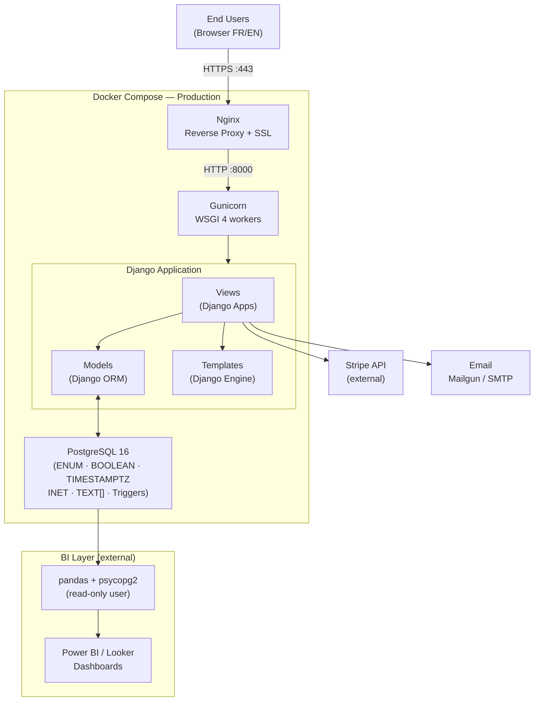
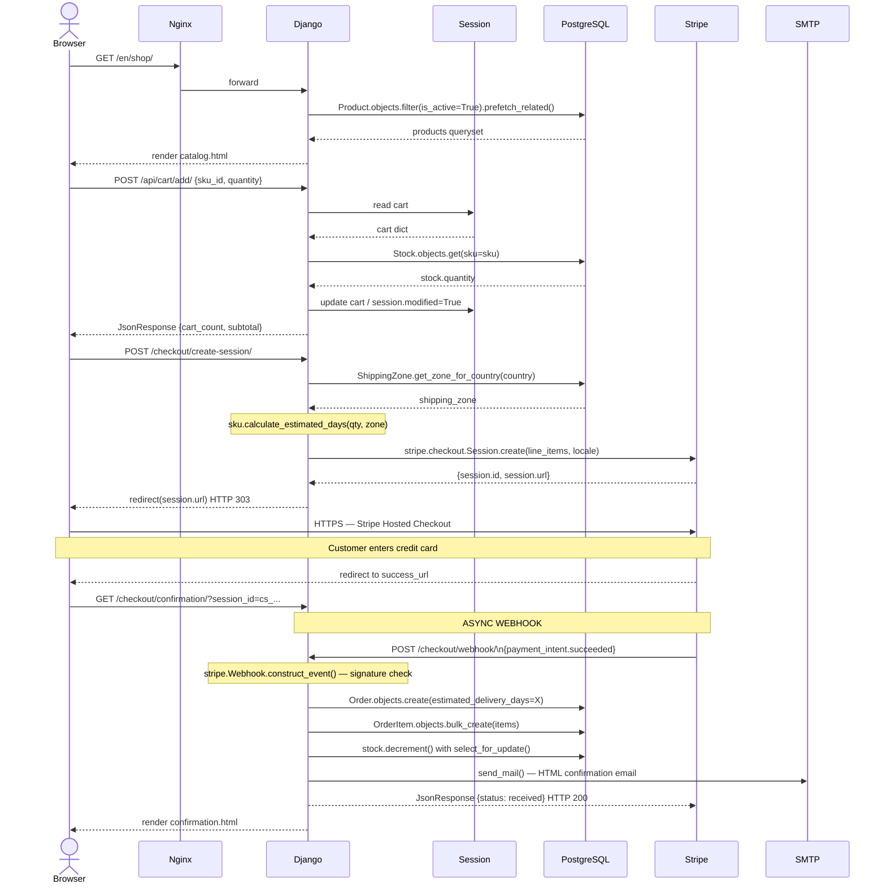
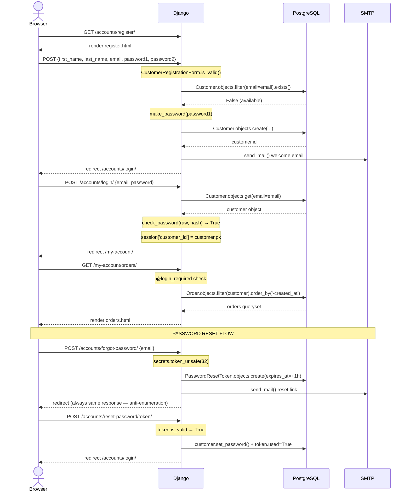
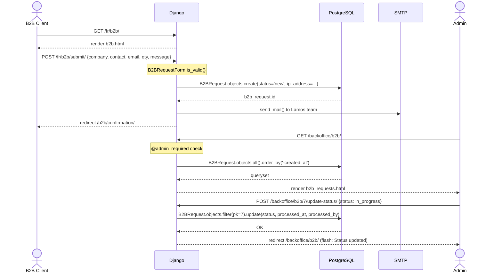
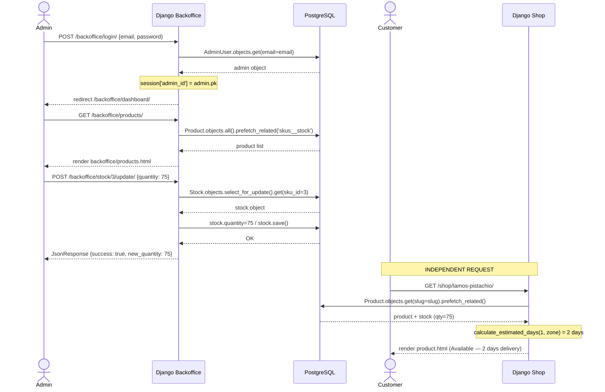
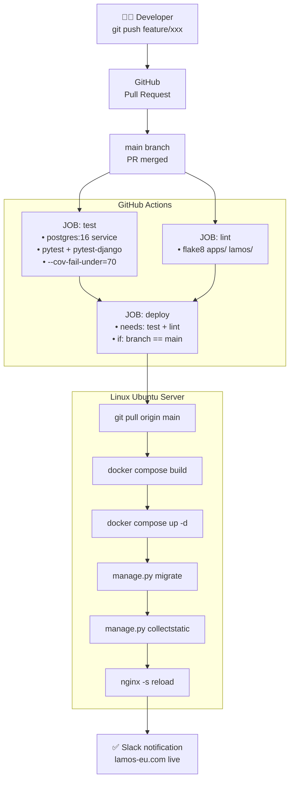
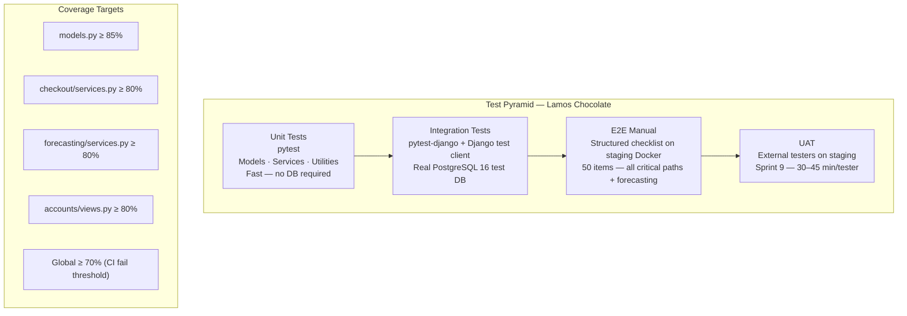
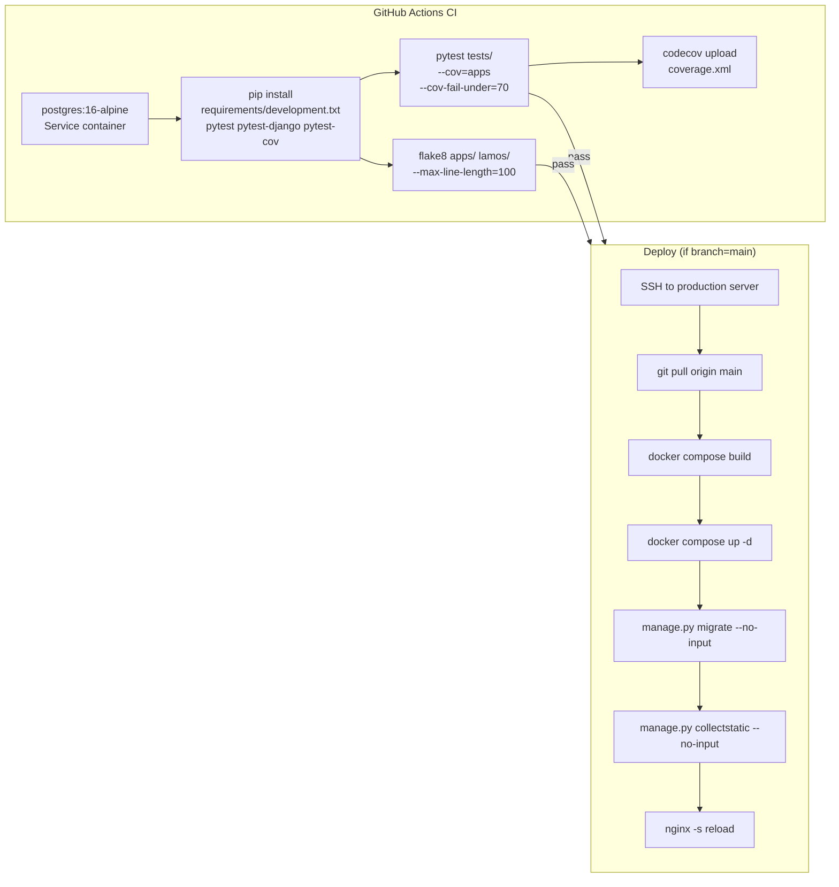

# Lamos Chocolate — All Diagrams Source Code
## VS Code · draw.io Compatible

> **How to use this file:**
>
> **VS Code**: Install the extensions `Markdown Preview Mermaid Support` and `Draw.io Integration`.
> All Mermaid blocks render natively in markdown preview. ASCII blocks render as-is in monospace.
>
> **draw.io**: Open draw.io (app or web) → `Extras` → `Edit Diagram` → select `Mermaid` from the dropdown → paste the Mermaid code block content.
>
> **Note**: Each diagram is provided in **two formats**:
> - `ASCII` — renders directly in VS Code markdown, readable in any editor
> - `Mermaid` — renders in VS Code (with extension) and imports natively into draw.io

---

---

# TASK 1 — System Architecture

## 1-A — Architecture Overview (ASCII)

```
┌─────────────────────────────────────────────────────────────────────┐
│                          END USERS                                  │
│   [B2C Visitor / Customer]    [B2B Client]    [Lamos Admin]         │
│         Browser (FR/EN)          Browser          Browser           │
└──────────────────────────┬──────────────────────────────────────────┘
                           │ HTTPS (port 443)
                           ▼
┌─────────────────────────────────────────────────────────────────────┐
│              NGINX — Reverse Proxy (Docker container)               │
│  • SSL/TLS termination (Let's Encrypt)                              │
│  • Static files served directly                                     │
│  • Forwards dynamic requests → Gunicorn :8000                       │
└──────────────────────────┬──────────────────────────────────────────┘
                           │ HTTP :8000
                           ▼
┌─────────────────────────────────────────────────────────────────────┐
│              GUNICORN — WSGI Server (Docker container)              │
│  • 4 workers in production                                          │
└──────────────────────────┬──────────────────────────────────────────┘
                           │
                           ▼
┌─────────────────────────────────────────────────────────────────────┐
│         DJANGO APPLICATION — Python 3.12 (Docker container)        │
│                  MVT Pattern                                        │
│                                                                     │
│  ┌────────────────┐  ┌──────────────────┐  ┌────────────────────┐  │
│  │     VIEWS      │  │      MODELS      │  │     TEMPLATES      │  │
│  │  (Django apps) │  │  (Django ORM)    │  │  (Django Engine)   │  │
│  │                │  │                  │  │                    │  │
│  │ main           │  │ Product          │  │ HTML + i18n tags   │  │
│  │ shop           │  │ SKU              │  │         │  │
│  │ cart           │  │ Order            │  │ Template inherit.  │  │
│  │ checkout       │  │ OrderItem        │  │                    │  │
│  │ accounts       │  │ Customer         │  │                    │  │
│  │ customer_area  │  │ B2BRequest       │  │                    │  │
│  │ b2b            │  │ Stock            │  │                    │  │
│  │ backoffice     │  │ ShippingZone     │  │                    │  │
│  │ forecasting    │  │ AdminUser        │  │                    │  │
│  └────────┬───────┘  └────────┬─────────┘  └────────────────────┘  │
│           └──────────────────┬┘                                     │
│                   ┌──────────┴─────────────────────────────────┐   │
│                   │         DJANGO BUILT-IN SERVICES            │   │
│                   │  django.contrib.auth · django.core.mail     │   │
│                   │  django.middleware.locale · django.contrib.  │   │
│                   │  postgres · Stripe Python SDK               │   │
│                   └────────────────────────────────────────────┘   │
└───────────────────────────────┬─────────────────────────────────────┘
                                │
              ┌─────────────────┼─────────────────┐
              ▼                 ▼                 ▼
 ┌──────────────────┐  ┌──────────────┐  ┌──────────────────┐
 │  PostgreSQL 16   │  │  Stripe API  │  │  Email (SMTP /   │
 │  (Docker)        │  │  (external)  │  │  Mailgun)        │
 │  ENUM types      │  │  Checkout    │  │  django.core.    │
 │  BOOLEAN         │  │  Sessions    │  │  mail +          │
 │  TIMESTAMPTZ     │  │  Webhooks    │  │  django-anymail  │
 │  INET / TEXT[]   │  │              │  │                  │
 │  Triggers        │  │              │  │                  │
 └──────────────────┘  └──────────────┘  └──────────────────┘

 ┌─────────────────────────────────────────────────────────┐
 │              BI LAYER (External — read-only)            │
 │  pandas + psycopg2 → lamos_bi_reader (PostgreSQL)      │
 │  → Power BI / Looker Studio Dashboards                 │
 │  KPIs: Orders · Revenue · Top Products · Forecasting   │
 └─────────────────────────────────────────────────────────┘
```

## 1-B — Architecture Overview (Mermaid — draw.io)



---

---

# TASK 2 — Database Schema (ERD)

## 2-A — Entity Relationship Diagram (ASCII)

```
categories
  id PK
  name_fr · name_en · slug · created_at
     │
     │ 1─N
     ▼
products
  id PK
  slug (UNIQUE) · name_fr · name_en
  description_* · ingredients_* · allergens_*
  category_id FK → categories.id
  image_url · is_active · created_at · updated_at
     │
     │ 1─N
     ▼
skus
  id PK
  product_id FK → products.id
  sku_code (UNIQUE) · format · weight_g
  price · currency · is_active
  production_delay_days · batch_size       ← forecasting
  created_at
     │
     ├── 1─1 ──────────────────────────────────────────┐
     ▼                                                  ▼
stock                                          order_items
  id PK                                          id PK
  sku_id FK (UNIQUE)                             order_id FK → orders.id
  quantity ≥ 0 · threshold_alert                 sku_id FK → skus.id
  updated_at · updated_by FK → admin_users       quantity > 0
                                                 unit_price · subtotal
                                                      │
                                                      │ N─1
                                                      ▼
customers                                      orders
  id PK                                          id PK
  first_name · last_name                         customer_id FK → customers.id
  email (UNIQUE) · password_hash                 order_number (UNIQUE)
  phone · address_* · city                       status (ENUM)
  postal_code · country                          total_amount · currency
  language_pref · is_active                      stripe_payment_id
  created_at · last_login                        stripe_session_id
     │                                           shipping_*
     │ 1─N                                       estimated_delivery_days ← forecasting
     │                                           language · notes
     │                                           created_at · updated_at
     │
     │ 1─N
     ▼
password_reset_tokens
  id PK
  customer_id FK · token (UNIQUE)
  expires_at · used · created_at

admin_users                          b2b_requests
  id PK                                id PK
  email (UNIQUE)                       company_name · contact_name
  password_hash                        contact_email · contact_phone
  first_name · last_name               sector · estimated_qty
  role (ENUM)                          occasion · message
  is_active                            status (ENUM) · language
  created_at · last_login              ip_address (INET)
                                       created_at · processed_at
                                       processed_by FK → admin_users.id

shipping_zones                         ← New (forecasting model)
  id PK
  zone_name
  countries TEXT[]                     ← PostgreSQL native array
  delay_days · cost
```

## 2-B — Entity Relationship Diagram (Mermaid — draw.io)

```mermaid
erDiagram
    categories {
        int id PK
        varchar name_fr
        varchar name_en
        varchar slug
        timestamptz created_at
    }
    products {
        int id PK
        varchar slug
        varchar name_fr
        varchar name_en
        text description_fr
        text description_en
        int category_id FK
        boolean is_active
        timestamptz created_at
        timestamptz updated_at
    }
    skus {
        int id PK
        int product_id FK
        varchar sku_code
        varchar format
        int weight_g
        decimal price
        varchar currency
        boolean is_active
        int production_delay_days
        int batch_size
        timestamptz created_at
    }
    stock {
        int id PK
        int sku_id FK
        int quantity
        int threshold_alert
        timestamptz updated_at
        int updated_by FK
    }
    shipping_zones {
        int id PK
        varchar zone_name
        text_array countries
        int delay_days
        decimal cost
    }
    customers {
        int id PK
        varchar first_name
        varchar last_name
        varchar email
        varchar password_hash
        varchar language_pref
        boolean is_active
        timestamptz created_at
        timestamptz last_login
    }
    orders {
        int id PK
        int customer_id FK
        varchar order_number
        varchar status
        decimal total_amount
        varchar currency
        varchar stripe_session_id
        varchar shipping_country
        int estimated_delivery_days
        timestamptz created_at
        timestamptz updated_at
    }
    order_items {
        int id PK
        int order_id FK
        int sku_id FK
        int quantity
        decimal unit_price
        decimal subtotal
    }
    b2b_requests {
        int id PK
        varchar company_name
        varchar contact_email
        varchar status
        inet ip_address
        int processed_by FK
        timestamptz created_at
    }
    admin_users {
        int id PK
        varchar email
        varchar role
        boolean is_active
    }
    password_reset_tokens {
        int id PK
        int customer_id FK
        varchar token
        timestamptz expires_at
        boolean used
    }

    categories ||--o{ products : "has"
    products ||--o{ skus : "has variants"
    skus ||--|| stock : "has stock"
    skus ||--o{ order_items : "included in"
    orders ||--o{ order_items : "contains"
    customers ||--o{ orders : "places"
    customers ||--o{ password_reset_tokens : "has"
    admin_users ||--o{ b2b_requests : "processes"
    admin_users ||--o{ stock : "updates"
```



---

---

# TASK 3 — Sequence Diagrams

## 3-1A — B2C Purchase Flow (ASCII)

```
Browser       Nginx      Django       Session       DB            Stripe       SMTP
   │             │          │             │           │               │           │
   │─ GET /shop/ ►          │             │           │               │           │
   │             │─ forward ►             │           │               │           │
   │             │          │─ Product.objects.filter().prefetch_related() ───────►
   │             │          │◄─ products queryset ─────────────────── │           │
   │             │◄─ render catalog.html ─┘            │              │           │
   │◄────────────┘          │             │            │              │           │
   │                        │             │            │              │           │
   │─ POST /api/cart/add/ ──►             │            │              │           │
   │  {sku_id, quantity}     │             │            │              │           │
   │             │          │─ read cart ─►            │              │           │
   │             │          │◄─ cart dict ┘            │              │           │
   │             │          │─ Stock.objects.get(sku) ─►              │           │
   │             │          │◄─ stock.quantity ─────── │              │           │
   │             │          │─ update cart ►           │              │           │
   │             │◄─ JsonResponse {cart_count, subtotal} ┘            │           │
   │◄────────────┘          │             │            │              │           │
   │                        │             │            │              │           │
   │─ POST /checkout/create-session/ ──────►           │              │           │
   │             │          │─ ShippingZone.get_zone_for_country() ───►           │
   │             │          │─ sku.calculate_estimated_days(qty, zone)            │
   │             │          │─ stripe.checkout.Session.create() ──────────────────►
   │             │          │◄─ {session.id, session.url} ─────────────────────── │
   │             │◄─ redirect(session.url) HTTP 303 ───┘              │           │
   │◄────────────┘          │             │            │              │           │
   │── redirect → Stripe Hosted Checkout Page ────────────────────── ►           │
   │      [CUSTOMER ENTERS CREDIT CARD ON STRIPE]      │             │           │
   │◄── redirect to success_url ─────────────────────────────────── ─┘           │
   │─ GET /checkout/confirmation/ ──────────►          │              │           │
   │             │          │── [ASYNC WEBHOOK] ────────────────────────►         │
   │             │          │◄── POST /checkout/webhook/ ─────────────── │         │
   │             │          │─ stripe.Webhook.construct_event() verify   │         │
   │             │          │─ Order.objects.create(estimated_days=X) ───►         │
   │             │          │─ OrderItem.objects.bulk_create() ──────────►         │
   │             │          │─ stock.decrement() select_for_update() ─────►        │
   │             │          │─ send_mail() confirmation ──────────────────────────►
   │             │◄─ render confirmation.html ──────────┘             │           │
   │◄────────────┘          │             │            │              │           │
```

## 3-1B — B2C Purchase Flow (Mermaid — draw.io)



---

## 3-2A — Customer Registration & Auth (ASCII)

```
Browser       Django       DB          Django Auth    SMTP
   │             │           │               │           │
   │─ GET /accounts/register/ ──────────────►          │
   │◄─ render register.html ──────────────── │          │
   │─ POST /accounts/register/ ──────────────►          │
   │  {first_name, last_name, email,         │          │
   │   password1, password2}                 │          │
   │             │─ CustomerRegistrationForm.is_valid() │
   │             │─ Customer.objects.filter(email).exists() ──────────►
   │             │◄─ False (available) ─────────────────────────────── │
   │             │─ make_password(password1)                           │
   │             │─ Customer.objects.create() ──────────────────────── ►
   │             │◄─ customer.id ────────────────────────────────────── │
   │             │─── send_mail() welcome ─────────────────────────────►
   │◄─ redirect /accounts/login/ ─────────── │          │
   │                         │              │           │
   │─ POST /accounts/login/ ─────────────────►          │
   │  {email, password}       │              │          │
   │             │─ Customer.objects.get(email=email) ──────────────── ►
   │             │◄─ customer ──────────────────────────────────────── │
   │             │─ check_password(password, hash) → True              │
   │             │─ session['customer_id'] = customer.pk               │
   │◄─ redirect /my-account/ ─────────────── │          │
   │─ GET /my-account/orders/ ───────────────►          │
   │             │─ @login_required check                              │
   │             │─ Order.objects.filter(customer).order_by('-created_at') ───────►
   │             │◄─ orders ─────────────────────────────────────────── │
   │◄─ render orders.html ─────────────────── │          │
   │                         │              │           │
   │  [PASSWORD RESET]       │              │           │
   │─ POST /accounts/forgot-password/ ───────►          │
   │             │─ secrets.token_urlsafe(32)                          │
   │             │─ PasswordResetToken.objects.create(expires+1h) ─────►
   │             │─── send_mail() reset link ──────────────────────────►
   │◄─ redirect (anti-enumeration response) ─ │          │
   │─ POST /accounts/reset-password/<token>/ ─►          │
   │             │─ token.is_valid → True      │          │
   │             │─ customer.set_password()    │          │
   │             │─ token.used = True          │          │
   │◄─ redirect /accounts/login/ ─────────── │          │
```

## 3-2B — Customer Registration & Auth (Mermaid — draw.io)



---

## 3-3A — B2B Request + Admin Processing (ASCII)

```
Browser(B2B)   Django       DB           SMTP(Lamos)   Browser(Admin)
    │             │           │               │              │
    │─ GET /fr/b2b/ ──────────►              │              │
    │◄─ render b2b.html ───────┘             │              │
    │─ POST /fr/b2b/submit/ ────►            │              │
    │  {company_name, contact_name,          │              │
    │   contact_email, sector,               │              │
    │   estimated_qty, occasion, message}    │              │
    │             │─ B2BRequestForm.is_valid()              │
    │             │─ B2BRequest.objects.create(             │
    │             │    status='new',                        │
    │             │    ip_address=REMOTE_ADDR) ─────────────►
    │             │◄─ b2b_request.id ────────────────────── │
    │             │─── send_mail() → Lamos team ────────────►
    │◄─ redirect /b2b/confirmation/ ─────── │              │
    │                          │                           │
    │                          │    GET /backoffice/b2b/ ◄─┘
    │                          │─ @admin_required check    │
    │                          │─ B2BRequest.objects.all() ►
    │                          │◄─ queryset ─────────────── │
    │                          │─── render backoffice/b2b_requests.html ──────────►
    │                          │                           │
    │                          │    POST /backoffice/b2b/<id>/update-status/ ◄──── │
    │                          │    {status: 'in_progress'}│
    │                          │─ B2BRequest.objects.filter(pk=id).update(         │
    │                          │    status, processed_at,  │
    │                          │    processed_by) ──────────►
    │                          │◄─ OK ───────────────────── │
    │                          │─── redirect /backoffice/b2b/ (flash: updated) ───►
```

## 3-3B — B2B Request + Admin Processing (Mermaid — draw.io)



---

## 3-4A — Admin Stock Update + Storefront (ASCII)

```
Browser(Admin)   Django(Backoffice)   DB         Browser(Customer)  Django(Shop)
    │                │                 │                │               │
    │─ POST /backoffice/login/ ──────────►               │               │
    │              │─ AdminUser.objects.get(email) ───────►               │
    │              │◄─ admin ─────────────────────────── │               │
    │              │─ session['admin_id'] = admin.pk     │               │
    │◄─ redirect /backoffice/dashboard/ ────────────── ──┘               │
    │                                  │                │               │
    │─ GET /backoffice/products/ ────────►               │               │
    │              │─ Product.objects.all().prefetch_related('skus__stock') ────────►
    │              │◄─ product list ────────────────────── │               │
    │◄─ render backoffice/products.html ─┘               │               │
    │                                  │                │               │
    │─ POST /backoffice/stock/<sku_id>/update/ ────────────►              │
    │  {quantity: 75}                  │                │               │
    │              │─ Stock.objects.select_for_update().get(sku_id) ──── ►│
    │              │◄─ stock object ──────────────────── │               │
    │              │─ stock.quantity = 75 / save() ────── ►               │
    │              │◄─ OK ─────────────────────────────── │               │
    │◄─ JsonResponse {success: true, new_quantity: 75, is_low: false} ── │
    │                                  │                │               │
    │                    [INDEPENDENT REQUEST — CUSTOMER]               │
    │                                  │    GET /shop/lamos-pistachio/ ──►
    │                                  │                │─ Product.objects.get(slug)
    │                                  │                │  .prefetch_related('skus__stock')
    │                                  │                │─ calculate_estimated_days()
    │                                  │◄─ render product.html (Available, 2 days) ──┘
```

## 3-4B — Admin Stock Update + Storefront (Mermaid — draw.io)



---

## 3-5A — CI/CD Pipeline (ASCII)

```
Developer    GitHub        GitHub Actions        Docker          Server(Prod)   Nginx
    │           │                │                  │                │           │
    │─ git push feature/xxx ──────►                 │                │           │
    │           │─ PR opened ────►                  │                │           │
    │           │  [Peer code review]               │                │           │
    │           │─ PR merged to main ───────────────►                │           │
    │           │                │                  │                │           │
    │           │──── trigger CI/CD workflow ────────►               │           │
    │           │                │                  │                │           │
    │           │         ┌──────┴──────┐           │                │           │
    │           │         │  JOB: test  │           │                │           │
    │           │         ├─────────────┤           │                │           │
    │           │         │ postgres:16 │           │                │           │
    │           │         │ service     │           │                │           │
    │           │         │ (Alpine)    │           │                │           │
    │           │         │ pytest      │           │                │           │
    │           │         │ pytest-django            │                │           │
    │           │         │ --cov ≥ 70%             │                │           │
    │           │         │  ✓ passed   │           │                │           │
    │           │         └──────┬──────┘           │                │           │
    │           │         ┌──────┴──────┐           │                │           │
    │           │         │ JOB: lint   │           │                │           │
    │           │         │ flake8      │           │                │           │
    │           │         │  ✓ passed   │           │                │           │
    │           │         └──────┬──────┘           │                │           │
    │           │         ┌──────┴────────────┐     │                │           │
    │           │         │  JOB: deploy      │     │                │           │
    │           │         │  (needs test+lint)│     │                │           │
    │           │         │ SSH to server     │     │                │           │
    │           │         │ git pull main     │     │                │           │
    │           │         │ docker compose    │─────►                │           │
    │           │         │   build           │     │ build images   │           │
    │           │         │ docker compose    │─────►                │           │
    │           │         │   up -d           │     │ restart ctrs   │           │
    │           │         │ manage.py migrate │─────►                │           │
    │           │         │ collectstatic     │─────►                │           │
    │           │         │                   │     │                │──────────►│
    │           │         │ nginx -s reload   │     │                │           │ reload
    │           │         │  ✓ deployed       │     │                │◄──────────┘
    │           │         └───────────────────┘     │                │
    │◄─────────────── Slack: "✅ Deploy successful — lamos-eu.com" ─────────────
```

## 3-5B — CI/CD Pipeline (Mermaid — draw.io)



---

---

# TASK 5 — SCM & QA Diagrams

## 5-1A — Git Branching Strategy (ASCII)

```
main ──────────────────────────────●────────────────────────●──────────►
(production)                       ▲                        ▲
                                   │ merge                  │ merge
staging ────────────────────●──────●────────────────●───────●──────────►
(pre-prod)                  ▲                       ▲
                            │ merge                 │ merge
develop ────────────────────●───────────────────────●──────────────────►
(integration)              ▲│                      ▲│
                            │                       │
feature/stripe-checkout─────●──────────────────────►│
feature/forecasting─────────────────────────────────●──────────────────►
fix/stock-decrement─────────────────────►
hotfix/webhook-500──────────────────────────────────────────────────────►
                                                              (→ main directly)
```

## 5-1B — Git Branching Strategy (Mermaid — draw.io)

```mermaid
gitGraph
    commit id: "Initial Django setup"
    branch develop
    checkout develop
    commit id: "feat(shop): catalog view"

    branch feature/stripe-checkout
    checkout feature/stripe-checkout
    commit id: "feat(checkout): Stripe session"
    commit id: "feat(checkout): webhook handler"
    checkout develop
    merge feature/stripe-checkout id: "Merge: Stripe checkout"

    branch feature/forecasting
    checkout feature/forecasting
    commit id: "feat(shop): add production_delay_days"
    commit id: "feat(forecasting): delivery calculation"
    checkout develop
    merge feature/forecasting id: "Merge: forecasting"

    branch staging
    checkout staging
    merge develop id: "Staging deploy"

    checkout main
    merge staging id: "v1.0 — Production deploy"

    checkout develop
    branch fix/stock-decrement
    checkout fix/stock-decrement
    commit id: "fix(stock): atomic decrement"
    checkout develop
    merge fix/stock-decrement id: "Merge: stock fix"
```

---

## 5-2A — Test Pyramid (ASCII)

```
                         ┌─────────┐
                         │   UAT   │
                         │ Manual  │
                         │Sprint 9 │
                        ┌┴─────────┴┐
                        │    E2E    │
                        │  Manual   │
                        │ Checklist │
                       ┌┴───────────┴┐
                       │ Integration │
                       │pytest-django│
                       │ PostgreSQL  │
                      ┌┴─────────────┴┐
                      │  Unit Tests   │
                      │    pytest     │
                      │  Models /     │
                      │  Services     │
                      └───────────────┘
                       Coverage ≥ 70%
                       (CI threshold)
```

## 5-2B — Test Pyramid (Mermaid — draw.io)



---

## 5-3A — CI/CD Flow Detail (Mermaid — draw.io)



---

> **draw.io import instructions:**
>
> 1. Open [draw.io](https://app.diagrams.net) or VS Code draw.io extension
> 2. Click `Extras` → `Edit Diagram`
> 3. In the dropdown, select **Mermaid**
> 4. Paste the content of any `mermaid` code block above (without the backticks)
> 5. Click `OK` — the diagram renders automatically
> 6. To export: `File` → `Export As` → PNG / SVG / PDF
>
> **VS Code Mermaid preview:**
> Install `Markdown Preview Mermaid Support` extension.
> Open this file → `Ctrl+Shift+V` (or `Cmd+Shift+V`) for preview.
> All Mermaid blocks render inline.
