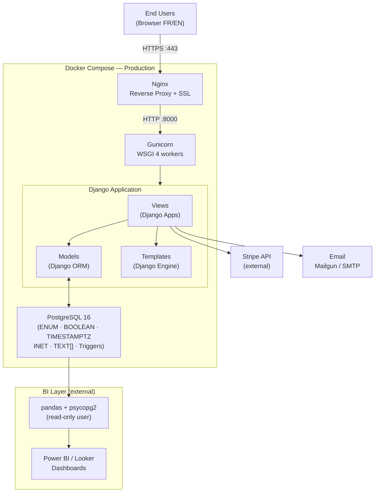

# Stage 3 — Task 1: System Architecture
## Lamos Chocolate — European Digital Platform

> **Project**: Lamos Chocolate — European Digital Platform
> **Team**: Sara Rebati · Valentin Planchon
> **Stack**: Django 5.x · PostgreSQL 16 · Docker · GitHub Actions

---

## 1.1 — Architecture Overview

The Lamos Chocolate system is a **multi-layer full-stack web application** organized around Django's **MVT (Model-View-Template)** pattern. It integrates an external BI layer connected directly to the production PostgreSQL database. The entire infrastructure is **containerized with Docker** and deployed on a Linux Ubuntu server via a GitHub Actions CI/CD pipeline, behind an Nginx reverse proxy.

### Core Architectural Principles

| Principle | Choice | Justification |
|-----------|--------|---------------|
| **MVT Pattern** | Django 5.x | Batteries-included framework: built-in admin, auth, ORM, i18n, forms |
| **Modular monolith** | Django apps | Appropriate for MVP scope, evolvable toward microservices in V2 |
| **Relational database** | PostgreSQL 16 | ACID, superior MVCC, JSONB, arrays, native full-text search, partitioning |
| **Reverse proxy** | Nginx in front of Gunicorn | Performance, HTTPS termination, static asset serving |
| **Central containerization** | Docker + Docker Compose | Full dev/staging/prod reproducibility |
| **CI/CD** | GitHub Actions | Native GitHub integration, free, Holberton curriculum |
| **External payment** | Stripe API (hosted checkout) | PCI-DSS compliance delegated to Stripe |
| **External BI** | Power BI / Looker via Python connector | Decoupled reporting, no production performance impact |
| **Connection pooling** | PgBouncer (production) | PostgreSQL connection management at high load |

### Stack Migration Summary — Flask/MySQL → Django/PostgreSQL

| Component | Previous Stack (V1) | New Stack (V2) |
|-----------|--------------------|--------------------|
| Framework | Flask | Django 5.x |
| ORM | SQLAlchemy | Django ORM (built-in) |
| Database | MySQL 8 | PostgreSQL 16 |
| Auth | Flask-Login | `django.contrib.auth` |
| i18n | Flask-Babel | `django.middleware.locale` + django-rosetta |
| Email | Flask-Mail | `django.core.mail` + django-anymail |
| Forms | Flask-WTF | Django Forms |
| Admin | Custom Flask panel | Django Admin + custom backoffice |
| Migrations | Flask-Migrate (Alembic) | Django Migrations (built-in) |
| Tests | pytest | pytest + pytest-django |
| DB URI | `mysql+pymysql://` | `postgresql+psycopg2://` |
| Session storage | Flask server-side session | Django sessions (DB-backed) |
| ENUM types | Inline MySQL ENUM | `CREATE TYPE AS ENUM` (PostgreSQL reusable types) |
| Auto-increment | `AUTO_INCREMENT` | `GENERATED ALWAYS AS IDENTITY` |
| Boolean | `TINYINT(1)` | Native `BOOLEAN` |
| Timestamps | `DATETIME` | `TIMESTAMPTZ` (timezone-aware) |
| `updated_at` | `ON UPDATE CURRENT_TIMESTAMP` | PostgreSQL trigger `update_updated_at()` |

---

## 1.2 — High-Level Architecture Diagram

```
┌─────────────────────────────────────────────────────────────────────┐
│                          END USERS                                  │
│                                                                     │
│   [B2C Visitor / Customer]    [B2B Client]    [Lamos Admin]         │
│         Browser (FR/EN)          Browser          Browser           │
└──────────────────────────┬──────────────────────────────────────────┘
                           │ HTTPS (port 443)
                           ▼
┌─────────────────────────────────────────────────────────────────────┐
│                  NGINX — Reverse Proxy (Docker)                     │
│              (Linux Ubuntu Server — Production)                     │
│  • SSL/TLS termination (Let's Encrypt certificate)                  │
│  • Direct serving of static files (CSS, JS, images)                 │
│  • Forwards dynamic requests → Gunicorn (port 8000)                 │
└──────────────────────────┬──────────────────────────────────────────┘
                           │ HTTP (port 8000, internal Docker network)
                           ▼
┌─────────────────────────────────────────────────────────────────────┐
│                  GUNICORN — WSGI Server (Docker)                    │
│              (4 workers — production)                               │
│  • Serves the Django application in production                      │
│  • Handles request concurrency                                      │
└──────────────────────────┬──────────────────────────────────────────┘
                           │
                           ▼
┌─────────────────────────────────────────────────────────────────────┐
│               DJANGO APPLICATION — Python 3.12 (Docker)             │
│                   [Application Layer — MVT]                         │
│                                                                     │
│  ┌────────────────────┐  ┌──────────────────┐  ┌────────────────┐   │
│  │      VIEWS         │  │     MODELS       │  │   TEMPLATES    │   │
│  │   (Django apps)    │  │  (Django ORM)    │  │ (Django tmpl.) │   │
│  │                    │  │                  │  │                │   │
│  │ • main (home,      │  │ • Product        │  │ • HTML files   │   │
│  │   about, i18n)     │  │ • SKU            │  │ • Template     │   │
│  │ • shop (catalog,   │  │ • Order          │  │   inheritance  │   │
│  │   product pages)   │  │ • OrderItem      │  │ • i18n tags    │   │
│  │ • cart (session    │  │ • Customer       │  │   ()│   │
│  │   management)      │  │ • B2BRequest     │  │ • Reusable     │   │
│  │ • checkout         │  │ • Stock          │  │   partials     │   │
│  │   (Stripe)         │  │ • ShippingZone   │  │                │   │
│  │ • accounts         │  │ • AdminUser      │  │                │   │
│  │   (auth)           │  │ • PasswordReset  │  │                │   │
│  │ • customer_area    │  │   Token          │  │                │   │
│  │   (order hist.)    │  │                  │  │                │   │
│  │ • b2b (form)       │  │                  │  │                │   │
│  │ • backoffice       │  │                  │  │                │   │
│  │   (admin panel)    │  │                  │  │                │   │
│  │ • forecasting      │  │                  │  │                │   │
│  │   (delivery calc.) │  │                  │  │                │   │
│  └────────┬───────────┘  └────────┬─────────┘  └────────────────┘   │
│           │                       │                                 │
│  ┌────────┴───────────────────────┴───────────────────────────────┐ │
│  │                  BUILT-IN DJANGO SERVICES                      │ │
│  │  • django.contrib.auth  (sessions, login, logout, permissions) │ │
│  │  • django.middleware.locale  (i18n, language routing)          │ │
│  │  • django.core.mail  (transactional emails)                    │ │
│  │  • django.contrib.admin  (native admin for superusers)         │ │
│  │  • django.contrib.postgres  (ArrayField, GIN index, INET)      │ │
│  │  • Stripe Python SDK  (webhooks + checkout sessions)           │ │
│  └────────────────────────────┬───────────────────────────────────┘ │
└───────────────────────────────┼─────────────────────────────────────┘
                                │
          ┌─────────────────────┼──────────────────────┐
          │                     │                      │
          ▼                     ▼                      ▼
┌──────────────────┐   ┌──────────────────┐   ┌────────────────────┐
│  DATABASE        │   │  STRIPE API      │   │  EMAIL             │
│  PostgreSQL 16   │   │  (external)      │   │  (external)        │
│  (Docker)        │   │                  │   │                    │
│                  │   │ • Checkout       │   │ • django.core.mail │
│ • ENUM types     │   │   Sessions       │   │ + django-anymail   │
│ • BOOLEAN        │   │ • Webhooks       │   │ • Order confirm.   │
│ • TIMESTAMPTZ    │   │   (payment_      │   │ • B2B notifications│
│ • INET           │   │   intent.        │   │ • Password reset   │
│ • TEXT[]         │   │   succeeded)     │   │ • Registration     │
│ • Triggers       │   │ • Test/Prod keys │   │                    │
│ • Partial indexes│   │                  │   │                    │
│ • Django ORM     │   │                  │   │                    │
└──────────────────┘   └──────────────────┘   └────────────────────┘

          ┌─────────────────────────────────────────────────────────┐
          │              BI LAYER — DATA REPORTING                  │
          │                                                         │
          │  Python Data Connector (pandas + psycopg2)              │
          │     │                                                   │
          │     └──► PostgreSQL (READ-ONLY user lamos_bi_reader)    │
          │               │                                         │
          │               └──► Power BI Desktop / Looker Studio     │
          │                      KPI Dashboards:                    │
          │                      ├── Orders & Revenue               │
          │                      ├── Top 3 Products                 │
          │                      ├── B2C vs B2B Ratio               │
          │                      ├── Days Until Stockout / SKU      │
          │                      ├── Production Relaunch Alerts     │
          │                      └── Monthly Seasonality            │
          └─────────────────────────────────────────────────────────┘

          ┌─────────────────────────────────────────────────────────┐
          │              INFRASTRUCTURE & CI/CD                     │
          │                                                         │
          │  [Developer Workstation]                                │
          │    │   git push → [GitHub Repository]                   │
          │    │                   │                                │
          │    │           [GitHub Actions]                         │
          │    │           • Run pytest + pytest-django             │
          │    │           • PostgreSQL 16 service (Alpine)         │
          │    │           • Build Docker image                     │
          │    │           • Deploy to production server            │
          │    │                   │                                │
          │    │     [Docker Compose — 4 services]                  │
          │    │     • db      (PostgreSQL 16-alpine)               │
          │    │     • app     (Django + Gunicorn)                  │
          │    │     • nginx   (Reverse proxy + SSL)                │
          │    │     • pgbouncer (Connection pooling — prod only)   │
          │    │                                                    │
          │  [Linux Ubuntu Server — Production]                     │
          │    • All services run in Docker containers              │
          │    • Let's Encrypt SSL via Certbot                      │
          └─────────────────────────────────────────────────────────┘
```

---

## 1.3 — Layer-by-Layer Description

### 1.3.1 — Presentation Layer (Front-end)

**Technologies: HTML5 · CSS3 · Vanilla JavaScript · Django Templates**

The front-end is entirely server-side rendered via Django's built-in template engine. No JavaScript front-end framework (React, Vue) in the MVP — vanilla JS handles AJAX interactions only.

**Template organization:**

```
templates/
├── base.html                  ← Global layout (navbar, footer, meta, i18n)
├── main/
│   ├── index.html             ← Homepage
│   └── about.html             ← Brand story
├── shop/
│   ├── catalog.html           ← Product list
│   └── product.html           ← Product page + estimated delivery display
├── cart/
│   └── cart.html              ← Cart page
├── checkout/
│   ├── checkout.html          ← Shipping address form
│   └── confirmation.html      ← Post-payment confirmation
├── accounts/
│   ├── login.html
│   ├── register.html
│   └── reset_password.html
├── customer_area/
│   └── orders.html            ← Order history
├── b2b/
│   └── b2b.html               ← Corporate form
├── backoffice/                ← Custom admin panel (beyond Django Admin)
│   ├── dashboard.html         ← KPIs + stock & production alerts
│   ├── products.html
│   ├── orders.html
│   └── b2b_requests.html
└── emails/                    ← HTML email templates
    ├── order_confirmation.html
    ├── b2b_notification.html
    └── reset_password.html
```

**Static files:**

```
static/
├── css/
│   ├── main.css               ← Global styles + CSS custom properties
│   ├── shop.css
│   ├── backoffice.css
│   └── responsive.css         ← Mobile-first media queries
├── js/
│   ├── cart.js                ← Cart AJAX updates (fetch API)
│   ├── language.js            ← Language switcher
│   └── backoffice.js          ← Admin panel interactions
└── images/
    └── products/              ← WebP optimized product photos
```

**Internationalization (i18n):**
- `django.middleware.locale` handles language detection (cookie + URL prefix via `i18n_patterns`)
- Translation files: `locale/fr/LC_MESSAGES/django.po` and `locale/en/`
- All strings use `` in templates and `_("...")` in Python
- Tool: `django-rosetta` for in-browser translation editing

---

### 1.3.2 — Application Layer (Django Back-end)

**Technologies: Python 3.12 · Django 5.x · Django Apps · Django ORM**

The Django application is structured as **Django apps** to separate functional modules. Each app maps to a business domain.

**Django Apps structure:**

| App | URL Prefix | Responsibilities |
|-----|------------|-----------------|
| `main` | `/` | Homepage, brand page, language selection |
| `shop` | `/shop/` | Catalog, product pages, delivery estimation |
| `cart` | `/cart/` | Cart management (Django session), AJAX endpoints |
| `checkout` | `/checkout/` | Stripe payment flow, webhooks, confirmation |
| `accounts` | `/accounts/` | Login, register, logout, password reset |
| `customer_area` | `/my-account/` | Customer profile, order history |
| `b2b` | `/b2b/` | Corporate form, confirmation |
| `backoffice` | `/backoffice/` | Custom admin panel: product CRUD, orders, B2B |
| `forecasting` | (internal) | Delivery time calculation, BI alert queries |

**Cross-cutting Django services:**
- `django.contrib.auth`: session management, `@login_required`, `LoginRequiredMixin`
- `django.middleware.locale`: i18n, bilingual URL routing
- `django.core.mail` / `django-anymail`: transactional emails
- `django.contrib.admin`: native admin interface for superusers (`/admin/`)
- `django.contrib.postgres`: `ArrayField` for `shipping_zones.countries`, `GIN` index
- Stripe Python SDK: checkout session creation, webhook processing

---

### 1.3.3 — Data Layer (PostgreSQL 16)

**Technologies: PostgreSQL 16 · Django ORM · Django Migrations**

PostgreSQL 16 was chosen over MySQL 8 for several key advantages:

| Criterion | PostgreSQL 16 | MySQL 8 |
|-----------|--------------|---------|
| Advanced types | JSONB, `TEXT[]`, `INET`, range types | Basic |
| MVCC | Superior, fewer lock contentions | More aggressive locks |
| ENUM types | `CREATE TYPE AS ENUM` (reusable) | Inline per column |
| Extensions | pg_trgm, PostGIS, TimescaleDB, pg_stat_statements | Few |
| SQL conformance | Very high | Partial |
| Native partitioning | Yes (on `orders.created_at`) | Limited |
| `CHECK` constraints | Full support since always | Recent (8.0.16+) |

**Connection:**
```
postgresql+psycopg2://lamos_app:password@db:5432/lamos_db
```

**Key PostgreSQL features used:**
- `GENERATED ALWAYS AS IDENTITY` (replaces `AUTO_INCREMENT`)
- `BOOLEAN` (replaces `TINYINT(1)`)
- `TIMESTAMPTZ` (replaces `DATETIME` — timezone-aware)
- `CREATE TYPE AS ENUM` — reusable across tables
- `INET` — native type for IP addresses (`b2b_requests.ip_address`)
- `TEXT[]` — PostgreSQL array for `shipping_zones.countries`
- Trigger `update_updated_at()` (replaces `ON UPDATE CURRENT_TIMESTAMP`)
- Partial indexes: `WHERE status NOT IN ('cancelled', 'refunded')` on orders
- Advisory locks for atomic stock decrements

**BI Read-Only Access:**
```sql
CREATE ROLE lamos_bi_reader WITH LOGIN PASSWORD 'bi_secure_password';
GRANT CONNECT ON DATABASE lamos_db TO lamos_bi_reader;
GRANT USAGE ON SCHEMA public TO lamos_bi_reader;
GRANT SELECT ON ALL TABLES IN SCHEMA public TO lamos_bi_reader;
ALTER DEFAULT PRIVILEGES IN SCHEMA public GRANT SELECT ON TABLES TO lamos_bi_reader;
```

---

### 1.3.4 — External Services

| Service | Usage | Protocol | Environment Variables |
|---------|-------|----------|-----------------------|
| **Stripe** | Online checkout + webhooks | HTTPS REST | `STRIPE_PUBLIC_KEY`, `STRIPE_SECRET_KEY`, `STRIPE_WEBHOOK_SECRET` |
| **SMTP / Mailgun** | Transactional emails | SMTP TLS 587 / HTTP API | `EMAIL_HOST`, `MAILGUN_API_KEY` |
| **Let's Encrypt** | SSL/TLS certificate | Certbot auto-renew | Managed by Nginx |

---

### 1.3.5 — BI Layer (Business Intelligence)

**Technologies: Python (pandas, psycopg2) · Power BI Desktop / Looker Studio**

The BI layer is **fully decoupled** from the main application. It queries PostgreSQL through a read-only user and feeds externalized dashboards. This separation guarantees that no heavy analytical query impacts production site performance.

**BI data flow:**
```
PostgreSQL lamos_db (read-only via lamos_bi_reader)
    │
    └── Python Connector (pandas + psycopg2 / SQLAlchemy)
         │
         ├── Data aggregation (groupby, pivot, KPI computation)
         │
         └── Export to Power BI / Looker Studio
              │
              └── Live KPI Dashboards:
                   ├── KPI 1: Total orders (by period)
                   ├── KPI 2: Revenue (total / per product)
                   ├── KPI 3: Top 3 products (volume + revenue)
                   ├── KPI 4: B2C orders vs B2B requests ratio
                   ├── KPI 5: Days until stockout / SKU (forecasting)
                   ├── KPI 6: Production relaunch alerts
                   └── KPI 7: Monthly seasonality (peak detection)
```

**Forecasting model** (new — from `forecasting.md`):
- Sales velocity per SKU computed from the last 90 days of orders
- Days until stockout = `current_stock / (units_per_week / 7)`
- Production alert triggered when: `days_until_stockout ≤ production_delay_days + 3`
- Expected peaks: November–December (Christmas gifts), February (Valentine's Day), May (Mother's Day)

---

### 1.3.6 — Infrastructure & DevOps

**Technologies: GitHub · GitHub Actions · Docker · Docker Compose · Nginx · Linux Ubuntu Server**

Docker is the backbone of the entire infrastructure, from local development to production.

**Docker Compose services:**

```yaml
services:
  db:          # PostgreSQL 16-alpine
  app:         # Django + Gunicorn (4 workers in production)
  nginx:       # Reverse proxy + SSL termination
  pgbouncer:   # Connection pooling (production only)
```

**CI/CD pipeline:**
```
Developer → git push → GitHub
                          │
                    GitHub Actions (CI)
                          │
                    ┌─────┴─────┐
                    │           │
                  Tests       Lint
              (pytest-django) (flake8)
              PostgreSQL 16     │
               service          │
                    │           │
                    └────┬──────┘
                         │
                   (if all pass)
                         │
                   Deploy to Server
                   (SSH + docker compose up)
                         │
                   django manage.py migrate
                   django manage.py collectstatic
                         │
                   Nginx reloads
                         │
                   Production Live ✓
```

**Environments:**

| Env | Description | URL | Docker Compose file |
|-----|-------------|-----|---------------------|
| `development` | Local developer machine | `localhost:8000` | `docker-compose.dev.yml` |
| `staging` | Pre-production test server | `staging.lamos-eu.com` | `docker-compose.staging.yml` |
| `production` | Live server | `lamos-eu.com` | `docker-compose.yml` |

---

## 1.4 — Data Flows — Main Use Cases

### Flow 1: B2C Order (Complete Purchase Journey)

```
Browser → GET /en/shop/ → Nginx → Gunicorn → Django (shop app)
                                              → Django ORM → PostgreSQL
                                                (SELECT products with prefetch_related)
                                              ← Django template render catalog.html ←

Browser → POST /api/cart/add/ → Django (cart app)
                              → Read request.session['cart']
                              → Check stock: Stock.objects.get(sku=sku)
                              → Update session cart
                              ← JsonResponse {cart_count, subtotal} ←

Browser → POST /checkout/create-session/ → Django (checkout app)
                                         → Compute estimated_delivery_days
                                           (SKU.calculate_estimated_days + ShippingZone)
                                         → stripe.checkout.Session.create(line_items)
                                         ← redirect(session.url) ←

[Stripe Hosted Page] → Customer enters credit card

Stripe → POST /checkout/webhook/ → Django
                                 → stripe.Webhook.construct_event() signature check
                                 → Order.objects.create(estimated_delivery_days=X)
                                 → OrderItem.objects.bulk_create(items)
                                 → Stock.decrement() with select_for_update()
                                 → send_mail() (HTML confirmation email)
                                 ← JsonResponse {status: received} 200 ←

Browser → GET /checkout/confirmation/?session_id=cs_... → Django
                                                        → render confirmation.html ←
```

### Flow 2: B2B Request Submission

```
Browser → GET /fr/b2b/ → Django → render b2b.html

Browser → POST /fr/b2b/submit/ → Django
                               → B2BRequestForm validation
                               → B2BRequest.objects.create(status='new', ip_address=...)
                               → send_mail() → SMTP (Lamos internal notification)
                               ← redirect /b2b/confirmation/ ←
```

### Flow 3: Customer Authentication

```
Browser → POST /accounts/login/ → Django
                                → Customer.objects.get(email=email)
                                → check_password(password, customer.password_hash)
                                → request.session['customer_id'] = customer.pk
                                ← redirect /my-account/ ←
```

---

## 1.5 — Technology Choice Justification

| Layer | Choice | Alternatives Considered | Justification |
|-------|--------|------------------------|---------------|
| **Backend** | Python / Django 5.x | Flask, Node.js/Express | Django: built-in admin, auth, i18n, ORM — less glue code for this scope |
| **ORM** | Django ORM | SQLAlchemy, raw SQL | Built-in, automatic migrations, excellent documentation |
| **Database** | PostgreSQL 16 | MySQL 8, MongoDB | Advanced types (INET, TEXT[], TIMESTAMPTZ), superior MVCC, native partitioning |
| **Frontend** | Vanilla JS + Django Templates | React, Vue | No SPA needed for MVP, server-side rendering simpler and SEO-friendly |
| **Payment** | Stripe | PayPal, Mollie | Best DX, Python SDK, robust test mode, delegated PCI-DSS |
| **Web server** | Nginx + Gunicorn | Apache + uWSGI | Standard combination for Django in production |
| **Containerization** | Docker (central) | VMs, bare metal | Full dev/prod reproducibility, rapid onboarding |
| **CI/CD** | GitHub Actions | Jenkins, GitLab CI | Integrated with GitHub, free, Holberton curriculum |
| **BI** | Power BI / Looker | Tableau, Metabase | Valentin's specialization (Liora track), native Python/SQL connectors |

---
