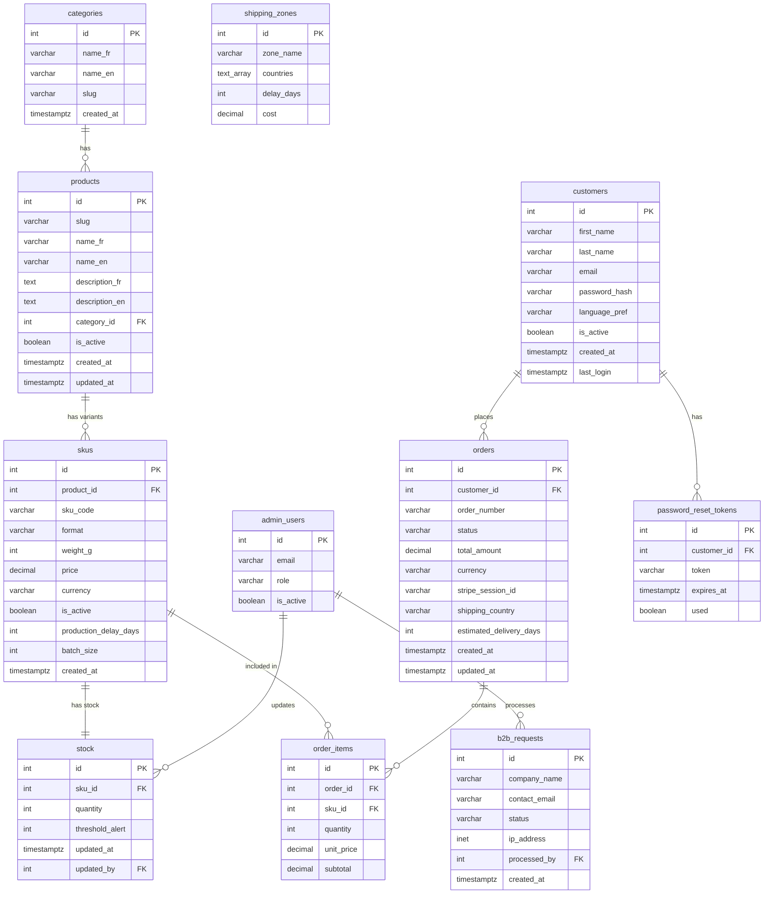
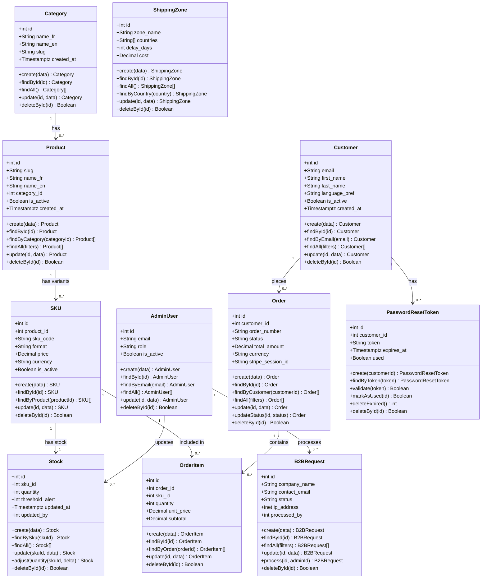

# Stage 3 — Task 2: Components, Classes & Database Design
## Lamos Chocolate — European Digital Platform

> **Project**: Lamos Chocolate — European Digital Platform
> **Team**: Sara Rebati · Valentin Planchon
> **Stack**: Django 5.x · PostgreSQL 16 · Docker

---

## 2.1 — Database Schema (ERD)

All tables are implemented in **PostgreSQL 16**. MySQL-specific syntax (`AUTO_INCREMENT`, `TINYINT(1)`, `DATETIME`, inline ENUMs, `ON UPDATE CURRENT_TIMESTAMP`) has been replaced with their native PostgreSQL equivalents.

### Key PostgreSQL Replacements

| MySQL | PostgreSQL |
|-------|------------|
| `AUTO_INCREMENT` | `GENERATED ALWAYS AS IDENTITY` |
| `TINYINT(1)` | `BOOLEAN` |
| `DATETIME` | `TIMESTAMPTZ` (timezone-aware) |
| `ENUM('a','b')` inline | `CREATE TYPE ... AS ENUM (...)` (reusable) |
| `ON UPDATE CURRENT_TIMESTAMP` | Trigger `update_updated_at()` |
| `ENGINE=InnoDB DEFAULT CHARSET=utf8mb4` | Removed (encoding at DB level) |
| `VARCHAR(45)` for IP | `INET` (native PostgreSQL type) |

### Table Relationships Overview

```
┌─────────────────────┐         ┌─────────────────────────┐
│    admin_users      │         │       customers         │
├─────────────────────┤         ├─────────────────────────┤
│ PK id               │         │ PK id                   │
│    email            │         │    first_name           │
│    password_hash    │         │    last_name            │
│    role (ENUM)      │         │    email (UNIQUE)       │
│    is_active        │         │    password_hash        │
│    created_at       │         │    phone                │
│    last_login       │         │    address_line1/2      │
└──────────┬──────────┘         │    city / postal_code   │
           │                    │    country              │
           │ updated_by (FK)    │    language_pref        │
           │                    │    is_active            │
           ▼                    │    created_at           │
┌──────────────────────┐        └────────────┬────────────┘
│       stock          │                     │ 1
├──────────────────────┤                     │
│ PK id                │                     │ N
│ FK sku_id (UNIQUE)   │        ┌────────────▼────────────┐
│    quantity ≥ 0      │        │         orders          │
│    threshold_alert   │        ├─────────────────────────┤
│    updated_at        │        │ PK id                   │
│ FK updated_by        │        │ FK customer_id          │
└──────────────────────┘        │    order_number (UNIQUE)│
           ▲                    │    status (ENUM)        │
           │ 1                  │    total_amount         │
           │                    │    currency (ENUM)      │
           │ 1                  │    stripe_payment_id    │
┌──────────┴───────────┐        │    stripe_session_id    │
│        skus          │        │    shipping_*           │
├───────────────────── ┤        │    language (ENUM)      │
│ PK id                │◄───────│    estimated_delivery   │
│ FK product_id        │    N   │    notes                │
│    sku_code (UNIQUE) │        │    created_at           │
│    format            │        │    updated_at           │
│    weight_g          │        └────────────┬────────────┘
│    price             │                     │ 1
│    currency (ENUM)   │                     │
│    is_active         │                     │ N
│    production_       │         ┌───────────▼────────────┐
│    delay_days        │         │       order_items      │
│    batch_size        │         ├────────────────────────┤
│    created_at        │         │ PK id                  │
└──────────┬───────────┘         │ FK order_id            │
           │ N                   │ FK sku_id              │
           │                     │    quantity > 0        │
           │ 1                   │    unit_price          │
┌──────────▼──────────┐          │    subtotal            │
│      products       │          └────────────────────────┘
├─────────────────────┤
│ PK id               │         ┌─────────────────────────┐
│    slug (UNIQUE)    │         │      b2b_requests       │
│    name_fr / name_en│         ├─────────────────────────┤
│    description_*    │         │ PK id                   │
│    ingredients_*    │         │    company_name         │
│    allergens_*      │         │    contact_name/email   │
│ FK category_id      │         │    contact_phone        │
│    image_url        │         │    sector               │
│    is_active        │         │    estimated_qty        │
│    created_at       │         │    occasion / message   │
│    updated_at       │         │    status (ENUM)        │
└──────────┬──────────┘         │    language (ENUM)      │
           │ N                  │    ip_address (INET)    │
           │                    │    created_at           │
           │ 1                  │    processed_at         │
┌──────────▼──────────┐         │ FK processed_by         │
│     categories      │         └─────────────────────────┘
├─────────────────────┤
│ PK id               │         ┌─────────────────────────┐
│    name_fr / name_en│         │  password_reset_tokens  │
│    slug (UNIQUE)    │         ├─────────────────────────┤
│    created_at       │         │ PK id                   │
└─────────────────────┘         │ FK customer_id          │
                                │    token (UNIQUE)       │
                                │    expires_at           │
┌─────────────────────┐         │    used (BOOLEAN)       │
│    shipping_zones   │         │    created_at           │
├─────────────────────┤         └─────────────────────────┘
│ PK id               │
│    zone_name        │  ← New table — forecasting model
│    countries TEXT[] │  ← PostgreSQL native array
│    delay_days       │
│    cost             │
└─────────────────────┘
```
----
2.2 — Class Diagram & CRUD Methods
This class diagram is derived from the ERD schema (§ 2.1). It translates the PostgreSQL tables into business classes with their typed attributes and standardized CRUD methods, ready to be implemented in the service/repository layer.
Adopted Conventions
SymbolMeaning+Public member(data)Generic object passed as parameter (e.g. DTO, JSON payload)BooleanDeletion confirmation return value (true = success)[]Array / list of resultsfiltersOptional filters object (pagination, status, date…)
Standard CRUD Methods (present on all classes)
Each class exposes the five basic operations:

create(data) — inserts a new record, returns the created object.
findById(id) — retrieves a record by its primary key.
findAll() — returns all records, with optional filters depending on the class.
update(id, data) — updates the provided fields, returns the modified object.
deleteById(id) — deletes the record, returns true on success.

Specific Business Methods
Some classes expose additional methods related to their own logic:
ClassMethodRoleProductfindByCategory(categoryId)Filter products by categorySKUfindByProduct(productId)Retrieve all variants of a productStockadjustQuantity(skuId, delta)Increment or decrement stock (order, restocking)StockfindBySku(skuId)Direct access to the stock of a given SKUOrderupdateStatus(id, status)State transition (pending → paid → shipped…)OrderfindByCustomer(customerId)Order history for a customerCustomerfindByEmail(email)Authentication / uniqueness checkShippingZonefindByCountry(country)Resolve the pricing zone at checkoutB2BRequestprocess(id, adminId)Process a B2B request by an adminPasswordResetTokenvalidate(token)Verify that a token is valid and not expiredPasswordResetTokenmarkAsUsed(id)Invalidate the token after usePasswordResetTokendeleteExpired()Scheduled purge of expired tokens
Relationships Between Classes
Multiplicities exactly match the cardinalities from the ERD:

Category → Product: a category contains zero or more products.
Product → SKU: a product has zero or more variants (size, weight…).
SKU → Stock: each SKU has exactly one stock record (1–1 relationship).
SKU → OrderItem: a SKU can appear in multiple order lines.
Order → OrderItem: an order contains one or more lines.
Customer → Order: a customer places zero or more orders.
Customer → PasswordResetToken: a customer can have multiple tokens (history).
AdminUser → B2BRequest: an admin handles zero or more B2B requests.
AdminUser → Stock: an admin can update zero or more stock records.


Note: ShippingZone has no direct FK to the other tables in the current schema.
It is resolved dynamically at checkout time via findByCountry(),
by comparing the delivery country against the countries TEXT[] array of each zone.






---

## 2.2 — Full PostgreSQL DDL

```sql
-- ================================================================
-- LAMOS CHOCOLATE — POSTGRESQL SCHEMA
-- Version : 2.0 (Django + Forecasting)
-- Engine  : PostgreSQL 16+
-- Encoding: UTF-8
-- ================================================================

-- ----------------------------------------------------------------
-- REUSABLE ENUM TYPES (PostgreSQL advantage over MySQL inline ENUMs)
-- ----------------------------------------------------------------

CREATE TYPE currency_type AS ENUM ('EUR', 'CHF');
CREATE TYPE language_type AS ENUM ('fr', 'en');
CREATE TYPE order_status  AS ENUM (
    'pending', 'paid', 'processing',
    'shipped', 'delivered', 'cancelled', 'refunded'
);
CREATE TYPE b2b_status  AS ENUM ('new', 'in_progress', 'converted', 'refused');
CREATE TYPE admin_role  AS ENUM ('superadmin', 'admin', 'viewer');

-- ----------------------------------------------------------------
-- TRIGGER FUNCTION — automatic updated_at
-- (replaces MySQL's ON UPDATE CURRENT_TIMESTAMP)
-- ----------------------------------------------------------------

CREATE OR REPLACE FUNCTION update_updated_at()
RETURNS TRIGGER AS $$
BEGIN
    NEW.updated_at = NOW();
    RETURN NEW;
END;
$$ LANGUAGE plpgsql;

-- ----------------------------------------------------------------
-- TABLE: categories
-- ----------------------------------------------------------------

CREATE TABLE categories (
    id         INTEGER      GENERATED ALWAYS AS IDENTITY PRIMARY KEY,
    name_fr    VARCHAR(100) NOT NULL,
    name_en    VARCHAR(100) NOT NULL,
    slug       VARCHAR(120) NOT NULL UNIQUE,
    created_at TIMESTAMPTZ  NOT NULL DEFAULT NOW()
);

-- ----------------------------------------------------------------
-- TABLE: products
-- ----------------------------------------------------------------

CREATE TABLE products (
    id             INTEGER       GENERATED ALWAYS AS IDENTITY PRIMARY KEY,
    slug           VARCHAR(160)  NOT NULL UNIQUE,
    name_fr        VARCHAR(200)  NOT NULL,
    name_en        VARCHAR(200)  NOT NULL,
    description_fr TEXT,
    description_en TEXT,
    ingredients_fr TEXT,
    ingredients_en TEXT,
    allergens_fr   VARCHAR(500),
    allergens_en   VARCHAR(500),
    category_id    INTEGER       NOT NULL REFERENCES categories(id) ON DELETE RESTRICT,
    image_url      VARCHAR(500),
    is_active      BOOLEAN       NOT NULL DEFAULT TRUE,
    created_at     TIMESTAMPTZ   NOT NULL DEFAULT NOW(),
    updated_at     TIMESTAMPTZ   NOT NULL DEFAULT NOW()
);

CREATE TRIGGER trg_products_updated_at
    BEFORE UPDATE ON products
    FOR EACH ROW EXECUTE FUNCTION update_updated_at();

-- ----------------------------------------------------------------
-- TABLE: admin_users
-- ----------------------------------------------------------------

CREATE TABLE admin_users (
    id            INTEGER       GENERATED ALWAYS AS IDENTITY PRIMARY KEY,
    email         VARCHAR(255)  NOT NULL UNIQUE,
    password_hash VARCHAR(255)  NOT NULL,
    first_name    VARCHAR(100),
    last_name     VARCHAR(100),
    role          admin_role    NOT NULL DEFAULT 'admin',
    is_active     BOOLEAN       NOT NULL DEFAULT TRUE,
    created_at    TIMESTAMPTZ   NOT NULL DEFAULT NOW(),
    last_login    TIMESTAMPTZ
);

-- ----------------------------------------------------------------
-- TABLE: skus (Stock Keeping Units)
-- NEW: production_delay_days, batch_size — forecasting model
-- ----------------------------------------------------------------

CREATE TABLE skus (
    id                    INTEGER        GENERATED ALWAYS AS IDENTITY PRIMARY KEY,
    product_id            INTEGER        NOT NULL REFERENCES products(id) ON DELETE CASCADE,
    sku_code              VARCHAR(60)    NOT NULL UNIQUE,
    format                VARCHAR(100)   NOT NULL,
    weight_g              INTEGER,
    price                 DECIMAL(10,2)  NOT NULL,
    currency              currency_type  NOT NULL DEFAULT 'EUR',
    is_active             BOOLEAN        NOT NULL DEFAULT TRUE,
    production_delay_days INTEGER        NOT NULL DEFAULT 7,
    -- Average days to produce one batch of this SKU
    batch_size            INTEGER        NOT NULL DEFAULT 50,
    -- Number of units per production batch
    created_at            TIMESTAMPTZ    NOT NULL DEFAULT NOW()
);

-- ----------------------------------------------------------------
-- TABLE: stock
-- ----------------------------------------------------------------

CREATE TABLE stock (
    id              INTEGER     GENERATED ALWAYS AS IDENTITY PRIMARY KEY,
    sku_id          INTEGER     NOT NULL UNIQUE REFERENCES skus(id) ON DELETE CASCADE,
    quantity        INTEGER     NOT NULL DEFAULT 0 CHECK (quantity >= 0),
    threshold_alert INTEGER     NOT NULL DEFAULT 5,
    updated_at      TIMESTAMPTZ NOT NULL DEFAULT NOW(),
    updated_by      INTEGER     REFERENCES admin_users(id) ON DELETE SET NULL
);

CREATE TRIGGER trg_stock_updated_at
    BEFORE UPDATE ON stock
    FOR EACH ROW EXECUTE FUNCTION update_updated_at();

-- Partial index — fast queries for low-stock alerts
CREATE INDEX idx_stock_low ON stock (sku_id) WHERE quantity <= threshold_alert;

-- ----------------------------------------------------------------
-- TABLE: shipping_zones (NEW — forecasting model)
-- ----------------------------------------------------------------

CREATE TABLE shipping_zones (
    id          INTEGER       GENERATED ALWAYS AS IDENTITY PRIMARY KEY,
    zone_name   VARCHAR(100)  NOT NULL,
    countries   TEXT[]        NOT NULL,
    -- PostgreSQL native array: ARRAY['CH'], ARRAY['FR'], ARRAY['DE','AT','IT',...]
    delay_days  INTEGER       NOT NULL DEFAULT 5,
    cost        DECIMAL(10,2) NOT NULL DEFAULT 0.00
);

-- GIN index on array column for fast country lookup
CREATE INDEX idx_shipping_zones_countries ON shipping_zones USING GIN (countries);

-- ----------------------------------------------------------------
-- TABLE: customers
-- ----------------------------------------------------------------

CREATE TABLE customers (
    id            INTEGER       GENERATED ALWAYS AS IDENTITY PRIMARY KEY,
    first_name    VARCHAR(100)  NOT NULL,
    last_name     VARCHAR(100)  NOT NULL,
    email         VARCHAR(255)  NOT NULL UNIQUE,
    password_hash VARCHAR(255)  NOT NULL,
    phone         VARCHAR(30),
    address_line1 VARCHAR(255),
    address_line2 VARCHAR(255),
    city          VARCHAR(100),
    postal_code   VARCHAR(20),
    country       VARCHAR(100),
    language_pref language_type NOT NULL DEFAULT 'fr',
    is_active     BOOLEAN       NOT NULL DEFAULT TRUE,
    created_at    TIMESTAMPTZ   NOT NULL DEFAULT NOW(),
    last_login    TIMESTAMPTZ
);

-- ----------------------------------------------------------------
-- TABLE: orders
-- NEW: estimated_delivery_days — computed at order time (forecasting)
-- ----------------------------------------------------------------

CREATE TABLE orders (
    id                      INTEGER        GENERATED ALWAYS AS IDENTITY PRIMARY KEY,
    customer_id             INTEGER        NOT NULL REFERENCES customers(id) ON DELETE RESTRICT,
    order_number            VARCHAR(30)    NOT NULL UNIQUE,
    status                  order_status   NOT NULL DEFAULT 'pending',
    total_amount            DECIMAL(10,2)  NOT NULL,
    currency                currency_type  NOT NULL DEFAULT 'EUR',
    stripe_payment_id       VARCHAR(255),
    stripe_session_id       VARCHAR(255),
    shipping_first_name     VARCHAR(100),
    shipping_last_name      VARCHAR(100),
    shipping_address1       VARCHAR(255),
    shipping_address2       VARCHAR(255),
    shipping_city           VARCHAR(100),
    shipping_postal_code    VARCHAR(20),
    shipping_country        VARCHAR(100),
    language                language_type  NOT NULL DEFAULT 'fr',
    notes                   TEXT,
    estimated_delivery_days INTEGER,
    -- Computed at order time and stored for display + email
    created_at              TIMESTAMPTZ    NOT NULL DEFAULT NOW(),
    updated_at              TIMESTAMPTZ    NOT NULL DEFAULT NOW()
);

CREATE TRIGGER trg_orders_updated_at
    BEFORE UPDATE ON orders
    FOR EACH ROW EXECUTE FUNCTION update_updated_at();

CREATE INDEX idx_orders_status   ON orders (status);
CREATE INDEX idx_orders_customer ON orders (customer_id);
CREATE INDEX idx_orders_created  ON orders (created_at DESC);

-- Partial index for active orders only (recommended for production)
CREATE INDEX idx_orders_active ON orders (status)
    WHERE status NOT IN ('cancelled', 'refunded');

-- ----------------------------------------------------------------
-- TABLE: order_items
-- ----------------------------------------------------------------

CREATE TABLE order_items (
    id         INTEGER        GENERATED ALWAYS AS IDENTITY PRIMARY KEY,
    order_id   INTEGER        NOT NULL REFERENCES orders(id) ON DELETE CASCADE,
    sku_id     INTEGER        NOT NULL REFERENCES skus(id) ON DELETE RESTRICT,
    quantity   INTEGER        NOT NULL CHECK (quantity > 0),
    unit_price DECIMAL(10,2)  NOT NULL,
    -- Price captured at order time (snapshot — immutable)
    subtotal   DECIMAL(10,2)  NOT NULL
    -- quantity * unit_price
);

-- ----------------------------------------------------------------
-- TABLE: b2b_requests
-- NOTE: ip_address uses PostgreSQL's native INET type
-- ----------------------------------------------------------------

CREATE TABLE b2b_requests (
    id            INTEGER       GENERATED ALWAYS AS IDENTITY PRIMARY KEY,
    company_name  VARCHAR(200)  NOT NULL,
    contact_name  VARCHAR(200)  NOT NULL,
    contact_email VARCHAR(255)  NOT NULL,
    contact_phone VARCHAR(30),
    sector        VARCHAR(100),
    estimated_qty INTEGER,
    occasion      VARCHAR(200),
    message       TEXT,
    status        b2b_status    NOT NULL DEFAULT 'new',
    language      language_type NOT NULL DEFAULT 'fr',
    ip_address    INET,
    -- Native PostgreSQL type — supports both IPv4 and IPv6
    created_at    TIMESTAMPTZ   NOT NULL DEFAULT NOW(),
    processed_at  TIMESTAMPTZ,
    processed_by  INTEGER       REFERENCES admin_users(id) ON DELETE SET NULL
);

CREATE INDEX idx_b2b_status  ON b2b_requests (status);
CREATE INDEX idx_b2b_created ON b2b_requests (created_at DESC);

-- ----------------------------------------------------------------
-- TABLE: password_reset_tokens
-- ----------------------------------------------------------------

CREATE TABLE password_reset_tokens (
    id          INTEGER      GENERATED ALWAYS AS IDENTITY PRIMARY KEY,
    customer_id INTEGER      NOT NULL REFERENCES customers(id) ON DELETE CASCADE,
    token       VARCHAR(255) NOT NULL UNIQUE,
    expires_at  TIMESTAMPTZ  NOT NULL,
    used        BOOLEAN      NOT NULL DEFAULT FALSE,
    created_at  TIMESTAMPTZ  NOT NULL DEFAULT NOW()
);

-- Partial index — only index valid (unused) tokens
CREATE INDEX idx_reset_tokens_lookup
    ON password_reset_tokens (token)
    WHERE used = FALSE;
```

---

## 2.3 — Seed Data (PostgreSQL)

```sql
-- Shipping zones (forecasting model)
INSERT INTO shipping_zones (zone_name, countries, delay_days, cost) VALUES
    ('Switzerland', ARRAY['CH'],                                     2,  8.90),
    ('France',      ARRAY['FR'],                                     3,  6.90),
    ('Europe',      ARRAY['DE','AT','IT','BE','NL','LU','ES','PT'],  5,  9.90);

-- Categories
INSERT INTO categories (name_fr, name_en, slug) VALUES
    ('Tablettes',         'Bars',             'tablettes'),
    ('Coffrets',          'Gift Boxes',        'coffrets'),
    ('Editions Limitees', 'Limited Editions',  'editions-limitees');

-- Products
INSERT INTO products (slug, name_fr, name_en, description_fr, description_en,
                      ingredients_fr, allergens_fr, allergens_en, category_id, image_url)
VALUES
    ('lamos-pistachio-kunafa-bar',
     'Tablette Pistache & Kunafa', 'Pistachio & Kunafa Bar',
     'La signature originale de Lamos — pistache iranienne, cheveux d''ange, chocolat blanc belge.',
     'The original Lamos signature — Iranian pistachio, kunafa angel hair, Belgian white chocolate.',
     'Chocolat blanc (lait, sucre, beurre de cacao), pistache 28%, kunafa (ble), beurre clarifie.',
     'Lait, Gluten (ble), Fruits a coque (pistache)',
     'Milk, Gluten (wheat), Nuts (pistachio)', 1,
     '/static/images/products/pistachio-kunafa-bar.webp'),

    ('lamos-coffret-decouverte-3',
     'Coffret Decouverte 3 Tablettes', 'Discovery Gift Box — 3 Bars',
     'Coffret cadeau avec 3 tablettes signature.',
     'Gift box featuring 3 signature bars.',
     'Voir composition de chaque tablette.',
     'Lait, Gluten, Fruits a coque', 'Milk, Gluten, Nuts', 2,
     '/static/images/products/coffret-decouverte-3.webp'),

    ('lamos-dark-rose-saffron',
     'Tablette Noir Rose & Safran', 'Dark Rose & Saffron Bar',
     'Edition limitee printemps — chocolat noir 72%, petales de rose, safran iranien.',
     'Spring limited edition — 72% dark chocolate, rose petals, Iranian saffron.',
     'Chocolat noir (cacao min. 72%, sucre), petales de rose, safran, beurre de cacao.',
     'Peut contenir des traces de lait et fruits a coque.',
     'May contain traces of milk and nuts.', 3,
     '/static/images/products/dark-rose-saffron.webp');

-- SKUs (with forecasting columns)
INSERT INTO skus (product_id, sku_code, format, weight_g, price, currency,
                  production_delay_days, batch_size) VALUES
    (1, 'LM-PIK-100',   'Bar 100g',           100,  12.90, 'EUR', 7,  50),
    (1, 'LM-PIK-250',   'Gift format 250g',   250,  28.50, 'EUR', 7,  30),
    (2, 'LM-GBX-3',     'Gift Box 3 bars',    330,  38.90, 'EUR', 5,  20),
    (2, 'LM-GBX-3-CHF', 'Gift Box 3 bars CHF',330, 42.00, 'CHF', 5,  20),
    (3, 'LM-DRS-100',   'Bar 100g',           100,  14.90, 'EUR', 10, 40);

-- Stock
INSERT INTO stock (sku_id, quantity, threshold_alert) VALUES
    (1, 100, 10), (2, 50, 5), (3, 30, 5), (4, 20, 3), (5, 25, 5);

-- Admin user
INSERT INTO admin_users (email, password_hash, first_name, last_name, role) VALUES
    ('admin@lamos-eu.com', 'HASHED_IN_PROD', 'Sara', 'Rebati', 'superadmin');
```

---

## 2.4 — Forecasting Model

### Estimated Delivery Calculation Logic

At each order, the system computes `estimated_delivery_days` displayed to the customer and stored in `orders.estimated_delivery_days`.

**Case 1 — Sufficient stock:**
```
stock.quantity >= order_quantity
→ estimated_days = shipping_zone.delay_days
```
Example: 50 in stock, customer orders 10, Switzerland zone (2 days) → **Delivered in 2 days**

**Case 2 — Insufficient stock:**
```
deficit        = order_quantity - stock.quantity
batches_needed = CEIL(deficit / sku.batch_size)
production     = batches_needed * sku.production_delay_days
estimated_days = production + shipping_zone.delay_days
```
Example: 5 in stock, customer orders 55, batch_size=50, production_delay=7d, EU zone (5d)
→ deficit=50, batches=1, production=7d → **Delivered in 12 days**

**Case 3 — Zero stock:**
```
estimated_days = CEIL(order_qty / batch_size) * production_delay_days + shipping_delay
```

### BI Analytical SQL Views

```sql
-- Sell-through velocity per SKU (last 90 days)
SELECT
    oi.sku_id,
    s.sku_code,
    SUM(oi.quantity)                                                    AS total_sold,
    COUNT(DISTINCT DATE_TRUNC('week', o.created_at))                    AS weeks_active,
    ROUND(
        SUM(oi.quantity)::NUMERIC
        / GREATEST(COUNT(DISTINCT DATE_TRUNC('week', o.created_at)), 1),
        1
    )                                                                    AS units_per_week
FROM order_items oi
JOIN orders o ON o.id  = oi.order_id
JOIN skus   s ON s.id  = oi.sku_id
WHERE o.created_at >= NOW() - INTERVAL '90 days'
  AND o.status NOT IN ('cancelled', 'refunded')
GROUP BY oi.sku_id, s.sku_code
ORDER BY units_per_week DESC;

-- KPI: Days until stockout per SKU
SELECT
    s.sku_code,
    st.quantity AS current_stock,
    forecast.units_per_week,
    CASE
        WHEN forecast.units_per_week = 0 THEN NULL
        ELSE ROUND(st.quantity / (forecast.units_per_week / 7.0), 0)
    END AS days_until_stockout
FROM stock st
JOIN skus s ON s.id = st.sku_id
JOIN (
    SELECT oi.sku_id,
           SUM(oi.quantity)::NUMERIC
           / GREATEST(COUNT(DISTINCT DATE_TRUNC('week', o.created_at)), 1)
           AS units_per_week
    FROM order_items oi
    JOIN orders o ON o.id = oi.order_id
    WHERE o.created_at >= NOW() - INTERVAL '90 days'
      AND o.status NOT IN ('cancelled', 'refunded')
    GROUP BY oi.sku_id
) forecast ON forecast.sku_id = st.sku_id
ORDER BY days_until_stockout ASC NULLS LAST;

-- Reusable forecast view
CREATE VIEW forecast_view AS
SELECT
    oi.sku_id,
    SUM(oi.quantity)::NUMERIC
        / GREATEST(COUNT(DISTINCT DATE_TRUNC('week', o.created_at)), 1)
        AS units_per_week,
    CASE
        WHEN SUM(oi.quantity)::NUMERIC
             / GREATEST(COUNT(DISTINCT DATE_TRUNC('week', o.created_at)), 1) = 0
        THEN NULL
        ELSE ROUND(
            st.quantity /
            (SUM(oi.quantity)::NUMERIC
             / GREATEST(COUNT(DISTINCT DATE_TRUNC('week', o.created_at)), 1) / 7.0),
            0)
    END AS days_until_stockout
FROM order_items oi
JOIN orders o  ON o.id       = oi.order_id
JOIN stock  st ON st.sku_id  = oi.sku_id
WHERE o.created_at >= NOW() - INTERVAL '90 days'
  AND o.status NOT IN ('cancelled', 'refunded')
GROUP BY oi.sku_id, st.quantity;

-- KPI: Production relaunch alert (urgent SKUs)
SELECT
    s.sku_code,
    s.production_delay_days,
    st.quantity         AS current_stock,
    fv.days_until_stockout,
    s.batch_size        AS batch_to_launch
FROM skus s
JOIN stock       st ON st.sku_id  = s.id
JOIN forecast_view fv ON fv.sku_id = s.id
WHERE fv.days_until_stockout <= (s.production_delay_days + 3)
ORDER BY fv.days_until_stockout ASC;

-- KPI: Monthly seasonality
SELECT
    DATE_TRUNC('month', o.created_at) AS month,
    COUNT(DISTINCT o.id)              AS order_count,
    SUM(oi.quantity)                  AS total_units,
    SUM(o.total_amount)               AS total_revenue
FROM orders o
JOIN order_items oi ON oi.order_id = o.id
WHERE o.status NOT IN ('cancelled', 'refunded')
GROUP BY DATE_TRUNC('month', o.created_at)
ORDER BY month DESC;
```

---

## 2.5 — Django Models

```python
# apps/shop/models.py

import math
import random
import string
from django.db import models
from django.contrib.auth.hashers import make_password, check_password as django_check_password
from django.contrib.postgres.fields import ArrayField
from django.utils import timezone


class Category(models.Model):
    name_fr    = models.CharField(max_length=100)
    name_en    = models.CharField(max_length=100)
    slug       = models.SlugField(max_length=120, unique=True)
    created_at = models.DateTimeField(auto_now_add=True)

    class Meta:
        db_table = 'categories'
        verbose_name_plural = 'categories'

    def get_name(self, lang='fr'):
        return self.name_en if lang == 'en' else self.name_fr

    def __str__(self):
        return self.slug


class Product(models.Model):
    slug           = models.SlugField(max_length=160, unique=True)
    name_fr        = models.CharField(max_length=200)
    name_en        = models.CharField(max_length=200)
    description_fr = models.TextField(blank=True, null=True)
    description_en = models.TextField(blank=True, null=True)
    ingredients_fr = models.TextField(blank=True, null=True)
    ingredients_en = models.TextField(blank=True, null=True)
    allergens_fr   = models.CharField(max_length=500, blank=True, null=True)
    allergens_en   = models.CharField(max_length=500, blank=True, null=True)
    category       = models.ForeignKey(
        Category, on_delete=models.RESTRICT, related_name='products'
    )
    image_url      = models.CharField(max_length=500, blank=True, null=True)
    is_active      = models.BooleanField(default=True)
    created_at     = models.DateTimeField(auto_now_add=True)
    updated_at     = models.DateTimeField(auto_now=True)

    class Meta:
        db_table = 'products'

    def get_name(self, lang='fr'):
        return self.name_en if lang == 'en' else self.name_fr

    def get_description(self, lang='fr'):
        return self.description_en if lang == 'en' else self.description_fr

    def get_primary_sku(self):
        """Returns the first active SKU."""
        return self.skus.filter(is_active=True).first()

    def __str__(self):
        return self.slug


class SKU(models.Model):
    CURRENCY_CHOICES = [('EUR', 'EUR'), ('CHF', 'CHF')]

    product               = models.ForeignKey(
        Product, on_delete=models.CASCADE, related_name='skus'
    )
    sku_code              = models.CharField(max_length=60, unique=True)
    format                = models.CharField(max_length=100)
    weight_g              = models.IntegerField(null=True, blank=True)
    price                 = models.DecimalField(max_digits=10, decimal_places=2)
    currency              = models.CharField(
        max_length=3, choices=CURRENCY_CHOICES, default='EUR'
    )
    is_active             = models.BooleanField(default=True)
    production_delay_days = models.IntegerField(default=7)
    batch_size            = models.IntegerField(default=50)
    created_at            = models.DateTimeField(auto_now_add=True)

    class Meta:
        db_table = 'skus'
        verbose_name = 'SKU'

    @property
    def available_quantity(self):
        """Returns the current available stock quantity."""
        try:
            return self.stock.quantity
        except Stock.DoesNotExist:
            return 0

    @property
    def is_available(self):
        return self.available_quantity > 0

    def calculate_estimated_days(self, order_quantity, shipping_zone):
        """
        Computes estimated delivery days based on stock level and shipping zone.

        Case 1 — sufficient stock: returns shipping_zone.delay_days
        Case 2 — insufficient stock: production time + shipping delay
        Case 3 — zero stock: full production from scratch + shipping
        """
        stock_qty = self.available_quantity

        if stock_qty >= order_quantity:
            return shipping_zone.delay_days

        deficit        = order_quantity - stock_qty
        batches_needed = math.ceil(deficit / self.batch_size)
        production     = batches_needed * self.production_delay_days
        return production + shipping_zone.delay_days

    def __str__(self):
        return self.sku_code


class Stock(models.Model):
    sku             = models.OneToOneField(
        SKU, on_delete=models.CASCADE, related_name='stock'
    )
    quantity        = models.IntegerField(default=0)
    threshold_alert = models.IntegerField(default=5)
    updated_at      = models.DateTimeField(auto_now=True)
    updated_by      = models.ForeignKey(
        'AdminUser', on_delete=models.SET_NULL,
        null=True, blank=True, related_name='stock_updates'
    )

    class Meta:
        db_table = 'stock'

    @property
    def is_low(self):
        return self.quantity <= self.threshold_alert

    def decrement(self, qty, updated_by=None):
        """Atomically decrements stock. Raises ValueError if insufficient."""
        if self.quantity < qty:
            raise ValueError(f"Insufficient stock for SKU {self.sku.sku_code}")
        self.quantity  -= qty
        self.updated_by = updated_by
        self.save(update_fields=['quantity', 'updated_at', 'updated_by'])

    def __str__(self):
        return f'Stock[{self.sku.sku_code}] = {self.quantity}'


class ShippingZone(models.Model):
    """Shipping zones with estimated delivery times and costs (forecasting model)."""

    zone_name  = models.CharField(max_length=100)
    countries  = ArrayField(models.CharField(max_length=2), default=list)
    delay_days = models.IntegerField(default=5)
    cost       = models.DecimalField(max_digits=10, decimal_places=2, default=0)

    class Meta:
        db_table = 'shipping_zones'

    @classmethod
    def get_zone_for_country(cls, country_code):
        """Returns the shipping zone for a given country code (ISO 2-letter)."""
        return cls.objects.filter(countries__contains=[country_code]).first()

    def __str__(self):
        return self.zone_name


class Customer(models.Model):
    LANGUAGE_CHOICES = [('fr', 'French'), ('en', 'English')]

    first_name    = models.CharField(max_length=100)
    last_name     = models.CharField(max_length=100)
    email         = models.EmailField(max_length=255, unique=True)
    password_hash = models.CharField(max_length=255)
    phone         = models.CharField(max_length=30, blank=True, null=True)
    address_line1 = models.CharField(max_length=255, blank=True, null=True)
    address_line2 = models.CharField(max_length=255, blank=True, null=True)
    city          = models.CharField(max_length=100, blank=True, null=True)
    postal_code   = models.CharField(max_length=20, blank=True, null=True)
    country       = models.CharField(max_length=100, blank=True, null=True)
    language_pref = models.CharField(
        max_length=2, choices=LANGUAGE_CHOICES, default='fr'
    )
    is_active  = models.BooleanField(default=True)
    created_at = models.DateTimeField(auto_now_add=True)
    last_login = models.DateTimeField(null=True, blank=True)

    class Meta:
        db_table = 'customers'

    def set_password(self, password):
        self.password_hash = make_password(password)

    def check_password(self, password):
        return django_check_password(password, self.password_hash)

    @property
    def full_name(self):
        return f"{self.first_name} {self.last_name}"

    def __str__(self):
        return self.email


class Order(models.Model):
    STATUS_CHOICES = [
        ('pending',    'Pending'),
        ('paid',       'Paid'),
        ('processing', 'Processing'),
        ('shipped',    'Shipped'),
        ('delivered',  'Delivered'),
        ('cancelled',  'Cancelled'),
        ('refunded',   'Refunded'),
    ]
    CURRENCY_CHOICES = [('EUR', 'EUR'), ('CHF', 'CHF')]
    LANGUAGE_CHOICES = [('fr', 'French'), ('en', 'English')]

    customer             = models.ForeignKey(
        Customer, on_delete=models.RESTRICT, related_name='orders'
    )
    order_number         = models.CharField(max_length=30, unique=True)
    status               = models.CharField(
        max_length=20, choices=STATUS_CHOICES, default='pending'
    )
    total_amount         = models.DecimalField(max_digits=10, decimal_places=2)
    currency             = models.CharField(
        max_length=3, choices=CURRENCY_CHOICES, default='EUR'
    )
    stripe_payment_id    = models.CharField(max_length=255, blank=True, null=True)
    stripe_session_id    = models.CharField(max_length=255, blank=True, null=True)
    shipping_first_name  = models.CharField(max_length=100, blank=True, null=True)
    shipping_last_name   = models.CharField(max_length=100, blank=True, null=True)
    shipping_address1    = models.CharField(max_length=255, blank=True, null=True)
    shipping_address2    = models.CharField(max_length=255, blank=True, null=True)
    shipping_city        = models.CharField(max_length=100, blank=True, null=True)
    shipping_postal_code = models.CharField(max_length=20, blank=True, null=True)
    shipping_country     = models.CharField(max_length=100, blank=True, null=True)
    language             = models.CharField(
        max_length=2, choices=LANGUAGE_CHOICES, default='fr'
    )
    notes                   = models.TextField(blank=True, null=True)
    estimated_delivery_days = models.IntegerField(null=True, blank=True)
    created_at              = models.DateTimeField(auto_now_add=True)
    updated_at              = models.DateTimeField(auto_now=True)

    class Meta:
        db_table = 'orders'
        indexes  = [
            models.Index(fields=['status']),
            models.Index(fields=['customer']),
            models.Index(fields=['-created_at']),
        ]

    @staticmethod
    def generate_order_number():
        """Generates a unique order number: LM-YYYYMMDD-XXXXX"""
        date_str = timezone.now().strftime('%Y%m%d')
        suffix   = ''.join(random.choices(string.ascii_uppercase + string.digits, k=5))
        return f"LM-{date_str}-{suffix}"

    def __str__(self):
        return f'{self.order_number} — {self.status}'


class OrderItem(models.Model):
    order      = models.ForeignKey(
        Order, on_delete=models.CASCADE, related_name='items'
    )
    sku        = models.ForeignKey(SKU, on_delete=models.RESTRICT)
    quantity   = models.IntegerField()
    unit_price = models.DecimalField(max_digits=10, decimal_places=2)
    subtotal   = models.DecimalField(max_digits=10, decimal_places=2)

    class Meta:
        db_table = 'order_items'

    def __str__(self):
        return f'OrderItem[{self.order.order_number}] SKU={self.sku.sku_code} x{self.quantity}'


class B2BRequest(models.Model):
    STATUS_CHOICES   = [
        ('new',         'New'),
        ('in_progress', 'In Progress'),
        ('converted',   'Converted'),
        ('refused',     'Refused'),
    ]
    LANGUAGE_CHOICES = [('fr', 'French'), ('en', 'English')]

    company_name  = models.CharField(max_length=200)
    contact_name  = models.CharField(max_length=200)
    contact_email = models.EmailField(max_length=255)
    contact_phone = models.CharField(max_length=30, blank=True, null=True)
    sector        = models.CharField(max_length=100, blank=True, null=True)
    estimated_qty = models.IntegerField(null=True, blank=True)
    occasion      = models.CharField(max_length=200, blank=True, null=True)
    message       = models.TextField(blank=True, null=True)
    status        = models.CharField(
        max_length=20, choices=STATUS_CHOICES, default='new'
    )
    language      = models.CharField(
        max_length=2, choices=LANGUAGE_CHOICES, default='fr'
    )
    ip_address   = models.GenericIPAddressField(null=True, blank=True)
    created_at   = models.DateTimeField(auto_now_add=True)
    processed_at = models.DateTimeField(null=True, blank=True)
    processed_by = models.ForeignKey(
        'AdminUser', on_delete=models.SET_NULL,
        null=True, blank=True, related_name='processed_b2b'
    )

    class Meta:
        db_table = 'b2b_requests'

    def __str__(self):
        return f'{self.company_name} — {self.status}'


class AdminUser(models.Model):
    ROLE_CHOICES = [
        ('superadmin', 'Super Admin'),
        ('admin',      'Admin'),
        ('viewer',     'Viewer'),
    ]

    email         = models.EmailField(max_length=255, unique=True)
    password_hash = models.CharField(max_length=255)
    first_name    = models.CharField(max_length=100, blank=True, null=True)
    last_name     = models.CharField(max_length=100, blank=True, null=True)
    role          = models.CharField(
        max_length=20, choices=ROLE_CHOICES, default='admin'
    )
    is_active  = models.BooleanField(default=True)
    created_at = models.DateTimeField(auto_now_add=True)
    last_login = models.DateTimeField(null=True, blank=True)

    class Meta:
        db_table = 'admin_users'

    def set_password(self, password):
        self.password_hash = make_password(password)

    def check_password(self, password):
        return django_check_password(password, self.password_hash)

    def is_superadmin(self):
        return self.role == 'superadmin'

    def __str__(self):
        return f'{self.email} — {self.role}'


class PasswordResetToken(models.Model):
    customer   = models.ForeignKey(
        Customer, on_delete=models.CASCADE, related_name='reset_tokens'
    )
    token      = models.CharField(max_length=255, unique=True)
    expires_at = models.DateTimeField()
    used       = models.BooleanField(default=False)
    created_at = models.DateTimeField(auto_now_add=True)

    class Meta:
        db_table = 'password_reset_tokens'

    @property
    def is_valid(self):
        return not self.used and timezone.now() < self.expires_at

    def __str__(self):
        return f'ResetToken[customer={self.customer_id} used={self.used}]'
```

---

## 2.6 — Django Project Structure

```
lamos_platform/
├── lamos/                           ← Main Django package
│   ├── __init__.py
│   ├── settings/
│   │   ├── base.py                  ← Common settings
│   │   ├── development.py           ← DEBUG=True, local PostgreSQL
│   │   ├── staging.py
│   │   ├── production.py            ← DEBUG=False, env vars, PgBouncer
│   │   └── testing.py               ← In-memory email, test DB
│   ├── urls.py                      ← Root URL dispatcher (i18n_patterns)
│   ├── wsgi.py                      ← Gunicorn entry point
│   └── asgi.py
├── apps/
│   ├── main/                        ← Homepage, about, language switch
│   │   ├── views.py
│   │   ├── urls.py
│   │   └── templates/main/
│   ├── shop/                        ← Catalog, product pages, all models
│   │   ├── models.py                ← All Django models (single source of truth)
│   │   ├── views.py
│   │   ├── urls.py
│   │   ├── admin.py                 ← Django Admin registration
│   │   └── templates/shop/
│   ├── cart/                        ← Session-based cart
│   │   ├── services.py              ← CartService class
│   │   ├── views.py
│   │   └── urls.py
│   ├── checkout/                    ← Stripe checkout + webhook
│   │   ├── services.py              ← create_checkout_session(), handle_webhook()
│   │   ├── views.py
│   │   └── urls.py
│   ├── accounts/                    ← Customer auth
│   │   ├── views.py
│   │   ├── forms.py
│   │   └── urls.py
│   ├── customer_area/               ← Customer area (orders)
│   │   ├── views.py
│   │   └── urls.py
│   ├── b2b/                         ← B2B form
│   │   ├── views.py
│   │   ├── forms.py
│   │   └── urls.py
│   ├── backoffice/                  ← Custom admin panel
│   │   ├── views.py
│   │   ├── urls.py
│   │   └── decorators.py            ← @admin_required
│   └── forecasting/                 ← Delivery calculation + BI queries
│       ├── services.py              ← calculate_estimated_days()
│       └── queries.py               ← Raw SQL analytical queries
├── templates/                       ← Global + per-app templates
├── static/                          ← CSS, JS, images
├── locale/                          ← i18n translation files
│   ├── fr/LC_MESSAGES/django.po
│   └── en/LC_MESSAGES/django.po
├── docker/
│   ├── Dockerfile
│   ├── docker-compose.yml           ← Production (db, app, nginx, pgbouncer)
│   ├── docker-compose.dev.yml       ← Development (db, app)
│   └── nginx/lamos.conf
├── requirements/
│   ├── base.txt                     ← django, psycopg2, stripe, django-anymail...
│   ├── development.txt
│   └── production.txt
├── tests/
│   ├── conftest.py
│   ├── unit/
│   └── integration/
├── manage.py
├── .env.example
└── .gitignore
```

## 2.7 — Django Settings (Key Configuration)

```python
# lamos/settings/base.py

import os
from pathlib import Path

BASE_DIR = Path(__file__).resolve().parent.parent.parent
SECRET_KEY = os.environ.get('SECRET_KEY')
DEBUG = False

INSTALLED_APPS = [
    'django.contrib.admin',
    'django.contrib.auth',
    'django.contrib.contenttypes',
    'django.contrib.sessions',
    'django.contrib.messages',
    'django.contrib.staticfiles',
    'django.contrib.postgres',    # ArrayField, GIN index, GenericIPAddressField
    # Lamos apps
    'apps.main',
    'apps.shop',
    'apps.cart',
    'apps.checkout',
    'apps.accounts',
    'apps.customer_area',
    'apps.b2b',
    'apps.backoffice',
    'apps.forecasting',
]

DATABASES = {
    'default': {
        'ENGINE':   'django.db.backends.postgresql',
        'NAME':     os.environ.get('DB_NAME', 'lamos_db'),
        'USER':     os.environ.get('DB_USER', 'lamos_app'),
        'PASSWORD': os.environ.get('DB_PASSWORD'),
        'HOST':     os.environ.get('DB_HOST', 'db'),  # Docker service name
        'PORT':     os.environ.get('DB_PORT', '5432'),
        'CONN_MAX_AGE': 60,
    }
}

# i18n
LANGUAGE_CODE = 'fr'
TIME_ZONE     = 'Europe/Paris'
USE_I18N      = True
USE_TZ        = True
LANGUAGES     = [('fr', 'Français'), ('en', 'English')]
LOCALE_PATHS  = [BASE_DIR / 'locale']

# Stripe
STRIPE_PUBLIC_KEY     = os.environ.get('STRIPE_PUBLIC_KEY')
STRIPE_SECRET_KEY     = os.environ.get('STRIPE_SECRET_KEY')
STRIPE_WEBHOOK_SECRET = os.environ.get('STRIPE_WEBHOOK_SECRET')
```

```yaml
# docker/docker-compose.yml — Production

services:
  db:
    image: postgres:16-alpine
    environment:
      POSTGRES_DB:       lamos_db
      POSTGRES_USER:     lamos_app
      POSTGRES_PASSWORD: ${DB_PASSWORD}
    volumes:
      - postgres_data:/var/lib/postgresql/data
      - ./schema_postgresql.sql:/docker-entrypoint-initdb.d/01_schema.sql
    healthcheck:
      test: ["CMD-SHELL", "pg_isready -U lamos_app -d lamos_db"]
      interval: 5s
      timeout: 3s
      retries: 5

  app:
    build:
      context: ..
      dockerfile: docker/Dockerfile
    command: gunicorn lamos.wsgi:application --bind 0.0.0.0:8000 --workers 4
    environment:
      DJANGO_SETTINGS_MODULE: lamos.settings.production
    env_file: ../.env
    depends_on:
      db:
        condition: service_healthy
    volumes:
      - static_volume:/app/staticfiles

  nginx:
    image: nginx:alpine
    ports:
      - "80:80"
      - "443:443"
    volumes:
      - ./nginx/lamos.conf:/etc/nginx/conf.d/default.conf
      - static_volume:/var/www/static:ro
      - /etc/letsencrypt:/etc/letsencrypt:ro
    depends_on:
      - app

volumes:
  postgres_data:
  static_volume:
```

---

## 2.8 — Reusable Frontend Component (Django Template Tag)

```django
{# templatetags/product_tags.py #}



<article class="product-card product-card--out-of-stock">
  <a href="" class="product-card__image-link">
    
    
      <span class="badge badge--out"></span>
    
  </a>
  <div class="product-card__body">
    <h3 class="product-card__name">{{ product.get_name(request.LANGUAGE_CODE) }}</h3>
    <p class="product-card__format">{{ sku.format }}</p>
    <p class="product-card__price">{{ sku.price }} {{ sku.currency }}</p>
    
      <p class="product-card__delivery">
        Estimated delivery: {{ days }} days
      </p>
    
    
      <button class="btn btn--primary js-add-to-cart" data-sku-id="{{ sku.id }}">
        
      </button>
    
      <button class="btn btn--disabled" disabled></button>
    
  </div>
</article>

```

---
