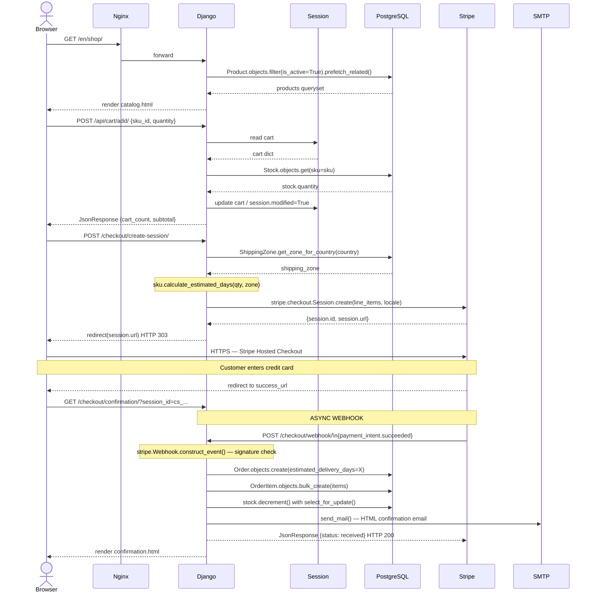
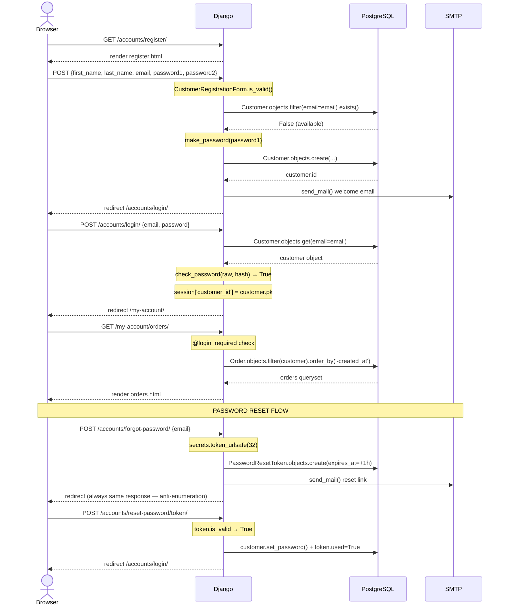
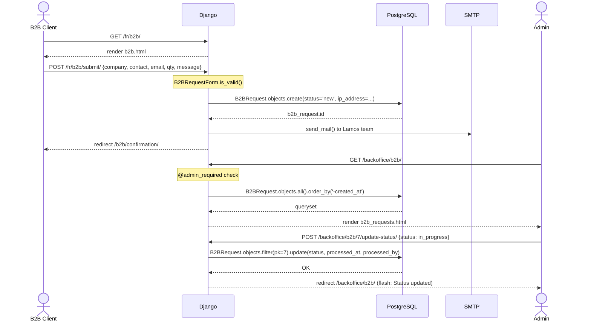
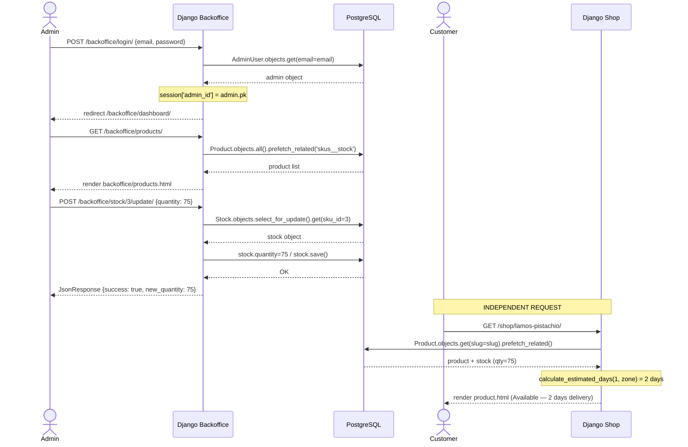
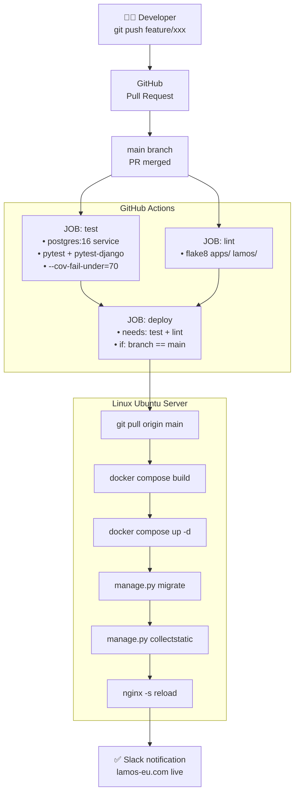

# Stage 3 — Task 3: Sequence Diagrams
## Lamos Chocolate — European Digital Platform

> **Project**: Lamos Chocolate — European Digital Platform
> **Team**: Sara Rebati · Valentin Planchon
> **Stack**: Django 5.x · PostgreSQL 16 · Docker
---

## 3.1 — Introduction

Sequence diagrams describe the **chronological interactions** between system components for critical use cases. They answer the question: *"Who sends what to whom, and in what order?"*

Each diagram is accompanied by a step-by-step description detailing every interaction.

### Common Actors and Participants

| Symbol | Participant | Description |
|--------|-------------|-------------|
| `Browser` | Client browser | User interface (HTML/JS) |
| `Nginx` | Reverse proxy | HTTPS → Gunicorn routing (Docker) |
| `Django` | Django application | Views + Service Layer (Python 3.12) |
| `DB` | PostgreSQL 16 | Relational database (Docker) |
| `Stripe` | Stripe API | External payment service |
| `SMTP` | Mail server | Transactional email sending |
| `Session` | Django Session | Server-side storage (cart, auth) |

---

## 3.2 — Diagram 1: Complete B2C Purchase Flow (Stripe Checkout)

> **Use case**: A logged-in customer adds a product to their cart, proceeds to checkout, pays via Stripe, and receives a confirmation.

### Step-by-Step Description

| # | Actor | Action | Technical Detail |
|---|-------|--------|-----------------|
| 1 | Browser → Django | `GET /en/shop/` | `CatalogView` — `Product.objects.filter(is_active=True).prefetch_related('skus__stock')` |
| 2 | Django → DB | Products query | `prefetch_related` avoids N+1 queries |
| 3 | Django → Browser | Render `catalog.html` | Django template with i18n context |
| 4 | Browser → Django | `POST /api/cart/add/` — `{sku_id, qty}` | AJAX call from `cart.js` |
| 5 | Django → Session | Read current cart | `request.session.get('cart', {})` |
| 6 | Django → DB | Check stock | `Stock.objects.select_for_update().get(sku=sku)` |
| 7 | Django → Session | Update cart | `request.session['cart'][sku_id] += qty`; `request.session.modified = True` |
| 8 | Django → Browser | `JsonResponse {cart_count, subtotal}` | AJAX response — updates header counter |
| 9 | Browser → Django | `POST /checkout/create-session/` | Triggers Stripe checkout creation |
| 10 | Django → DB | Get customer + shipping zone | `ShippingZone.get_zone_for_country(country)` |
| 11 | Django | Compute delivery | `sku.calculate_estimated_days(qty, shipping_zone)` |
| 12 | Django → Stripe | `stripe.checkout.Session.create(line_items=..., locale=lang)` | Hosted Stripe Checkout session |
| 13 | Stripe → Django | `{session.id, session.url}` | URL to Stripe-hosted payment page |
| 14 | Django → Browser | `redirect(session.url)` HTTP 303 | Customer redirected to Stripe |
| 15 | Stripe → Browser | Stripe payment page | Customer enters card details on Stripe's PCI-DSS compliant interface |
| 16 | Stripe → Browser | Redirect to `success_url` | After payment, Stripe sends customer back |
| 17 | Stripe → Django | `POST /checkout/webhook/` (async) | `payment_intent.succeeded` event |
| 18 | Django | Signature verification | `stripe.Webhook.construct_event(payload, sig, STRIPE_WEBHOOK_SECRET)` |
| 19 | Django → DB | `Order.objects.create(estimated_delivery_days=X)` | Order created with `status='paid'` |
| 20 | Django → DB | `OrderItem.objects.bulk_create(items)` | All order lines in one DB call |
| 21 | Django → DB | `stock.decrement(qty)` with `select_for_update()` | Atomic stock decrement |
| 22 | Django → SMTP | `send_mail()` | HTML confirmation email in session language |
| 23 | Django → Browser | Render `confirmation.html` | Displays order number + estimated delivery |

> **Critical point**: Steps 17–22 are **asynchronous**. The order is **never** created before Stripe webhook confirmation, preventing any unconfirmed order from being recorded.

---

## 3.3 — Diagram 2: Customer Registration and Authentication

> **Use case**: A visitor creates an account, logs in, accesses their order history, and resets their password.

### Step-by-Step Description

**Phase 1 — Registration**

| # | Action | Detail |
|---|--------|--------|
| 1 | Display form | `GET /accounts/register/` → `CustomerRegistrationView` |
| 2 | Form submission | `POST` with `CustomerRegistrationForm` |
| 3 | Django validation | `form.is_valid()`: email format, unique check, password length, password match |
| 4 | Email uniqueness | `Customer.objects.filter(email=email).exists()` |
| 5 | Password hashing | `make_password(password)` — PBKDF2 with SHA-256 |
| 6 | Account creation | `Customer.objects.create(...)` |
| 7 | Welcome email | `send_mail()` asynchronous |
| 8 | Redirect | `redirect('accounts:login')` with Django message |

**Phase 2 — Login**

| # | Action | Detail |
|---|--------|--------|
| 9 | Login submission | `POST /accounts/login/` |
| 10 | Account lookup | `Customer.objects.get(email=email)` |
| 11 | Password check | `check_password(raw_password, customer.password_hash)` |
| 12 | If False | Generic error message (no user enumeration: "Email or password incorrect") |
| 13 | If True | `request.session['customer_id'] = customer.pk` |
| 14 | Redirect | To `next` param or `/my-account/` |

**Phase 3 — Password Reset**

| # | Action | Detail |
|---|--------|--------|
| 15 | Reset request | `POST /accounts/forgot-password/` — always same response (anti-enumeration) |
| 16 | Token generation | `secrets.token_urlsafe(32)` |
| 17 | Token storage | `PasswordResetToken.objects.create(expires_at=timezone.now() + timedelta(hours=1))` |
| 18 | Reset email | Link with token, 1-hour expiration |
| 19 | Validation | `token.is_valid` → `not used and timezone.now() < expires_at` |
| 20 | Password update | `customer.set_password(new_password)` + `token.used = True` |

---

## 3.4 — Diagram 3: B2B Request Submission + Admin Notification

> **Use case**: A purchasing manager submits a corporate form. The Lamos team receives a notification, the request is stored, and the admin can view and process it.

### Step-by-Step Description

| # | Action | Technical Detail |
|---|--------|-----------------|
| 1 | Display B2B form | `GET /fr/b2b/` → bilingual template via `i18n_patterns` |
| 2 | Form submission | `POST /fr/b2b/submit/` with `B2BRequestForm` |
| 3 | Validation | `form.is_valid()` — required fields: company, contact, email format |
| 4 | Record in DB | `B2BRequest.objects.create(status='new', ip_address=request.META.get('REMOTE_ADDR'))` |
| 5 | Lamos notification | `send_mail()` to internal Lamos address with all form details |
| 6 | User confirmation | `redirect('b2b:confirmation')` with success message |
| 7 | Admin consultation | `GET /backoffice/b2b/` — `@admin_required` decorator verifies `session['admin_id']` |
| 8 | Admin check | `AdminUser.objects.get(pk=session['admin_id'])` — role verification |
| 9 | Data retrieval | `B2BRequest.objects.all().order_by('-created_at')` with optional `?status=new` filter |
| 10 | Status update | `B2BRequest.objects.filter(pk=id).update(status=new_status, processed_at=timezone.now(), processed_by=admin)` |

---

## 3.5 — Diagram 4: Admin — Product Update + Storefront Impact

> **Use case**: A Lamos admin updates a product's stock from the back-office panel. The change is immediately visible on the storefront.

---

## 3.6 — Diagram 5: CI/CD Pipeline — Automated Deployment

> **Use case**: A developer pushes code to `main` after a validated pull request. GitHub Actions triggers the full deployment pipeline.

### CI/CD Step Description

| Phase | Step | Action | Detail |
|-------|------|--------|--------|
| **Test** | 1 | PostgreSQL 16-alpine service | GitHub Actions spins up a PostgreSQL container automatically |
| **Test** | 2 | Dependencies | `pip install -r requirements/development.txt` + `pytest pytest-django pytest-cov` |
| **Test** | 3 | Test run | `pytest tests/ --cov=apps --cov-fail-under=70` — fails if coverage < 70% |
| **Lint** | 4 | Code quality | `flake8 apps/ lamos/ --max-line-length=100` |
| **Deploy** | 5 | SSH connection | `appleboy/ssh-action` — connects to production server securely |
| **Deploy** | 6 | Docker build | `docker compose build` — rebuilds all container images |
| **Deploy** | 7 | Container restart | `docker compose up -d` — zero-downtime restart |
| **Deploy** | 8 | DB migrations | `docker compose exec app python manage.py migrate --no-input` |
| **Deploy** | 9 | Static files | `docker compose exec app python manage.py collectstatic --no-input` |
| **Deploy** | 10 | Nginx reload | `nginx -s reload` — picks up new static files without downtime |

---

## 3.7 — Diagrams Summary

| # | Use Case | Components Involved | Criticality |
|---|----------|--------------------|-|
| 1 | B2C Purchase + Stripe | Browser, Nginx, Django, DB, Stripe, SMTP | 🔴 Critical |
| 2 | Registration & Authentication | Browser, Django, DB, Django Auth, SMTP | 🔴 Critical |
| 3 | B2B Request + Admin notification | Browser, Django, DB, SMTP, Admin Browser | 🟡 Important |
| 4 | Admin — Stock update + CRUD | Browser (admin), Django, DB | 🟡 Important |
| 5 | CI/CD — Automated deployment | GitHub, Actions, Docker, Server, Nginx | 🟠 Infrastructure |

---
