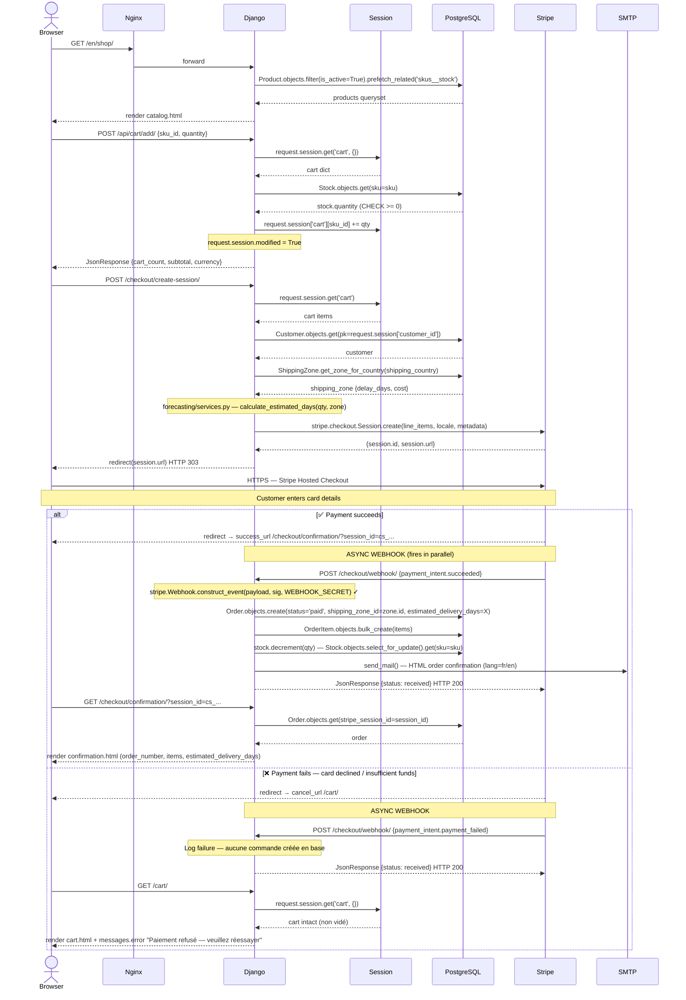
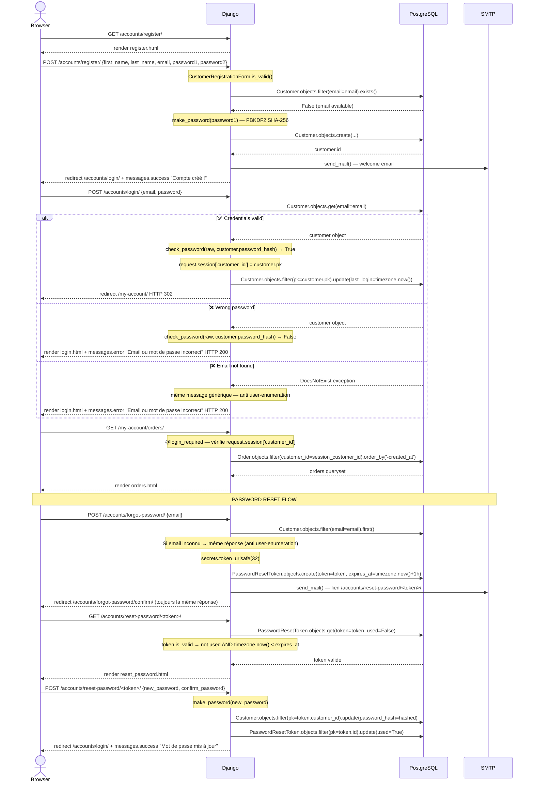
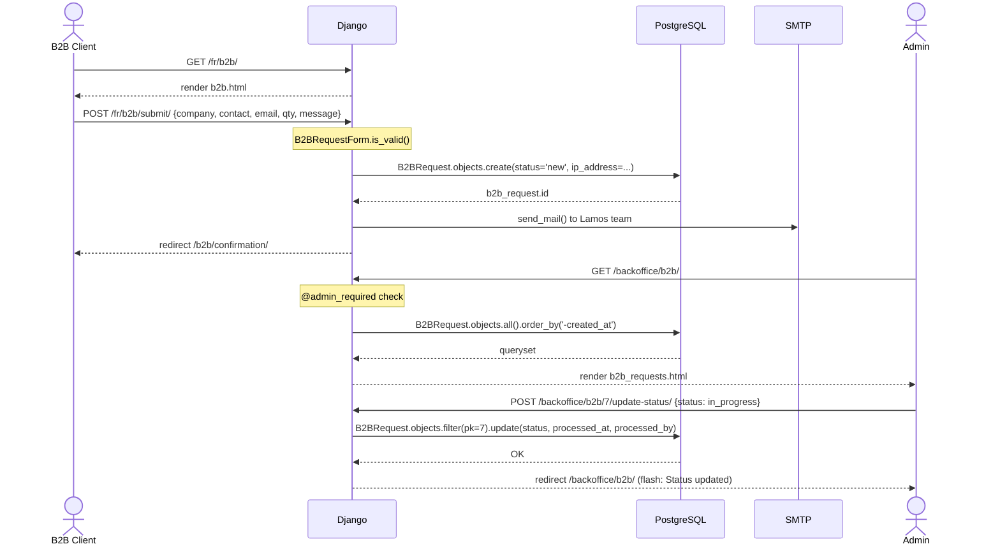
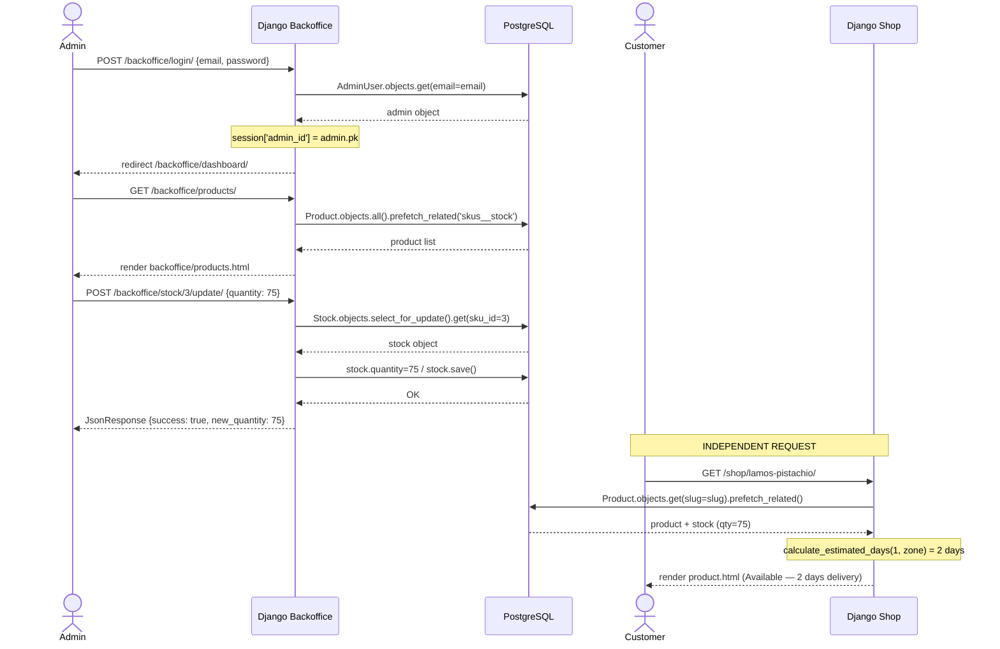
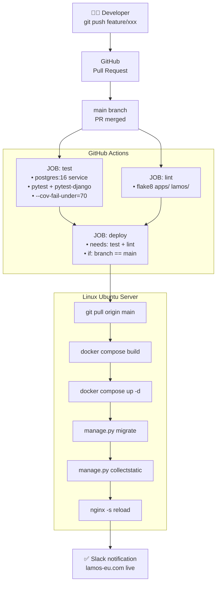

# Stage 3 — Task 3: Sequence Diagrams
## Lamos Chocolate — European Digital Platform

> **Project**: Lamos Chocolate — European Digital Platform
> **Team**: Sara Rebati · Valentin Planchon
> **Stack**: Django 5.x · PostgreSQL 16 · Docker
---

## 3.1 — Introduction

Sequence diagrams describe the **chronological interactions** between system components for critical use cases. They answer the question: *"Who sends what to whom, and in what order?"*

Each diagram is accompanied by a step-by-step description detailing every interaction.

### Common Actors and Participants

| Symbol | Participant | Description |
|--------|-------------|-------------|
| `Browser` | Client browser | User interface (HTML/JS) |
| `Nginx` | Reverse proxy | HTTPS → Gunicorn routing (Docker) |
| `Django` | Django application | Views + Service Layer (Python 3.12) |
| `DB` | PostgreSQL 16 | Relational database (Docker) |
| `Stripe` | Stripe API | External payment service |
| `SMTP` | Mail server | Transactional email sending |
| `Session` | Django Session | Server-side storage (cart, auth) |

---

## 3.2 — Diagram 1: Complete B2C Purchase Flow (Production‑grade Stripe Checkout)

> **Use case**: An authenticated customer adds a product to their cart, initiates the Stripe checkout, the payment is confirmed via webhook, then the order is created, stock is decremented, and the customer receives the confirmation.


----
### Step-by-Step Description

| # | Actor | Action | Technical Detail |
|---|-------|--------|-----------------|
| 1 | Browser → Nginx → Django | `GET /en/shop/` | `CatalogView` — `Product.objects.filter(is_active=True).prefetch_related('skus__stock')` |
| 2 | Django → DB | Products query | `prefetch_related('skus__stock')` avoids N+1 and loads SKUs + stock in a single query |
| 3 | Django → Browser | Render `catalog.html` | Django template with i18n context and product cards |
| 4 | Browser → Django | `POST /api/cart/add/` — `{sku_id, quantity}` | AJAX call from frontend (`cart.js`) |
| 5 | Django → Session | Read current cart | `request.session.get('cart', {})` |
| 6 | Django → DB (transactional) | Check stock | `Stock.objects.select_for_update().get(sku=sku)` — row-level lock to prevent race conditions |
| 7 | Django | Validate availability | Ensure `stock.quantity >= requested_qty`, or handle partial availability |
| 8 | Django → Session | Update cart | `request.session['cart'][sku_id] += qty`; set `request.session.modified = True` |
| 9 | Django → Browser | `JsonResponse {cart_count, subtotal, currency}` | AJAX response updates the UI (header counter, mini-cart) |
| 10 | Browser → Django | `POST /checkout/create-session/` | View reads the session cart and customer context |
| 11 | Django → DB | Resolve customer & shipping zone | `Customer.objects.get(pk=...)`; `ShippingZone.get_zone_for_country(country_code)` |
| 12 | Django | Compute estimated delivery | `sku.calculate_estimated_days(order_qty, shipping_zone)` (forecasting logic in `forecasting/services.py`) |
| 13 | Django → Stripe | `stripe.checkout.Session.create(line_items=..., locale=lang, metadata=...)` | Create hosted Stripe Checkout session server-side |
| 14 | Stripe → Django | `{session.id, session.url}` | Stripe returns the session payload |
| 15 | Django → Browser | `redirect(session.url)` HTTP 303 | Redirect the customer to the Stripe hosted checkout page |
| 16 | Browser ↔ Stripe | Stripe Checkout (PCI-compliant) | Customer enters payment details on Stripe's UI |
| 17 | Stripe → Browser | Redirect to `success_url` or `cancel_url` | Browser redirected after the payment attempt |
| 18 | Stripe → Django (async) | `POST /checkout/webhook/` — `payment_intent.succeeded` or `payment_intent.payment_failed` | Webhook fires asynchronously, independent of the browser redirect |
| 19 | Django | Verify webhook signature | `stripe.Webhook.construct_event(payload, sig_header, STRIPE_WEBHOOK_SECRET)` — reject if invalid |
| 20 | ✅ (on success) Django → DB | Create order atomically | `Order.objects.create(...)` with `status='paid'`, `estimated_delivery_days=X` |
| 21 | ✅ (on success) Django → DB | Create order lines | `OrderItem.objects.bulk_create(items)` for performance |
| 22 | ✅ (on success) Django → DB | Decrement stock safely | For each SKU: `Stock.objects.select_for_update()` then `stock.decrement(qty, updated_by=...)` inside the same DB transaction |
| 23 | ✅ (on success) Django → SMTP | Send confirmation email | `send_mail()` — HTML email localised to the customer's language |
| 24 | ✅ (on success) Django → Stripe | Acknowledge webhook | Return `JsonResponse({'status': 'received'})` HTTP 200 to Stripe |
| 25 | ✅ (on success) Browser → Django | `GET /checkout/confirmation/?session_id=cs_...` | View loads `Order.objects.get(stripe_session_id=session_id)` and renders `confirmation.html` |
| 26 | ❌ (on failure) Stripe → Django (async) | `payment_intent.payment_failed` webhook | Log failure — no order created, cart and session remain intact |
| 27 | ❌ (on failure) Django → Browser | Render `cart.html` with error | Display localised message: *"Payment declined — please try again"* |
 
> **Critical point:** Steps **18–24** (webhook handling, order creation, stock decrement, confirmation email) are **asynchronous** and **transactional**. The system **must not** create a confirmed `Order` before receiving and verifying a valid, signature-verified Stripe webhook. Use `select_for_update()` and wrap all DB writes in atomic transactions to prevent race conditions and ensure stock consistency.

---

## 3.3 — Diagram 2: Registration, Login & Password Reset (with ALT login failure)
> **Use case**: A visitor creates an account, logs in (with both success and failure paths), accesses a protected page, and resets their password via a time-limited email token.

 

---
### Step-by-Step Description
 
| # | Flow | Actor | Action | Technical Detail |
|---|------|-------|--------|-----------------|
| 1 | Registration | Browser → Django | `GET /accounts/register/` | Django renders the empty registration form |
| 2 | Registration | Django → Browser | Render `register.html` | Displays `CustomerRegistrationForm` (first name, last name, email, password×2) |
| 3 | Registration | Browser → Django | `POST /accounts/register/` `{first_name, last_name, email, password1, password2}` | Form submission — all fields sent in the POST body |
| 4 | Registration | Django | Validate form | `CustomerRegistrationForm.is_valid()` — checks field formats, password matching, length constraints |
| 5 | Registration | Django → DB | Check email uniqueness | `Customer.objects.filter(email=email).exists()` — returns `False` if available |
| 6 | Registration | Django | Hash the password | `make_password(password1)` — PBKDF2 SHA-256 with a random salt (Django default) |
| 7 | Registration | Django → DB | Persist the customer | `Customer.objects.create(first_name=..., last_name=..., email=..., password_hash=hashed)` |
| 8 | Registration | DB → Django | Return new customer ID | `customer.id` confirmed after INSERT |
| 9 | Registration | Django → SMTP | Send welcome email | `send_mail()` — welcome message with account details |
| 10 | Registration | Django → Browser | Redirect + success message | `redirect('/accounts/login/')` HTTP 302 + `messages.success("Account created!")` |
| 11 | Login | Browser → Django | `POST /accounts/login/` `{email, password}` | Login form submitted |
| 12 | Login | Django → DB | Fetch customer record | `Customer.objects.get(email=email)` |
| 13 | ✅ Login success | DB → Django | Return customer object | Customer found with matching email |
| 14 | ✅ Login success | Django | Verify password | `check_password(raw_password, customer.password_hash)` → `True` |
| 15 | ✅ Login success | Django → Session | Store customer identity | `request.session['customer_id'] = customer.pk` |
| 16 | ✅ Login success | Django → DB | Update last login | `Customer.objects.filter(pk=customer.pk).update(last_login=timezone.now())` |
| 17 | ✅ Login success | Django → Browser | Redirect to account area | `redirect('/my-account/')` HTTP 302 |
| 18 | ❌ Wrong password | DB → Django | Return customer object | Customer exists but password check fails |
| 19 | ❌ Wrong password | Django | Password check fails | `check_password(raw, customer.password_hash)` → `False` |
| 20 | ❌ Wrong password | Django → Browser | Re-render login with error | `render login.html` HTTP 200 + `messages.error("Incorrect email or password")` |
| 21 | ❌ Email not found | DB → Django | Raise exception | `Customer.DoesNotExist` — no record matches the submitted email |
| 22 | ❌ Email not found | Django | Generic error — anti-enumeration | Same message as wrong password: **never reveal** whether the email exists |
| 23 | ❌ Email not found | Django → Browser | Re-render login with error | `render login.html` HTTP 200 + `messages.error("Incorrect email or password")` |
| 24 | Protected page | Browser → Django | `GET /my-account/orders/` | Request to a login-required view |
| 25 | Protected page | Django | Check session authentication | `@login_required` decorator — verifies `request.session['customer_id']` is present |
| 26 | Protected page | Django → DB | Fetch customer's orders | `Order.objects.filter(customer_id=session_customer_id).order_by('-created_at')` |
| 27 | Protected page | DB → Django | Return orders queryset | List of orders sorted by most recent first |
| 28 | Protected page | Django → Browser | Render `orders.html` | Order history page displayed to the authenticated customer |
| 29 | Password reset | Browser → Django | `POST /accounts/forgot-password/` `{email}` | User submits the forgot-password form |
| 30 | Password reset | Django → DB | Look up the email | `Customer.objects.filter(email=email).first()` — returns `None` if not found |
| 31 | Password reset | Django | Anti-enumeration protection | If email unknown, the response is identical to the success case — no information leaked |
| 32 | Password reset | Django | Generate a secure token | `secrets.token_urlsafe(32)` — cryptographically random, URL-safe 32-byte token |
| 33 | Password reset | Django → DB | Persist the reset token | `PasswordResetToken.objects.create(token=token, customer=customer, expires_at=timezone.now()+1h)` |
| 34 | Password reset | Django → SMTP | Send reset email | `send_mail()` — email contains link `/accounts/reset-password/<token>/` |
| 35 | Password reset | Django → Browser | Always redirect (same response) | `redirect('/accounts/forgot-password/confirm/')` — identical whether email was found or not |
| 36 | Password reset | Browser → Django | `GET /accounts/reset-password/<token>/` | User clicks the link from the email |
| 37 | Password reset | Django → DB | Validate token | `PasswordResetToken.objects.get(token=token, used=False)` |
| 38 | Password reset | Django | Check token validity | `token.is_valid` → `not used AND timezone.now() < expires_at` |
| 39 | Password reset | DB → Django | Return valid token | Token confirmed as unused and within the 1-hour window |
| 40 | Password reset | Django → Browser | Render `reset_password.html` | Form with `new_password` and `confirm_password` fields |
| 41 | Password reset | Browser → Django | `POST /accounts/reset-password/<token>/` `{new_password, confirm_password}` | New password submitted |
| 42 | Password reset | Django | Hash new password | `make_password(new_password)` — PBKDF2 SHA-256 with a new random salt |
| 43 | Password reset | Django → DB | Update customer password | `Customer.objects.filter(pk=token.customer_id).update(password_hash=hashed)` |
| 44 | Password reset | Django → DB | Mark token as used | `PasswordResetToken.objects.filter(pk=token.id).update(used=True)` — prevents token reuse |
| 45 | Password reset | Django → Browser | Redirect + success message | `redirect('/accounts/login/')` + `messages.success("Password updated successfully")` |
 
> **Security notes:**
> - Steps **22–23**: using a **generic error message** for both "wrong password" and "unknown email" is intentional — it prevents **user enumeration attacks** (an attacker cannot determine whether an email is registered).
> - Step **31**: the forgot-password endpoint always returns the same response, regardless of whether the email exists, for the same anti-enumeration reason.
> - Step **44**: the reset token is marked `used=True` immediately after the password is updated, making it **single-use** and preventing replay attacks.
> - Step **32**: `secrets.token_urlsafe(32)` generates a **256-bit** random token — computationally infeasible to brute-force within the 1-hour validity window.
 

---

## 3.4 — Diagram 3: B2B Request Submission + Admin Notification

> **Use case**: A purchasing manager submits a corporate form. The Lamos team receives a notification, the request is stored, and the admin can view and process it.


---

### Step-by-Step Description

| # | Action | Technical Detail |
|---|--------|-----------------|
| 1 | Display B2B form | `GET /fr/b2b/` → bilingual template via `i18n_patterns` |
| 2 | Form submission | `POST /fr/b2b/submit/` with `B2BRequestForm` |
| 3 | Validation | `form.is_valid()` — required fields: company, contact, email format |
| 4 | Record in DB | `B2BRequest.objects.create(status='new', ip_address=request.META.get('REMOTE_ADDR'))` |
| 5 | Lamos notification | `send_mail()` to internal Lamos address with all form details |
| 6 | User confirmation | `redirect('b2b:confirmation')` with success message |
| 7 | Admin consultation | `GET /backoffice/b2b/` — `@admin_required` decorator verifies `session['admin_id']` |
| 8 | Admin check | `AdminUser.objects.get(pk=session['admin_id'])` — role verification |
| 9 | Data retrieval | `B2BRequest.objects.all().order_by('-created_at')` with optional `?status=new` filter |
| 10 | Status update | `B2BRequest.objects.filter(pk=id).update(status=new_status, processed_at=timezone.now(), processed_by=admin)` |

---

## 3.5 — Diagram 4: Admin — Product Update + Storefront Impact

> **Use case**: A Lamos admin updates a product's stock from the back-office panel. The change is immediately visible on the storefront.


---

## 3.6 — Diagram 5: CI/CD Pipeline — Automated Deployment

> **Use case**: A developer pushes code to `main` after a validated pull request. GitHub Actions triggers the full deployment pipeline.


### CI/CD Step Description

| Phase | Step | Action | Detail |
|-------|------|--------|--------|
| **Test** | 1 | PostgreSQL 16-alpine service | GitHub Actions spins up a PostgreSQL container automatically |
| **Test** | 2 | Dependencies | `pip install -r requirements/development.txt` + `pytest pytest-django pytest-cov` |
| **Test** | 3 | Test run | `pytest tests/ --cov=apps --cov-fail-under=70` — fails if coverage < 70% |
| **Lint** | 4 | Code quality | `flake8 apps/ lamos/ --max-line-length=100` |
| **Deploy** | 5 | SSH connection | `appleboy/ssh-action` — connects to production server securely |
| **Deploy** | 6 | Docker build | `docker compose build` — rebuilds all container images |
| **Deploy** | 7 | Container restart | `docker compose up -d` — zero-downtime restart |
| **Deploy** | 8 | DB migrations | `docker compose exec app python manage.py migrate --no-input` |
| **Deploy** | 9 | Static files | `docker compose exec app python manage.py collectstatic --no-input` |
| **Deploy** | 10 | Nginx reload | `nginx -s reload` — picks up new static files without downtime |

---

## 3.7 — Diagrams Summary

| # | Use Case | Components Involved | Criticality |
|---|----------|--------------------|-|
| 1 | B2C Purchase + Stripe | Browser, Nginx, Django, DB, Stripe, SMTP | 🔴 Critical |
| 2 | Registration & Authentication | Browser, Django, DB, Django Auth, SMTP | 🔴 Critical |
| 3 | B2B Request + Admin notification | Browser, Django, DB, SMTP, Admin Browser | 🟡 Important |
| 4 | Admin — Stock update + CRUD | Browser (admin), Django, DB | 🟡 Important |
| 5 | CI/CD — Automated deployment | GitHub, Actions, Docker, Server, Nginx | 🟠 Infrastructure |

---
 
## 3.8 Why `request.session` — Technical & Regulatory Justification (English Translation)
 
### 1 — Technical Choice: Why Use the Django Session for the Cart?
 
#### The Core Problem
 
HTTP is a stateless protocol: each request from the browser to the server is independent. Without a persistence mechanism, adding an item to the cart at request N is invisible at request N+1. The session solves this problem.
 
#### Two Possible Architectures
 
**Option A — Django Session (chosen)**
 
```
Browser                     Django                  PostgreSQL
   │                           │                        │
   │── POST /cart/add/ ────────►                        │
   │                           │── SELECT django_session WHERE
   │                           │   session_key = 'abc123' ───►
   │                           │◄── session data ───────────┘
   │                           │
   │                           │   request.session['cart']['3'] += 2
   │                           │   (in memory, then saved)
   │                           │
   │                           │── UPDATE django_session ────►
   │◄── JsonResponse ──────────┘                        │
```
 
The `sessionid` cookie sent to the browser contains only an opaque key (e.g. `abc123xkj9...`), never the actual cart data. The real data is stored in PostgreSQL inside the `django_session` table.
 
**Option B — Dedicated `cart` table in the database (rejected)**
 
```sql
-- What would need to be created to support anonymous visitors
CREATE TABLE carts (
    id UUID PRIMARY KEY,
    session_key VARCHAR(40),
    sku_id INTEGER,
    quantity INTEGER,
    created_at TIMESTAMPTZ,
    expires_at TIMESTAMPTZ   -- TTL must be managed manually
);
```
 
#### Decision Comparison Table
 
| Criterion | `request.session` (Django) | Dedicated `cart` table |
|-----------|---------------------------|------------------------|
| Auth required | ❌ No — anonymous visitors supported natively | ✅ Yes — guest token must be managed |
| DB queries | 1 SELECT + 1 UPDATE per request (existing session) | N SELECT/INSERT/UPDATE depending on logic |
| Code complexity | `request.session['cart'][sku_id] = qty` — 1 line | Dedicated service + model + migration |
| Expiration | `SESSION_COOKIE_AGE` handled automatically by Django | TTL + cron job / Celery task to implement |
| Multi-tab support | ✅ Same session shared across tabs | ✅ Identical |
| MVP consistency | ✅ Native Django, zero overhead | ❌ Over-engineering for current scope |
| V2 scalability | ⚠️ Migrate to Redis for multi-instance setups | ✅ Natively shared |
 
#### Cart Data Structure in the Session
 
```python
# cart/services.py
 
# Structure stored in django_session.session_data (JSON-serialised + base64-encoded)
request.session['cart'] = {
    "3": {                          # Key = str(sku_id)
        "sku_id":    3,
        "quantity":  2,
        "unit_price": "12.90",      # str to avoid Decimal serialisation errors
        "currency":  "EUR"
    },
    "5": {
        "sku_id":    5,
        "quantity":  1,
        "unit_price": "14.90",
        "currency":  "EUR"
    }
}
# Reassignment required to trigger the DB save
# (or request.session.modified = True for in-place modifications of a nested dict)
```
 
#### Complete Lifecycle
 
```
Visitor arrives        → Django creates an empty session in django_session
Item added to cart     → session['cart'] updated and saved to DB
Payment confirmed      → request.session.pop('cart', None) — cart cleared
Stripe webhook fires   → Order.objects.create(...) — order persisted independently
Session expires        → django.contrib.sessions cleanup via manage.py clearsessions
```
 
---
 
### 2 — Swiss Regulatory Framework
 
#### 2.1 — Applicable Legislation for Lamos
 
Lamos Chocolate operates from Switzerland and delivers to Switzerland (CH), France (FR) and the EU (DE, AT, IT…). Two regulatory regimes apply simultaneously.
 
| Regime | Text | Reference | Applies to Lamos |
|--------|------|-----------|-----------------|
| Swiss law — Data protection | Federal Act on Data Protection (nFADP) | RS 235.1 — in force 1 September 2023 | ✅ Yes — registered in Switzerland |
| Swiss law — Telecommunications | Telecommunications Act (TCA) | RS 784.10 — Art. 45c | ✅ Yes — cookies on website |
| Swiss law — Implementing ordinance | Ordinance on Data Protection (ODP) | RS 235.11 | ✅ Yes |
| Swiss supervisory authority | Federal Data Protection and Information Commissioner (FDPIC) | Cookie guide — January/February 2025 | ✅ Key reference |
| EU law — for EU customers | General Data Protection Regulation (GDPR) | Regulation (EU) 2016/679 | ✅ Yes — deliveries to FR, DE, IT… |
| EU law — cookies | ePrivacy Directive | Directive 2002/58/EC — Art. 5(3) | ✅ If site targets EU users |
 
#### 2.2 — nFADP (RS 235.1) — Directly Relevant Articles
 
**Art. 5(a) — Definition of personal data**
 
> *"Personal data: all information relating to an identified or identifiable natural person."*
 
**Implication for Lamos:** The `django_session` table stores a `session_key` associated with an IP address (logged in Nginx access logs) and potentially a `customer_id`. This combination constitutes personal data under Art. 5(a) nFADP as soon as the visitor is identifiable. The nFADP therefore applies to the content of the session, not only to the cookie on the browser side.
 
**Art. 6(1), (2) and (4) — Principles of data processing**
 
> *"(1) Any person processing personal data must do so lawfully.*
> *(2) The processing must be carried out in good faith and must be proportionate to the purpose.*
> *(4) Personal data may only be collected for a specific purpose that is recognisable to the data subject."*
 
| Principle | Application to Django session |
|-----------|-------------------------------|
| Lawfulness | The session is technically necessary for the cart to function — legal basis: legitimate interest (Art. 31 nFADP) |
| Proportionality | Only the minimum is stored: `sku_id`, `quantity`, `unit_price`. No behavioural tracking |
| Determined purpose | The purpose is single and clear: maintaining cart state during the purchase session |
| Good faith | Disclosed in the site's privacy policy |
 
**Art. 19(1) — Duty to inform at the time of collection**
 
> *"The controller shall adequately inform the data subject about the collection of personal data relating to them."*
 
**Implication for Lamos:** The site's privacy policy must explicitly mention:
- Use of the `django_session` table (storage in PostgreSQL)
- Retention period (`SESSION_COOKIE_AGE` — see §3)
- Purpose (cart persistence, authentication)
- Data controller identity (Lamos Chocolate, CH address)
> ⚠️ The FDPIC states in its 2025 Cookie Guide that *"it is not sufficient to place the privacy statement somewhere in a hidden section"* — it must be easily accessible and structured in layers of information.
 
**Art. 31(1) — Justification grounds (legitimate interest)**
 
> *"An infringement of personality rights is unlawful unless it is justified by the consent of the data subject, by an overriding private or public interest, or by law."*
 
This is the key article for the cart session. According to the FDPIC Cookie Guide (January 2025) as commented by Attorney Sylvain Métille (February 2025):
 
> *"Essential cookies do not require consent. This applies in particular to shopping cart cookies, form buffer cookies, login cookies, language preference cookies […] and other technical cookies."*
 
The Django session falls precisely into this category: it is technically indispensable for providing the e-commerce service requested by the user. Lamos's legitimate interest (operating a functional online shop) is overriding, and **no explicit consent is required** under Swiss law.
 
#### 2.3 — TCA (RS 784.10) — Art. 45c — Cookie-Specific Rule
 
The TCA contains the only Swiss provision that explicitly targets cookies, independently of whether they process personal data.
 
**Art. 45c TCA (in substance):**
 
> The provider of electronic communications services must inform users of the use of cookies or similar technologies and offer them the possibility to object.
 
| Obligation | Implication for Lamos |
|-----------|----------------------|
| Inform | Privacy policy + a mention in the footer is sufficient. A popup banner is not mandatory. |
| Right to object | The user may refuse non-essential cookies. For essential session cookies, this objection is technically moot (the site cannot function without them). |
 
> **Important:** Enforcement of Art. 45c TCA falls under the **OFCOM** (Federal Office of Communications), not the FDPIC. The two authorities have complementary but distinct jurisdictions.
 
#### Key Difference: Switzerland vs EU
 
| Aspect | Switzerland (nFADP + TCA) | EU (GDPR + ePrivacy Directive) |
|--------|--------------------------|-------------------------------|
| Paradigm | Opt-out — processing is lawful by default if principles are respected | Opt-in — prior consent required for non-essential cookies |
| Cookie banner mandatory | ❌ No — recommended but not imposed | ✅ Yes — for any non-strictly necessary cookie |
| Cart cookies | ✅ No consent required (Art. 31 nFADP) | ✅ Exempt (technically necessary, Directive 2002/58/EC Art. 5(3)) |
| Analytics cookies | ⚠️ Right to object must be displayed — no mandatory consent if data is anonymised | ❌ Opt-in consent mandatory |
 
#### 2.4 — FDPIC — Cookie Guide (January/February 2025)
 
> Federal Data Protection and Information Commissioner (FDPIC),
> *"Guide on data processing using cookies and similar technologies"*,
> published 22 January 2025 (DE), 6 February 2025 (FR).
> French PDF: https://backend.edoeb.admin.ch/fileservice/sdweb-docs-prod-edoebch-files/files/2025/02/26/3e235261-35a6-4605-89c0-47c11bdd756e.pdf
 
This guide is the **authoritative reference in Swiss law for 2025**. Key points for Lamos:
 
- **Cart cookies = essential** → no consent required under nFADP.
- **Login cookies = essential** → same.
- **Language preference cookies = essential** → same (`django_language` cookie).
- Retention periods must comply with the principle of necessity (Art. 6(2) nFADP).
- The FDPIC does **not** recommend a cookie banner for cases where no consent is required.
#### 2.5 — GDPR — Application to EU Customers (FR, DE, AT, IT…)
 
Since Lamos delivers to France, Germany and the EU, the GDPR applies in parallel for customers residing in those countries (extraterritoriality principle — Art. 3 GDPR).
 
| Article | Content | Application to session |
|---------|---------|----------------------|
| Art. 4(1) | Definition of personal data — includes online identifiers | `session_key` + IP address = personal data |
| Art. 5(1)(e) | Storage limitation | `SESSION_COOKIE_AGE` must be justified |
| Art. 6(1)(b) | Lawfulness — contractual necessity | Session necessary for executing the online sale |
| Art. 6(1)(f) | Lawfulness — legitimate interests | Valid alternative basis for technical sessions |
| Art. 13 | Information at time of collection | Privacy policy mandatory |
 
**ePrivacy Directive 2002/58/EC — Art. 5(3):**
 
> *"the storing of information […] in the terminal equipment of a subscriber or user […] is only allowed on condition that the […] user has given his or her consent, unless the storage […] is strictly necessary in order to provide an information society service explicitly requested by the subscriber or user."*
 
The Django `sessionid` cookie is **strictly necessary** for the e-commerce cart to function: it is explicitly **exempt** by this article. Even under the GDPR/ePrivacy regime, **no consent is required** for this type of cookie.
---
