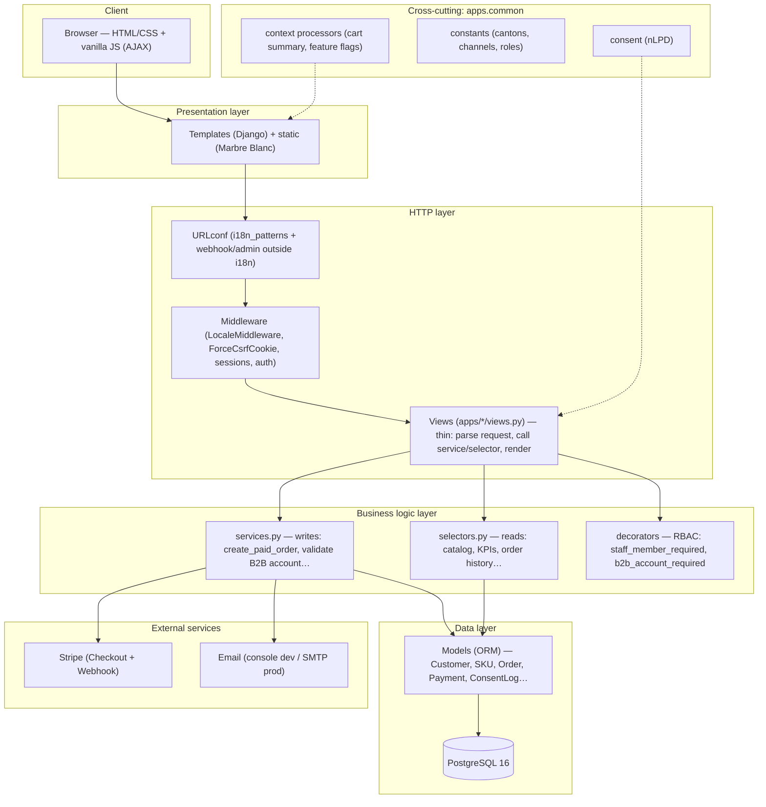
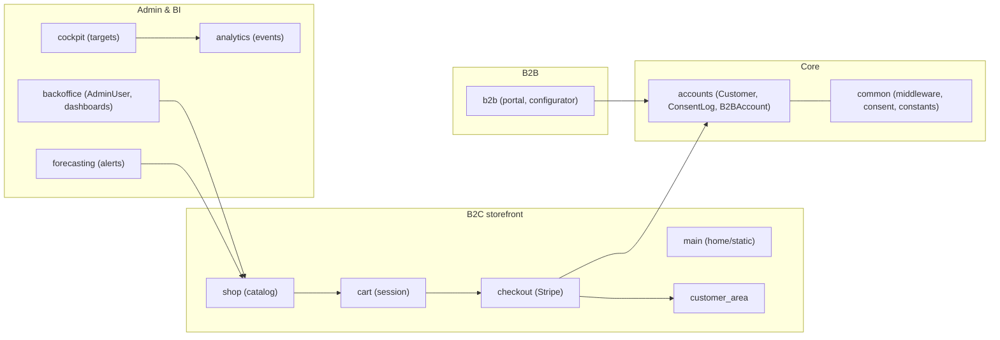
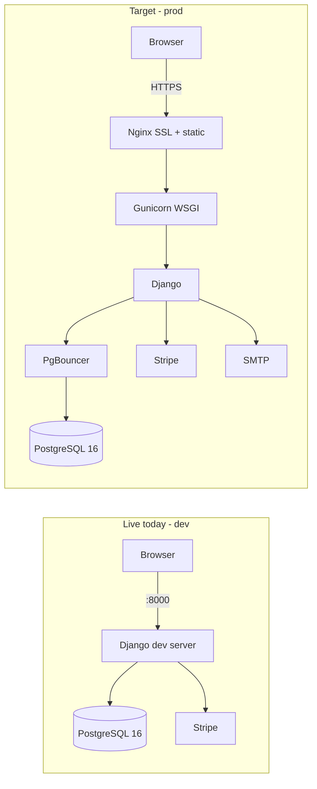
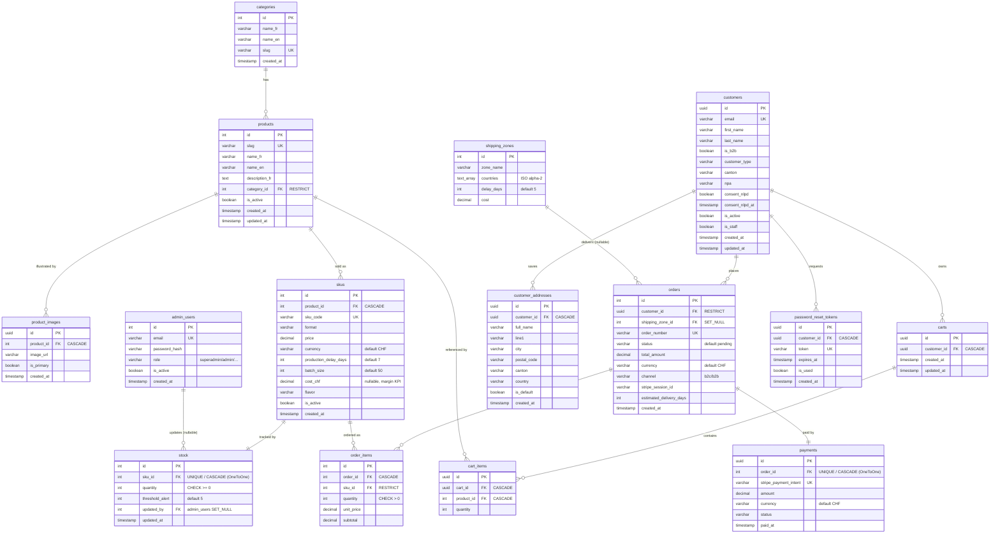

<!--
  README.md — Lamos Chocolate
  ---------------------------------------------------------------------------
  This file is the entry point of the repository. It is written in English on
  purpose: everything that lives inside the repo (code, comments, commits,
  docs) is in English, so tooling, reviewers and future contributors get a
  single, consistent language. The product UI itself is multilingual
  (fr / en / de-CH / it-CH) — see the "Internationalization" section.
-->

# 🍫 Lamos Chocolate — Swiss Luxury Chocolate E-commerce

A production-oriented **Django 5.2** e-commerce platform for a Swiss luxury
chocolate maker. It ships a **B2C storefront**, a full **B2B professional
portal**, and an internal **executive cockpit**, with **Swiss data-protection
compliance (nLPD / RGPD)** built in from the start rather than bolted on.


---

## Table of contents

1. [What this project is](#1-what-this-project-is)
2. [Key features](#2-key-features)
3. [Tech stack](#3-tech-stack)
4. [Architecture](#4-architecture)
5. [Project structure](#5-project-structure)
6. [Getting started (Docker)](#6-getting-started-docker)
7. [Running the tests](#7-running-the-tests)
8. [Code quality](#8-code-quality)
9. [CI/CD pipeline](#9-cicd-pipeline)
10. [Internationalization](#10-internationalization)
11. [Swiss compliance (nLPD / RGPD)](#11-swiss-compliance-nlpd--rgpd)
12. [Security](#12-security)
13. [Deployment](#13-deployment)
14. [Team & ownership](#14-team--ownership)
15. [Known limitations](#15-known-limitations)

---

## 1. What this project is

Lamos Chocolate sells premium chocolate through three product families —
**Tablette Kunafa**, **Truffes**, and **Carrés Lamo's** — to two very different
audiences:

- **Individuals (B2C):** browse the catalogue, add to cart, pay online via
  Stripe, and manage their account.
- **Professionals (B2B):** request a professional account, get a moderated
  `prospect → active` lifecycle, access pro-only catalogue data (minimum order
  quantities, professional pricing), configure custom products, and simulate
  quotes.

On top of the shop, an internal **cockpit** lets the business set objectives
per product and per Swiss canton, and a **forecasting** layer produces sales
forecasts and alerts.

> This is a school / portfolio project targeting production-grade quality
> (not a throwaway MVP). The primary market is **Switzerland**, which drives
> the localization and the privacy choices described below.

---

## 2. Key features

### B2C storefront
- Product catalogue with categories, product detail pages, SKUs, stock and
  shipping zones.
- Session- and user-bound **cart** (`Cart` / `CartItem`).
- **Stripe checkout** with server-side `Order` / `OrderItem` / `Payment`
  records and a signed **webhook** endpoint for asynchronous payment events.
- Customer accounts with a **custom user model** (`accounts.Customer`),
  email-based login, Google social login (via allauth), password reset, and a
  personal dashboard with saved addresses and order history.

### B2B professional portal
- Public funnel and gated pro portal, protected by dedicated decorators
  (`b2b_login_required`, `b2b_account_required`).
- Account lifecycle: `prospect → pending → active`, with a **back-office
  validation** screen for pending accounts.
- B2B-specific catalogue data isolated in `B2BProductInfo` (MOQ, pro pricing,
  availability) so it never pollutes the core product models.
- Product **customization requests** and **quote simulation**.
- Orders are tagged with a `channel` field (`b2c` / `b2b`) so revenue can be
  split cleanly for reporting.

### Executive cockpit & analytics
- `cockpit`: business objectives per product (`ProductTarget`) and per canton
  (`CantonTarget`).
- `analytics`: lightweight event tracking (`Event`) with a consent gate.
- `forecasting`: sales `Forecast` and `Alert` generation.

### Compliance & trust
- First-party, granular **cookie consent** with an immutable, timestamped
  audit log (`ConsentLog`) — see [section 11](#11-swiss-compliance-nlpd--rgpd).
- Full **4-language** interface for the Swiss market.

---

## 3. Tech stack

| Layer            | Technology                                                        |
|------------------|-------------------------------------------------------------------|
| Language         | Python 3.12                                                       |
| Framework        | Django 5.2                                                        |
| Database         | PostgreSQL 16                                                     |
| Auth             | django-allauth (email + Google; Facebook configured but disabled)|
| Payments         | Stripe (`stripe` 11.1.0) + signed webhooks                       |
| Frontend         | Django templates + custom **"Marbre Blanc"** CSS design system   |
| Containerization | Docker + Docker Compose                                          |
| Tests            | pytest, pytest-django, pytest-cov (coverage gate ≥ 70%)          |
| Code quality     | black, isort, flake8                                             |
| CI/CD            | GitHub Actions (lint / tests / security / deploy)               |
| Config           | `python-decouple` (12-factor style, values read from `.env`)    |

**Marbre Blanc design system** — a bespoke light theme replacing Bootstrap:
ivory `#FBF7F0`, gold `#C9A063`, cocoa `#1F1813`; typefaces Cormorant Garamond,
Cinzel and Lato.

---

## 4. Architecture

The backend follows Django's **MVT** pattern, extended with an explicit
**service / selector** separation to keep views thin:

- **`services.py`** — write operations and business logic (create an order,
  validate a B2B account, record consent…).
- **`selectors.py`** — read/query logic (fetch catalogue data, dashboard
  aggregates…).
- **`views.py`** — orchestration only: parse the request, call a
  service/selector, render a template.

Cross-cutting concerns live in **`apps.common`** (custom middleware, context
processors, decorators, validators, consent helpers), so no single feature app
owns them.

### The 12 local apps

| App             | Responsibility                                                       |
|-----------------|----------------------------------------------------------------------|
| `common`        | Shared middleware, context processors, decorators, consent, validators |
| `main`          | Homepage, static pages, custom 403/404/500 handlers                 |
| `accounts`      | Custom `Customer` user, `B2BAccount`, `ConsentLog`, allauth adapters |
| `shop`          | `Category`, `Product`, `ProductImage`, `SKU`, `Stock`, `ShippingZone`|
| `cart`          | `Cart`, `CartItem`                                                   |
| `checkout`      | `Order`, `OrderItem`, `Payment`, Stripe integration & webhooks       |
| `customer_area` | Customer dashboard, `CustomerAddress`                               |
| `b2b`           | `B2BRequest`, `B2BProductInfo`, `CustomizationRequest`, `QuoteSimulation`, access decorators |
| `backoffice`    | Staff dashboards and B2B account validation                         |
| `cockpit`       | `CockpitObjective`, `ProductTarget`, `CantonTarget` (standalone)    |
| `forecasting`   | `Forecast`, `Alert`                                                 |
| `analytics`     | `Event` tracking (consent-gated)                                    |

---

## 5. Project structure

```text
Lamos-chocolate/
├── .github/workflows/         # CI/CD: ci, lint, tests, security, deploy-staging, deploy-production
├── backend/
│   ├── apps/                  # The 12 local Django apps (see table above)
│   ├── config/
│   │   ├── settings/          # base.py, dev.py, prod.py, test.py (split settings)
│   │   ├── urls.py            # Root URLconf (i18n + non-i18n routes)
│   │   ├── wsgi.py / asgi.py
│   ├── locale/                # fr, en, de_CH, it_CH translation catalogs
│   ├── static/                # Marbre Blanc CSS, JS, images, video
│   ├── templates/             # Base + per-app templates, emails, error pages
│   ├── requirements/          # base.txt, dev.txt, prod.txt, test.txt
│   ├── manage.py
│   ├── pytest.ini             # pytest config + coverage gate (--cov-fail-under=70)
│   ├── setup.cfg              # flake8 config
│   └── pyproject.toml         # black + isort config
├── infrastructure/
│   ├── docker/                # Dockerfile, entrypoint.sh, nginx, postgres init.sql
│   ├── nginx/                 # nginx site configs (default / production)
│   └── scripts/               # backup / restore / deploy / wait-for-db helpers
├── scripts/                   # setup, lint, format, run_tests, seed_db, reset_db
├── docs/                      # Architecture, decisions, deployment, QA, setup notes
├── docker-compose.yml
└── .env.example               # Copy to .env and fill in
```

---

## 6. Getting started (Docker)

The whole stack runs in Docker, so you only need **Docker** and **Docker
Compose** installed. No local Python or PostgreSQL required.

### Step 1 — Clone and configure

```bash
git clone https://github.com/SaraEstelle/Lamos-chocolate.git
cd Lamos-chocolate

# Create your local .env from the template
cp .env.example .env
```

> **Important — `POSTGRES_HOST`.** Inside Docker, Django reaches the database
> through the Compose service name, so keep `POSTGRES_HOST=postgres`. Only
> switch it to `localhost` if you ever run Django directly on your host
> machine instead of in the container.

### Step 2 — Build and start

```bash
# Build the images and start PostgreSQL + Django in the background
docker compose up -d --build
```

On startup the Django container automatically:
1. waits for PostgreSQL to be ready,
2. applies migrations (`manage.py migrate`),
3. collects static files (`manage.py collectstatic`),
4. starts the dev server on port **8000**.

### Step 3 — Seed demo data (optional but recommended)

```bash
# Load the shop catalogue (categories, products, SKUs, stock, shipping zones)
docker compose exec django python manage.py loaddata \
  apps/shop/fixtures/categories.json \
  apps/shop/fixtures/products.json \
  apps/shop/fixtures/product_images.json \
  apps/shop/fixtures/skus.json \
  apps/shop/fixtures/stock.json \
  apps/shop/fixtures/shipping_zones.json

# Load B2B pro catalogue data (MOQ, pro pricing, availability)
docker compose exec django python manage.py loaddata apps/b2b/fixtures/b2b_product_info.json

# Seed cockpit objectives (custom management command)
docker compose exec django python manage.py seed_cockpit
```

### Step 4 — Create an admin user

```bash
docker compose exec django python manage.py createsuperuser
```

### Step 5 — Open the app

| URL                                | What it is                          |
|------------------------------------|-------------------------------------|
| http://localhost:8000/             | B2C storefront (homepage)           |
| http://localhost:8000/shop/        | Product catalogue                   |
| http://localhost:8000/b2b/         | B2B professional portal             |
| http://localhost:8000/admin/       | Django admin (superuser)            |
| http://localhost:8000/backoffice/  | Staff back-office                   |
| http://localhost:8000/cockpit/     | Executive cockpit (staff)           |

### Full reset

To wipe the database and start clean (this is the **only** approved reset —
never regenerate migrations to "start fresh", as that overwrites shared team
history):

```bash
docker compose down -v      # -v also removes the postgres volume
docker compose up -d --build
```

---

## 7. Running the tests

The suite currently holds **200+ tests** across all apps, run against a real
PostgreSQL engine, with a **coverage gate of 70%** enforced in `pytest.ini`.

```bash
# Run the full suite (from inside the running container)
docker compose exec django pytest

# Run one app only
docker compose exec django pytest apps/checkout

# Run by marker (e.g. payment-related tests)
docker compose exec django pytest -m payment
```

A browsable HTML coverage report is generated in `backend/htmlcov/`.

---

## 8. Code quality

Formatting and linting are enforced both locally and in CI. None of these
tools ever rewrite your files in CI — they only report.

```bash
docker compose exec django black --check .        # formatting (line length 88)
docker compose exec django isort --check-only .   # import ordering (black profile)
docker compose exec django flake8 .               # style / unused imports
```

Convenience wrappers live in `scripts/format.sh` and `scripts/lint.sh`.

---

## 9. CI/CD pipeline

CI/CD runs on **GitHub Actions**. A single orchestrator (`ci.yml`) fans out
into three reusable workflows so the whole status is visible on every branch
and every pull request:

| Workflow                 | Trigger                          | What it does                                                        |
|--------------------------|----------------------------------|---------------------------------------------------------------------|
| `ci.yml`                 | every push + every PR            | Orchestrator: calls lint / tests / security in parallel             |
| `lint.yml`               | called by `ci.yml`               | black, isort, flake8 (report-only)                                  |
| `tests.yml`              | called by `ci.yml`               | pytest against PostgreSQL 16, uploads HTML coverage artifact        |
| `security.yml`           | called by `ci.yml` + weekly cron | `pip-audit` (CVEs), `bandit` (code), `manage.py check --deploy`     |
| `deploy-staging.yml`     | push to `develop`                | Build & push image to GHCR (`:staging`)                             |
| `deploy-production.yml`  | git tag `v*` + manual approval   | Build & push versioned image to GHCR (`:latest`, `:vX.Y.Z`)         |

> **Honest note:** the image build/push steps are real and work out of the box
> (they use the built-in `GITHUB_TOKEN`). The final "deploy to server" step is
> a documented **placeholder** until a real staging/production host and its
> SSH secrets exist. This is intentional — the pipeline demonstrates the full
> shape without pretending to deploy to a machine that isn't there yet.

---

## 10. Internationalization

The interface is available in **four languages** targeting the Swiss market:

| Language | URL prefix  | Locale folder |
|----------|-------------|---------------|
| French   | *(default)* | `fr`          |
| English  | `/en/`      | `en`          |
| German (CH) | `/de-ch/` | `de_CH`      |
| Italian (CH) | `/it-ch/`| `it_CH`      |

Routing uses Django's `i18n_patterns`. Language codes follow Django convention
(lowercase + hyphen in URLs; underscore + region for the folders). Payment
webhooks, admin and consent endpoints are deliberately kept **outside** the
language prefix.

---

## 11. Swiss compliance (nLPD / RGPD)

Privacy is a first-class feature, not an afterthought:

- **Granular, opt-in cookie consent.** A first-party cookie (`lamos_consent`)
  stores three categories — `necessary` (always on), `analytics`, `marketing`.
  Nothing non-essential loads until the visitor decides.
- **Immutable proof of consent.** Every decision is written to `ConsentLog`
  (UUID primary key, timestamp, IP, user agent, policy version). Rows are
  **never updated or deleted** — a new decision creates a new row, so the
  history stays auditable. It works for both anonymous visitors (correlated by
  a random `consent_id`) and authenticated customers.
- **Policy versioning.** `policy_version` is stored with each decision, so a
  future change to the cookie policy can trigger a fresh consent request.
- **No hard deletes of business data.** Accounting-relevant records are kept
  (Swiss CO art. 958f — 10-year retention); accounts are marked dormant rather
  than physically deleted.
- **PCI-DSS is fully delegated to Stripe.** No card data ever touches the
  application or the database.

---

## 12. Security

- **Custom user model** with email-based authentication and Django's password
  validators.
- **UUID primary keys** on sensitive records (`Payment`, `B2BAccount`,
  `ConsentLog`) to avoid enumeration / information leaks.
- **Access-control decorators** for the B2B area (`b2b_login_required`,
  `b2b_account_required`) designed **not** to reveal whether an account exists
  to unauthorized users.
- **CSRF everywhere except the Stripe webhook**, which must accept Stripe's raw
  POST and is instead protected by **signature verification**.
- **Production hardening** (in `config/settings/prod.py`): `SECURE_SSL_REDIRECT`,
  `SESSION_COOKIE_SECURE`, `CSRF_COOKIE_SECURE`, HSTS.
- **Automated security scanning** in CI: dependency CVEs (`pip-audit`), static
  analysis (`bandit`), and Django's own `check --deploy` audit — plus a weekly
  scheduled run to catch newly disclosed CVEs.
- **Secrets are never committed.** All credentials come from `.env`, which is
  git-ignored; only `.env.example` (with placeholders) is tracked.

---

## 13. Deployment

Split settings modules select the environment via `DJANGO_SETTINGS_MODULE`:

- `config.settings.dev` — local development (DEBUG on, console email, debug
  toolbar).
- `config.settings.prod` — production hardening (DEBUG off, SSL redirect,
  secure cookies, HSTS). Serves with **gunicorn** + **whitenoise**.
- `config.settings.test` — fast test settings (used by pytest and CI).

Production images are published to the GitHub Container Registry by
`deploy-production.yml` on a version tag (e.g. `v1.0.0`). Wiring those images
to a real host is the next step (see [Known limitations](#15-known-limitations)).

---

## 14. Team & ownership

| Area                                                   | Owner       |
|--------------------------------------------------------|-------------|
| Accounts, customer area, B2B portal, frontend          | **Sara**    |
| Cart & checkout (incl. Stripe)                         | **Valentin**|

**Working conventions**
- Code, comments and commit messages: **English**.
- Commits follow the **Conventional Commits** specification.
- Branch strategy: `develop` (stable base) → feature branches → PR into
  `develop`; `develop` → `main` for releases.
- Database resets use `docker compose down -v` only. Migrations are **never**
  regenerated to "start fresh".

---

## 15. Known limitations

These are stated openly so the project state is never misrepresented:

- **Server deployment is a placeholder.** Image build & push work; the actual
  SSH rollout to a staging/production host is stubbed until a host and its
  secrets exist.
- **Facebook social login is configured but disabled**; only email + Google
  are active.
- **`pip-audit` / `bandit` are non-blocking** in CI for now (`|| true`) so an
  unpatched pinned dependency doesn't block the deadline. The reports are still
  printed; the recommendation is to make them blocking once the project is
  stable.
- **Nginx is prepared but not enabled** in `docker-compose.yml` (planned for a
  later phase); the dev server currently serves the app directly.
- **Default `TIME_ZONE` is `Europe/Paris`** (from `.env.example`). For a
  Swiss-first product, consider `Europe/Zurich`. *(No code changed here — flagged
  for a decision.)*

---
## 16. The application architecture :
# Architecture Diagram — layered, with business logic

## 1) Layered view (the important one — the data flow)
Each request crosses well-separated layers. Business logic lives in the **service layer**
(`services.py` for writes, `selectors.py` for reads), never in the views.


## 2) Domain map (12 apps grouped by business area)


## 3) Runtime: live (dev) vs target (prod)

Note: Nginx / Gunicorn / PgBouncer are the production targets, not enabled in the dev compose (only `django` + `postgres` run today).

## 4) More to know about data flow
A request enters via the URLconf (with a language prefix for non-French), passes through
middleware (locale, sessions, CSRF), reaches a thin view. The view calls a **service** (write)
or a **selector** (read); those hold the business logic and talk to the models (ORM), which map
to PostgreSQL. Cross-cutting concerns (consent, constants, context) live in `apps.common`.
External calls (Stripe, email) are made from the service layer.

## 17 The Database Diagram :
# 🗄️ Database Diagram (ERD) — corrected version


## 1) What is an ERD?
An **ERD** (Entity-Relationship Diagram) shows the **database tables** and the **links
(foreign keys)** between them. In Mermaid:
- `A ||--o{ B` = "**one** A relates to **many** B" (one-to-many).
- `A ||--|| B` = "**one** A for **one** B" (one-to-one).
- `PK` = primary key, `FK` = foreign key, `UK` = unique constraint.

An ERD shows **tables**, not class inheritance. That is the first thing to fix (see §2).

---

## 2) Mistakes in the old ERD/diagram (and why they are wrong)
| # | Mistake in the Portfolio | Reality in the code | Fix |
|---|---|---|---|
| 1 | A **`BaseModel`** with inheritance arrows (`BaseModel <|-- Category…`) | **No `BaseModel` exists.** `apps/common/models.py` says "this app has NO models", `mixins.py` is empty. Every model extends `django.db.models.Model` directly. | Remove `BaseModel` (details in the class diagram). |
| 2 | `admin_users ||--o{ b2b_requests : "processes"` | `B2BRequest` has **no** `processed_by` FK. Staff only changes a `status` field. | Remove that relation. |
| 3 | `customers.id = int` | `Customer.id` = **UUID** (`models.UUIDField`) | PK = `uuid`. |
| 4 | `currency DEFAULT EUR` | Default = **CHF** (`Order`, `Payment`, `SKU`) — Swiss market | `chf`. |
| 5 | `customers` with `password_hash` + addresses **inline** | Password handled by Django (`AbstractBaseUser`); addresses in **`customer_addresses`** | Separate them. |
| 6 | Tables **missing** | `product_images`, `payments`, `b2b_accounts`, `consent_logs`, `customer_addresses`, `carts`, `cart_items`, `b2b_product_info`, `b2b_customization_requests`, `b2b_quote_simulations`, `cockpit_*`, `forecasts`, `alerts`, `analytics_events` | Add them. |

> **Note:** "The design ERD evolved: We moved to **UUID keys** for sensitive data, to **CHF** for Switzerland, and we added the compliance (`consent_logs`) and B2B (`b2b_accounts`) tables. Here is the **up-to-date** ERD."

---

## 3) Corrected ERD — Part A: B2C commerce (the purchase funnel core)


## 4) Corrected ERD — Part B: B2B, compliance & business intelligence

```mermaid
erDiagram
    customers    ||--|| b2b_accounts               : "pro profile"
    skus         ||--|| b2b_product_info           : "pro data"
    b2b_accounts ||--o{ b2b_customization_requests : "requests"
    skus         ||--o{ b2b_customization_requests : "customizes (PROTECT)"
    b2b_accounts ||--o{ b2b_quote_simulations      : "simulates"

    customers    ||--o{ consent_logs               : "consents (SET_NULL)"
    customers    ||--o{ analytics_events           : "generates (SET_NULL)"

    products     ||--o{ forecasts                  : "forecasted"
    forecasts    ||--o{ alerts                      : "raises"
    products     ||--o{ alerts                      : "about"
    products     ||--|| cockpit_product_targets     : "monthly target"
    customers    ||--o{ cockpit_objectives          : "set by (SET_NULL)"

    b2b_accounts {
        uuid id PK
        uuid customer_id FK "UNIQUE / CASCADE (OneToOne)"
        varchar company_name
        varchar segment
        varchar status "prospect/active/…"
        timestamp onboarded_at
        timestamp created_at
    }
    b2b_requests {
        int id PK
        varchar company_name
        varchar contact_email
        varchar sector
        int estimated_qty
        varchar status "new/in_progress/…"
        inet ip_address
        boolean wants_marketing
        timestamp marketing_consent_at
        timestamp created_at
    }
    b2b_product_info {
        int id PK
        int sku_id FK "UNIQUE / CASCADE (OneToOne)"
        boolean is_b2b_available
        varchar availability_status
        int moq "default 24"
        decimal b2b_unit_price "nullable"
    }
    b2b_customization_requests {
        int id PK
        uuid account_id FK "b2b_accounts CASCADE"
        int sku_id FK "skus PROTECT"
        boolean logo_engraved
        int grammage
        int quantity
        varchar status "draft/quote/order"
        timestamp created_at
    }
    b2b_quote_simulations {
        int id PK
        uuid account_id FK "b2b_accounts CASCADE"
        jsonb cart_json
        boolean moq_reached
        decimal estimated_value
        boolean converted
        timestamp created_at
    }
    consent_logs {
        uuid id PK
        uuid customer_id FK "SET_NULL, nullable"
        varchar consent_id "cookie token"
        boolean necessary
        boolean analytics
        boolean marketing
        varchar policy_version
        inet ip_address
        timestamp created_at
    }
    analytics_events {
        uuid id PK
        varchar event_type
        uuid customer_id FK "SET_NULL, nullable"
        varchar channel
        varchar canton
        decimal value_chf
        jsonb properties
        timestamp created_at
    }
    forecasts {
        uuid id PK
        int product_id FK "CASCADE"
        date forecast_date
        int predicted_quantity
        decimal confidence_score
        timestamp created_at
    }
    alerts {
        uuid id PK
        int product_id FK "CASCADE"
        uuid forecast_id FK "CASCADE"
        text message
        varchar severity "low/medium/high/critical"
        timestamp created_at
    }
    cockpit_objectives {
        int id PK "singleton pk=1"
        int daily_revenue_chf
        int monthly_revenue_chf
        int monthly_capacity_units
        decimal target_margin_pct
        uuid updated_by FK "customers SET_NULL"
        timestamp updated_at
    }
    cockpit_product_targets {
        int id PK
        int product_id FK "UNIQUE / CASCADE (OneToOne)"
        int monthly_units
        timestamp updated_at
    }
    canton_targets {
        int id PK
        varchar canton UK
        int monthly_revenue_chf
        timestamp updated_at
    }
```


---

## 5) Reference table — every table (to know for the MR)
| Table (db_table) | Django model | Primary key | App |
|---|---|---|---|
| `categories` | `Category` | int | shop |
| `products` | `Product` | int | shop |
| `product_images` | `ProductImage` | **uuid** | shop |
| `skus` | `SKU` | int | shop |
| `stock` | `Stock` | int | shop |
| `shipping_zones` | `ShippingZone` | int | shop |
| `accounts_customer` | `Customer` | **uuid** | accounts |
| `accounts_passwordresettoken` | `PasswordResetToken` | **uuid** | accounts |
| `b2b_accounts` | `B2BAccount` | **uuid** | accounts |
| `consent_logs` | `ConsentLog` | **uuid** | accounts |
| `customer_addresses` | `CustomerAddress` | **uuid** | customer_area |
| `cart_cart` | `Cart` | **uuid** | cart |
| `cart_cartitem` | `CartItem` | **uuid** | cart |
| `orders` | `Order` | int | checkout |
| `order_items` | `OrderItem` | int | checkout |
| `payments` | `Payment` | **uuid** | checkout |
| `b2b_requests` | `B2BRequest` | int | b2b |
| `b2b_product_info` | `B2BProductInfo` | int | b2b |
| `b2b_customization_requests` | `CustomizationRequest` | int | b2b |
| `b2b_quote_simulations` | `QuoteSimulation` | int | b2b |
| `admin_users` | `AdminUser` | int | backoffice |
| `cockpit_*` objective/targets | `CockpitObjective` / `ProductTarget` / `CantonTarget` | int | cockpit |
| `forecasting_forecast` | `Forecast` | **uuid** | forecasting |
| `forecasting_alert` | `Alert` | **uuid** | forecasting |
| `analytics_events` | `Event` | **uuid** | analytics |

> **URL routing rule to mention:** **UUID** PK → `<uuid:...>` in URLs (non-enumerable,
> security); **int** PK (e.g. `Order`) → `<int:order_id>`.

---

## 6) Key relations to explain (3 examples) :
- **`orders.customer_id` → `customers` with `RESTRICT`**: I **cannot** delete a customer who
  has orders (Swiss accounting retention, CO art. 958f).
- **`payments.order_id` → `orders` as `OneToOne`**: exactly **one** payment per order.
- **`consent_logs.customer_id` as `SET_NULL`**: if an account is anonymised, I **keep** the
  consent proof (nLPD compliance) — the row is never deleted.

---

## 7) Honesty notes :
- **`cart_items` points to `products`, not `skus`.** Also, `Cart.get_total_price()` and
  `CartItem.get_subtotal()` use `product.price`, which **does not exist** (price is on `SKU`).
  The **cart actually used at checkout is session-based** (SKU-based, see
  `apps/checkout/stripe.py`). → These DB `Cart`/`CartItem` models are likely **legacy /
  partly unused**. I can say so if asked.
- `Forecast.__str__` and `CartItem.__str__` reference `product.name` (does not exist) → a
  minor display bug, no functional impact.

---

## 9) How each part of the ERD works and why it changed

**a) Catalog: `categories → products → skus → stock` (+ `product_images`, `shipping_zones`)**
How it works: a `category` groups `products`; each product is sold as one or more **`skus`**
(a sellable variant with its own price and stock); each SKU has exactly one **`stock`** row
(OneToOne) and a product can have several **`product_images`**.
Why it changed: the old design put the price/name on the product and forgot `product_images`.
In the code, **price and stock are on the SKU** (a "Tablette" can have 100 g and 200 g SKUs),
and images are a separate table — so I added `product_images` (UUID) and moved price to `skus`.

**b) Accounts: `customers` (+ `password_reset_tokens`, `consent_logs`, `b2b_accounts`)**
How it works: `customers` is the login identity (email + UUID). Password resets use single-use
`password_reset_tokens`. Consent is proven by **`consent_logs`** (immutable rows). A customer
may have one `b2b_accounts` profile (prospect → active).
Why it changed: the old ERD had `customers.id = int` with an inline `password_hash` and inline
address. In the code the key is **UUID** (non-enumerable), the password is managed by Django's
auth (not a plain field), and addresses moved to `customer_addresses`. I also added
`consent_logs` and `b2b_accounts`, which the old ERD did not have — they are central to Swiss
nLPD compliance and the B2B lifecycle.

**c) Cart: `carts → cart_items`**
How it works in the schema: a customer owns a `cart` containing `cart_items` (each referencing
a `product`).
Why it needs a note: the **cart used at checkout is session-based** (`apps/cart/cart.py`,
SKU-based). These DB tables exist but are partly unused (their helpers reference
`product.price`, which does not exist). I keep them in the ERD for completeness and flag the
limitation openly.

**d) Orders & payment: `orders → order_items` + `payments`**
How it works: an `order` (int key, human `order_number`) contains `order_items` (each linked to
a `sku`, with a price snapshot). Exactly one **`payments`** row per order (OneToOne, UUID,
Stripe payment intent). `orders.customer` uses **RESTRICT** (cannot delete a customer with
orders); `orders.shipping_zone` uses SET_NULL.
Why it changed: the old design defaulted currency to EUR and had no `payments` table. The code
defaults to **CHF** (Swiss market) and isolates payment data in its own table (cleaner + PCI
data stays with Stripe).

**e) B2B: `b2b_requests`, `b2b_product_info`, customization & quotes**
How it works: `b2b_requests` are public leads (no FK). `b2b_product_info` adds pro data
(MOQ, pro price) to a `sku` without touching the B2C catalog. `b2b_customization_requests` and
`b2b_quote_simulations` belong to a `b2b_account`.
Why it changed: the old ERD drew `admin_users → b2b_requests : processes`, but the code has **no
`processed_by` FK** — staff only change a `status`. That relation was removed.

**f) BI: `analytics_events`, `forecasts`, `alerts`, `cockpit_*`**
How it works: `analytics_events` records consent-gated events (with canton/channel/value_chf for
KPIs). `forecasts` predict per-product demand and raise `alerts`. `cockpit_*` holds management
targets (a singleton objectives row + per-product and per-canton targets).
Why it changed: these tables were missing from the old ERD entirely; they were added with the
cockpit/forecasting/analytics apps.

**Consistency rule that drove many changes:** sensitive or externally-referenced rows use
**UUID** keys (Customer, Payment, ConsentLog, B2BAccount, ProductImage) so IDs cannot be
enumerated; internal high-volume rows (Order, OrderItem, SKU) keep integer keys with a separate
non-guessable `order_number` where a public identifier is needed.

<p align="center"><em>Lamos Chocolate — crafted for Switzerland. 🇨🇭</em></p>
