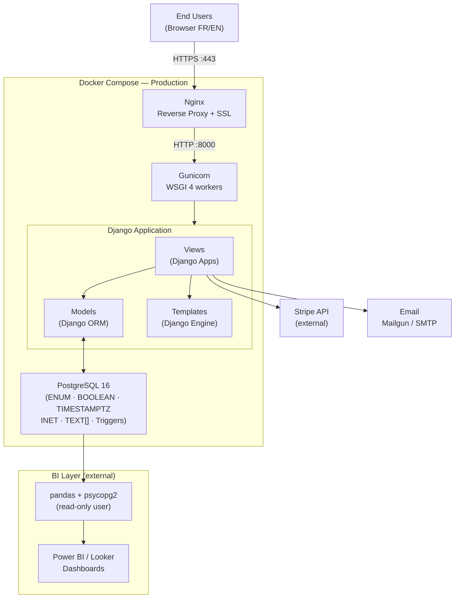

```mermaid

graph TD
    Users["End Users\n(Browser FR/EN)"]

    subgraph Docker["Docker Compose — Production"]
        Nginx["Nginx\nReverse Proxy + SSL"]
        Gunicorn["Gunicorn\nWSGI 4 workers"]
        subgraph Django["Django Application"]
            Views["Views\n(Django Apps)"]
            Models["Models\n(Django ORM)"]
            Templates["Templates\n(Django Engine)"]
        end
        DB["PostgreSQL 16\n(ENUM · BOOLEAN · TIMESTAMPTZ\nINET · TEXT[] · Triggers)"]
    end

    Stripe["Stripe API\n(external)"]
    Email["Email\nMailgun / SMTP"]

    subgraph BI["BI Layer (external)"]
        Python["pandas + psycopg2\n(read-only user)"]
        Dashboard["Power BI / Looker\nDashboards"]
    end

    Users -->|HTTPS :443| Nginx
    Nginx -->|HTTP :8000| Gunicorn
    Gunicorn --> Django
    Views --> Models
    Views --> Templates
    Models <--> DB
    Views --> Stripe
    Views --> Email
    DB --> Python
    Python --> Dashboard
```

---