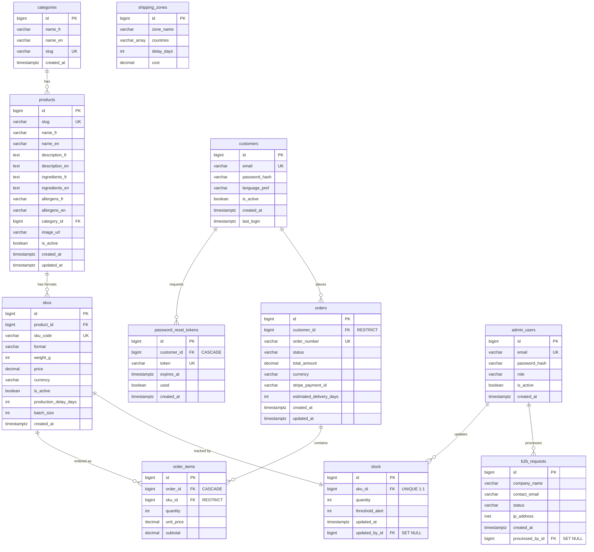

# Entity-Relationship Diagram

> A more detailed conceptual ERD (with native ENUM types and SQL-standard
> identity columns) is kept in [`../diagrams_erd.md`](../diagrams_erd.md).
> This file reflects the Django implementation (`BigAutoField` PKs,
> `TextChoices` stored as `varchar`).
