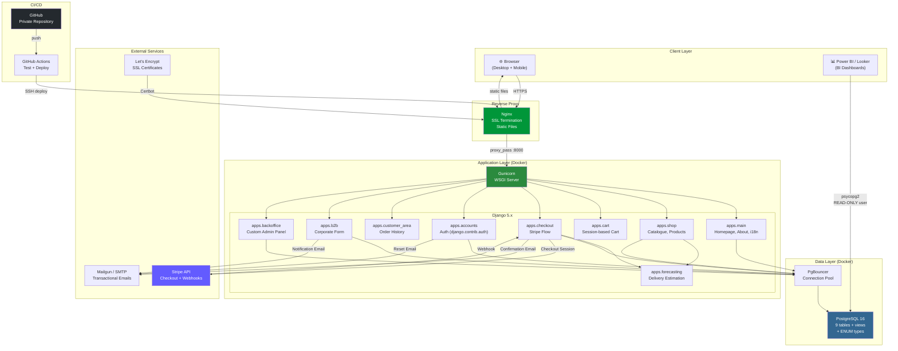
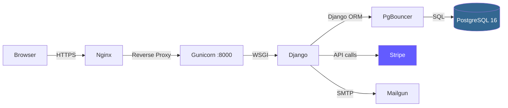
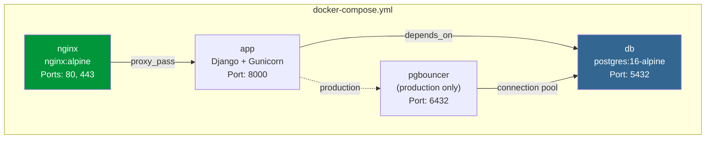

# System Architecture Diagram

## High-Level Architecture

```mermaid
graph TB
    subgraph "Client Layer"
        Browser["🌐 Browser<br/>(Desktop + Mobile)"]
        PowerBI["📊 Power BI / Looker<br/>(BI Dashboards)"]
    end

    subgraph "Reverse Proxy"
        Nginx["Nginx<br/>SSL Termination<br/>Static Files"]
    end

    subgraph "Application Layer (Docker)"
        Gunicorn["Gunicorn<br/>WSGI Server"]
        
        subgraph "Django 5.x"
            Main["apps.main<br/>Homepage, About, i18n"]
            Shop["apps.shop<br/>Catalogue, Products"]
            Cart["apps.cart<br/>Session-based Cart"]
            Checkout["apps.checkout<br/>Stripe Flow"]
            Accounts["apps.accounts<br/>Auth (django.contrib.auth)"]
            CustomerArea["apps.customer_area<br/>Order History"]
            B2B["apps.b2b<br/>Corporate Form"]
            Backoffice["apps.backoffice<br/>Custom Admin Panel"]
            Forecasting["apps.forecasting<br/>Delivery Estimation"]
        end
    end

    subgraph "Data Layer (Docker)"
        PgBouncer["PgBouncer<br/>Connection Pool"]
        PostgreSQL["PostgreSQL 16<br/>9 tables + views<br/>+ ENUM types"]
    end

    subgraph "External Services"
        Stripe["Stripe API<br/>Checkout + Webhooks"]
        SMTP["Mailgun / SMTP<br/>Transactional Emails"]
        LetsEncrypt["Let's Encrypt<br/>SSL Certificates"]
    end

    subgraph "CI/CD"
        GitHub["GitHub<br/>Private Repository"]
        Actions["GitHub Actions<br/>Test + Deploy"]
    end

    Browser -->|HTTPS| Nginx
    Nginx -->|proxy_pass :8000| Gunicorn
    Nginx -->|static files| Browser
    Gunicorn --> Main
    Gunicorn --> Shop
    Gunicorn --> Cart
    Gunicorn --> Checkout
    Gunicorn --> Accounts
    Gunicorn --> CustomerArea
    Gunicorn --> B2B
    Gunicorn --> Backoffice
    
    Shop --> Forecasting
    Checkout --> Forecasting

    Main --> PgBouncer
    Shop --> PgBouncer
    Checkout --> PgBouncer
    Accounts --> PgBouncer
    Backoffice --> PgBouncer
    B2B --> PgBouncer
    PgBouncer --> PostgreSQL

    Checkout -->|Checkout Session| Stripe
    Stripe -->|Webhook| Checkout
    Checkout -->|Confirmation Email| SMTP
    B2B -->|Notification Email| SMTP
    Accounts -->|Reset Email| SMTP

    LetsEncrypt -->|Certbot| Nginx

    PowerBI -->|psycopg2<br/>READ-ONLY user| PostgreSQL

    GitHub -->|push| Actions
    Actions -->|SSH deploy| Nginx

    style PostgreSQL fill:#336791,color:#fff
    style Stripe fill:#635bff,color:#fff
    style Nginx fill:#009639,color:#fff
    style Gunicorn fill:#2b8a3e,color:#fff
    style GitHub fill:#24292e,color:#fff
```

## Request Flow — Simplified

```mermaid
graph LR
    A[Browser] -->|HTTPS| B[Nginx]
    B -->|Reverse Proxy| C[Gunicorn :8000]
    C -->|WSGI| D[Django]
    D -->|Django ORM| E[PgBouncer]
    E -->|SQL| F[(PostgreSQL 16)]
    D -->|API calls| G[Stripe]
    D -->|SMTP| H[Mailgun]
    
    style F fill:#336791,color:#fff
    style G fill:#635bff,color:#fff
```

## Docker Compose Services

```mermaid
graph TB
    subgraph "docker-compose.yml"
        DB["db<br/>postgres:16-alpine<br/>Port: 5432"]
        App["app<br/>Django + Gunicorn<br/>Port: 8000"]
        Web["nginx<br/>nginx:alpine<br/>Ports: 80, 443"]
        Pool["pgbouncer<br/>(production only)<br/>Port: 6432"]
    end

    Web -->|proxy_pass| App
    App -->|depends_on| DB
    Pool -->|connection pool| DB
    App -.->|production| Pool

    style DB fill:#336791,color:#fff
    style Web fill:#009639,color:#fff
```
