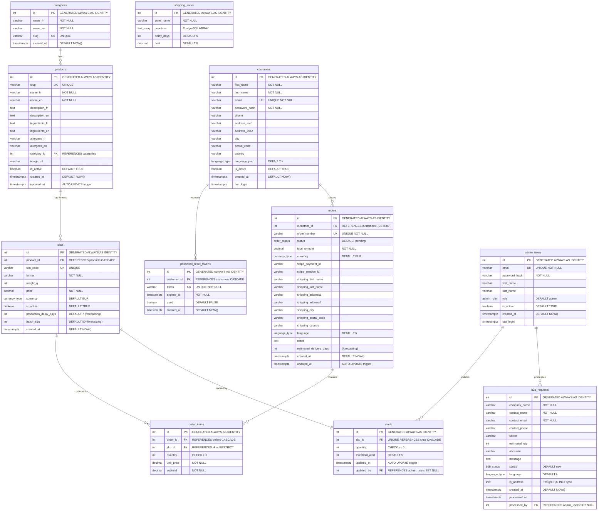

# Entity-Relationship Diagram (ERD)

## Complete Database Schema

## PostgreSQL-Specific Features Used

| Feature | Table | Usage |
|---------|-------|-------|
| `GENERATED ALWAYS AS IDENTITY` | All tables | Auto-increment PKs (SQL standard) |
| `CREATE TYPE AS ENUM` | Global | `currency_type`, `order_status`, `b2b_status`, `admin_role`, `language_type` |
| `TEXT[]` (Array) | `shipping_zones` | Country codes list with GIN index |
| `INET` | `b2b_requests` | IPv4/IPv6 storage |
| `TIMESTAMPTZ` | All tables | Timezone-aware timestamps |
| Trigger `update_updated_at()` | `products`, `stock`, `orders` | Automatic `updated_at` on UPDATE |
| Partial Index | `orders`, `password_reset_tokens` | Performance on active records only |
| `CHECK` constraint | `stock`, `order_items` | Data integrity (`quantity >= 0`) |
| `ON DELETE RESTRICT` | `orders → customers` | Prevent accidental customer deletion |
| `ON DELETE CASCADE` | `order_items → orders` | Cascade delete order items with order |
| `ON DELETE SET NULL` | `stock → admin_users` | Keep stock record if admin deleted |
