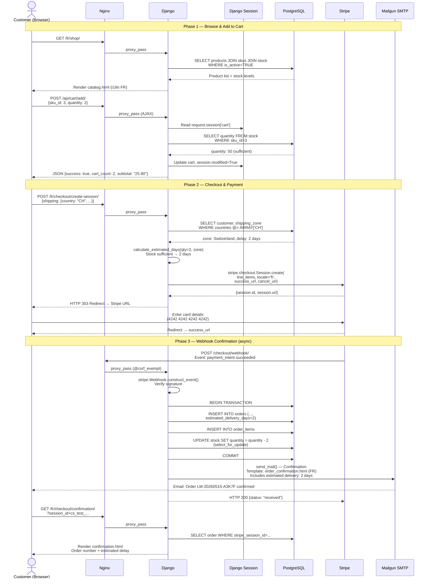
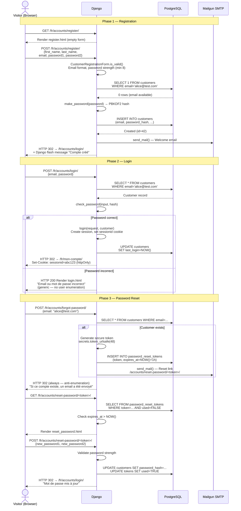
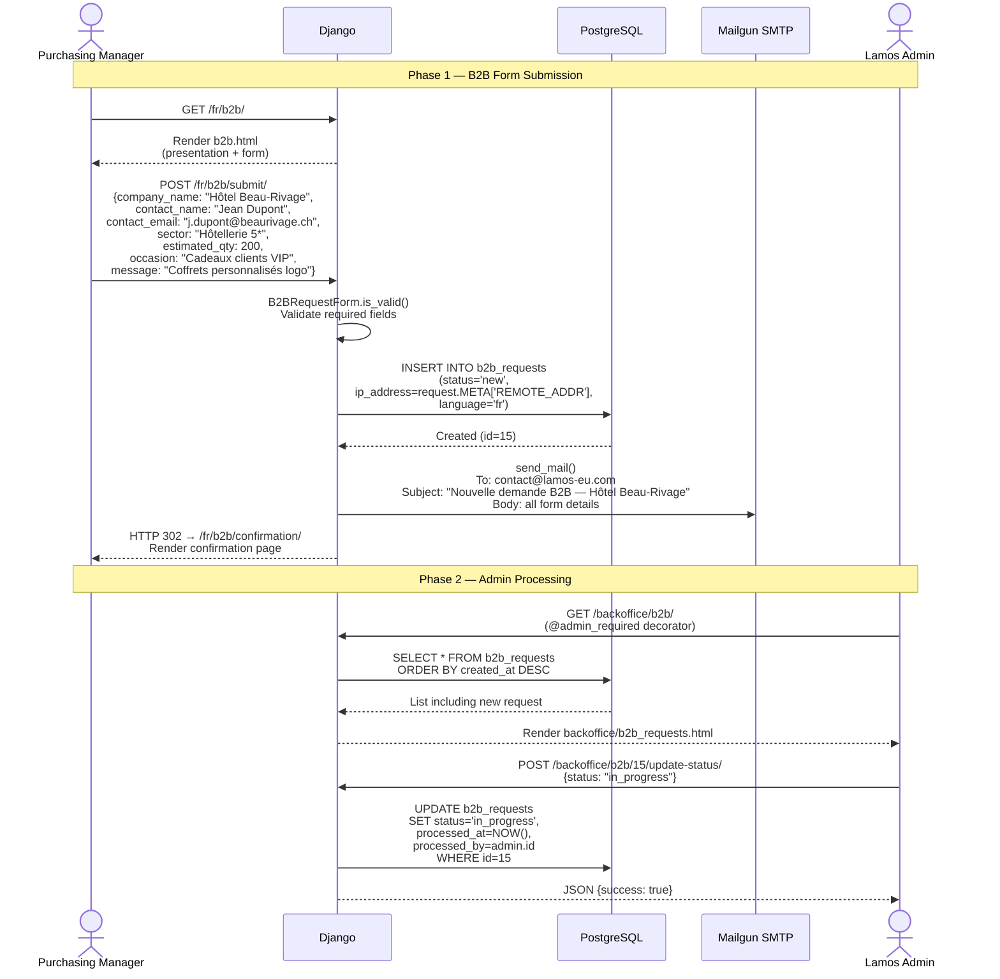
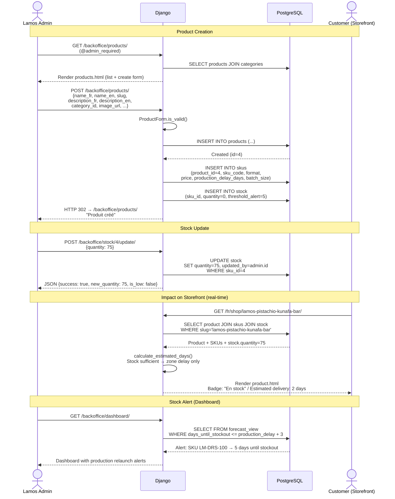
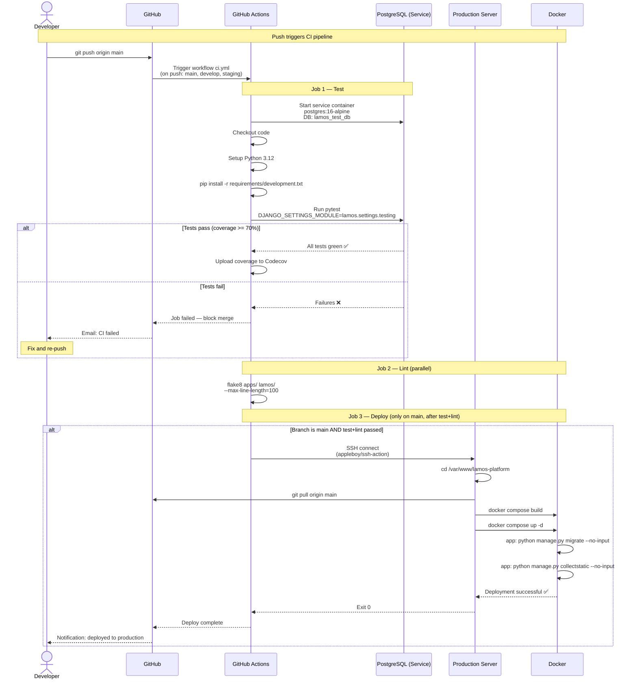

# Sequence Diagrams

## Diagram 1 — Complete B2C Purchase Flow

## Diagram 2 — Customer Registration & Authentication

## Diagram 3 — B2B Request Submission + Admin Notification

## Diagram 4 — Admin Product CRUD + Stock Management

## Diagram 5 — CI/CD Pipeline (GitHub Actions)

